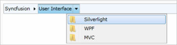

# Template Customizing in WPF Breadcrumb (HierarchyNavigator)

When Business Objects are used for data binding, ItemTemplate should be used to determine how the user interface will be displayed. A HierarchicalDataTemplate can be used as an ItemTemplate specifying the template for each item.

## HierarchicalDataTemplate

HierarchicalDataTemplate is used to show data in a hierarchical structure. 

The steps to create a HierarchicalDataTemplate are as follows:

1. Create a Business Object with its collections.




public class HierarchyItem
{
	public string ContentString { get; set; }
	public HierarchyItem(string content, params HierarchyItem[] myItems)
	{
		this.ContentString = content;
		itemsObservableCollection = new ObservableCollection<HierarchyItem>();
		foreach (var item in myItems)
		{
			itemsObservableCollection.Add(item);
		}
		Items = itemsObservableCollection;
	}
    private ObservableCollection<HierarchyItem> itemsObservableCollection;
	public ObservableCollection<HierarchyItem> Items
	{
		get { return itemsObservableCollection; }
		set
		{
			if (itemsObservableCollection != value)
    		{
    			itemsObservableCollection = value;
			}
		}
	}
}
public class HierarchicalItemsSource : ObservableCollection<HierarchyItem>
{
	public HierarchicalItemsSource()
	{
		this.Add(new HierarchyItem("Syncfusion",
		new HierarchyItem("User Interface",
		new HierarchyItem("Silverlight"),
		new HierarchyItem("WPF"),
		new HierarchyItem("MVC")),
		new HierarchyItem("Reporting Edition",
		new HierarchyItem("IO"),
		new HierarchyItem("PDF generator"),
		new HierarchyItem("WPF")
		)));
	}
}




2. Add HierarchicalDataTemplate. 
3. Add a template and ItemsSource to bind the object collections.




<Window.Resources>
<local:HierarchicalItemsSource x:Key="hierarchicalItemsSource"/>
<HierarchicalDataTemplate x:Key="myHierarchicalTemplate" ItemsSource="{Binding Items}">
<TextBlock Text="{Binding ContentString}" Margin="2,0" />
</HierarchicalDataTemplate>
</Window.Resources>




4. Add hierarchicalItemsSource with the HierarchyNavigator control ItemsSource property.




<syncfusion:HierarchyNavigator Name="hierarchyNavigator1" 
		ItemTemplate="{StaticResource myHierarchicalTemplate}"                
		ItemsSource="{StaticResource hierarchicalItemsSource}"/>




