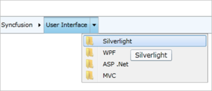

---
layout: post
title: Tooltip in WPF Breadcrumb | Syncfusion®
description: Display tooltips for Breadcrumb items to provide additional navigation information and improve user experience.
platform: wpf
control: Hierarchical Navigator
documentation: ug
---

# Tooltip in WPF Breadcrumb (HierarchicalNavigator) 

A ToolTip can be displayed for each HierarchyNavigator item.

Setting the ShowToolTip Boolean property to true in the HierarchyNavigator control will enable the ToolTips for all items.



<syncfusion:HierarchyNavigator ShowToolTip="True" x:Name="hierarchyNavigator1" />



HierarchyNavigator hierarchyNavigatorControl1 = new HierarchyNavigator()
 { Height = 30 };
 hierarchyNavigatorControl1.ShowToolTip = true;
 


