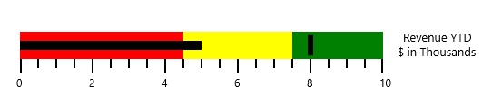

# Caption in WPF Bullet Graph (SfBulletGraph)

The **Caption** for a bullet graph is used to specify a unique label describing the value represented in the bullet graph. 




              <syncfusion:SfBulletGraph >        
              <syncfusion:SfBulletGraph.Caption>
                <StackPanel Margin="0,0,10,0">
                    <TextBlock Text="Revenue YTD" Foreground="Black"
                               FontSize="13" HorizontalAlignment="Center"/>
                    <TextBlock Text="$ in Thousands" Foreground="Black"
                               FontSize="13" HorizontalAlignment="Center"/>
                </StackPanel>
            </syncfusion:SfBulletGraph.Caption>
      </syncfusion:SfBulletGraph>





        SfBulletGraph bulletgraph = new SfBulletGraph();
        TextBlock _textBlock = new TextBlock() { Text = "Revenue YTD" };
        TextBlock _textBlock1 = new TextBlock() { Text = "$ in Thousands" };
        StackPanel _stackPanel = new StackPanel();
        _stackPanel.Children.Add(_textBlock);
        _stackPanel.Children.Add(_textBlock1);
        bulletgraph.Caption = _stackPanel;
        this.Grid.Children.Add(bulletgraph);




## Caption Position

The caption in the bullet graph can be placed in the start or end of the quantitative scale by choosing from one of the two options available in the **CaptionPosition** property. They are:

1. Near (Default)
2. Far




    <syncfusion:SfBulletGraph  CaptionPosition="Far" Caption="Revenue YTD">
    </syncfusion:SfBulletGraph>





    SfBulletGraph bulletgraph = new SfBulletGraph();
    bulletgraph.Caption = Revenue YTD;
    bulletgraph.CaptionPosition  = BulletGraphCaptionPosition.Far;
    this.Grid.Children.Add(bulletgraph);




