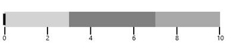

# Flow Direction in WPF Bullet Graph (SfBulletGraph)

By default the flow direction of SfBulletGraph is Left to Right. It can be customized by using **FlowDirection** property respectively.

>Note: When the orientation of [`SfBulletGraph`](https://help.syncfusion.com/cr/wpf/Syncfusion.UI.Xaml.BulletGraph.SfBulletGraph.html) is **Horizontal**, the default flow direction will be left to right and when the orientation of is **Vertical**, the default flow direction will be top to bottom.




    <syncfusion:SfBulletGraph Orientation="Horizontal" Minimum="0" Maximum="10" Interval="2"
                                  FlowDirection="LeftToRight">
            <syncfusion:SfBulletGraph.QualitativeRanges>
            <syncfusion:QualitativeRange RangeEnd="3" RangeStroke="#EBEBEB"></syncfusion:QualitativeRange>
            <syncfusion:QualitativeRange RangeEnd="7" RangeStroke="#7F7F7F"></syncfusion:QualitativeRange>
            <syncfusion:QualitativeRange RangeEnd="10" RangeStroke="#D8D8D8"></syncfusion:QualitativeRange>
            </syncfusion:SfBulletGraph.QualitativeRanges>
        </syncfusion:SfBulletGraph>




    SfBulletGraph bulletgraph = new SfBulletGraph();
            bulletgraph.Minimum = 0;
            bulletgraph.Maximum = 10;
            bulletgraph.Interval = 2;
            bulletgraph.FlowDirection = FlowDirection.LeftToRight;
            bulletgraph.Orientation = Orientation.Vertical;
            QualitativeRange range1 = new QualitativeRange();
            range1.RangeEnd = 3;
            range1.RangeStroke = (Brush)new BrushConverter().ConvertFrom("#EBEBEB");
            QualitativeRange range2 = new QualitativeRange();
            range2.RangeEnd = 7;
            range2.RangeStroke = (Brush)new BrushConverter().ConvertFrom("#7F7F7F");

            QualitativeRange range3 = new QualitativeRange();
            range3.RangeEnd = 10;
            range3.RangeStroke = (Brush)new BrushConverter().ConvertFrom("#D8D8D8");

            bulletgraph.QualitativeRanges.Add(range1);
            bulletgraph.QualitativeRanges.Add(range2);
            bulletgraph.QualitativeRanges.Add(range3);
            grid.Children.Add(bulletgraph);




Refer below screenshot for flow direction `LeftToRight`.





     <syncfusion:SfBulletGraph Orientation="Horizontal" Minimum="0" Maximum="10" Interval="2"
                                  FlowDirection="RightToLeft">
            <syncfusion:SfBulletGraph.QualitativeRanges>
            <syncfusion:QualitativeRange RangeEnd="3" RangeStroke="#EBEBEB"></syncfusion:QualitativeRange>
            <syncfusion:QualitativeRange RangeEnd="7" RangeStroke="#7F7F7F"></syncfusion:QualitativeRange>
            <syncfusion:QualitativeRange RangeEnd="10" RangeStroke="#D8D8D8"></syncfusion:QualitativeRange>
            </syncfusion:SfBulletGraph.QualitativeRanges>
        </syncfusion:SfBulletGraph>





            SfBulletGraph bulletgraph = new SfBulletGraph();
            bulletgraph.Minimum = 0;
            bulletgraph.Maximum = 10;
            bulletgraph.Interval = 2;
            bulletgraph.FlowDirection = FlowDirection.RightToLeft;
            bulletgraph.Orientation = Orientation.Vertical;
            QualitativeRange range1 = new QualitativeRange();
            range1.RangeEnd = 3;
            range1.RangeStroke = (Brush)new BrushConverter().ConvertFrom("#EBEBEB");
            QualitativeRange range2 = new QualitativeRange();
            range2.RangeEnd = 7;
            range2.RangeStroke = (Brush)new BrushConverter().ConvertFrom("#7F7F7F");

            QualitativeRange range3 = new QualitativeRange();
            range3.RangeEnd = 10;
            range3.RangeStroke = (Brush)new BrushConverter().ConvertFrom("#D8D8D8");

            bulletgraph.QualitativeRanges.Add(range1);
            bulletgraph.QualitativeRanges.Add(range2);
            bulletgraph.QualitativeRanges.Add(range3);
            grid.Children.Add(bulletgraph);




Refer the following screenshot for flow direction `RightToLeft`.

