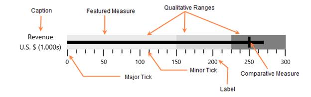

# Key Features in WPF Bullet Graph

[`SfBulletGraph`](https://help.syncfusion.com/cr/wpf/Syncfusion.UI.Xaml.BulletGraph.SfBulletGraph.html) is a composite UI element with the following sub-parts:

* Ticks
* Labels
* Caption
* Ranges
* Featured Measure

## Ticks

Ticks are scale indicators used to specify the values on the quantitative scale.

## Labels

A quantitative scale label specifies the numeric value according to the major ticks in the range of the scale.

## Caption

The [`Caption`](https://help.syncfusion.com/cr/wpf/Syncfusion.UI.Xaml.BulletGraph.SfBulletGraph.html#Syncfusion_UI_Xaml_BulletGraph_SfBulletGraph_Caption) property of the bullet graph is used to specify a unique label describing the value represented in the bullet graph. 

## Ranges

A qualitative range is a visual element that ends at a specified RangeEnd at the beginning of the previous range's RangeEnd. The qualitative ranges are arranged according to each [`RangeEnd`](https://help.syncfusion.com/cr/wpf/Syncfusion.UI.Xaml.BulletGraph.QualitativeRange.html#Syncfusion_UI_Xaml_BulletGraph_QualitativeRange_RangeEnd) value.

## Performance measures

### Featured measure

[`FeaturedMeasure`](https://help.syncfusion.com/cr/wpf/Syncfusion.UI.Xaml.BulletGraph.SfBulletGraph.html#Syncfusion_UI_Xaml_BulletGraph_SfBulletGraph_FeaturedMeasure) is used to display the primary data, or the current value of the data that you are measuring. It should usually be encoded as a bar, like the bar on a bar graph, and be prominent.

### Comparative measure

[`ComparativeMeasure`](https://help.syncfusion.com/cr/wpf/Syncfusion.UI.Xaml.BulletGraph.SfBulletGraph.html#Syncfusion_UI_Xaml_BulletGraph_SfBulletGraph_ComparativeMeasure) should be less visually dominant than the featured measure. It should always be encoded as a short line that runs perpendicular to the orientation of the graph. A good example would be a target for YTD revenue. Whenever the featured measure intersects a comparative measure, the comparative measure should appear behind the featured measure.

## Bullet graph types

The bullet graph types can be differentiated by their orientation. The control direction may be **horizontal** or **vertical**.

### Easy to use

SfBulletGraph is available in the Visual Studio toolbox itself, so you can easily drag and drop the control from the toolbox.

## Data Binding Support

The control can be bound to your application data from a variety of data sources in the form of a binding declaration or by setting its properties directly.

## MVVM support

The Model-View-ViewModel (MVVM) pattern should be followed to get better control customization.

## SfBulletGraph Elements

