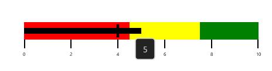
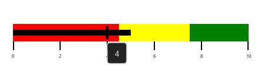
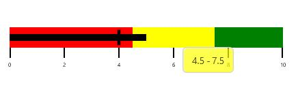

# Tooltip in WPF Bullet Graph (SfBulletGraph)

Tooltip in SfBulletGraph is used to view the values of FeaturedMeasure, ComparativeMeasure and QualitativeRange in required design.

This tooltip is displayed when the mouse is over the FeaturedMeasure, ComparativeMeasure or QualitativeRange. Whereas, in touch device it is displayed on holding over the FeaturedMeasure, ComparativeMeasure and QualitativeRange of SfBulletGraph.

The SfBulletGraph tooltip is displayed only when the **ShowToolTip** property is set to true.




    <syncfusion:SfBulletGraph ShowToolTip="True"/>





    SfBulletGraph bulletgraph = new SfBulletGraph();
    bulletgraph.ShowToolTip = true;
    this.Grid.Children.Add(bulletgraph);




## Customizing FeaturedMeasureToolTip

You can display the value of FeaturedMeasure of SfBulletGraph in ToolTip that is used to view the FeaturedMeasure value .The FeaturedMeasureToolTipTemplate is DataTemplate type by using this property the default appearance of the FeaturedMeasure tooltip can be customized.



     <syncfusion:SfBulletGraph>
            <syncfusion:SfBulletGraph.FeaturedMeasureToolTipTemplate>
                <DataTemplate>
                    <Border BorderBrush="#D3D3D3" BorderThickness="1.5" Background="#232323" CornerRadius="5">
                        <TextBlock Text="{Binding}" FontSize="14" Foreground="#D3D3D3" Margin="12 8"/>
                    </Border>
                </DataTemplate>
            </syncfusion:SfBulletGraph.FeaturedMeasureToolTipTemplate>
        </syncfusion:SfBulletGraph>



## Customizing ComparativeMeasureToolTip

You can display the value of ComparativeMeasure of SfBulletGraph in ToolTip that is used to view the ComparativeMeasure value. The ComparativeMeasureToolTipTemplate is DataTemplate type by using this property the default appearance of the ComparativeMeasure tooltip can be customized.



        <syncfusion:SfBulletGraph>
            <syncfusion:SfBulletGraph.ComparativeMeasureToolTipTemplate>
                <DataTemplate>
                    <Border BorderBrush="#D3D3D3" BorderThickness="1.5" Background="#232323" CornerRadius="5">
                        <TextBlock Text="{Binding}" FontSize="14" Foreground="#D3D3D3" Margin="12 8"/>
                    </Border>
                </DataTemplate>
            </syncfusion:SfBulletGraph.ComparativeMeasureToolTipTemplate>
        </syncfusion:SfBulletGraph>



## Customizing QualitativeRangeToolTip

You can display the value of QualitativeRange of SfBulletGraph in ToolTip that is used to view theStart and End value of QualitativeRange. The QualitativeRangeToolTipTemplate is DataTemplate type by using this property the default appearance of the QualitativeRange tooltip can be customized.



        <syncfusion:SfBulletGraph >
            <syncfusion:SfBulletGraph.QualitativeRangeToolTipTemplate>
                <DataTemplate>
                    <Border BorderBrush="#D3D3D3" BorderThickness="1.5" CornerRadius="5">
                        <Border Background="{Binding RangeStroke}" Opacity="0.7" CornerRadius="5">
                            <StackPanel Orientation="Horizontal" Margin="12 8" >
                                <TextBlock Text="{Binding RangeStart}" FontSize="14" Foreground="Black"/>
                                <TextBlock Text="-" FontSize="14" Foreground="Black" Width="10" TextAlignment="Center"/>
                                <TextBlock Text="{Binding RangeEnd}" FontSize="14" Foreground="Black"/>
                            </StackPanel>
                        </Border>
                    </Border>
                </DataTemplate>
            </syncfusion:SfBulletGraph.QualitativeRangeToolTipTemplate>
        </syncfusion:SfBulletGraph>



