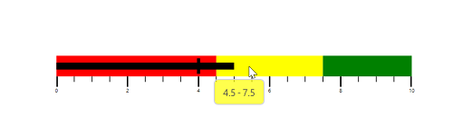
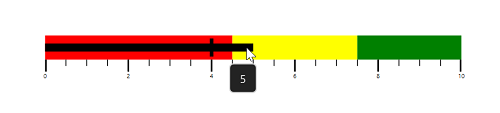
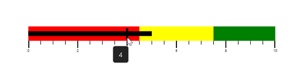
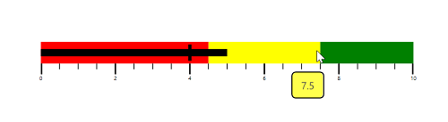

# Tooltip in WPF Bullet Graph (SfBulletGraph)

Tooltip in `SfBulletGraph` is used to view the values of FeaturedMeasure, ComparativeMeasure and QualitativeRange in required design.

This tooltip is displayed when the mouse is over the FeaturedMeasure, ComparativeMeasure or QualitativeRange. Whereas, in touch device it is displayed on holding over the FeaturedMeasure, ComparativeMeasure and QualitativeRange of SfBulletGraph.

The SfBulletGraph tooltip is displayed only when the [`ShowToolTip`](https://help.syncfusion.com/cr/wpf/Syncfusion.UI.Xaml.BulletGraph.SfBulletGraph.html#Syncfusion_UI_Xaml_BulletGraph_SfBulletGraph_ShowToolTip) property is set to true.




     <syncfusion:SfBulletGraph QualitativeRangesSize="30" Minimum="0" Maximum="10" Interval="2"
                                  MinorTicksPerInterval="3" MinorTickSize="8" FeaturedMeasure="5"
                                  ShowToolTip="True" FeaturedMeasureBarStroke="Black"
                                  ComparativeMeasure="4" >
          
            <syncfusion:SfBulletGraph.QualitativeRanges>
                <syncfusion:QualitativeRange RangeEnd="4.5" 
                                             RangeStroke="Red"
                                             RangeOpacity="1">
                </syncfusion:QualitativeRange>
                <syncfusion:QualitativeRange RangeEnd="7.5" 
                                             RangeStroke="Yellow"
                                             RangeOpacity="1">
                </syncfusion:QualitativeRange>
                <syncfusion:QualitativeRange RangeEnd="10" 
                                             RangeStroke="Green"
                                             RangeOpacity="1">
                </syncfusion:QualitativeRange>
            </syncfusion:SfBulletGraph.QualitativeRanges>
        </syncfusion:SfBulletGraph>





   SfBulletGraph bulletgraph = new SfBulletGraph();
            bulletgraph.Minimum = 0;
            bulletgraph.Maximum = 10;
            bulletgraph.FeaturedMeasure = 5;
            bulletgraph.ComparativeMeasure = 4;
            bulletgraph.Interval = 2;
            bulletgraph.MinorTickSize = 8;
            bulletgraph.MinorTicksPerInterval = 3;
            bulletgraph.QualitativeRangesSize = 30;
            bulletgraph.FeaturedMeasureBarStroke = new SolidColorBrush(Colors.Black);
            bulletgraph.ShowToolTip = true;
            bulletgraph.QualitativeRanges.Add(new QualitativeRange()
            {
                RangeEnd = 4.5,
                RangeOpacity = 1,
                RangeStroke = new SolidColorBrush(Colors.Red)
            });
            bulletgraph.QualitativeRanges.Add(new QualitativeRange()
            {
                RangeEnd = 7.5,
                RangeOpacity = 1,
                RangeStroke = new SolidColorBrush(Colors.Yellow)
            });
            bulletgraph.QualitativeRanges.Add(new QualitativeRange()
            {
                RangeEnd = 10,
                RangeOpacity = 1,
                RangeStroke = new SolidColorBrush(Colors.Green)
            });
            grid.Children.Add(bulletgraph);




## Customizing FeaturedMeasureToolTip

You can display the value of [`FeaturedMeasure`](https://help.syncfusion.com/cr/wpf/Syncfusion.UI.Xaml.BulletGraph.SfBulletGraph.html#Syncfusion_UI_Xaml_BulletGraph_SfBulletGraph_FeaturedMeasure) of SfBulletGraph in ToolTip that is used to view the FeaturedMeasure value .The [`FeaturedMeasureToolTipTemplate`](https://help.syncfusion.com/cr/wpf/Syncfusion.UI.Xaml.BulletGraph.SfBulletGraph.html#Syncfusion_UI_Xaml_BulletGraph_SfBulletGraph_FeaturedMeasureToolTipTemplate) is DataTemplate type by using this property, the default appearance of the FeaturedMeasure tooltip can be customized.




 <Grid x:Name="grid">

       <Grid.Resources>
            <DataTemplate x:Key="tooltipTemplate">
                 <Border BorderBrush="#D3D3D3" BorderThickness="1.5" Background="#232323" CornerRadius="5">
                        <TextBlock Text="{Binding}" FontSize="14" Foreground="#D3D3D3" Margin="12 8"/>
                    </Border>
            </DataTemplate>
        </Grid.Resources>

    <syncfusion:SfBulletGraph QualitativeRangesSize="30" Minimum="0" Maximum="10" Interval="2"
                                  MinorTicksPerInterval="3" MinorTickSize="8" FeaturedMeasure="5"
                                  ShowToolTip="True" FeaturedMeasureBarStroke="Black" 
                                  ComparativeMeasure="4" FeaturedMeasureToolTipTemplate="{StaticResource tooltipTemplate}">
          
            <syncfusion:SfBulletGraph.QualitativeRanges>
                <syncfusion:QualitativeRange RangeEnd="4.5" 
                                             RangeStroke="Red"
                                             RangeOpacity="1">
                </syncfusion:QualitativeRange>
                <syncfusion:QualitativeRange RangeEnd="7.5" 
                                             RangeStroke="Yellow"
                                             RangeOpacity="1">
                </syncfusion:QualitativeRange>
                <syncfusion:QualitativeRange RangeEnd="10" 
                                             RangeStroke="Green"
                                             RangeOpacity="1">
                </syncfusion:QualitativeRange>
            </syncfusion:SfBulletGraph.QualitativeRanges>
        </syncfusion:SfBulletGraph>

    </Grid>





 SfBulletGraph bulletgraph = new SfBulletGraph();
            bulletgraph.Minimum = 0;
            bulletgraph.Maximum = 10;
            bulletgraph.FeaturedMeasure = 5;
            bulletgraph.ComparativeMeasure = 4;
            bulletgraph.Interval = 2;
            bulletgraph.MinorTickSize = 8;
            bulletgraph.MinorTicksPerInterval = 3;
            bulletgraph.QualitativeRangesSize = 30;
            bulletgraph.FeaturedMeasureBarStroke = new SolidColorBrush(Colors.Black);
            bulletgraph.ShowToolTip = true;
            bulletgraph.FeaturedMeasureToolTipTemplate = grid.Resources["tooltipTemplate"] as DataTemplate;
            bulletgraph.QualitativeRanges.Add(new QualitativeRange()
            {
                RangeEnd = 4.5,
                RangeOpacity = 1,
                RangeStroke = new SolidColorBrush(Colors.Red)
            });
            bulletgraph.QualitativeRanges.Add(new QualitativeRange()
            {
                RangeEnd = 7.5,
                RangeOpacity = 1,
                RangeStroke = new SolidColorBrush(Colors.Yellow)
            });
            bulletgraph.QualitativeRanges.Add(new QualitativeRange()
            {
                RangeEnd = 10,
                RangeOpacity = 1,
                RangeStroke = new SolidColorBrush(Colors.Green)
            });
            grid.Children.Add(bulletgraph);




## Customizing ComparativeMeasureToolTip

You can display the value of [`ComparativeMeasure`](https://help.syncfusion.com/cr/wpf/Syncfusion.UI.Xaml.BulletGraph.SfBulletGraph.html#Syncfusion_UI_Xaml_BulletGraph_SfBulletGraph_ComparativeMeasure) of SfBulletGraph in ToolTip that is used to view the ComparativeMeasure value. The [`ComparativeMeasureToolTipTemplate`](https://help.syncfusion.com/cr/wpf/Syncfusion.UI.Xaml.BulletGraph.SfBulletGraph.html#Syncfusion_UI_Xaml_BulletGraph_SfBulletGraph_ComparativeMeasureToolTipTemplate) is DataTemplate type by using this property, the default appearance of the ComparativeMeasure tooltip can be customized.




    <Grid x:Name="grid">

       <Grid.Resources>
            <DataTemplate x:Key="tooltipTemplate">
                <Border BorderBrush="#D3D3D3" BorderThickness="1.5" Background="#232323" CornerRadius="5">
                    <TextBlock Text="{Binding}" FontSize="14" Foreground="#D3D3D3" Margin="12 8"/>
                </Border>
            </DataTemplate>
        </Grid.Resources>

       <syncfusion:SfBulletGraph QualitativeRangesSize="30" Minimum="0" Maximum="10" Interval="2"
                                  MinorTicksPerInterval="3" MinorTickSize="8" FeaturedMeasure="5"
                                  ShowToolTip="True" FeaturedMeasureBarStroke="Black" 
                                  ComparativeMeasure="4" ComparativeMeasureToolTipTemplate="{StaticResource tooltipTemplate}">
          
            <syncfusion:SfBulletGraph.QualitativeRanges>
                <syncfusion:QualitativeRange RangeEnd="4.5" 
                                             RangeStroke="Red"
                                             RangeOpacity="1">
                </syncfusion:QualitativeRange>
                <syncfusion:QualitativeRange RangeEnd="7.5" 
                                             RangeStroke="Yellow"
                                             RangeOpacity="1">
                </syncfusion:QualitativeRange>
                <syncfusion:QualitativeRange RangeEnd="10" 
                                             RangeStroke="Green"
                                             RangeOpacity="1">
                </syncfusion:QualitativeRange>
            </syncfusion:SfBulletGraph.QualitativeRanges>
        </syncfusion:SfBulletGraph>
     </Grid>





           SfBulletGraph bulletgraph = new SfBulletGraph();
            bulletgraph.Minimum = 0;
            bulletgraph.Maximum = 10;
            bulletgraph.FeaturedMeasure = 5;
            bulletgraph.ComparativeMeasure = 4;
            bulletgraph.Interval = 2;
            bulletgraph.MinorTickSize = 8;
            bulletgraph.MinorTicksPerInterval = 3;
            bulletgraph.QualitativeRangesSize = 30;
            bulletgraph.FeaturedMeasureBarStroke = new SolidColorBrush(Colors.Black);
            bulletgraph.ShowToolTip = true;
            bulletgraph.ComparativeMeasureToolTipTemplate = grid.Resources["tooltipTemplate"] as DataTemplate;
            bulletgraph.QualitativeRanges.Add(new QualitativeRange()
            {
                RangeEnd = 4.5,
                RangeOpacity = 1,
                RangeStroke = new SolidColorBrush(Colors.Red)
            });
            bulletgraph.QualitativeRanges.Add(new QualitativeRange()
            {
                RangeEnd = 7.5,
                RangeOpacity = 1,
                RangeStroke = new SolidColorBrush(Colors.Yellow)
            });
            bulletgraph.QualitativeRanges.Add(new QualitativeRange()
            {
                RangeEnd = 10,
                RangeOpacity = 1,
                RangeStroke = new SolidColorBrush(Colors.Green)
            });
            grid.Children.Add(bulletgraph);





## Customizing QualitativeRangeToolTip

You can display the value of QualitativeRange of SfBulletGraph in ToolTip that is used to view the Start and End value of QualitativeRange. The [`QualitativeRangeToolTipTemplate`](https://help.syncfusion.com/cr/wpf/Syncfusion.UI.Xaml.BulletGraph.SfBulletGraph.html#Syncfusion_UI_Xaml_BulletGraph_SfBulletGraph_QualitativeRangeToolTipTemplate) is DataTemplate type by using this property, the default appearance of the QualitativeRange tooltip can be customized.




    <Grid x:Name="grid">
       <Grid.Resources>
            <DataTemplate x:Key="tooltipTemplate">
                <Border BorderBrush="Black" BorderThickness="1.5" CornerRadius="5">
                    <Border Background="{Binding RangeStroke}" Opacity="0.7" CornerRadius="5">
                        <StackPanel Orientation="Horizontal" Margin="12 8" >
                            <TextBlock Text="{Binding RangeEnd}" FontSize="14" Foreground="Black"/>
                        </StackPanel>
                    </Border>
                </Border>
            </DataTemplate>
        </Grid.Resources>

      <syncfusion:SfBulletGraph QualitativeRangesSize="30"          Minimum="0" Maximum="10" Interval="2"
                                  MinorTicksPerInterval="3" MinorTickSize="8" FeaturedMeasure="5"
                                  ShowToolTip="True" FeaturedMeasureBarStroke="Black"
                                  ComparativeMeasure="4" 
                                  QualitativeRangeToolTipTemplate="{StaticResource tooltipTemplate}">
           
            <syncfusion:SfBulletGraph.QualitativeRanges>
                <syncfusion:QualitativeRange RangeEnd="4.5" 
                                             RangeStroke="Red"
                                             RangeOpacity="1">
                </syncfusion:QualitativeRange>
                <syncfusion:QualitativeRange RangeEnd="7.5" 
                                             RangeStroke="Yellow"
                                             RangeOpacity="1">
                </syncfusion:QualitativeRange>
                <syncfusion:QualitativeRange RangeEnd="10" 
                                             RangeStroke="Green"
                                             RangeOpacity="1">
                </syncfusion:QualitativeRange>
            </syncfusion:SfBulletGraph.QualitativeRanges>
        </syncfusion:SfBulletGraph>
    </Grid>





            SfBulletGraph bulletgraph = new SfBulletGraph();
            bulletgraph.Minimum = 0;
            bulletgraph.Maximum = 10;
            bulletgraph.FeaturedMeasure = 5;
            bulletgraph.ShowToolTip = "True";
            bulletgraph.ComparativeMeasure = 4;
            bulletgraph.Interval = 2;
            bulletgraph.MinorTickSize = 8;
            bulletgraph.MinorTicksPerInterval = 3;
            bulletgraph.QualitativeRangesSize = 30;
            bulletgraph.FeaturedMeasureBarStroke = new SolidColorBrush(Colors.Black);
            bulletgraph.QualitativeRangeToolTipTemplate = grid.Resources["tooltipTemplate"] as DataTemplate;
            bulletgraph.QualitativeRanges.Add(new QualitativeRange()
            {
                RangeEnd = 4.5,
                RangeOpacity = 1,
                RangeStroke = new SolidColorBrush(Colors.Red)
            });
            bulletgraph.QualitativeRanges.Add(new QualitativeRange()
            {
                RangeEnd = 7.5,
                RangeOpacity = 1,
                RangeStroke = new SolidColorBrush(Colors.Yellow)
            });
            bulletgraph.QualitativeRanges.Add(new QualitativeRange()
            {
                RangeEnd = 10,
                RangeOpacity = 1,
                RangeStroke = new SolidColorBrush(Colors.Green)
            });
            grid.Children.Add(bulletgraph);




