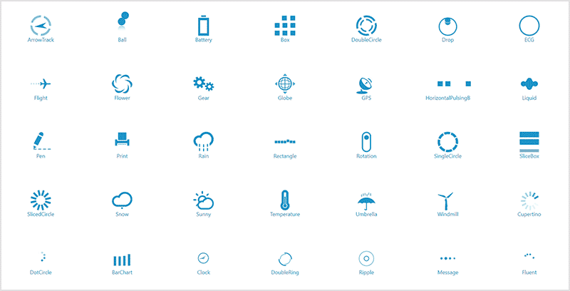

# AnimationTypes in WPF Busy Indicator (SfBusyIndicator)

The AnimationTypes property for the SfBusyIndicator allows the user to set one of the animations from the built-in animations as the busy indicator.

N> `AnimationSpeed` property is not applicable for `Fluent` animation type.





<Grid Background="CornflowerBlue">

    <Notification:SfBusyIndicator AnimationType="Flight"/>

</Grid>





SfBusyIndicator busyIndicator = new SfBusyIndicator();

busyIndicator.AnimationType = AnimationTypes.Flight;





The following gif image contains the types of animation in BusyIndicator.

N> View [sample](https://github.com/SyncfusionExamples/wpf-BusyIndicator-examples/tree/master/Samples/AnimationType) in GitHub
