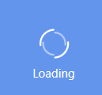
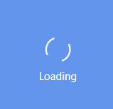
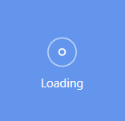

# AnimationTypes in WPF Busy Indicator (SfBusyIndicator)

The AnimationTypes property for the SfBusyIndicator allows the user to set one of the animations from the built-in animations as the busy indicator.





<Grid Background="CornflowerBlue">

    <Notification:SfBusyIndicator AnimationType="Flight"/>

</Grid>





SfBusyIndicator busyIndicator = new SfBusyIndicator();

busyIndicator.AnimationType = AnimationTypes.Flight;





Busy Indicator with ArrowTrack type animation
{:.caption}

Busy Indicator with Ball  type animation
{:.caption}

Busy Indicator with Battery type animation
{:.caption}

Busy Indicator with Box type animation
{:.caption}

Busy Indicator with Delete type animation
{:.caption}

Busy Indicator with DoubleCircle type animation
{:.caption}

Busy Indicator with Drop type animation
{:.caption}

Busy Indicator with ECG type animation
{:.caption}

Busy Indicator with Flight type animation
{:.caption}

Busy Indicator with Flower type animation
{:.caption}

Busy Indicator with Gear type animation
{:.caption}

Busy Indicator with Globe type animation
{:.caption}

Busy Indicator with GPS type animation
{:.caption}

Busy Indicator with HorizontalPulsingBox type animation
{:.caption}

Busy Indicator with Liquid type animation
{:.caption}

Busy Indicator with Pen type animation
{:.caption}

Busy Indicator with Print type animation
{:.caption}

Busy Indicator with Rain type animation
{:.caption}

Busy Indicator with Rectangle type animation
{:.caption}

Busy Indicator with Rotation type animation
{:.caption}

Busy Indicator with SingleCircle type animation
{:.caption}

Busy Indicator with SliceBox type animation
{:.caption}

Busy Indicator with SlicedCircle type animation
{:.caption}

Busy Indicator with Snow type animation
{:.caption}

Busy Indicator with Sunny type animation
{:.caption}

Busy Indicator with Temperature type animation
{:.caption}

Busy Indicator with Umbrella type animation
{:.caption}

Busy Indicator with Windmill type animation
{:.caption}

Busy Indicator with Cupertino type animation
{:.caption}

Busy Indicator with DotCircle type animation
{:.caption}

Busy Indicator with BarChart type animation
{:.caption}

Busy Indicator with Clock type animation
{:.caption}

Busy Indicator with DoubleRing type animation
{:.caption}

Busy Indicator with DualRing type animation
{:.caption}

Busy Indicator with Ripple type animation
{:.caption}

Busy Indicator with Message type animation
{:.caption}

N> View [sample](https://github.com/SyncfusionExamples/wpf-BusyIndicator-examples/tree/master/Samples/AnimationType) in GitHub
