# Getting Started with Button

This section provides an overview of how to work with Button control. It describes the control structure, the control initialization  and the image setting to the control.

## Control structure

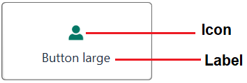

## Assembly deployment

Refer [ButtonAdv](https://help.syncfusion.com/wpf/control-dependencies#buttonadv) control dependencies section to get the list of assemblies or [NuGet package](https://help.syncfusion.com/wpf/visual-studio-integration/nuget-packages) needs to be added as reference to use the ButtonAdv control in any application.

## Creating simple application with Button

In this walk through, will create WPF application that contains Button control. By the following ways, one can add the controls:

1. [Adding control via designer](#adding-control-via-designer)

2. [Adding control manually in XAML](#adding-control-manually-in-xaml)

3. [Adding control manually in C#](#adding-control-manually-in-c)

### Adding control via designer

Button control can be added to the application by dragging **ButtonAdv** from toolbox and dropping it in designer view. After dropping the control in designer view, the assembly **Syncfusion.Shared.WPF** gets added into the project automatically. The following code snippets will also be added into the XAML.




<syncfusion:ButtonAdv x:Name="buttonAdv" Label="ButtonAdv"/>




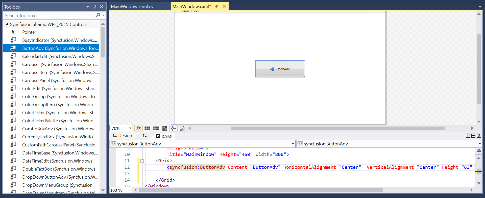

N> **syncfusion** in XAML is an auto generated namespace.

### Adding control manually in XAML

In order to add the control manually in XAML, follow the below steps.

1. Add the below required assembly reference to the project.

    * Syncfusion.Shared.WPF

2. Import Syncfusion WPF schema `http://schemas.syncfusion.com/wpf` or the control namespace `Syncfusion.Windows.Tools.Controls` in XAML page.

3. Declare ButtonAdv control in XAML page.




<Window xmlns="http://schemas.microsoft.com/winfx/2006/xaml/presentation"
        xmlns:x="http://schemas.microsoft.com/winfx/2006/xaml"
        xmlns:local="clr-namespace:Buttonadv_GetStart_Sample"
        xmlns:syncfusion="http://schemas.syncfusion.com/wpf"
        xmlns:Syncfusion="http://schemas.microsoft.com/netfx/2009/xaml/presentation"
        mc:Ignorable="d"
        Title="MainWindow" Height="450" Width="800">
    <Grid>
        <syncfusion:ButtonAdv Height="44"  VerticalAlignment="Center" HorizontalAlignment="Center" Width="162"/>
    </Grid>
</Window>




### Adding control manually in C#

In order to the add control manually in C#, do the below steps.

1. Add the below required assembly reference to the project.

    * Syncfusion.Shared.WPF

2. Import the **Syncfusion.Windows.Tools.Controls** namespace.

3. Create ButtonAdv control instance and add it to the window.




<Window xmlns="http://schemas.microsoft.com/winfx/2006/xaml/presentation"
        xmlns:x="http://schemas.microsoft.com/winfx/2006/xaml"
        xmlns:local="clr-namespace:Button_Getting_Started"
        xmlns:syncfusion="http://schemas.syncfusion.com/wpf"
        xmlns:Syncfusion="http://schemas.microsoft.com/netfx/2009/xaml/presentation"
        mc:Ignorable="d"
        Title="MainWindow" Height="450" Width="800">
    <Grid x:Name="Root">

    </Grid>
</Window>




using Syncfusion.Windows.Tools.Controls;
    
    namespace Button_Getting_Started
    {   
        public partial class MainWindow : Window
        {
            public MainWindow()
            {
                InitializeComponent();
                ButtonAdv button = new ButtonAdv();
                button.Height=44;
                button.Width=31;
                Root.Children.Add(button);
            }
        }
    }




## Setting label

The label on the button is a text that explains its action to the end-user. Apply the text by using the [Label](https://help.syncfusion.com/cr/wpf/Syncfusion.Windows.Tools.Controls.ButtonAdv.html#Syncfusion_Windows_Tools_Controls_ButtonAdv_Label) property.




<syncfusion:ButtonAdv SmallIcon="image\usersmall.png" Label="Log-in"/>





ButtonAdv button = new ButtonAdv();
button.Label = "Log-in";
button.SmallIcon = new BitmapImage(new Uri("image/usersmall.png" , UriKind.RelativeOrAbsolute));




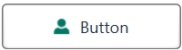

## Setting size mode

Size mode is used to render button control in different pre-defined sizes based on application demand. Apply the size mode by setting the [SizeMode](https://help.syncfusion.com/cr/wpf/Syncfusion.Windows.Tools.Controls.ButtonAdv.html#Syncfusion_Windows_Tools_Controls_ButtonAdv_SizeMode) property.

 The **SizeMode** is an enumeration which contains the following values:

* Small
* Normal
* Large

### Small mode

When the mode is set to small, the control is displayed without the label. Only icon will be present in it.




<sync:ButtonAdv SizeMode="Small" Label="Log-in" SmallIcon ="image\usersmall.png"/>




ButtonAdv button = new ButtonAdv();
button.Label = "Log-in";
button.SizeMode = SizeMode.Small;
button.SmallIcon = new BitmapImage(new Uri("image/usersmall.png", UriKind.RelativeOrAbsolute));




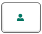

### Normal mode

In a normal size button, a small image with the text on the side will be displayed.




<syncfusion:ButtonAdv SizeMode="Normal" Label="Log-in" SmallIcon ="image\usersmall.png"/>




ButtonAdv button = new ButtonAdv();
button.Label = "Log-in";
button.SizeMode = SizeMode.Normal;
button.SmallIcon = new BitmapImage(new Uri("image/usersmall.png", UriKind.RelativeOrAbsolute));




### Large mode

In a large size button, a large image along with the text at the bottom will be displayed.




<syncfusion:ButtonAdv SizeMode="Large" Label="Log-in" LargeIcon ="image\userlarge.png"/>




ButtonAdv button = new ButtonAdv();
button.Label = "Log-in";
button.SizeMode = SizeMode.Large;
button.LargeIcon = new BitmapImage(new Uri("image/userlarge.png", UriKind.RelativeOrAbsolute));




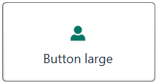

## Setting icon template

The [IconTemplate](https://help.syncfusion.com/cr/wpf/Syncfusion.Windows.Tools.Controls.ButtonAdv.html#Syncfusion_Windows_Tools_Controls_ButtonAdv_IconTemplate) property provides support for setting up any type of image such as path data, font icons, etc. to the ButtonAdv. The icon will automatically resize the template content according to its size provided in the data template.





<sync:ButtonAdv Grid.Row="1" Grid.Column="1" SizeMode="Small" Label="Login" HorizontalAlignment="Center" VerticalAlignment="Center">
    <sync:ButtonAdv.IconTemplate>
        <DataTemplate>
            <Grid Width="12" Height="16">
                <Path
                        Data="M21.576999,13.473151C26.414003,15.496185 30.259996,20.071221 31.999999,25.86432 15.448002,32.143386 0,25.86432 0,25.86432 1.7140042,20.158227 5.4690005,15.632174 10.202001,13.564156 11.338002,15.514191 13.444005,16.827195 15.862003,16.827195 18.317996,16.827195 20.455997,15.474182 21.576999,13.473151z M16.000003,0C19.617999,1.5323894E-07 22.550998,2.9330488 22.550998,6.5510722 22.550998,10.170134 19.617999,13.102144 16.000003,13.102144 12.381993,13.102144 9.4489957,10.170134 9.4489957,6.5510722 9.4489957,2.9330488 12.381993,1.5323894E-07 16.000003,0z"
                        Fill="#FF3A3A38"
                        Stretch="Fill" />
            </Grid>
        </DataTemplate>
    </sync:ButtonAdv.IconTemplate>
</sync:ButtonAdv>
<sync:ButtonAdv Grid.Row="2" Grid.Column="1" SizeMode="Normal" Label="Login" HorizontalAlignment="Center" VerticalAlignment="Center">
    <sync:ButtonAdv.IconTemplate>
        <DataTemplate>
            <Grid Width="16" Height="16">
                <Path
                        Data="M21.576999,13.473151C26.414003,15.496185 30.259996,20.071221 31.999999,25.86432 15.448002,32.143386 0,25.86432 0,25.86432 1.7140042,20.158227 5.4690005,15.632174 10.202001,13.564156 11.338002,15.514191 13.444005,16.827195 15.862003,16.827195 18.317996,16.827195 20.455997,15.474182 21.576999,13.473151z M16.000003,0C19.617999,1.5323894E-07 22.550998,2.9330488 22.550998,6.5510722 22.550998,10.170134 19.617999,13.102144 16.000003,13.102144 12.381993,13.102144 9.4489957,10.170134 9.4489957,6.5510722 9.4489957,2.9330488 12.381993,1.5323894E-07 16.000003,0z"
                        Fill="#FF3A3A38"
                        Stretch="Fill" />
            </Grid>
        </DataTemplate>
    </sync:ButtonAdv.IconTemplate>
</sync:ButtonAdv>
<sync:ButtonAdv Grid.Row="3" Grid.Column="1" SizeMode="Large" Label="Login" HorizontalAlignment="Center" VerticalAlignment="Center">
    <sync:ButtonAdv.IconTemplate>
        <DataTemplate>
            <Grid  x:Name="Save"
                    Width="16"
                    Height="16">
                <Path
                        Width="16"
                        Height="16"
                        Data="M21.576999,13.473151C26.414003,15.496185 30.259996,20.071221 31.999999,25.86432 15.448002,32.143386 0,25.86432 0,25.86432 1.7140042,20.158227 5.4690005,15.632174 10.202001,13.564156 11.338002,15.514191 13.444005,16.827195 15.862003,16.827195 18.317996,16.827195 20.455997,15.474182 21.576999,13.473151z M16.000003,0C19.617999,1.5323894E-07 22.550998,2.9330488 22.550998,6.5510722 22.550998,10.170134 19.617999,13.102144 16.000003,13.102144 12.381993,13.102144 9.4489957,10.170134 9.4489957,6.5510722 9.4489957,2.9330488 12.381993,1.5323894E-07 16.000003,0z"
                        Fill="#FF3A3A38"
                        Stretch="Fill" />
            </Grid>
        </DataTemplate>
    </sync:ButtonAdv.IconTemplate>
</sync:ButtonAdv>

 

 

 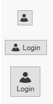

 N> The [ButtonAdv](https://help.syncfusion.com/cr/wpf/Syncfusion.Windows.Tools.Controls.ButtonAdv.html) loads the icon in the following priority order.
* [IconTemplate](https://help.syncfusion.com/cr/wpf/Syncfusion.Windows.Tools.Controls.ButtonAdv.html#Syncfusion_Windows_Tools_Controls_ButtonAdv_IconTemplate)
* [LargeIcon](https://help.syncfusion.com/cr/wpf/Syncfusion.Windows.Tools.Controls.ButtonAdv.html#Syncfusion_Windows_Tools_Controls_ButtonAdv_LargeIcon)
* [SmallIcon](https://help.syncfusion.com/cr/wpf/Syncfusion.Windows.Tools.Controls.ButtonAdv.html#Syncfusion_Windows_Tools_Controls_ButtonAdv_SmallIcon)

## Setting icon template selector

 The [IconTemplateSelector](https://help.syncfusion.com/cr/wpf/Syncfusion.Windows.Tools.Controls.ButtonAdv.html#Syncfusion_Windows_Tools_Controls_ButtonAdv_IconTemplateSelector) property that allows you to specify a different data template based on the value given in the data templates.

 

 

 <Window x:Class="TemplateSelector_ButtonAdv.MainWindow"
        xmlns="http://schemas.microsoft.com/winfx/2006/xaml/presentation"
        xmlns:x="http://schemas.microsoft.com/winfx/2006/xaml"
        xmlns:d="http://schemas.microsoft.com/expression/blend/2008"
        xmlns:mc="http://schemas.openxmlformats.org/markup-compatibility/2006"
        xmlns:local="clr-namespace:TemplateSelector_ButtonAdv"
        xmlns:Sync="http://schemas.syncfusion.com/wpf"
        mc:Ignorable="d"
        Title="MainWindow" Height="450" Width="800">
    <Window.Resources>
        <DataTemplate x:Key="newIcon">
            <Grid Width="12" Height="16">
                <Path
                      Margin="0.5"
                      Data="M0,0 L5.9999999,0 11,5 11,15 0,15 z"
                      Fill="White"
                      Stretch="Fill" />
                <Path
                     Data="M7,1.7070007 L7,5 10.292999,5 z M1,1 L1,15 11,15 11,6 6,6 6,1 z M0,0 L6.7070007,0 12,5.2929993 12,16 0,16 z"
                     Fill="#FF3A3A38"
                     Stretch="Fill" />
            </Grid>
        </DataTemplate>
        <DataTemplate x:Key="OpenIcon">
            <Grid Width="16" Height="16">
                <Path
                     Margin="0.5,0.5,0.738,0.502"
                     Data="M0,0 L5,0 6,1 12,1 12,3.4999998 11.499065,3.9999996 14.716998,3.9999996 11.92699,10.999 4.1853847,10.984859 0,10.982999 z"
                     Fill="White"
                     Stretch="Fill" />
                <Path
                     Data="M5.162991,5.0009986 L1.7839907,10.979999 4.3081884,10.984653 5.0009999,10.984999 5.0009999,10.98593 12.088991,10.999 14.480014,5.0009986 z M0,0 L5.7069998,0 6.7069998,1 13,1 13,3.9999998 12,3.9999998 12,1.9999998 6.2930002,1.9999998 5.2930002,1 0.99999994,1 0.99999994,10.335325 4.5790062,4.0009986 15.954991,4.0009986 12.765994,12.000998 4.552258,11.98482 0,11.982999 z"
                     Fill="#FF3A3A38"
                     Stretch="Fill" />
            </Grid>
        </DataTemplate>
        <local:TemplateSelector x:Key="IconTemp" NewIcon="{StaticResource newIcon}" OpenIcon="{StaticResource OpenIcon}"/>
    </Window.Resources>
    <Grid>
        <StackPanel VerticalAlignment="Center">
            <CheckBox Name="Check" IsChecked="True" Checked="Check_Checked" Unchecked="Check_Unchecked" HorizontalAlignment="Center" Command="{Binding CheckCommand}" Content="ChangeIcon"/>
            <Sync:ButtonAdv HorizontalAlignment="Center" Margin="10" Content="{Binding IsChecked}" Label="IconTemplateSelector" IconTemplateSelector="{StaticResource IconTemp}"/>
        </StackPanel>
    </Grid>
 </Window>

 

 

 public class TemplateSelector : DataTemplateSelector
 {
    public DataTemplate NewIcon { get; set; }
    public DataTemplate OpenIcon { get; set; }
    public override DataTemplate SelectTemplate(object item, DependencyObject container)
    {
        if (item == null)
        {
            return OpenIcon;
        }
        if ((item as Model).IsChecked)
        {
            return NewIcon;
        }
        return base.SelectTemplate(item, container);
    }
 }

 

 

 N> The [ButtonAdv](https://help.syncfusion.com/cr/wpf/Syncfusion.Windows.Tools.Controls.ButtonAdv.html) loads the icon in the following priority order.
* [IconTemplateSelector](https://help.syncfusion.com/cr/wpf/Syncfusion.Windows.Tools.Controls.ButtonAdv.html#Syncfusion_Windows_Tools_Controls_ButtonAdv_IconTemplateSelector)
* [IconTemplate](https://help.syncfusion.com/cr/wpf/Syncfusion.Windows.Tools.Controls.ButtonAdv.html#Syncfusion_Windows_Tools_Controls_ButtonAdv_IconTemplate)
* [LargeIcon](https://help.syncfusion.com/cr/wpf/Syncfusion.Windows.Tools.Controls.ButtonAdv.html#Syncfusion_Windows_Tools_Controls_ButtonAdv_LargeIcon)
* [SmallIcon](https://help.syncfusion.com/cr/wpf/Syncfusion.Windows.Tools.Controls.ButtonAdv.html#Syncfusion_Windows_Tools_Controls_ButtonAdv_SmallIcon)

## Setting image

The image option helps to provide pictorial representation of the button. Image can be added either using the [SmallIcon](https://help.syncfusion.com/cr/wpf/Syncfusion.Windows.Tools.Controls.ButtonAdv.html#Syncfusion_Windows_Tools_Controls_ButtonAdv_SmallIcon) property or [LargeIcon](https://help.syncfusion.com/cr/wpf/Syncfusion.Windows.Tools.Controls.ButtonAdv.html#Syncfusion_Windows_Tools_Controls_ButtonAdv_LargeIcon) property.

**SmallIcon** — This property will be used to set the image when size mode is **Normal** or **Small**.
**LargeIcon** — This property will be used to set the image when size mode is **Large**.

The **SmallIcon** property can be set as follows:




<syncfusion:ButtonAdv SizeMode="Small" SmallIcon ="image\syncfusion.png"/>




ButtonAdv button = new ButtonAdv();
button.SizeMode = SizeMode.Small;
button.SmallIcon = new BitmapImage(new Uri("image/syncfusion.png", UriKind.RelativeOrAbsolute));




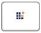

The **SmallIcon** property can be set even when the SizeMode is **Normal**.




<syncfusion:ButtonAdv SizeMode="Normal" SmallIcon="syncfusion.png" Label="Syncfusion" SmallIcon ="image\syncfusion.png"/>




ButtonAdv button = new ButtonAdv();
button.Label = "Syncfusion";
button.SizeMode = SizeMode.Normal;
button.SmallIcon = new BitmapImage(new Uri("image/syncfusion.png", UriKind.RelativeOrAbsolute));




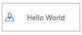

The **LargeIcon** property can be set as follows:




<sync:ButtonAdv SizeMode="Large" LargeIcon="syncfusion.png" Label="Syncfusion" SmallIcon ="image\syncfusion.png"/>




ButtonAdv button = new ButtonAdv();
button.Label = "Syncfusion";
button.SizeMode = SizeMode.Large;
button.SmallIcon = new BitmapImage(new Uri("image/syncfusion.png", UriKind.RelativeOrAbsolute));




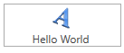

## Setting icon width and height

Icon width and icon height can be set using [IconWidth](https://help.syncfusion.com/cr/wpf/Syncfusion.Windows.Tools.Controls.ButtonAdv.html#Syncfusion_Windows_Tools_Controls_ButtonAdv_IconWidth) and [IconHeight](https://help.syncfusion.com/cr/wpf/Syncfusion.Windows.Tools.Controls.ButtonAdv.html#Syncfusion_Windows_Tools_Controls_ButtonAdv_IconHeight) properties respectively.




<syncfusion:ButtonAdv x:Name="button1" SizeMode="Normal" IconHeight="20" IconWidth="20"  Label="Syncfusion"  SmallIcon ="image\syncfusion.png"/>




ButtonAdv button1 = new ButtonAdv();
button1.Label = "Syncfusion";
button1.IconWidth=20;
button1.IconHeight=20;
button1.SmallIcon = new BitmapImage(new Uri("image/syncfusion.png", UriKind.RelativeOrAbsolute));




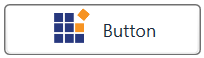




<syncfusion:ButtonAdv x:Name="button2"  SizeMode="Normal" IconHeight="30" IconWidth="30"  Label="Syncfusion" SmallIcon ="image\syncfusion.png" />




ButtonAdv button2 = new ButtonAdv();
button2.Label = "Syncfusion";
button2.IconWidth=30;
button2.IconHeight=30;
button2.SmallIcon = new BitmapImage(new Uri("image/syncfusion.png", UriKind.RelativeOrAbsolute));




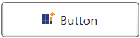

N> View [sample](https://github.com/SyncfusionExamples/wpf-button-examples/blob/master/Samples/Getting-Started) in GitHub. This sample showcases how to add button control and its basic features like image sizing options and size modes.

## IsDefault mode

The [IsDefault](https://help.syncfusion.com/cr/wpf/Syncfusion.Windows.Tools.Controls.ButtonAdv.html#Syncfusion_Windows_Tools_Controls_ButtonAdv_IsDefault) property indicates whether the ButtonAdv is a Default button and is used to activate the ButtonAdv by pressing using Enter key. When setting the IsDefault property to true, the user can invoke the button by pressing the `Enter` key. 





 <sync:ButtonAdv x:Name="defaultButton" Label="Default" Grid.Column="1" Grid.Row="1" VerticalAlignment="Top" HorizontalAlignment="Center" Click="ButtonAdv_Click" IsDefault="True" />





## IsCancel mode

The [IsCancel](https://help.syncfusion.com/cr/wpf/Syncfusion.Windows.Tools.Controls.ButtonAdv.html#Syncfusion_Windows_Tools_Controls_ButtonAdv_IsCancel) property indicates whether the ButtonAdv is a Cancel button and is used to activate the button by using Escape key. When setting the IsCancel property to true, the user can invoke the button by pressing the `Escape` key. 





 <sync:ButtonAdv x:Name="cancelButton" Label="Cancel" Grid.Column="1" Grid.Row="1" VerticalAlignment="Top" HorizontalAlignment="Center" Click="ButtonAdv_Click" IsCancel="True" />



