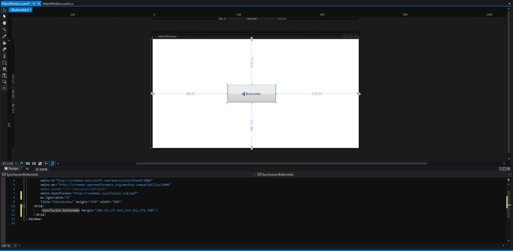
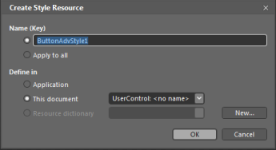
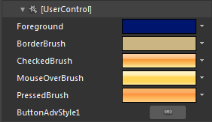
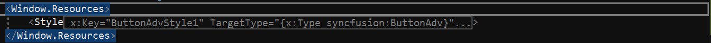
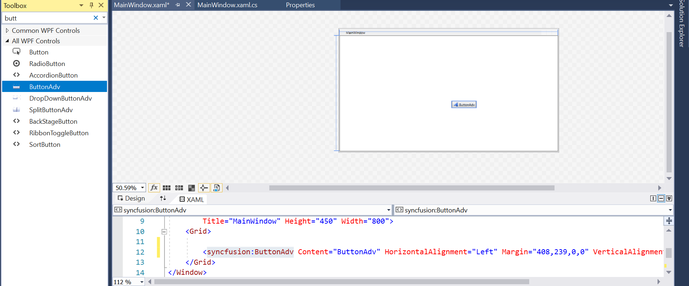
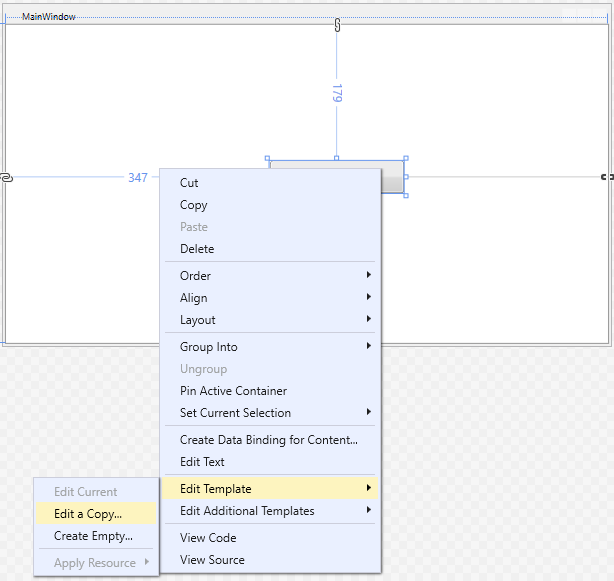
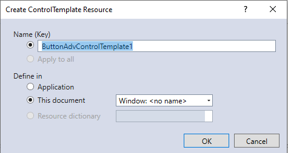
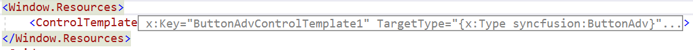

# Styles and Templates in WPF Button (ButtonAdv)

The [WPF Button](https://www.syncfusion.com/wpf-controls/button) control supports styles and templates that allow developers and designers to create visually compelling effects and a consistent product appearance. The WPF Button is implemented through the `ButtonAdv` class.

This document provides information about changing the visual appearance of the Button control. You can also edit the structure of the Button control by using Blend and Visual Studio to customize its appearance.

## Edit appearance in Expression Blend

* Open the application in Expression Blend.
* Select the WPF Button control from the window.

    

* Right-click the WPF Button control and choose **Edit Template**. It contains the following two options.
    * **Edit a Copy...** – Edit a copy of the default style. When selecting this option, a new dialog opens as follows.

    

    

    The **Create Style Resource** dialog allows you to enter or change the style name and choose the location for the style. When you select **OK**, Expression Blend generates the Button control style in the **Resource** section. You can edit the generated XAML in XAML view or Visual Studio.

    * **Create Empty...** - Creates an empty WPF Button style. Selecting this option opens the **Create ControlTemplate Resource** dialog, which allows you to enter or change the control template name and choose the location for the template.

All resources are displayed in the application XAML file after you perform the above steps. You can edit these resources to create a new style.

WPF Button control edited in Expression Blend
{:.caption}

## Edit appearance in Visual Studio

* Open the application in Visual Studio.
* Open design view and select the WPF Button control. Right-click the Button control to view the available menu options.

    

* Select **Edit Template** to view the following two options.
    * **Edit a Copy...** – Edit a copy of the default style. When selecting this option, a new dialog opens as follows.

    

    

    The **Create ControlTemplate Resource** dialog allows you to enter or change the control template name and choose the location for the template. When you select **OK**, Visual Studio generates the WPF Button control template in the **Resource** section. You can edit the generated XAML in XAML view.

    * **Create Empty...** - Creates an empty WPF Button style. Selecting this option opens the **Create ControlTemplate Resource** dialog, which allows you to enter or change the control template name and choose the location for the template.

All resources are displayed in the application XAML file after you perform the above steps. You can edit these resources to create a new style.

Button control edited in Visual Studio
{:.caption}
