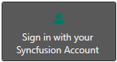

# Themes in WPF Button (ButtonAdv)

The [WPF Button](https://www.syncfusion.com/wpf-controls/button) control supports various built-in themes. The WPF Button is implemented through the [ButtonAdv](https://help.syncfusion.com/cr/wpf/Syncfusion.Windows.Tools.Controls.ButtonAdv.html) class. Refer to the following links to apply themes to the control:

  * [Apply theme using SfSkinManager](https://help.syncfusion.com/wpf/themes/skin-manager)
	
  * [Create a custom theme using ThemeStudio](https://help.syncfusion.com/wpf/themes/theme-studio#creating-custom-theme)

  
