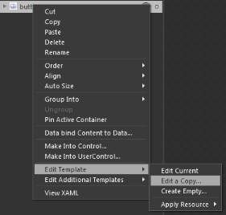

# Blendability

The ButtonAdv control can be easily edited using the Expression Blend.

To edit the ButtonAdv control:

1. Open Sample in the Expression Blend. 
2. Right click on the button control and choose Edit Template option as shown below:

   

   Editing ButtonAdv Template Using Expression Blend
   {:.caption}

3. The Create Style Resource window appears as follows. Click OK to create a new style for Button control.

   

   Creating Style Resource
   {:.caption}

4. All the resources will be displayed on the resources pane of the design area. These resources can be edited to create a new Style.

   

   Editing Resources
  {:.caption}

   

   ButtonControlAdv style edited in Blend

   {:.caption}
