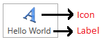
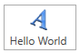
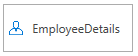
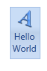
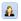
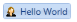
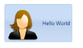
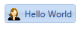

# Getting Started

This section guides you on getting started with the ButtonAdv control. It describes you about the control structure, basic settings, implementation and members.

## Control structure

Control Structure
{:.caption}

## Add ButtonAdv control to an application

The ButtonAdv control is available in the following assembly:

*  Syncfusion.Shared.WPF

## Setting label

The following code explains how to declare the ButtonAdv control using XAML.




<sync:ButtonAdv Label="Hello World"/>




The ButtonAdv control can be created using the C# code as follows:




ButtonAdv button = new ButtonAdv();

button.Label = "Hello World";




Typical ButtonAdv Control
{:.caption}

## Set size mode

The size mode of the ButtonAdv control can be easily modified by using the property SizeMode. The SizeMode is the enum property which contains the following values:

* Small
* Normal
* Large

## Small mode

When the SizeMode is set to Small, the ButtonAdv control is displayed without the label and only icon is present in it.

Use the following code example to set the SizeMode to Small:




<sync:ButtonAdv SizeMode="Small" Label="Hello World"/>




ButtonAdv button = new ButtonAdv();

button.Label = "Hello World";

button.SizeMode = SizeMode.Small;




ButtonAdv Control with Small SizeMode
{:.caption}

## Normal mode

The ButtonAdv control retains the default appearance, when the SizeMode is set to Normal.

Use the following code example to set the SizeMode to Normal:




<sync:ButtonAdv SizeMode="Normal" Label="Hello World"/>




ButtonAdv button = new ButtonAdv();

button.Label = "Hello World";

button.SizeMode = SizeMode.Normal;




ButtonAdv control with Normal SizeMode
{:.caption}

## Large mode

When the SizeMode is set to Large, the ButtonAdv control is displayed with large icon and provides multiline support.

Use the following code example to set the SizeMode to Large:




<sync:ButtonAdv SizeMode="Large" Label="Hello World"/>




ButtonAdv button = new ButtonAdv();

button.Label = "Hello World";

button.SizeMode = SizeMode.Large;




ButtonAdv controls with Large SizeMode
{:.caption}

## Setting image

The image displayed on the control can be set using the following two properties:

* SmallIcon—To set the image when SizeMode is Normal or Small.
* LargeIcon—To set the image when SizeMode is Large.

The SmallIcon property can be set as follows:




<sync:ButtonAdv SizeMode="Small" Label="Hello World" SmallIcon="employee.png"/>




ButtonAdv button = new ButtonAdv();

button.Label = "Hello World";

button.SizeMode = SizeMode.Small;

button.SmallIcon = new BitmapImage(new Uri("employee.png"));




Small Sized ButtonAdv Control with image
{:.caption}

The SmallIcon property can be set even when the SizeMode is Normal:




<sync:ButtonAdv SizeMode="Normal" SmallIcon="employee.png" Label="Hello World"/>




ButtonAdv button = new ButtonAdv();

button.Label = "Hello World";

button.SizeMode = SizeMode.Normal;

button.SmallIcon = new BitmapImage(new Uri("employee.png"));




Normal Sized ButtonAdv Control with Image
{:.caption}

The LargeIcon property can be set as follows:




<sync:ButtonAdv SizeMode="Large" LargeIcon="employee.png" Label="Hello World"/>




ButtonAdv button = new ButtonAdv();

button.Label = "Hello World";

button.SizeMode = SizeMode.Large;

button.SmallIcon = new BitmapImage(new Uri("employee.png"));</td></tr>




Large Sized ButtonAdv Control with Image
{:.caption}

## Set icon width and height

The Icon size can be customized using the following two properties:

* IconWidth
* IconHeight

ButtonAdv Control with IconSize(80,80)
{:.caption}

ButtonAdv Control with IconSize(20,20)
{:.caption}

The IconWidth and IconHeight can be set as follows:




<sync:ButtonAdv   SizeMode="Normal" IconHeight="20" IconWidth="20"  Label="Hello World"  SmallIcon ="female.png"  />




ButtonAdv button = new ButtonAdv()button.Label = "Hello World";button.IconWidth=20;button.IconHeight=20;




## ButtonAdv members

### Properties

<table>
<tr>
<th>
Name</th><th>
Type</th><th>
Value it accepts</th><th>
Description</th><th>
Default Value</th><th>
Reference Link</th></tr>
<tr>
<td>
Label</td><td>
String</td><td>
String</td><td>
The Label Property of this element can be set to any string value</td><td>
Null</td><td>
Label</td></tr>
<tr>
<td>
SizeMode</td><td>
SizeMode</td><td>
Normal,Small,        Large</td><td>
Represents the Size of the element, that can be Normal, Small or Large</td><td>
Normal</td><td>
SizeMode</td></tr>
<tr>
<td>
SmallIcon</td><td>
ImageSource</td><td>
Image URL</td><td>
Represents the Image displayed in the element, when size form is Small or Normal</td><td>
-</td><td>
SmallIcon</td></tr>
<tr>
<td>
LargeIcon</td><td>
ImageSource</td><td>
Image URL</td><td>
Represents the Image displayed in the element, when size form is Large</td><td>
Null</td><td>
LargeIcon</td></tr>
<tr>
<td>
IsCheckable</td><td>
Boolean</td><td>
True or False</td><td>
Button will act as a Checkable item if true</td><td>
False</td><td>
Checkable Support</td></tr>
<tr>
<td>
IsChecked</td><td>
Boolean</td><td>
True or False</td><td>
Represents the Checked state of the element</td><td>
False</td><td>
Checkable Support</td></tr>
<tr>
<td>
IsMultiline</td><td>
Boolean</td><td>
True or False</td><td>
Represents whether the Label displayed in two line or not</td><td>
True</td><td>
MultiLine Support</td></tr>
<tr>
<td>
Command</td><td>
ICommand</td><td>
ICommand</td><td>
Represents the command to invoke when the button is pressed</td><td>
Null</td><td>
Command Binding</td></tr>
<tr>
<td>
CommandParameter</td><td>
Object</td><td>
Object</td><td>
Represents the parameter to pass the Command property.</td><td>
Null</td><td>
Command Binding</td></tr>
<tr>
<td>
IconWidth</td><td>
double</td><td>
double</td><td>
Represents the width of the icon. </td><td>
16.0</td><td>
IconSize</td></tr>
<tr>
<td>
IconHeight</td><td>
double</td><td>
double</td><td>
Represents the height of the icon.</td><td>
16.0</td><td>
IconSize</td></tr>
</table>

### Events

<table>
<tr>
<th>
Name</th><th>
Event Type</th><th>
Event Args Parameter</th><th>
Description</th><th>
Reference Link</th></tr>
<tr>
<td>
Click</td><td>
RoutedEventHandler</td><td>
RoutedEvent Args</td><td>
Occurs when ButtonAdv is pressed.</td><td>
Click</td></tr>
<tr>
<td>
Checked</td><td>
RoutedEventHandler</td><td>
RoutedEventArgs</td><td>
Occurs when the Button is Checked.</td><td>
Checked</td></tr>
</table>
