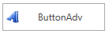

# Overview

The ButtonAdv control is a basic button control that is used to design complex forms and applications. The control is shipped with a Commanding Support that provides compatibility in MVVM design pattern.

_ButtonAdv_

