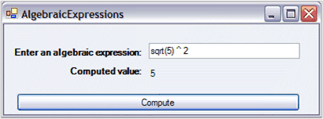
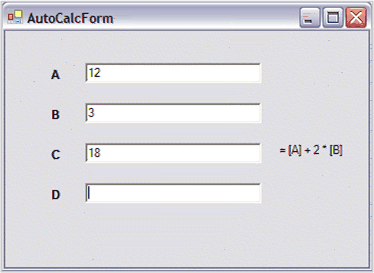

# Add Calculation Support

Essential Calculate has a CalcQuickBase class that enables you to easily add formula parsing calculation support to arbitrary business objects. In addition, you can add calculation support to any data class by having that class implement the ICalcData interface. 

The following sections discuss this class and interface:

## CalcQuickBase

The simplest way to use Essential Calculate is through an instance of its CalcQuickBase class. This class provides options to directly parse and compute a formula, or register variable names that can later be used in more complex formulas involving these variables. After registering the variables, it provides options to perform manual or automatic calculations.

This section discusses the usage of the CalcQuickBase class, under the following topics:

### Manual Calculations

Manual calculations requires you to explicitly request Essential Calculate to compute the value and return it. You can do this by invoking methods in the CalcQuickBase class. There are several methods available which are discussed under the following topics:

* ParseAndCompute-This method accepts a formula string, parse it, and then return the computed value of the parsed formula. You can also directly invoke computation methods for any of the library functions of Essential Calculate through the CalcEngine class.
* Indexer method by using Variables

### ParseAndCalculate Method

If you have an algebraic expression that just contains constants and function library methods, the most straight forward way of using Essential Calculate is to invoke its ParseAndCalculate method. Using CalcQuickBase makes this very simple. Consider, for example, the below form with a text box and a button on it. When you click the button, the computed value of the formula is displayed in the text box.

_Simple Expression_

The code that provides this functionality is very straight-forward. Add a reference to Syncfusion.Calculate in your project. Then instantiate a CalcQuickBase object, and invoke its ParseAndCalculate method from the button handler. Now you can type a formula in the text box and click the button to get the computed value. The following code illustrates this.


using Syncfusion.Calculate;

private CalcQuickBase calculator = null;

private void Form1_Load(object sender, EventArgs e)

{

      this.calculator = new CalcQuickBase();

}

private void button1_Click(object sender, EventArgs e)

{

      string s = calculator.ParseAndCompute(this.textBox1.Text);

      this.label3.Text = s;

}



Imports Syncfusion.Calculate

Private calculator As CalcQuickBase = Nothing

Private Sub Form1_Load(sender As Object, e As EventArgs)

      Me.calculator = New CalcQuickBase()

     ' Form1_Load

End Sub 

Private Sub button1_Click(ByVal sender As Object, ByVal e As EventArgs)

      Dim s As String = calculator.ParseAndCompute(Me.textBox1.Text)

      Me.label3.Text = s

' Button1_Click

End Sub 



In this discussion, it is assumed that the formulas involved contain only constants and library references. On the other hand, you can use the ParseAndCompute method to explicitly parse and calculate formulas that use variables as well. But, before you do that, you need to know how to register variables and assign values to them.

### Indexer Method using Variables

In this section, you can learn how to use variable names within formulas to represent particular values. A variable name must begin with an alphabetical character and can contain only letters and digits. It is not case-sensitive. To register a string as a variable name and set its value is a single step operation, you must simply index the CalcQuickBase object with the name and assign the value to it.



this.calculator["base"] = 3;

this.calculator["height"] = 2.5;




Me.calculator("base") = 3

Me.calculator("height") = 2.5



_Simple Variables_

When a name is used as an indexer on the CalcQuickBase object, the object checks a collection of variables that it maintains. 

* If the name is not in the collection, it is added to the collection as a new item with the assigned value.
* If the name is already in the collection, its assigned value is changed to the new value.

Then when a formula is parsed, the CalcQuickBase object replaces all occurrences of variable names with their current values. To use a named variable in a formula, you must enclose it within brackets, as shown in the following formula:

[base]*[height]/2

The preceding formula takes the value represented by the base and multiplies it by the height of the value divided by two.

As a convention, if you want a variable to actually hold a string that is a formula and be treated as a formula, so that it is parsed and computed through the indexing code, then begin that string with a special character, the CalcQuickBase.FormulaCharacter (CalcEngine.FormulaCharacter). The default value of this character is "=". If you invoke the ParseAndCompute directly, any string you pass is treated as a formula, whether or not it begins with FormulaCharacter.

### The FormulaInfo Class 

The collection that CalcQuickBase maintains in order to hold information on variables, is a collection of FormulaInfo objects. The FormulaInfo class has the following public properties.

* FormulaText-String holding the formula as originally entered
* ParsedFormula-String holding the parsed version of the formula1
* FormulaValue-String holding the last computed value for the formula

Indexing is an instance of the CalcQuickBase class, which sets the FormulaText property and gets the FormulaValue property for the FormulaInfo object that is associated with the variable name and used as the indexer. A FormulaInfo object is dynamically created, if you use a variable name that is not in the CalcQuickBase FormulaInfo collection. To retrieve FormulaText, you must use the CalcQuickBase.GetFormula method and pass it in the variable name.

While using an indexer to get a value from a CalcQuickBase object, the FormulaValue property is returned. So, the question arises, as to exactly "when" this FormulaValue is computed from the FormulaText that has been set into this FormulaInfo object. When a new value for FormulaValue is computed, it is controlled by an internal member of FormulaInfo, the calcID. The CalcQuickBase object maintains a calcID value as well. Whenever the FormulaInfo.FormulaValue is requested, the CalcQuickBase.calcID is compared to the FormulaInfo.calcID, and if they do not match, the FormulaInfo.FormulaValue is recomputed and its FormulaInfo.calcID is set to match the CalcQuickBase.calcID. So, FormulaValue is only computed when the calcID value does not match the CalQuick.calcID value. Also, you can force new computations by calling the SetDirty method on your CalcQuickBase instance.

The actual collection of FormulaInfo objects (and some related collections) are protected members of the CalcQuickBase class. In order to access the objects of these collections directly, you must derive the CalcQuickBase class of Essential Calculate. The Calculate class reference has more information on these protected collections.

You can access the underlying Calculate.Engine object through the public read-only Engine property of the CalcQuickBase class. You can then use this Engine property to add custom functions to the Function Library that is available for the CalcQuickBase object.

### Automatic Calculations 

Essential Calculate enables you to monitor value changes, and then automatically recomputes formulas that depend upon the changed values. There is an additional overhead associated with automatic calculations that enables you to determine "when" you want to use this feature.

### Using Explicit Events

By default, CalcQuickBase does not try to track any dependencies among the variables you set. Thus, if you have a formula like

"=[TestValue]+2", the computed value of this formula is not changed automatically if you modify your TestValue variable. To enable automatic recalculation of dependent variables, you must set the CalcQuickBase.AutoCalc property to True. Once this is done, the CalcQuickBase object (through its embedded CalcEngine object) maintains the required dependency information.

 In practice, some additional work needs to be done. When a variable is auto-changed, nothing actually happens until you try to use it. For example, assume that you have a series of text boxes on a form with some of the text boxes holding numerical values and some text boxes holding formulas that reference these values through variables that you have registered with a CalcQuickBase object.

_AutoCalc_

In the above screenshot, Text Box C is set to a formula that references the values from Text Box A and Text Box B. So, once the value in Text Box A or Text Box B changes, the value in Text Box C should also change.

In order to get this to work, two things must be done. First, when the variable registered as A or B is modified, your code must set the new values in the CalcQuickBase object by using indexers. The reason for you do this is, so that CalcQuickBase has no knowledge of Text Box A and Text Box B. It knows about the variables A and B which you have registered through indexing, but it has no knowledge that these values are actually coming from particular text boxes. After you have set the new values using indexers, the CalcQuickBase object knows that variable C changes and modifies its value. But, the CalcQuickBase object that modifies its value for variable C has no effect on the text box that holds C. This is the point where your code needs to play its second role. You need to get the value of variable C and put it into the appropriate text box. The common question is, "How does the code know that it has to retrieve C so that it can update Text Box C appropriately?" This is made possible as the CalcQuickBase object raises an event, CalcQuickBase.ValueSet, every time a value that it is tracking is modified. So, your code can listen for this event and set the proper values.

The following code illustrates the above process.



private CalcQuickBase calculator = null;

private void Form_Load(object sender, System.EventArgs e)

{

        // 1) Instantiate a CalcQuickBase object.

        calculator = new CalcQuickBase();

        // 2) Populate your controls.

        this.textBoxA.Text = "12";

        this.textBoxB.Text = "3";

        this.textBoxC.Text = "= [A] + 2 * [B]";

        // Must enter formula names before turning on calculations.

        // 3) Assign formula object names.

        calculator["A"] = this.textBoxA.Text;

        calculator["B"] = this.textBoxB.Text;

        calculator["C"] = this.textBoxC.Text;

        calculator["D"] = this.textBoxD.Text;

        // 4) Turn on auto calculations.

        this.calculator.AutoCalc = true;

        // 5) Subscribe to the event to set newly calculated values.

        this.calculator.ValueSet += new QuickValueSetEventHandler(calculator_ValueSet);

        // 6) Subscribe to some events to trigger the setting of values into CalcQuickBase.

        this.textBoxA.Leave +=new EventHandler(textBoxA_Leave);

        this.textBoxB.Leave +=new EventHandler(textBoxB_Leave);

        this.textBoxC.Leave +=new EventHandler(textBoxC_Leave);

        this.textBoxD.Leave +=new EventHandler(textBoxD_Leave);

         // 7) Allow the CalcQuickBase sheet to create dependency lists.

        // Necessary for auto-calculations.

        this.calculator.RefreshAllCalculations();

}

// 8) Raised when a variable value is calculated.

private void calculator_ValueSet(object sender, OuickValueSetEventArgs e)

{

        switch(e.Key)

        {

                case "A":

                        this.textBoxA.Text = this.calculator[e.Key].ToString();

                        break;

                case "B":

                        this.textBoxB.Text = this.calculator[e.Key].ToString();

                        break;

                case "C":

                        this.textBoxC.Text = this.calculator[e.Key].ToString();

                        break;

                case "D":

                        this.textBoxD.Text = this.calculator[e.Key].ToString();

                        break;

                default:

                        break;

        }

}

// 9) Handles the changing of the text in the text box so the CalQuick object can be updated as the text changes.

private void textBoxA_Leave(object sender, EventArgs e)

{

        if(this.textBoxA.Modified)

        {

                calculator["A"] = this.textBoxA.Text;

                this.textBoxA.Modified = false;

        }

}

// ..... same for textBoxB_Leave, textBoxC_Leave, textBoxD_Leave



Private calculator As CalcQuickBase = Nothing

Private Sub Form_Load(sender As Object, e As System.EventArgs)

        ' 1) Instantiate a CalcQuickBase object.

        calculator = New CalcQuickBase()

        ' 2) Populate your controls.

        Me.textBoxA.Text = "12"

        Me.textBoxB.Text = "3"

        Me.textBoxC.Text = "= [A] + 2 * [B]"

        ' Must enter formula names before turning on calculations.

        ' 3) Assign formula object names.

        calculator("A") = Me.textBoxA.Text

        calculator("B") = Me.textBoxB.Text

        calculator("C") = Me.textBoxC.Text

        calculator("D") = Me.textBoxD.Text

        ' 4) Turn on auto calculations.

        Me.calculator.AutoCalc = True

        ' 5) Subscribe to the event to set newly calculated values.

        AddHandler Me.calculator.ValueSet, AddressOf calculator_ValueSet

        ' 6) Subscribe to some events to trigger the setting of values into CalcQuickBase.

        AddHandler Me.textBoxA.Leave, AddressOf textBoxA_Leave

        AddHandler Me.textBoxB.Leave, AddressOf textBoxB_Leave

        AddHandler Me.textBoxC.Leave, AddressOf textBoxC_Leave

        AddHandler Me.textBoxD.Leave, AddressOf textBoxD_Leave

        ' 7) Allow the CalcQuickBase sheet to create dependency lists necessary for auto calculations.

        Me.calculator.RefreshAllCalculations()

' Form_Load

End Sub 

' 8) Raised when a variable value is calculated.

Private Sub calculator_ValueSet(ByVal sender As Object, ByVal e As OuickValueSetEventArgs)

        Select Case e.Key

            Case "A"

                Me.textBoxA.Text = Me.calculator(e.Key).ToString()

            Case "B"

                Me.textBoxB.Text = Me.calculator(e.Key).ToString()

            Case "C"

                Me.textBoxC.Text = Me.calculator(e.Key).ToString()

            Case "D"

                Me.textBoxD.Text = Me.calculator(e.Key).ToString()

            Case Else

        End Select

' Calculator_ValueSet

End Sub 

' 9) Handles the changing of the text in the text box so the CalcQuickBase object can be updated as the text changes.

Private Sub textBoxA_Leave(ByVal sender As Object, ByVal e As EventArgs)

        If Me.textBoxA.Modified Then

            calculator("A") = Me.textBoxA.Text

            Me.textBoxA.Modified = False

        End If

' TextBoxA_Leave

End Sub 



The following is an explanation of the numbered steps given in the preceding Form_Load.

1. Instantiates the CalcQuickBase instance.
2. Sets some initial text into the first three text boxes. The first two values are just numerical entries but, the third value is treated as a formula by the CalcQuickBase object as it begins with a "=".
3. This step registers the variable names A, B, C and D with the CalcQuickBase object, and sets the initial values of these variables to the contents of the text boxes.
4. Here the AutoCalc property is turned on so CalcQuickBase starts tracking any dependencies that it notes among the variables registered with it. Note that this step was done after the initial registering of the variables in step 3. So, any relations among the registered variables are unknown to the CalcQuickBase object. This shortcoming is addressed in step 7 and the rationale for this order is discussed there.
5. Subscribe to CalcQuickBase's ValueSet event so that the code can react to any automatic changing of the registered variables’ values and place them into the appropriate text box so your display immediately reflects any change.
6. Subscribe to the text box events so that you can update the CalcQuickBase object when the text in a text box has changed.
7. This step forces the recalculation of all variables registered with the CalcQuickBase object. This has to be done after the AutoCalc property has been set to True, so that the dependencies between variables can be monitored. The reason to postpone setting AutoCalc until after the initial registration of the variables, is to avoid problems that might occur because of CalcQuickBase trying to set up dependency chains even before all the variables have been registered. Initializing the variables, turning on AutoCalc, and then calling RefreshAllCalculations, avoids this potential problem.
8. This is the event handler that moves a freshly computed variable into the text box that it is related to.
9. These four event handlers signal when the user leaves a modified text box. At that point, the CalcQuickBase object is updated to reflect the new value that has been entered by the user.
### Using RegisterControlArray

Using explicit events to manage the auto-calculation in CalcQuickBase used with controls on a form is straight-forward enough but, does require subscribing to multiple events and writing code in the handlers. CalcQuickBase.RegisterControlArray handles all this work for you and streamlines adding calculation support to a form or UserControl. There are two assumptions on the controls to which you want to bind the calculations. The first assumption is that the control is either a text box or a combo box. (To support other controls, you have to derive CalcQuickBase and override RegisterControl). The second assumption is that the variable name that you want to use to represent the control value in formulas is Control.Name.

Here is the code that does exactly the same work as our previous example by using explicit events to support auto-calculation. Notice that all the event handling has been removed. There are only three steps that are related to adding the calculation support, which includes instantiating the CalcQuickBase object, and calling the RegisterControlArray and RefreshAllCalculations methods.


CalcQuickBase calculator = null;

private void Form1_Load(object sender, System.EventArgs e)

{

        // 1) Make sure controls have the names you want to use as variables. This can be done either 

        //   from code as here or from the designer.

        this.textBoxA.Name = "A";

        this.textBoxB.Name = "B";

        this.textBoxC.Name = "C";

        this.textBoxD.Name = "D";

        // 2) Initially populate the controls. Again, this can be done from the designer.

        this.textBoxA.Text = "12";

        this.textBoxB.Text = "3";

        this.textBoxC.Text = "= [A] + 2 * [B]";

        // 3) Instantiate a CalcQuickBase object.

        calculator = new CalcQuickBase();

        // 4) Register the controls used in calculations. The formula variables used are the Control.Name strings.

        this.calculator.RegisterControlArray(new Control[]

        {

                this.textBoxA,

                this.textBoxB,

                this.textBoxC,

                this.textBoxD

        });

         // 5) Allow the CalcQuickBase object to create dependency lists among the formula variables necessary 

        //   for autocalculations and do the initial computations.

        this.calculator.RefreshAllCalculations();

}



' 1) Make sure controls have the names you want to use as variables. This can be done either 

' from code as here or from the designer.

Me.textBoxA.Name = "A"

Me.textBoxB.Name = "B"

Me.textBoxC.Name = "C"

Me.textBoxD.Name = "D"

' 2) Initially populate the controls. Again, this can be done from the designer.

Me.textBoxA.Text = "12"

Me.textBoxB.Text = "3"

Me.textBoxC.Text = "= [A] + 2 * [B]"

' 3) Instantiate a CalcQuickBase object.

calculator = New CalcQuickBase

' 4) Register the controls used in calculations. The formula variables used are the Control.Name strings.

Me.calculator.RegisterControlArray(New Control() {Me.textBoxA, Me.textBoxB, Me.textBoxC, Me.textBoxD})

' 5) Allow the CalcQuickBase object to create dependency lists among the formula variables necessary for autocalculations and do the initial computations.

Me.calculator.RefreshAllCalculations()


The following is an explanation of the numbered steps in the preceding Form_Load.

1. Ensures that variable names are set as desired.
2. Sets the initial text into the first three text boxes.
3. Instantiates the CalcQuickBase instance.
4. Calls the RegisterControlArray method. In this method, the CalcQuickBase object handles all the event code that you have manually added in the previous section. It does make the assumption that the controls are either text boxes or combo boxes with the appropriate names.
5. This step forces the recalculation of all variables that are registered with the CalcQuickBase object.

_Methods_

<table>
<tr>
<th>
Name</th><th>
Description</th></tr>
<tr>
<td>
ResetKeys()</td><td>
Clears the keys used by the Calculate engine</td></tr>
</table>

### Summary

CalcQuickBase is the simplest way to add calculation support to your code. You can create an instance of it, and then just start by using it through either its ParseAndCompute method, or by indexing it with a variable name. You can use CalcQuickBase either in manual calculation mode or in an automatic calculation mode. Automatic calculations require you to either handle certain events or use the RegisterControlArray method for WPF text box and combo box controls.

## General Calculation Support - ICalcData

Essential Calculate enables you to add calculation support to arbitrary business objects through its ICalcData interface. In this section, you can learn how to define this interface and use it with a WPFDataGrid.

### The ICalcData Interface

ICalcData has three methods and one event. This interface allows the CalcEngine class in Essential Calculate to communicate with arbitrary data sources that implement this interface. 

* GetValueRowCol-Returns the data value of a specified row and column
* SetValueRowCol-Sets the data value of a specified row and column
* WireParentObject-A callback to the data object that occurs as the CalcEngine is being created. The purpose is to give the data object a chance to do any initialization steps it may need, such as subscribe to events to handle changes in data notifications.
* ValueChanged-An event that is raised whenever data changes. The ICalcData implementer raises this event when the data changes. The CalcEngine listens to this event and accordingly reacts to data changes. It is through this event that formulas are processed and dependencies are tracked by the CalcEngine.
### Conventions

There are two conventions that are honored by Essential Calculate. While processing strings that are used as data values, any string beginning with "=" is treated as a formula that is to be parsed and evaluated. You can change the "=" to some other character by setting this static (Shared in VB) member, CalcEngine.FormulaCharacter. If you call Parse routines directly from code, the FormulaCharacter is optional.

The second convention involves zero-based and one-based indexing. It should be noted that a lot of data sources use zero-based indexing to access values, but in CalcEngine one-based indexing is used to mimic Excel. This leads to possible indexing conflicts. To keep things consistent and to make sure that it is clear what should be used, Essential Calculate expects any indexes (rows / column integer values) to be one-based. This means that you may have to tweak the indexes that are passed through the ICalcData methods and event arguments to make them consistent with any zero-based data sources that you might be using. One such example is the DataGrid discussed in this section. You can see the index-based adjustments in the following code samples.


public class CalcDataGrid : DataGrid, Syncfusion.Calculate.ICalcData

{

        public CalcDataGrid() : base()

        {

                // Avoid the complexity of sorting.

                this.AllowSorting = false;

        }

// 1) Used to subscribe to the DataTable.ColumnChanged event. This ColumnChanged event raises the required ValueChanged event. 

        // Without this ValueChanged event, the CalcEngine would have no knowledge of the data.

        public void WireParentObject()

        {

                // Assumes grid's datasource is a DataTable.

                DataTable dt = this.DataSource as DataTable;

                dt.ColumnChanged += new DataColumnChangeEventHandler(dt_ColumnChanged);

                // Avoids the complexity of a new row.

                dt.DefaultView.AllowNew = false;

        }

        // 2) This event handler raises the required ICalcData.ValueChanged event when the data in the DataTable changes.

        private void dt_ColumnChanged(object sender, DataColumnChangeEventArgs e)

        {

                CurrencyManager cm = (CurrencyManager) this.BindingContext[this.DataSource, this.DataMember];

                DataTable dt = this.DataSource as DataTable;

                int pos = cm.Position;

                int field = dt.Columns.IndexOf(e.Column);

                string val = this[pos, field].ToString();

                // e1.RowIndex, e1.ColIndex needs to be one-based.

                Syncfusion.Calculate.ValueChangedEventArgs e1 = new ValueChangedEventArgs(pos + 1, field + 1, val);

                ValueChanged(this, e1);

        }

        // 3) Returns the value at the one-based row and col.

        public object GetValueRowCol(int row, int col)

        {

                // Row, col are one-based.

                return this[row-1, col-1];

        }

        // 4) Sets the value at the one-based row and col.

        public void SetValueRowCol(object value, int row, int col)

        {

                // Row, col are one-based.

                DataTable dt = this.DataSource as DataTable;

                dt.Rows[row - 1][col - 1] = value;

        }

        // 5) Required ICalcData event.                

        public event ValueChangedEventHandler ValueChanged;

}



Public Class CalcDataGrid

Inherits DataGrid

Implements Syncfusion.Calculate.ICalcData 

Public Sub New()

        ' Avoids the complexity of sorting.

        Me.AllowSorting = False

End Sub 

'1) Used to subscribe to the DataTable.ColumnChanged event. This event raises the required ValueChanged event. Without this           ValueChanged event, the CalcEngine would have no knowledge of the data.

Public Sub WireParentObject() Implements ICalcData.WireParentObject

        ' Assumes the grid's datasource is a DataTable.

        Dim dt As DataTable = Me.DataSource

        AddHandler dt.ColumnChanged, AddressOf dt_ColumnChanged

        ' Avoids the complexity of a new row.

        dt.DefaultView.AllowNew = False

End Sub 

' 2) This event handler raises the required ICalcData.ValueChanged event when the data in the DataTable changes.

Private Sub dt_ColumnChanged(ByVal sender As Object, ByVal e As DataColumnChangeEventArgs)

        Dim cm As CurrencyManager = CType(Me.BindingContext(Me.DataSource, Me.DataMember), CurrencyManager)

        Dim dt As DataTable = Me.DataSource

        Dim pos As Integer = cm.Position

        Dim field As Integer = dt.Columns.IndexOf(e.Column)

        Dim val As String = Me(pos, field).ToString()

        ' e1.RowIndex, e1.COlIndex needs to be one-based.

        Dim e1 = New ValueChangedEventArgs(pos + 1, field + 1, val)

        ValueChanged(Me, e1)

End Sub 

' 3) Returns the value at the one-based row and col.

Public Function GetValueRowCol(ByVal row As Integer, ByVal col As Integer) As Object Implements ICalcData.GetValueRowCol

      ' Row, col are one-based.

        Return Me(row - 1, col - 1)

End Function 

' 4) Sets the value at the one-based row and col.

Public Sub SetValueRowCol(ByVal value As Object, ByVal row As Integer, ByVal col As Integer) Implements ICalcData.SetValueRowCol

      ' Row, col are one-based.

        Dim dt As DataTable = Me.DataSource '

        dt.Rows(row - 1)(col - 1) = value

End Sub  

' 5) Required ICalcData event.                

Public Event ValueChanged As ValueChangedEventHandler Implements ICalcData.ValueChanged

' CalcDataGrid

End Class 



The following is an explanation of the preceding code.

1. This is the implementation of the ICalcData.WireParentObject. One of the requirements of the ICalcData object is to tell the CalcEngine "when" values have changed. This is necessary so that the CalcEngine can maintain the proper state of its data structures. The ICalcData object performs this notification task by raising the ICalcData.ValueChanged event whenever a data value changes. WireParentObject is a callback method from CalcEngine which gives the ICalcData object a chance to do whatever it needs to initially set up this notification process. In this particular case, this means subscribing to the DataTable.ColumnChanged event whose event handler raises the required ValueChanged event. These type of actions cannot be done in the ICalcData constructor as the data source of the DataGrid would not have been set at this point. Using the WireParentObject callback, enables the DataGrid to have things completely set up before the WireParentObject is triggered when the CalcEngine is created.
2. This is the DataTable.ColumnChanged event handler. Its purpose is to raise the ICalcData.ValueChanged event. It uses the CurrencyManager to retrieve the row position of the changed row, and looks up the changed column in the Columns collection. One point to note is that both these values are zero-based indexes. Anytime you interact with an ICalcData object, the indexes have to be one-based. So, when the ValueChangedEventArgs are created, the indexes are incremented by one.
3. This GetValueRowCol implementation returns the value in the DataGrid for a certain row and column index, which are passed in by the caller. These values must be one-based in the call list. So, before they are used to retrieve the value from the DataGrid, they are decremented to be proper zero-based indexes on the DataGrid.
4. This SetValueRowCol implementation sets the value in the DataGrid for a certain row and column index, which are passed in by the caller. Again the row and column indexes are adjusted for the base difference.
5. This is the declaration of the ValueChanged event that was raised in the ColumnChanged event discussed in item two.

