# Calculate functions

## Financial Functions

### DOLLARDE

A dollar price expressed as a fraction converts into a dollar price expressed as a decimal number.

#### Syntax:

DOLLARDE( arg1, arg2) where:

* Arg1 is fraction number.
* Arg2 is an integer to use in the denominator of the fraction.

#### Remarks:

&#35;NUM! - Occurs if the fraction is less than 0.

&#35;DIV/0! - Occurs if the fraction is equal to 0.

#### Example:

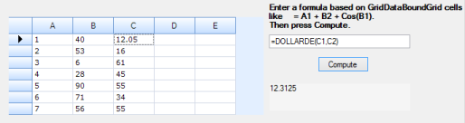

### DOLLARFR

A dollar price expressed as a decimal number converts into a dollar price expressed as a fraction.

#### Syntax:

DOLLARFR (decNum, arg2) where:

* decNum is a decimal number.
* arg2 is an integer to use in the denominator of a fraction.

#### Remarks:

&#35;NUM! - Occurs if the fraction is less than 0.

&#35;DIV/0! - Occurs if the fraction is 0.

#### Example:

### DURATION

Returns the annual duration of a security with periodic interest payments.

#### Syntax:

DURATION(SettlementDate,MaturityDate,rate,profit,frequency,basis) where:

* SettlementDate - security’s settlement date.
* MaturityDate - security’s maturity date.
* rate – yearly coupon rate of the security.
* profit – security’s annual yield.
* frequency – total number of interest payments per year.
* basis – type of day count basis. 

#### Example:

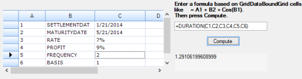

### RRI

The RRI function returns an equivalent interest rate when investment value increases.

#### Syntax:

RRI(np,pv,fv) where,

* np is the number of investment period.
* pv is the present investment value.
* fv is the future investment value.

#### Example:

### FVSCHEDULE

The FVSCHEDULE method returns the future value of an initial principle after applying a series of compound interest rates.

#### Syntax:

FVSCHEDULE(arg1,arg2) where:

* Arg1 is the present value.
* Arg2 is an array interest rate.

#### Remarks:

&#35;VALUE! – occurs any other than numbers or blank cells.

Example:

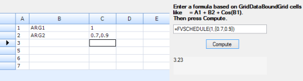

### DISC

The DISC function returns security discount rate.

#### Syntax:

DISC(SettlementDate,MaturityDate,rate,value) where:

* SettlementDate - security’s settlement date.
* MaturityDate - security’s maturity date.
* rate – yearly coupon rate of the security.
* value – security value.

#### Example:

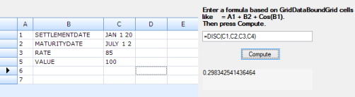

### INTRATE

The INTRATE function returns the interest rate for a fully invested security.

#### Syntax:

INTRATE(SettlementDate,MaturityDate, investment, amount, basis ) where:

* SettlementDate - security’s settlement date.
* MaturityDate - security’s maturity date.
* investment - amount invested in the security.
* amount - amount to be received at maturitydate.
* Basis - type of day count basis.

#### Remarks:

&#35;NUM! - occurs if settlementdate is greater than or equal to maturitydate, investment and amount is less than or equal to zero.

&#35;VALUE! - occurs if settlementdate and maturitydate less than or equal to zero.

Example:

### CUMIPMT

Calculates the cumulative interest paid on a loan or investment, between two specified periods. 

#### Syntax:

CUMIPMT(rate, np,pv,startPeriod, endPeriod, pp) where,

* rate – rate of interest.
* np - total number of payment periods.
* pv -  present value.
* startPeriod - first period in calculation. 
* endPeriod - last period in calculation.
* pp – payment period.

#### Remarks:

&#35;NUM! - occurs if rate,np or pv is less than or equals zero, if startPeriod or endPeriod is less than one, if startPeriod is greater than endPeriod and pp is any number other than 0 or 1.

#### Example:

### CUMPRINC

The CUMPRINC function calculates the cumulative payment on the principal of a loan or investment, between two specified periods. 

#### Syntax:

CUMPRINC(rate, np, pv, startPeriod, endPeriod, pp) where:

* rate - rate of interest.
* np - total number of payment periods.
* pv -  present value.
* startPeriod - first period in calculation. 
* endPeriod - last period in calculation.
* pp - payment period.

#### Remarks:

&#35;NUM! - occurs if rate, np or pv is less than or equals zero, if startPeriod or endPeriod is less than one, if startPeriod is greater than endPeriod and pp is any number other than 0 or 1.

#### Example:

### ACCRINT

The ACCRINT function returns the accrued interest for a security with periodic interest payments.

#### Syntax:

ACCRINT(IssueDate,FirstIntrestDate,settlementDate,rate,parvalue,frequency,basis) where:

* IssueDate - issue date of security.
* FirstInterest - first interest date of security.
* SettlementDate - date on which the security traded to buyer.
* rate - yearly coupon rate of the security.
* parvalue - par value of the security.
* frequency - total number of interest payments per year.
* basis- day count.

#### Remarks:

#VALUE - returns only if FirstInterest or settlementDate is invalid. 

&#35;NUM! -  returns if rate ≤ 0, if par ≤ 0, if frequency is any number other than 1, 2, or 4, if basis < 0 or if basis > 4 and if issue ≥ settlement.

#### Example:

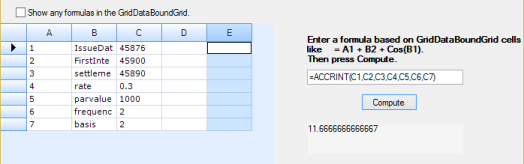

### RECEIVED

The RECEIVED function returns the amount received at maturity for a fully invested security.

#### Syntax:

RECEIVED(Settlementdate,MaturityDate,investment,discount,basis) where:

* SettlementDate - security’s settlement date.
* MaturityDate - security’s maturity date.
* investment - amount invested in the security.
* discount - security’s discount rate.
* basis - type of day count basis.

#### Remarks:

&#35;NUM! - occurs if settlement ≥ maturity and if investment and discount is ≤ 0.

#### Example:

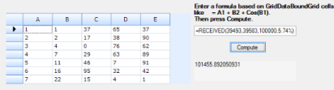

## Database Functions

### DCOUNT

The DCOUNT function counts the number of cells that contain numbers in a column of a list that matches the given conditions.

#### Syntax:

DCOUNT(collection,column,condition) where:

* collection is the range of cells that forms the list.
* column indicates the column used in the function.
* condition is the range of cells that contains the given conditions.

#### Example:

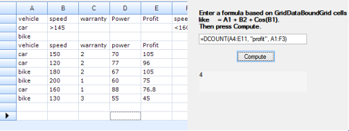

### DCOUNTA

The DCOUNTA function counts the number of nonblank cells in a column of a list that matches the given conditions.

#### Syntax:

DCOUNTA(collection,column,condition) where:

* collection is the range of cells that forms the list.
* column indicates the column used in the function.
* condition is the range of cells that contains the given conditions.

#### Example:

### DAVERAGE

The DAVERAGE function finds the average values obtained from a column of a list that matches the given conditions.

#### Syntax:

DAVERAGE(collection,column,condition) where:

* collection is the range of cells that forms a list.
* column indicates the column used in the function.
* condition is the range of cells that contains the given conditions.

#### Example:

### DGET

The DGET function renders value from the column of list from the specified condition.

#### Syntax:

DGET(collection,column,condition) where:

* collection is the range of cells that forms the list.
* column indicates the column used in the function.
* condition is the range of cells that contains the given conditions.

#### Example:

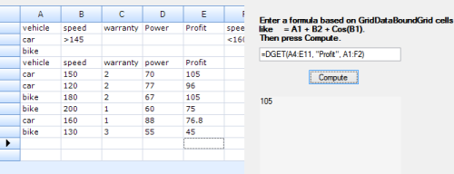

### DMAX

The DMAX function returns the largest number in a column of a list that matches the given conditions.

#### Syntax:

DMAX(collection,column,condition) where:

* collection is the range of cells that forms the list.
* column indicates the column used in the function.
* condition is the range of cells that contains the given conditions.

#### Example:

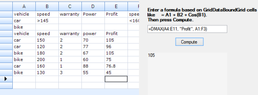

### DMIN

The DMIN function returns the smallest number in a column of a list that matches the given conditions.

#### Syntax:

DMIN(collection,column,condition) where:

* collection is the range of cells that forms the list.
* column indicates the column used in the function.
* condition is the range of cells that contains the given conditions.

#### Example:

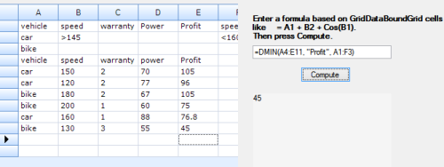

### DSTDEV

The DSTDEV function estimates the standard deviation of a population based on a sample by using the numbers in a column of a list that matches the given conditions.

#### Syntax:

DSTDEV(collection,column,condition) where:

* collection is the range of cells that forms the list.
* column indicates the column used in the function.
* condition is the range of cells that contains the given conditions.

#### Example:

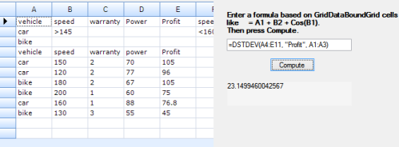

### DSTDEVP

The DSTDEVP function calculates the standard deviation of a population based on the entire population, using the numbers in a column of a list that match the given conditions.

#### Syntax:

DSTDEVP(collection,column,condition) where:

* collection is the range of cells that forms the list.
* column indicates the column used in the function
* condition is the range of cells that contains the given conditions.

#### Example:

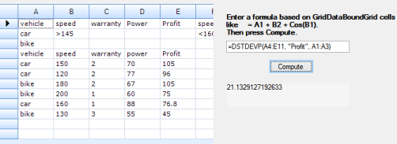

### DVAR

The DVAR function estimates the variance of a population based on a sample by using the numbers in a column of a list which matches the conditions.

#### Syntax:

VAR(collection, column, condition) where:

* collection is the range of cells that forms the list.
* column indicates the column used in the function.
* condition is the range of cells that contains the given conditions.

#### Example:

### DVARP

The DVARP function calculates the variance of a population based on the entire population by using the numbers in a column of a list or database that matches the conditions.

#### Syntax:

DVARP(collection, column, condition) where:

* collection is the range of cells that forms the list.
* column indicates the column used in the function
* condition is the range of cells that contains the given conditions.

#### Example:

### DSUM

The DSUM function adds the numbers in a field (column) of records in a list that matches the given conditions.

#### Syntax:

DSUM(collection, column, condition) where:

* collection is the range of cells that forms the list.
* column indicates the column used in the function
* condition is the range of cells that contains the given conditions.

#### Example:

## Math and Trigonometry

### SEC

The SEC function returns the secant of an angle.

#### Syntax:

SEC(number) where:

* number - angle radians to get the secant value.

#### Remarks:

&#35;NUM! - occurs if the number is outside of its constraints.

&#35;VALUE! - occurs if number is a non-numeric value.

#### Example:

### SECH

The SECH function returns the hyperbolic secant of an angle.

#### Syntax:

SECH(number) where:

* number - angle radians to get the hyperbolic secant value.

#### REMARKS:

&#35;NUM! - occurs if the number is outside of its constraints.

&#35;VALUE! - occurs if the number is a non-numeric value.

#### Example:

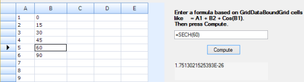

### COT

The COT function returns the cotangent of an angle specified in radians.

#### Syntax:

COT(number) where:

* number - angle radians to get the cotangent value.

 &#35;NUM! - occurs if the number is out of range.

&#35;VALUE! - occurs if the number is a non-numeric value.

#### Example:

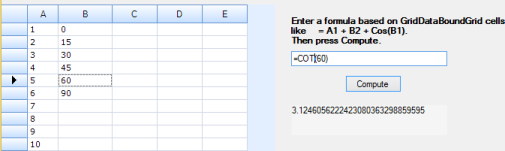

### COTH

The COTH function returns the hyperbolic cotangent of a hyperbolic angle.

#### Syntax:

COTH(number) where:

* number - angle radians to get the hyperbolic cotangent value.

#### Remarks:

&#35;NUM! - occurs if the number is outside of its constraints.

&#35;VALUE! - occurs if the number is a non-numeric value.

#### Example:

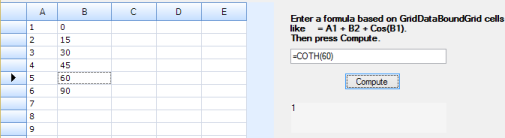

### CSC

The CSC function returns the cosecant of an angle specified in radians.

#### Syntax:

CSC(number) where:

* number - angle radians to get the cosecant value.

#### Remarks:

&#35;NUM! - occurs if the number is outside of its constraints.

&#35;VALUE! - occurs if the number is a non-numeric value.

#### Example:

### CSCH

The CSCH function returns the hyperbolic cosecant of an angle specified in radians.

#### Syntax:

CSCH(number) where:

* number - angle radians to get the hyperbolic cosecant value.

#### Remarks:

&#35;NUM! - occurs if the number is outside of its constraints.

&#35;VALUE! - occurs if the number is a non-numeric value.

#### Example:

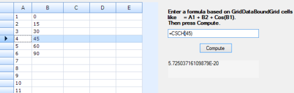

### ACOT

The ACOT function retrieves the principal value of the inverse trigonometric cotangent of a number.

To obtain in degrees, use DEGREES function before ACOT function.

#### Syntax:

ACOT(number) or DEGREES ACOT(number) where:

* number that is to be converted into acotangent.

#### Remarks:

&#35;VALUE! - occurs if the number is a non-numeric value.

The returned angle is given in radians in the range of 0 (zero) to pi.

#### Example:

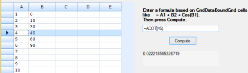

### ACOTH

The ACOTH function retrieves the inverse hyperbolic cotangent of a number.

#### Syntax:

ACOTH(number) where:

* number that is to be converted into cotangent.

#### Remarks:

&#35;NUM! - occurs if number is less than one.

&#35;VALUE! - occurs if absolute value of number is less than one.

#### Example:

### ACSCH

The ACSCH function computes the inverse hyperbolic cosecant of its argument.

#### Syntax:

x = ACSCH(y) where:

* x is a complex or real array
* y is a complex or real array

#### Example:

### BIGMUL

The BIGMUL function gives the full value of multiplying two 32-bit numbers.

#### Syntax:

Math.BIGMUL(x,y); where:

* x is the first number to multiply
* y is the second nr to multiply.

#### Example:

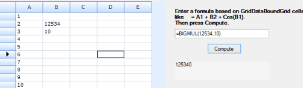

### DIVREM

The DIVREM function calculates the quotient of two numbers and also returns the remainder in an output parameter.

#### Syntax:

Math.DIVREM(num1,num2) where:

* num1 and num2 are integers.

#### Example:

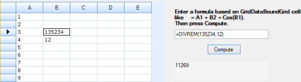

### IEEERemainder

IEEERemainder function returns the remainder operation on two arguments.

#### Syntax:

IEEERemainder(d1, d2) where:

* d1 is the divisor.
* d2 is the dividend.

#### Example:

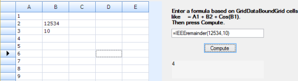

### TRUNC

The TRUNC function truncates a supplied number to a specified number of decimal places.

#### Syntax:

TRUNC( number, [num_digits] ) where:

* number is the initial number that is truncated.
* [num_digits] is an optional argument that specifies the number of decimal places to truncate the supplied number to. The default value is 0.

#### Example:

### COMBINA

For a given number of items, the COMBINA function returns the number of combinations.

#### Syntax:

COMBINA(number1, number2) where:

* number1 is total number of items.
* number2 is total number of items to be chosen

#### Remarks:

&#35;NUM! - occurs if either value is out of range.

&#35;VALUE! - occurs if either value is non-numeric.

#### Example:

### ARABIC

A Roman numeral is converted into an Arabic numeral.

#### Syntax:

ARABIC( romannumeral ) where 

* romannumeral is the text given by you to convert it into Arabic numeral

#### Remarks:

&#35;VALUE! - occurs if text is not a valid value.

&#35;VALUE! - occurs if text is not a valid Roman numeral.

Value zero occurs if an empty string is given as an input.

#### Example:

### BASE

A number is converted into a text representation with the given radix (base).

#### Syntax:

BASE(number,radix [Minlength]) where:

* Number is the value that you want to convert.
* Radix is the base radix that you want to convert the number into.
* Minlength is the minimum length of the returned string. Minlength is optional.

#### Remarks:

&#35;NUM! - occurs if Number, Radix, or Minlength are outside the minimum or maximum constraints.

&#35;VALUE! - occurs if Number is a non-numeric value.

#### Example:

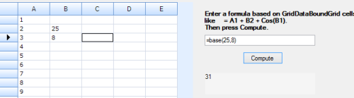

### CEILING.MATH

The CEILING.MATH function returns number rounded up to a multiple of another number.

#### Syntax:

CEILING(number, [significance],  [mode]) where:

* number - number that is rounded up to a multiple of significance.
* significance - multiple to which the number is rounded.
* mode is for negative numbers, it controls whether the number is rounded toward or away from zero.

#### Example:

### DECIMAL

A text representation of a number in a given base has been converted into a decimal number.

#### Syntax:

DECIMAL(text, radix) where:

* text is a string.
* radix is an integer.

#### Remarks:

&#35;NUM! or &#35;VALUE! - occurs if text or radix is outside the constraints.

#### Example:

### MDETERM

The MDETERM function retrieves the matrix determinant of an array.

#### Syntax:

MDETERM(array) where:

* array is a numeric array with an equal number of rows and columns.(a matrix)

#### Remarks:

&#35;VALUE! - occurs if any cell in the array is empty or has text in it and if the array does not have an equal number of rows and columns.

#### Example:

### MINVERSE

The MINVERSE function retrieves the inverse matrix for the matrix stored in an array.

#### Syntax:

MINVERSE(array) where:

* array is an numeric array with an equal number of rows and columns.(a matrix)

#### Remarks:

&#35;VALUE! - occurs when any cell in the array is empty or has text in it and if the array does not have an equal number of rows and columns.

#### Example:

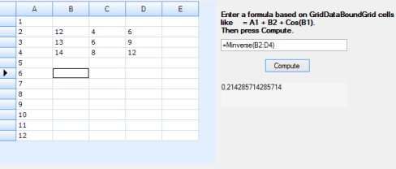

### MMULT

The MMULT function returns the matrix product of two arrays. Both the arrays should have same number of columns and same number of rows.

#### Syntax:

MMULT(M1,M2) where:

* M1, M2 are the matrix arrays that is to be multiplied.

#### Remarks:

&#35;VALUE! - occurs if any cell in the array is empty or contains text in it and if the array does not have an equal number of rows and columns.

#### Example:

### MUNIT

The MUNIT function retrieves the unit matrix for the particular dimension that has been specified.

#### Syntax:

MUNIT(dimension) where:

* Dimension is an integer specifying the dimension of the unit matrix that you want to return.

#### Remarks:

&#35;VALUE! - occurs if the dimension is a value that is equal to or smaller than zero.

#### Example:

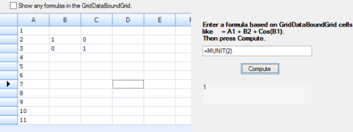

## Statistical functions

### CONFIDENCE.T

CONFIDENCE.T function retrieves the confidence interval for a population mean.

#### Syntax:

CONFIDENCE.T(alpha,stdev,size) where:

* alpha is the significance level 
* stdev is the population standard deviation for the data range.
* size is the sample size.

#### Remarks:

&#35;VALUE! - occurs if any argument is non-numeric.

&#35;NUM! - occurs if alpha  and stdev is less than or equal to zero or if alpha is greater than or equal to zero.

&#35;DIV/0! - occurs if the size is equal to one.

#### Example:

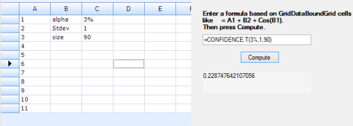

### SKEW.P

Returns the skewness of a distribution based on a population: a characterization of the degree of asymmetry of a distribution around its mean.

#### Syntax:

SKEW.P(number 1, [number 2],…) where:

* Number 1 is required, and subsequent numbers are optional. Number 2,... up to 254 are numbers or names, arrays, or references that contain numbers for which you want the population skewness, can be used.

#### Remarks:

&#35;NUM! - occurs if arguments do not have a valid value.

&#35;VALUE! - occurs if arguments do not have valid data types.

&#35;DIV/0! - occurs if there are fewer than three data points, or the sample standard deviation is zero.

### Example:

### COVARIANCE.P

The COVARIANCE.P function retrieves population covariance, the average of the products of deviations for each data point pair in two data sets.

#### Syntax:

COVARIANCE.P(array1,array2) where:

* array1 is the first cell range of integers.
* array2 is the second cell range of integers.

#### Example:

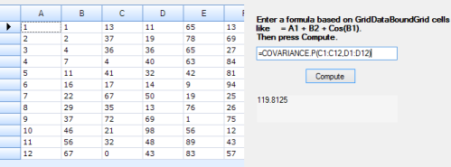

###  COVARIANCE.S

The COVARIANCE.S function returns the sample covariance, the average of the products of deviations for each data point pair in two data sets.

#### Syntax:

COVARIANCE.S(array1,array2) where:

* array1 is the first cell range of integers.
* array2 is the second cell range of integers.

#### Remarks:

&#35;N/A - occurs when values are different number of data points.

&#35;DIV/0! - occurs if either array1 or array2 is empty or contain only one data point each.

#### Example:

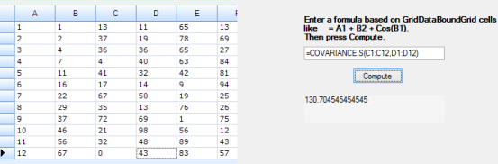

### PERCENTILE.EXC

The PERCENTILE.EXC function returns the k-th percentile of values in a range, where k is in the range of 0 to 1, exclusively.

#### Syntax:

PERCENTILE.EXC(array, k) where:

* array is the range of data that defines relative standing.
* k is the percentile value in the range of 0 to 1.

####  Remarks:

&#35;NUM! - occurs if k is equal to or less than zero, if k is equal to or greater than 1and if the array is empty.

&#35;VALUE! - occurs if k is non-numeric.

#### Example:

### PERCENTILE.INC

The PERCENTILE.INC function returns the k-th percentile of values in a range, where k is in the range 0 to 1.

#### Syntax:

PERCENTILE.INC(array,k) where:

* array is the range of data that defines relative standing.
* k is the percentile value in the range 0 to 1.

#### Remarks:

&#35;NUM! - occurs if k is equal to or less than zero, if k is equal to or greater than 1and if the array is empty.

&#35;VALUE! - occurs if k is non-numeric.

#### Example:

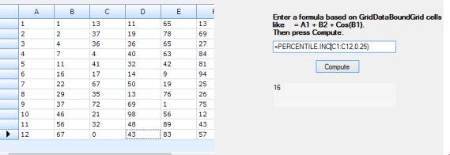

### PERCENTRANK.EXC

The PERCENTRANK.EXC function returns the rank of a value in a data set as a percentage (0 to 1, exclusively) of the data set.

#### Syntax:

PERCENTRANK.EXC(array, x ) where:

* array is the range of data that defines relative standing.
* x is value for which you want to know the rank.

#### Remarks:

&#35;NUM! - occurs if this argument is empty.

&#35;NUM! - occurs if the argument is less than one.

#### Example:

### STDEV.P

The STDEV.P function calculates the standard deviation of a supplied set of values.

#### Syntax:

STDEV.P(number1,[number2],...]) where:

* number1 is the first number argument corresponding to a population.
* number2, ... are the arguments 2 to 254 corresponding to a population.

#### Remarks:

* Arguments can either be numbers or names, arrays, or references that contain numbers.
* The standard deviation is calculated using the "n" method.
* Arguments that are error values or text that cannot be translated into numbers cause errors.

#### Example:

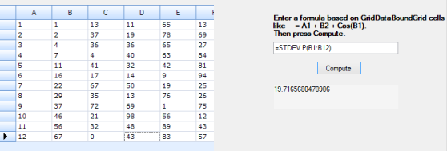

### STDEV.S

The STDEV.S function calculates the sample standard deviation of a supplied set of values.

#### Syntax:

STDEV.S(number1,[number2],...]) where:

* number1 is the first number argument corresponding to a population.
* Number2, ... are the arguments 2 to 254 corresponding to a population.

#### Remarks:

* Arguments can either be numbers or names, arrays, or references that contain numbers.
* The standard deviation is calculated using the "n" method.
* Arguments that are error values or text that cannot be translated into numbers cause errors.

#### Example:

### PERMUTATIONA

The PERMUTATIONA function returns the number of permutations for a given number of objects (with repetitions) that can be selected from the total number of objects.

#### Syntax:

PERMUTATIONA(number, number-chosen) where:

* number is an integer that describes the total number of objects.
* number-chosen is an integer that describes the number of objects in each permutation.

#### Remarks:

&#35;VALUE! - occurs if numeric arguments use data types that are non-numeric.

&#35;NUM! - occurs if numeric arguments are values that are not valid.

#### Example:

### NORMDIST

The NORM.DIST function calculates the normal distribution for a supplied value of x, and a supplied distribution mean & standard deviation.

#### Syntax:

NORM.DIST(x,mean,stdev,cumulative) where:

* x is the value for which you want the distribution.
* mean is the arithmetic mean of the distribution.
* stdev is the standard deviation of the distribution.
* cumulative is a logical value for given function.

#### Remarks:

&#35;VALUE! - occurs if mean or stdev is non-numeric.

&#35;NUM! - occurs if stdev is equal to or less than zero.

#### Example:

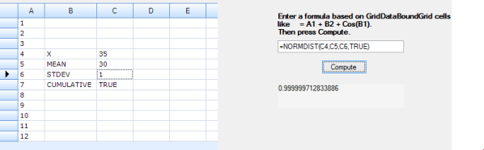

### NORMINV

Returns theinverse of the normal cumulative distribution for the specified mean and standard deviation.

#### Syntax: 

NORMINV(probability, mean, stdev), where:

* probability is a probability that corresponds to the normal distribution.
* mean is the arithmetic mean of the distribution.
* stdev is the standard deviation of the distribution.

#### Remarks:

&#35;NUM! - if probability or stdev is equal to or less than zero, equal to or greater than 1.

&#35;VALUE! - if probability or mean or stdev is non-numeric.

Example:

### NORM.S.DIST

The NORM.S.DIST function returns the standard normal distribution.

#### Syntax:

NORM.S.DIST(val, cumulative) where:

* val is the value for which you want the distribution.
* cumulative is a logical value that determines the form of the function.

#### Example:

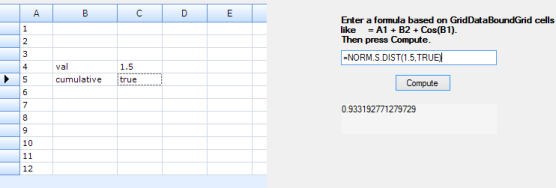

### NORM.S.INV

The NORM.S.INV function returns the inverse of the standard normal cumulative distribution.

#### Syntax:

NORM.S.INV(probability) where:

* probability is a probability that corresponds to the normal distribution.

#### Example:

### WEIBULL.DIST

The WEIBULL.DIST function returns the Weibull distribution.

#### Syntax:

WEIBULL.DIST(x,alpha,beta,cumulative) where:

* x is the value that evaluates the function.
* alpha is a parameter of the distribution.
* beta is a parameter of the distribution.
* cumulative determines the form of the function.

#### Remarks:

&#35;NUM! - occurs when x is less than zero and if alpha or beta is equal to or less than zero.

&#35;VALUE! - occurs if beta is non-numeric.

#### Example:

### EXPON.DIST

The EXPON.DIST function calculates the value of the probability density function or the cumulative distribution function for the exponential distribution.

#### Syntax:

EXPON.DIST(x,y,cumulative) where:

* x is the value that evaluates the function.
* y is the parameter value.
* cumulative is a logical value for given function.

#### Remarks:

&#35;NUM! - occurs if x is less than zero and if y is equal to or less than zero. 

&#35;VALUE! - occurs if x or y is non-numeric.

Example:

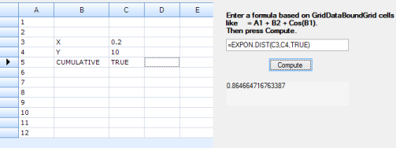

### GAMMA.DIST

The GAMMA.DIST function returns either the cumulative distribution or the probability density function for the Gamma Distribution.

#### Syntax:

GAMMA.DIST(x,y,z,cumulative) where:

* x is the value that eveluates the function.
* y is a distribution parameter.
* z is a distribution parameter.
* cumulative is a logical value that indicates which form of the exponential function to provide.

#### Remarks:

&#35;NUM! - occurs if x is less than zero, if z  is equal to or less than zero and occurs if alpha is equal to or less than zero. 

&#35;VALUE! - occurs if x or y or z is non-numeric.

Example:

### GAMMA.INV

The GAMMA.INV function returns the inverse of the Gamma Distribution.

#### Syntax:

GAMMA.INV(x,y,z,cumulative) where

* x is the value that evaluates the function.
* y is a distribution parameter.
* z is a distribution parameter.
* cumulative is a logical value that indicates which form of the exponential function to provide.

#### Remarks:

&#35;NUM! - occurs if x is less than zero, if z  is equal to or less than zero and occurs if alpha is equal to or less than zero. 

&#35;VALUE! - occurs if x or y or z is non-numeric

#### Example:

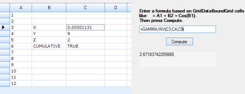

### GAMMALN.PRECISE

The GAMMALN.PRECISE function returns the natural logarithm of the Gamma Distribution.

#### Syntax:

GAMMALN.PRECISE( x ) where:

* x is the positive numeric value that evaluates the function. 

#### Remarks:

&#35;NUM! - occurs if x is less than zero.

&#35;VALUE! - occurs if x is non-numeric.

#### Example:

### F.INV

The F.INV function returns the inverse of the F probability distribution.

#### Syntax:

F.INV(probability,degFreedom1,degFreedom2) where:

* probability is a probability that corresponds to the normal distribution.
* degFreedom1 is the numerator degrees of freedom.
* degFreedom2 is the denominator degrees of freedom.

#### Remarks:

&#35;NUM! - occurs if probability is equal to or less than zero and if probability is equal to or greater than one.

&#35;VALUE! - occurs if probability or degFreedom1 or degFreedom2 is non-numeric.

#### Example:

### F.INV.RT

The F.INV.RT function calculates the inverse of the Cumulative F Distribution for a supplied probability.

#### Syntax:

F.INV.RT(probability,degFreedom1,degFreedom2) where:

* probability is a probability that corresponds to the normal distribution.
* degFreedom1 is the numerator degrees of freedom.
* degFreedom2 is the denominator degrees of freedom.

#### Remarks:

&#35;NUM! - occurs if probability is equal to or less than zero and if probability is equal to or greater than one.

&#35;VALUE! - occurs if probability or degFreedom1 or degFreedom2 is non-numeric.

#### Example:

### BINOM.INV

The BINOM.INV function returns the smallest value for which the cumulative binomial distribution is greater than or equal to a criterion value.

#### Syntax:

BINOM.INV(trial number,sp,value) where:

* trial number is the number of Bernoulli trials.
* sp is the probability of a success on each trial.
* value is the criterion value.

#### Remarks:

&#35;NUM! - occurs if trial number is less than zero, if sp and value is less than zero or greater one.

&#35;VALUE! - occurs if trials, sp and value are non-numeric.

#### Example:

### HYPGEOM.DIST

The HYPGEOM.DIST function returns the hypergeometric distribution for a specified number of successes from a population sample.

#### Syntax:

HYPGEOM.DIST(S_sample,size,S- population,ps,cumulative) where:

* S_sample is the number of successes in the sample.
* number_sample is the size of the sample.
* population_s is the number of successes in the population.
* number_pop is the population size.
* cumulative is a logical value that determines the form of the function.

#### Remarks:

&#35;VALUE! - occurs if any argument is non-numeric.

&#35;NUM! - occurs if S_sample < 0 or S_sample is greater than the lesser of size or S- population.

&#35;NUM! - occurs if S_sample is less than 0.

&#35;NUM! - occurs if size ≤ 0 or size > ps.

&#35;NUM! - occurs if S- population ≤ 0 or S- population > ps.

&#35;NUM! - occurs if ps ≤ 0.

#### Example:

### LOGNORM.DIST

The LOGNORM.DIST function calculates the Log-Normal Probability Density Function or the Cumulative Log-Normal Distribution Function for a supplied value of x.

#### Syntax:

LOGNORM.DIST(x,mean,stdev,cumulative) where:

* x is the value that evaluates the function.
* mean is the mean value of ln(x).
* stdev is the standard deviation of ln(x).
* cumulative is a logical value that determines the form of the function. 

#### Remarks:

&#35;VALUE! - occurs if any argument is non-numeric.

&#35;NUM! - occurs if x ≤ 0 or if stdev ≤ 0.

#### Example:

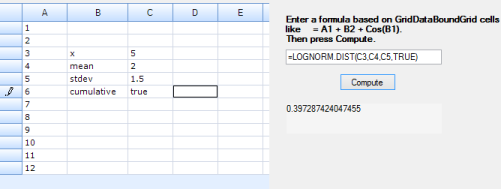

### LOGNORM.INV

The LOGNORM.INV function calculates the inverse of the Cumulative Log-Normal Distribution Function of x, for a supplied probability.

#### Syntax:

LOGNORM.INV(probability, mean, stdev) where:

* probability is a probability that corresponds to the lognormal distribution.
* mean is the arithmetic mean of In(x).
* stdev is the standard deviation of ln(x).

#### Remarks:

&#35;VALUE! - occurs if any argument is non-numeric.

&#35;NUM! - occurs if probability <= 0 or probability >= 1 and if Stdev<=0.

#### Example:

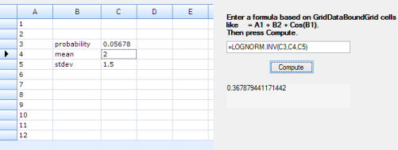

### CONFIDENCE.NORM

The CONFIDENCE.NORM function uses a [Normal Distribution](http://en.wikipedia.org/wiki/Normal_distribution) to calculate a confidence value that can be used to construct the confidence interval for a population mean, for a supplied probability and sample size.

#### Syntax:

CONFIDENCE.NORM(alpha,stdev,size) where:

* alpha is the significance level.
* stdev is the population standard deviation for the data range.
* size is the sample size.

#### Remarks:

&#35;VALUE! - occurs if any argument is non-numeric.

&#35;NUM! - occurs if alpha and stdev is less than or equal to zero or if alpha is greater than or equal to zero.

&#35;DIV/0! - occurs if the size is equal to one.

Example:

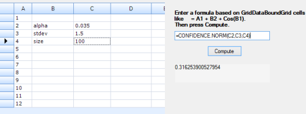

### CHISQ.DIST

The CHISQ.DIST function calculates the Probability Density Function or the Cumulative Distribution Function for the [chi-square distribution](http://en.wikipedia.org/wiki/Chi-square_distribution).

#### Syntax:

CHISQ.DIST(x,degFreedom,cumulative) where:

* x is the value that evaluates the function.
* degFreedom is the number of degrees of freedom.
* cumulative is a logical value that determines the form of the function. 

#### Remarks:

&#35;VALUE! - occurs if any argument is non-numeric.

&#35;NUM! - occurs if x is negative and if f degFreedom < 1 or degFreedom > 10^10.

#### Example:

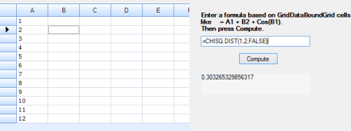

### CHISQ.DIST.RT

The CHISQ.DIST.RT function calculates the right-tailed probability of the [chi-square distribution](http://en.wikipedia.org/wiki/Chi-square_distribution).

#### Syntax:

CHISQ.DIST.RT(x,degFreedom) where:

* x is the value that evaluates the function.
* degFreedom is the number of degrees of freedom.

#### Remarks:

&#35;VALUE! - occurs if either argument is non-numeric.

&#35;VALUE! - occurs if any argument is non-numeric.

&#35;NUM! - occurs occurs if f degFreedom < 1 or degFreedom > 10^10.

#### Example:

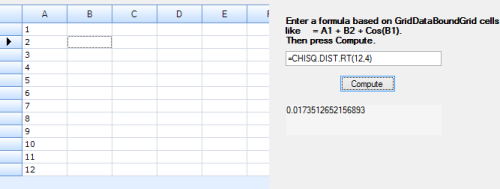

### F.DIST 

The F.DIST function calculates the Probability Density Function or the Cumulative Distribution Function for the F Distribution.

#### Syntax:

F.DIST(x,degFreedom1,degFreedom2,cumulative) where:

* x is the value that evaluates the function.
* degFreedom1 is the numerator degrees of freedom.
* degFreedom1 is the denominator degrees of freedom. 
* cumulative is a logical value that determines the form of the function.

#### Remarks:

&#35;VALUE! - occurs if any argument is non-numeric.

&#35;NUM! - occurs if x is negative, if degFreedom1< 1 and if degFreedom1< 1

#### Example:

### F.DIST.RT

The F.DIST.RT function calculates the F Probability Distribution, which measures the degree of diversity between two data sets.

#### Syntax:

F.DIST.RT(x, degFreedom1, degFreedom2) where:

* x is the value that evaluates the function.
* degFreedom1 is the numerator degrees of freedom.
* DegFreedom2 is the denominator degrees of freedom. 

#### Remarks:

&#35;VALUE! - occurs if any argument is non-numeric.

&#35;NUM! - occurs if x is negative, if degFreedom1< 1 and  if degFreedom2< 1

Example:

### MODE.MULT

The MODE.MULT function returns a vertical array of the statistical modes (the most frequently occurring values) within a list of supplied numbers.

#### Syntax:

MODE.MULT(number1) where:

* number1 is the first number argument for which you want to calculate the mode.

#### Remarks:

&#35;N/A - occurs if the data set contains no duplicate data points.

Example:

### CHISQ.TEST

The CHISQ.TEST function function performs the chi-square test on two supplied data sets (of observed and expected frequencies), and returns the probability that the differences between the sets are simply due to sampling error. 

#### Syntax:

CHISQ.TEST(O_range,E_range) where:

* O_range is the range of data that contains observed values.
* E_range is the range of data that contains expected values. 

#### Example:

### CHISQ.INV

The CHISQ.INV function returns the inverse of the left-tailed probability of the chi-squared distribution.

#### Syntax:

CHISQ.INV(probability,degFreedom) where:

* probability is a probability of chi-squared distribution.
* deg_freedom is the number of degrees of freedom.

#### Remarks:

&#35;NUM! - occurs if probability is is less than zero, if probability is greater than 1 and degFreedom is less than 1.

&#35;VALUE! - occurs if probability or degFreedom is non-numeric.

Example:

### CHISQ.INV.RT

The CHISQ.INV.RT function calculates the inverse of the right-tailed probability of the [chi-square distribution](http://en.wikipedia.org/wiki/Chi-square_distribution).

#### Syntax:

CHISQ.INV.RT(probability, degFreedom) where:

* probability is a probability of chi-squared distribution.
* degFreedom is the number of degrees of freedom.

#### Remarks:

&#35;NUM! - occurs if probability is is less than zero, if probability is greater than 1 and if degFreedom is less than 1.

&#35;VALUE! - occurs if probability or degFreedom is non-numeric. 

Example:

### BINOM.DIST

The BINOM.DIST function returns the Binomial Distribution probability for a given number of successes from a specified number of trials. 

#### Syntax:

BINOM.DIST (trial number,sp,value, cumulative) where:

* trial number is the number of Bernoulli trials.
* sp is the probability of a success on each trial.
* value is the criterion value. 
* cumulative is a logical value that determines the form of the function.

#### Remarks:

&#35;NUM! - occurs if trial number is less than zero, if sp and value is less than zero or greater one.

&#35;VALUE! - occurs if trials, sp and value are non-numeric.

#### Example:

### RANK.AVG

The RANK.AVG function returns the statistical rank of a given value, within a supplied array of values. If there are duplicate values in the list, the average rank is returned. 

#### Syntax:

RANK.AVG(number,ref) where:

* number is the rank you want to find.
* ref is a reference to, a list of numbers.

#### Example:

'

### QUARTILE.EXC

The QUARTILE.EXC function returns a requested quartile of a supplied range of values, based on a percentile range of 0 to 1 exclusive.

#### Syntax:

QUARTILE.EXC(array, quart) where:

* array is the range of numeric values.
* quart shows which value to return.

#### Remarks:

&#35;NUM! - occurs if the array is empty or if quart ≤ 0 or if quart ≥ 4.

#### Example:

### QUARTILE.INC

The QUARTILE.INC function returns a requested quartile of a supplied range of values, based on a percentile range of 0 to 1 inclusive.

QUARTILE.INC(array,quart) where:

* array is the array range of numeric values.
* quart shows which value to return

#### Remarks:

&#35;NUM! - occurs if the array is empty or if quart ≤ 0 or if quart ≥ 4.

#### Example:

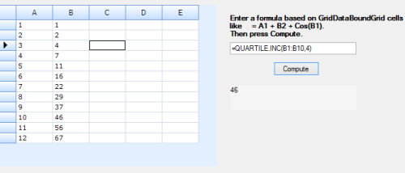

### NEGBINOM.DIST

The NEGBINOM.DIST function calculates the probability mass function or the cumulative distribution function for the Negative Binomial Distribution.

#### Syntax:

NEGBINOM.DIST(F_number,S_number,S_probability,cumulative) where:

* (F_number is the number of failures.
* S_number is the threshold number of successes.
* S_probability s is the probability of a success.
* cumulative is a logical value that determines the form of the function.

#### Example:

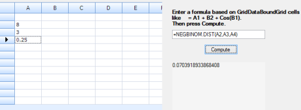

### POISSON.DIST

The POISSON.DIST function calculates the Poisson Probability Mass Function or the Cumulative Poisson Probability Function for a supplied set of parameters.

POISSON.DIST(x,mean,cumulative) where

* x is the number of events.
* mean is the expected numeric value.
* cumulative is a logical value that determines the form of the probability distribution returned.

#### Remarks:

&#35;VALUE! - occurs if x is not an integer.

&#35;NUM! - occurs if x or mean is non-numeric and s if x < 0.

#### Example:

### ZTEST

ZTEST function returns the one-tailed probability-value of a z-test.

#### Syntax:

ZTEST(a1,T_value,sigma) where:

* array is a array or range of data 
* T_value is the value to test.
* sigma  is the population (known) standard deviation.

#### Example:

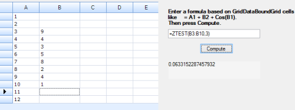

### RANK.EQ

The RANK.EQ function returns the statistical rank of a given value, within a supplied array of values.

#### Syntax:

RANK.EQ( number, ref ) where:

* number is the value, you want to find the rank.
* ref is an array of values containing the supplied number.

#### Example:

### CHIDIST

The CHIDIST function calculates the right-tailed probability of the chi-square distribution.

#### Syntax:

CHIDIST(x, degFreedom) where:

* x is the value at which the chi-square distribution is to be evaluated (must be ≥ 0). 
* degFreedom is the number of degrees of freedom. 

#### Remarks:

&#35;NUM! - occurs when the  x is negative or degFreedom argument is invalid.

#### Example:

## Engineering Functions

### DEC2BIN

The DEC2BIN function converts a decimal number into a binary number.

#### Syntax:

DEC2BIN(num,places) where:

* num is the decimal integer you want to convert. 
* places is the number of characters to use.

#### Remarks:

&#35;NUM! - occurs if number < -512 or if number > 511 and if places is zero or negative.

&#35;VALUE! - occurs when number or places is non-numeric, if DEC2BIN requires more than the number of characters specified in places.

#### Example:

### DEC2OCT

The DEC2OCT function converts a decimal number into an octal number.

#### Syntax:

DEC2OCT(num, places) where:

* num is the decimal integer you want to convert. 
* places is the number of characters to use.

#### Remarks:

&#35;NUM! - occurs if number < -512 or if number > 511 and if places is zero or negative.

&#35;VALUE! - occurs if number or places is non-numeric, if DEC2OCT requires more than the number of characters specified in places.

#### Example:

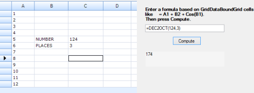

### DEC2HEX

The DEC2HEX function converts a decimal number into hexadecimal number. 

DEC2HEX(num, places ) where:

* num is the decimal integer you want to convert. 
* places is the number of characters to use.

#### Remarks:

&#35;NUM! - occurs if number < -512 or if number > 511 and if places is zero or negative.

&#35;VALUE! - occurs if number or places is non-numeric, if DEC2HEX requires more than the number of characters specified in places.

#### Example:

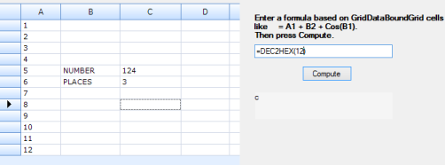

### BIN2DEC

The BIN2DEC function converts a binary number into a decimal number.

#### Syntax:

BIN2DEC(num) where:

* num is the binary number that you want to convert.

#### Remarks:

&#35;NUM! - occurs if number is not a valid binary number, or if number contains more than 10 characters.

#### Example:

### BIN2OCT

The BIN2OCT function converts a binary number into an octal number.

#### Syntax:

BIN2OCT(num, places) where:

* num is the decimal integer you want to convert. 
* places is the number of characters to use.

#### Example:

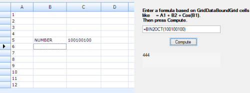

### BIN2HEX

The BIN2HEX function converts a binary number into a hexadecimal.

#### Syntax:

BIN2HEX(num places) where:

* num is the decimal integer you want to convert. 
* places is the number of characters to use.

#### Remarks:

&#35;NUM! - occurs if number is not a valid binary number, if if places is negative.

&#35;VALUE! - occurs if places is non-numeric.

#### Example:

### HEX2BIN

The HEX2BIN function converts a hexadecimal number into a binary number. 

#### Syntax:

HEX2BIN(num, places ) where:

* num is the decimal integer you want to convert. 
* places is the number of characters to use.

#### Remarks:

&#35;NUM! - occurs if number is not a valid binary number, if if places is negative.

&#35;VALUE! - occurs if places is non-numeric.

#### Example:

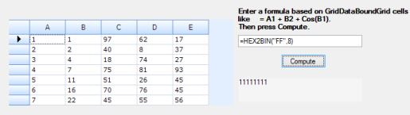

### HEX2OCT

The HEX2OCT function converts a hexadecimal number into an octal number. 

#### Syntax:

HEX2OCT(num, places) where:

* num is the hexadecimal integer you want to convert. 
* places is the number of characters to use.

#### Remarks:

&#35;NUM! - occurs if number is not a valid hexadecimal number and if if places is negative.

&#35;VALUE! - occurs if places is non-numeric.

#### Example:

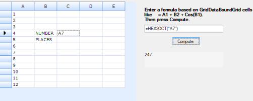

### HEX2DEC

The HEX2DEC function converts a hexadecimal number into a decimal number.

#### Syntax:

HEX2DEC(num) where:

* num is the hexadecimal integer you want to convert. 

#### Remarks:

&#35;NUM! - occurs if number is not a valid hexadecimal number.

#### Example:

### OCT2BIN

The OCT2BIN function converts an octal number into a binary number.

#### Syntax:

OCT2BIN(nuM, places ) where:

* num is the octal number you want to convert. 
* places is the number of characters to use.

#### Remarks:

&#35;NUM! - occurs if number is not a valid octal number and if if places is negative.

&#35;VALUE! - occurs if places is non-numeric.

#### Example:

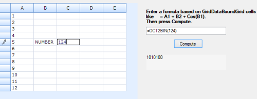

### OCT2HEX

The OCT2HEX function converts an octal number into a hexadecimal number.

#### Syntax:

OCT2HEX(num, places) where:

* num is the octal number you want to convert. 
* places is the number of characters to use.

#### Remarks:

&#35;NUM! - occurs if number is not a valid octal number and if if places is negative.

&#35;VALUE! - occurs if places is non-numeric.

#### Example:

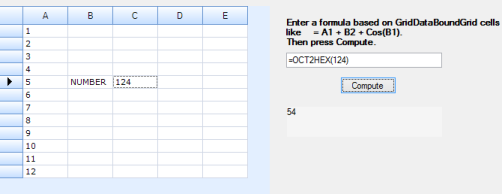

### OCT2DEC

The decimal value converts to an octal number.

#### Syntax:

OCT2DEC(number) where:

* number is the octal number you want to convert. 

#### Remarks:

&#35;NUM! - occurs if number is not a valid octal number.

#### Example:

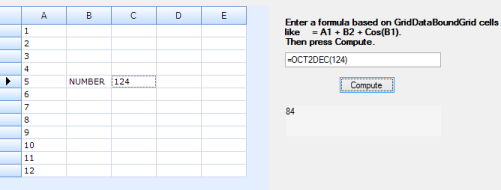

### IMABS

The IMABS function calculates the absolute value of a complex number in a + bi  or a + bj text format. 

#### Syntax:

IMABS(inum) where:

* inum is a complex number for which you want the absolute value.

#### Remarks:

&#35;NUM! - occurs if inumber is not in the form a + bi  or a + bj.

#### Example:

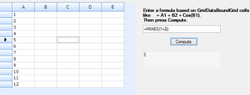

### IMAGINARY

The IMAGINARY function returns the imaginary coefficient of a complex number in a + bi or a+bj text format. 

#### Syntax:

IMAGINARY(inum) where:

* inum is a complex number for which you want the absolute value.

Remarks:

&#35;NUM! - occurs if inumber is not in the form a + bi  or a + bj.

#### Example:

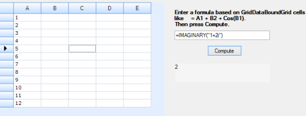

### IMREAL

The IMREAL function returns the real coefficient of a complex number in a + bi  or a + bj text format.

#### Syntax:

IMREAL(inum) where:

* inum is a complex number for which you want the absolute value.

#### Remarks:

&#35;NUM! - occurs if inumber is not in the form a + bi  or a + bj.

#### Example:

### COMPLEX

The COMPLEX function converts real and imaginary coefficients into a complex number of the form a + bi  or a + bj. 

#### Syntax:

COMPLEX(num,inum, suffix ) where:

* num is the real coefficient of the complex number.
* inum is the imaginary coefficient of the complex number.
* suffix is the imaginary component of the complex number.

#### Remarks:

&#35;VALUE! - occurs if num or inum is non-numeric, if suffix is neither "i" nor "j".

#### Example:

### IMSUM

The IMSUM function calculates the sum of two or more complex numbers in a + bi  or a + bj text format.

#### Syntax:

IMSUM(inum1,inum2,...) where:

* inum1,inum2,... are 1 to 29 complex numbers to add.

#### Example:

### IMSUB

The IMSUB function calculates the difference of two complex numbers in a + bi  or a + bj text format. 

#### Syntax:

IMSUB(inumber1,inumber2) where:

* inum1 is the complex number from which to subtract inum1. 

#### Example:

### IMPRODUCT

The IMPRODUCT function calculates the product of 1 to 255 complex numbers in a + bi  or a + bj text format.

#### Syntax:

IMPRODUCT(inum1, inum2,... ) where:

* inum1, inum2,... are 1 to 255 complex numbers to multiply.
* Inum2 is the complex number to subtract from inumber1.

#### Example:

### IMDIV

The IMDIV function calculates the quotient of two complex numbers in a + bi  or a + bj text format.

#### Syntax:

IMDIV(inum1, inum2) where:

* inum1 is the complex numerator or dividend.
* Inum2  is the complex denominator or divisor.

#### Example:

### IMCONJUGATE

The IMCONJUGATE function calculates the complex conjugate of a complex number in a + bi  or a + bj text format. 

#### Syntax:

IMCONJUGATE(inum) where:

* inum is a complex number for which you want the conjugate.

#### Example:

### IMSQRT

The IMSQRT function calculates the square root of a complex number in a + bi  or a + bj text format. 

#### Syntax:

IMSQRT(inum) where:

* inum is a complex number for which you want the square root.

#### Example:

### IMARGUMENT

The IMARGUMENT function retrieves the argument Theta, an angle expressed in radians.

#### Syntax:

IMARGUMENT(inum) where:

* inum is a complex number for which you want the argument Theta.

#### Example:

### IMSIN

The IMSIN function returns the sine of a complex number in a + bi  or a + bj text format. 

#### Syntax

IMSIN(inum) where:

* inum is a complex number for which you want the sine.

#### Example:

### IMCSC

The IMCSC function retrieves the cosecant of a complex number in a+bi or a+bj text format.

#### Syntax

IMCSC(inum) where:

* Inum is a complex number for which you want the cosecant.

#### Remarks:

&#35;NUM! - occurs if inumber is a value that is not in the a+bi or a+bj text format.  

&#35;VALUE! - occurs if inumber is a logical value.

#### Example:

### IMCOS

The IMCOS function retrieves the cosine of a complex number in a + bi  or a + bj text format.

#### Syntax:

IMCOS(inum) where:

* inum is a complex number for which you want the cosine.

#### Example:

### IMSEC

The IMSEC function retrieves the secant of a complex number in a+bi or a+bj text format.

#### Syntax:

IMSEC(inum) where:

* Inum is a complex number for which you want the secant.

#### Remarks:

&#35;NUM! - occurs if inumber is a value that is not in the a + bi  or a + bj text format.

&#35;VALUE! - occurs if inumber is a logical value.

#### Example:

### IMTAN

The IMTAN function retrieves the tangent of a complex number in a + bi or a + bj text format.

#### Syntax:

IMTAN(inum) where

* Inum is a complex number for which you want the cotangent.

#### Remarks:

&#35;NUM! - occurs if inumber is a value that is not in a + bi or a + bj text format.

&#35;VALUE! - occurs if inumber is a logical value.

#### Example:

### IMCOT

The IMCOT function calculates the cotangent of a complex number in a + bi or a + bj text format.

#### Syntax:

IMCOT(inum) where

* Inum is a complex number for which you want the cotangent.

#### Remarks:

&#35;NUM! - occurs if inum is a value that is not in a + bi or a + bj text format.

&#35;VALUE! - occurs if inumber is a logical value.

#### Example:

### IMSINH

The IMSINH function calculates the hyperbolic sine of a complex number in a + bi or a + bj text format.

#### Syntax:

IMSINH(inum) where:

* inum is a complex number for which you want the hyperbolic sine.

#### Remarks:

&#35;NUM! - occurs if inumber is a value that is not in a + bi or a + bj text format.

&#35;VALUE! - occurs if inumber is a logical value.

#### Example:

### IMCSCH

The IMCSCH function calculates the hyperbolic cosecant of a complex number in a + bi or a + bj text format.

#### Syntax:

IMCSCH(inum) where:

* inum is a complex number for which you want the hyperbolic cosecant.

#### Remarks:

&#35;NUM! - occurs if inumber is a value that is not in a + bi or a + bj text format.

&#35;VALUE! - occurs if inumber is a logical value.

#### Example:

### IMCOSH

The IMCOSH function calculates the hyperbolic cosine of a complex number in a + bi or a + bj text format.

#### Syntax:

IMCOSH(inum) where: 

* inum is a complex number for which you want the hyperbolic cosine.

#### Remarks:

&#35;NUM! - occurs if inumber is a value that is not in a + bi or a + bj text format.

&#35;VALUE! - occurs if inumber is a logical value.

#### Example:

### IMSECH

The IMSECH function calculates the hyperbolic secant of a complex number in a + bi or a + bj text format.

#### Syntax:

IMSECH(inum) where:

* inum is a complex number for which you want the hyperbolic secant.

#### Remarks:

&#35;NUM! - occurs if inumber is a value that is not in a + bi or a + bj text format.

&#35;VALUE! - occurs if inumber is a logical value.

#### Example:

### IMTANH

The IMTANH function calculates the hyperbolic tangent of the complex number z. 

#### Syntax:

IMTANH(inum) where: 

* inum is a complex number for which you want the hyperbolic tangent.

#### Remarks:

&#35;NUM! - occurs if inumber is a value that is not in a + bi or a + bj text format.

&#35;VALUE! - occurs if inumber is a logical value.

#### Example:

### IMCOTH

The IMCOTH function calculates the hyperbolic cotangent of the complex number z. 

#### Syntax:

IMCOTH(inum) where:

* inum is a complex number for which you want the hyperbolic cotangent.

#### Remarks:

&#35;NUM! - occurs if inumber is a value that is not in the a + bi  or a + bj text format.

&#35;VALUE! - occurs if inumber is a logical value.

#### Example:

### IMLOG10

The IMLOG10 function calculates the common logarithm (base 10) of a complex number z.

#### Syntax:

IMLOG10(inum) where:

* inum is a complex number for which you want the common logarithm.

#### Remarks: 

&#35;NUM! - occurs if inumber is not in the complex format

#### Example:

### IMLOG2

The IMLOG2 function calculates the base-2 logarithm of a complex number z.

#### Syntax:

IMLOG2(inum) where:

* Inum is a complex number for which you want the base-2 logarithm.

#### Remarks:

&#35;NUM! - occurs if inumber is not in the complex format.

#### Example:

### IMLN

The IMLN function calculates the natural logarithm of a complex number z.

#### Syntax:

IMLN(inum) where:

* inum is a complex number for which you want the natural logarithm.

#### Remarks:

&#35;NUM! - occurs if inumber is not in the complex format

#### Example:

### IMEXP

The IMEXP function calculates the exponential of a complex number z.

#### Syntax:

IMEXP(inum) where:

* inum is a complex number for which you want the exponential.

#### Remarks:

&#35;NUM! - occurs if inumber is not in the complex format

#### Example:

### IMPOWER

The IMPOWER function calculates a complex number in a + bi or a + bj text format raised to a power. 

#### Syntax:

IMPOWER(inum,num) where:

* Inum is a complex number you want to raise to a power. 
* Num is the power to which you want to raise the complex number.

#### Remarks:

&#35;NUM! - occurs if inumber is not in the complex format

&#35;VALUE! - occurs if number is non-numeric.

#### Example:

### GESTEP

The GESTEP function tests whether a supplied number is greater than a supplied step size and returns 1 if number ≥ step; returns 0 (zero) otherwise.

#### Syntax:

GESTEP(num, step ) where:

* num is the value to test against step.
* step is the threshold value.

#### Remarks:

&#35;VALUE! - occurs if any argument is non-numeric.

#### Example:

### DELTA

The DELTA function tests two numbers for equality and returns the [Kronecker Delta](http://en.wikipedia.org/wiki/Kronecker_delta). Returns 1 if a =b; returns 0 otherwise.

#### Syntax:

DELTA(num1,num2) where:

* num1 is the first number.
* num2 is the second number.

#### Example:

### BITAND

The BITAND function returns a bitwise 'AND' of two numbers.

#### Syntax:

BITAND(num1,num2) where:

* num1 and num2 should be in decimal format.

#### Remarks:

&#35;NUM! - occurs if num1 or num2 is less than zero, if num1 or num2 is a non-integer or is greater than (2^48)-1.

&#35;VALUE! - occurs if num1 or num2 is a non-numeric value.

#### Example:

### BITOR

The BITOR function retrieves a bitwise 'OR' of two numbers.

#### Syntax:

BITOR(num1, num2) where:

* num1 and num2 should be in decimal format.

#### Remarks:

&#35;NUM! - occurs if num1 or num2 is less than zero, if num1 or num2 is a non-integer or is greater than (2^48)-1.

&#35;VALUE! - occurs if num1 or num2 is a non-numeric value.

#### Example:

### BITXOR

The BITXOR function retrieves a bitwise 'XOR' of two numbers.

#### Syntax:

BITXOR(num1,num2b) where:

* num1 and num2 should be in decimal format.

#### Remarks:

&#35;NUM! - occurs if num1 or num2 is less than zero, if num1 or num2 is a non-integer or is greater than (2^48)-1.

&#35;VALUE! - occurs if num1 or num2 is a non-numeric value.

#### Example:

### BITLSHIFT

The BITLSHIFT function retrieves a number shifted left by the specified number of bits.

#### Syntax:

BITLSHIFT(num1,num2) where:

* num1 must be an integer greater than or equal to 0.
* Num2 must be an integer.

#### Remarks:

&#35;NUM! - occurs if num1 or num2 is less than zero, if num1 or num2 is a non-integer or is greater than (2^48)-1.

&#35;VALUE! - occurs if num1 or num2 is a non-numeric value.

#### Example:

### BITRSHIFT

The BITRSHIFT function retrieves a number shifted right by the specified number of bits.

#### Syntax:

BITRSHIFT(num1,num2) where:

* num1 must be an integer greater than or equal to 0.
* Num2 must be an integer.

#### Remarks:

&#35;NUM! - occurs if num1 or num2 is less than zero, if num1 or num2 is a non-integer or is greater than (2^48)-1.

&#35;VALUE! - occurs if num1 or num2 is a non-numeric value.

#### Example:

### ERF

The ERF function calculates the Error Function, integrated between two supplied limits. 

#### Syntax:

ERF(lowerLimit, upperLimit ) where:

* lowerLimit  is lower bound for integrating ERF.
* upperLimit  is upper bound for integrating ERF.

#### Remarks:

&#35;VALUE! - occurs if lowerLimit or upperLimit  is non-numeric.

&#35;NUM! - occurs if lowerLimit  or upperLimit  is negative.

#### Example:

### ERF.PRECISE

The ERF.PRECISE function calculates the Error Function, integrated between a supplied lower or upper limit and 0.

#### Syntax:

ERF.PRECISE(a) where:

* a is the lower bound for integrating ERF.PRECISE.

#### Remarks:

&#35;VALUE! - a is non-numeric

#### Example:

### BESSELI

The BESSELI function calculates the [modified Bessel functions](http://en.wikipedia.org/wiki/Bessel_function). These functions are the equivalent of the [Bessel functions](http://en.wikipedia.org/wiki/Bessel_function), evaluated for purely imaginary arguments.

#### Syntax:

BESSELI(a,n) where:

* a is the value that evaluates the function.
* n is the order of the Bessel function.

#### Remarks:

&#35;VALUE! - occurs if a or n is non-numeric

&#35;NUM! - occurs if n < 0

#### Example:

### BESSELJ

The BESSELJ function calculates the [Bessel function](http://en.wikipedia.org/wiki/Bessel_function), Jn(x), for a specified order and a given value of x.

#### Syntax:

BESSELJ(a,n) where: 

* a is the value that evaluates the function.
* n is the order of the Bessel function.

#### Remarks:

&#35;VALUE! - occurs if a or n is non-numeric

&#35;NUM! - occurs if n < 0

#### Example:

### BESSELY

The BESSELY function calculates for a specified order and value of x.

#### Syntax:

BESSELY(a,n) where: 

* a is the value that evaluates the function.
* n is the order of the Bessel function.

#### Remarks:

&#35;VALUE! - occurs if a or n is non-numeric

&#35;NUM! - occurs if n < 0

#### Example:

### BESSELK

The BESSELK function retrieves the modified Bessel function K n(x), which is equivalent to the Bessel functions evaluated for purely imaginary arguments. 

#### Syntax:

BESSELK(x,n) where:

* x is the value that evaluates the function.
* n is the order of the Bessel function.

#### Remarks:

&#35;VALUE! - occurs if a or n is non-numeric

&#35;NUM! - occurs if n < 0

#### Example:

### CONVERT

The CONVERT function converts a number from one unit type (e.g. Yards) to another unit type (e.g. Meters). 

#### Syntax:

CONVERT(num,fromUnit,toUnit) where:

* num is the value in fromUnit to convert.
* fromUnit  is the units for number.
* toUnit  is the units of the result.

#### Remarks:

&#35;VALUE! - occurs if the input data types are incorrect.

&#35;N/A - occurs if the unit does not exist or are in different groups.

#### Example:

## Web Functions

### ENCODEURL

The ENCODEURL function retrieves a URL-encoded string.

#### Syntax:

ENCODEURL(name) where:

* name denotes a string that is to be URL encoded.

#### Example:

### FILTERXML

The FILTERXML function retrieves specific data from the XML content by using the specified XPath.

#### Syntax:

FILTERXML(xml, xpath) where:

* xml is a string in valid XML format.
* xpath is a string in standard XPath format.

#### Remarks:

&#35;VALUE! - occurs if xml is not valid or  if xml contains a namespace with a prefix that is not valid.

#### Example:

### WEBSERVICE

WEBSERVICE function retrieves data from a web service on the Internet.

#### Syntax:

WEBSERVICE(url) where:

* url is the url of the web service.

#### Remarks:

&#35;VALUE! - occurs if url is unable to return the data, if url result in a string that is not valid and if url is a string that contains more than the 2048 characters.

#### Example:

## Text Functions

### ASC

The ASC function changes the double-byte characters to single-byte characters for DBCS languages.

#### Syntax:

ASC(text) where:

* text is the text you want to change.

#### Example:

### CODE

The CODE function converts the first character of a supplied text string into numeric character set code.

#### Syntax:

CODE(name) where:

* name is the text for which you want the code of the first character. 

#### Example:

### FINDB

The FINDB function finds one text string (text1) within another text string (text2) and returns the number of the starting position of text1, based on the number of bytes each character uses, from the first character of text2. 

#### Syntax:

FINDB(text1,text2, num) where:

* text1 is the text that to be found.
* text2 is the text that contains found text..
* num specifies the character at which to start the search.

#### Remarks:

&#35;VALUE! - occurs if text1 does not appear in text2 and if num is not greater than zero.

#### Example:

### JIS

The JIS function changes single-byte English letters or katakana within a character string to double-byte characters. This function is a Japanese-specific feature.

#### Syntax:

#### JIS(name) where:

* name is a reference to a cell that contains the text.

#### Example:

### LEFTB

The LEFTB function returns the first character or characters in a text string, based on the number of bytes you specify for double-byte character set (DBCS) languages.

#### Syntax:

#### LEFTB(text, bytes) where:

* text is a string that contains the characters that you want to return.
* bytes specifies the number of characters.

#### Example:

### LENB

The LENB function returns the number of bytes used to represent the characters in a text string for DBCS languages.

#### Syntax:

#### LENB(name) where:

* name is the text whose length you want to find.

#### Example:

### MIDB

The MIDB function returns a specific number of characters from a text string, starting at the position you specify, based on the number of bytes you specify for double-byte character set (DBCS) languages.

#### Syntax:

#### MIDB(text, startNum, numBytes) where:

* text is a string that contains the characters that you want to return.
* startNum is the position of the first character that you want to extract in text.
* numBytes specifies the number of characters you want in bytes.

#### Example:

### NUMBERVALUE

The NUMBERVALUE function converts text to a number in a locale-independent way.

#### Syntax:

NUMBERVALUE(text) where,

* text is the text to convert to a number.

#### Remarks:

&#35;VALUE! - occurs if any of the arguments are not valid.

#### Example:

### PROPER

The PROPER function changes the first letter of text into a capital letter and following letters changes to lowercases.

#### Syntax:

#### PROPER(text) where:

* text is the string which you want to capitalize the first letter.

#### Example:

### REPLACE

The REPLACE function replaces a certain part of text with a different part of text based on the number of characters given.

#### Syntax:

REPLACE(oldText, startNum, numChars, newText) where:

* oldText is the text that needs to be replaced.
* startNum is the position of the character in oldText
* numChars is the number of characters that is need to be replaced
* newText is the text that replaces the character in old text.

#### Example:

### REPLACEB

The REPLACEB function replaces a certain part of text with a different part of text based on the number of bytes given.

#### Syntax:

REPLACEB(oldText, startNum, numBytes, newText) where:

* oldText is the text that needs to be replaced.
* startNum is the position of the character in oldText
* numChars is the number of bytes that is need to be replaced,
* newText is the text that replaces the character in old text.

#### Example:

### REPT

The REPT function returns a supplied text string, repeated a specified number of times.

#### Syntax:

REPT(string, number) where:

* string is the text that you want to repeat.
* num is the number of times to repeat the text.

#### Remarks:

Blank text - occurs if number is zero.

#### Example:

### RIGHTB

The RIGHTB function returns the last character or characters in a string, based on the number of bytes you specify for double-byte character set (DBCS) languages.

#### Syntax:

RIGHTB(string, num) where:

* string contains the characters you want to return. 
* num specifies the number of characters.

#### Example:

### SEARCHB

The SEARCHB function finds one text string (find_text) within another text string (within_text), and returns the number of the starting position of find_text for double-byte character set (DBCS) languages.

#### Syntax:

SEARCHB(findText,withinText, startNum ) where:

* findText is the text that you want to find.
* withinText is the text in which you want to search for findText.
* startNum is the character number in withinText, at which you want to start the search.

#### Remarks:

&#35;VALUE! - occurs if find Text is not found.

#### Example: 

### UNICHAR

The UNICHAR function retrieves the unicode character for a given numeric value.

#### Syntax:

UNICHAR(num) where:

* num is the Unicode number that represents the character.

#### Remarks:

&#35;N/A - occurs if data types are not valid.

&#35;VALUE! - occurs if num fall outside the allowable range, if number is zero.

#### Example:

### UNICODE

The UNICODE function calculates the number corresponding to the first character of the text.

#### Syntax:

UNICODE(text) where:

* text is the character for which you want the Unicode value.

#### Remarks:

&#35;VALUE! - occurs if data types is not valid.

#### Example:

## Lookup and Reference Functions

### AREAS

The AREAS function returns the number of areas that make up the reference. 

#### Syntax:

AREAS(reference) where:

* reference is an input argument.

#### Example:

### COLUMNS

The COLUMNS function returns the number of columns that are contained within the range. 

#### Syntax:

COLUMNS( array ) where:

* array argument is the range that you want to know the number of columns in.

#### Example:

### HYPERLINK

The HYPERLINK function creates a hyperlink to a document in a supplied location.

#### Syntax:

HYPERLINK( linkLocation, friendlyName ) where

* linkLocation is the address of the file to link to. 
* friendlyName is the text to display in the cell. 

#### Example:

### ROW

The ROW function returns the first row number within a supplied reference, or if no reference is supplied, the function returns the number of the current row in the currently active spreadsheet..

ROW( [reference] ) where,

* reference is an optional argument that you want to return the row number of. If [reference] is omitted, the function returns the row number of the current cell (i.e. the cell that the function is entered into).

#### Example:

### ROWS

The ROWS function takes a range and returns the number of rows that are contained within the range. 

#### Syntax:

ROWS( array ) where:

* array argument is the range in which you want to count the number of rows. 

#### Example:

### SHEET

The SHEET function returns the sheet number of the reference sheet.

#### Syntax:

SHEET(value) where:

* value is an optional argument with the name of a sheet for which you want the sheet number.

#### Remarks:

&#35;REF! - occurs if value argument is not a valid value.

&#35;NA - occurs if value argument is a sheet name that is not valid.

#### Example:

### SHEETS

SHEETS function returns the number of sheets in a reference.

#### Syntax:

SHEETS(reference) where:

* reference is an optional argument with the name of a sheet for which you want to know the number of sheets.

#### Remarks:

&#35;REF! - occurs if reference is not a valid value.

#### Example:

### TRANSPOSE

The TRANSPOSE function copies a horizontal range of cells into a vertical range and vice versa.

#### Syntax:

TRANSPOSE( array ) where:

* array argument is a range of spreadsheet cells. 

#### Example:

### FORMULATEXT

FORMULATEXT function returns the formula as string.

#### Syntax:

FORMULATEXT(reference) where:

* reference is the reference to a cell or range of cells.

#### Remarks:

&#35;N/A - occurs if the reference argument is to another workbook that is not open.

&#35;N/A - occurs if the reference argument is to a range containing more than one cell.

&#35;N/A - occurs if the cell used as the reference argument does not contain a formula.

&#35;N/A - occurs if the formula in the cell is longer than 8192 characters.

&#35;N/A - occurs if the formula can't be displayed in the worksheet.

&#35;N/A - occurs if an external workbook that contains the formula which is not open.

#### Example:

## Information Functions

### CELL

The CELL function returns information about a given cell. This can be information in relation to the contents, formatting, or location of the cell. 

#### Syntax:

CELL( infoType, reference ) where

* infoType argument is a text string that specifies the type of information to be returned. 
* reference is the cell for which the information is to be returned. 

#### Example:

### INFO

The INFO function returns a text string containing information about the current operating environment.

#### Syntax:

 INFO( infoType ) where:

* infoType argument is a text string that specifies the type of information to be returned. 

#### Example:

### TYPE

The TYPE function receives a value and returns an integer that represents the supplied value's data type. 

#### Syntax:

TYPE( value ) where:

* value can be input either directly, as a value returned from a formula, or as a reference to a cell that contains a value. 

#### Example:

### ISFORMULA

The ISFORMULA function returns true or false if there is a reference to a cell that contains a formula.

#### Syntax:

ISFORMULA(reference) where:

* Reference is a reference to the cell you want to test.

#### Remarks:

&#35;VALUE! - occurs if reference is not a valid data type.

#### Example:

## Date and Time Functions

### EDATE

The EDATE function returns a date that is a specified number of months before or after a supplied start date. 

#### Syntax:

EDATE( startDate, Months ) where:

* startDate is the initial date, from which to count the number of months. 
* Months is the number of months to add to (or subtract from) the startDate.

#### Remarks:

&#35;VALUE! - occurs if the supplied startDate is not a valid date.

&#35;VALUE! - occurs if the supplied Months argument is non-numeric.

#### Example:

### EOMONTH

The EOMONTH function returns the last day of the month that is a specified number of months before or after an initially supplied start date.  

#### Syntax:

EOMONTH(startDate, Months) where:

* startDate is the initial date.
* Months  is the number of months to add to (or subtract from) the startDate before returning the last day of the resulting month 

#### Remarks:

&#35;VALUE! - occurs if either any of the supplied arguments are not numeric values. 

&#35;NUM! - occurs if the supplied startDate is not a valid date.

&#35;NUM! - occurs if the supplied startDate plus the value of the months argument is not a valid date.

#### Example:

### NETWORKDAYS.INTL

NETWORKDAYS.INTL calculates the number of whole work days between two supplied dates.

#### Syntax:

NETWORKDAYS.INTL(startDate, endDate) where:

* startDate is the start of the period in which days are being counted.
* endDate is the end of the period in which days are being counted.

#### Remarks:

&#35;VALUE! - occurs if the supplied startDate, endDate are not valid dates. 

#### Example:

### WEEKNUM

For a supplied a date, the WEEKNUM function returns an integer representing the week number (from 1 to 53) of the year. 

#### Syntax:

WEEKNUM( serialNum, [returnType] ) where:

* serialNum is the date that you want to return the week number for. 
* [returnType] is an optional argument that specifies which numbering system should be used and which weekday should be treated as the start of the week. 

#### Remarks:

&#35;VALUE! - occurs if the supplied serialNum cannot be recognized as a numeric value or a date. 

&#35;NUM! - occurs if the supplied [returnType] argument is not one of the above listed permitted values. 

&#35;NUM! - occurs if the supplied serialNum argument is numeric but is out of range for the current date base. 

#### Example:

### WORKDAY.INTL

The WORKDAY.INTL function returns a date that is a supplied number of working days (excluding weekends and holidays) ahead of a given start date.

#### Syntax:

WORKDAY.INTL( startDate, days, [weekend], [holidays] ) where:

* startDate is the initial date from which to count the number of workdays. 
* days are number of workdays to add onto startDate. 
* [weekend] is an optional argument, which specifies which weekdays should be counted as weekends. 
* [holidays] is an optional argument, which specifies an array of dates that are not to be counted as working days. 

#### Remarks:

&#35;NUM! - occurs if the supplied startDate plus the supplied days argument results in an invalid date.

&#35;NUM! - occurs if the supplied [weekend] argument is invalid (see above explanation of this argument).

&#35;VALUE! - occurs if the supplied startDate  or any of the values in the supplied [holidays] array are not valid dates.

&#35;VALUE! - occurs if the supplied days argument is non-numeric.

#### Example:

### YEARFRAC

The YEARFRAC function returns the fraction of a year that is represented by the number of whole days between two supplied dates.

#### Syntax:

YEARFRAC( startDate, endDate, [basis] ) where:

* startDate is the start of the period.
* endDate is the end of the period. 
* [basis] is an optional argument that specifies the type of day count basis to be used.

#### Remarks:

&#35;VALUE! - occurs if the startDate or endDate arguments are not valid dates. 

&#35;NUM! - occurs if the value of the supplied [basis] argument is less than 0 or greater than 4. 

#### Example:

### WORKDAY

The WORKDAY function returns a date that is a supplied number of working days (excluding weekends and holidays) ahead of a given start date. 

#### Syntax:

WORKDAY(startDate, Days, [holidays] ) where:

* startDate is the initial date from which to count the number of workdays. 
* Days are number of workdays to add onto startDate. 
*  [holidays] is an optional argument, which specifies an array of dates that are not to be counted as working days. 

#### Remarks:

&#35;NUM! - occurs if the supplied startDate plus the supplied days argument results in an invalid date. 

&#35;VALUE! - occurs if the supplied startDate or any of the values in the supplied [holidays] array are not valid dates, if the supplied days argument is non-numeric.

#### Example:

### ISOWEEKNUM

For a given date, the ISOWEEKNUM function returns the ISO week number of that year.

#### Syntax:

ISOWEEKNUM( DateTime) where:

* DateTime is used for date and time calculation.

#### Remarks:

&#35;NUM! - occurs if the date argument is not a valid number.

&#35;VALUE! - occurs if the date argument is not a valid date type.

#### Example:

###  DAYS

The DAYS function retrieves the number of days between two dates.

#### Syntax:

DAYS(endDate, startDate) where:

* endDate and startDate are the two dates between which you want to know the number of days.

#### Example:

