# Function Reference Section

This section discusses the library functions that are shipped in the Essential Calculate library. The arguments required by each of these functions are listed in bold text. Optional arguments are listed in a normal text.

## ABS

Returns the absolute value of a number. The absolute value of a non-negative number is the number itself. Theabsolute value of a negative number is -1 times the number.

### Syntax

ABS(number)

where:

number is the real number for which you want the absolute value.

##  ACOS

Returns the inverse cosine of a number. Inverse cosine is also referred to as arccosine. The arccosine is the angle whose cosine is the given number. The returned angle is given in radians in the range of 0 to pi.

### Syntax

ACOS(number)

where:

number is the cosine of the angle that you want and must be between -1 and 1.

## ACOSH

Returns the inverse hyperbolic cosine of a number. The number must be greater than or equal to 1. The inverse hyperbolic cosine is the value whose hyperbolic cosine is the given number.

### Syntax

ACOSH(number)

where:

number is any real number that is greater than or equal to 1.

## AND

Returns True if all the arguments have a logical value of True and returns False if at least one argument is False.

### Syntax

AND(logical1, logical2, ...)

where:

logical1, logical2, ... are multiple conditions you want to test for True or False.

### Remarks

* The arguments must evaluate to logical values (True or False).
* If an argument does not evaluate to True or False, those values are ignored. 
* There must be at least one value in the argument list.
## ASIN

Returns theinverse sine of a number. Inverse sine is also referred to as arcsine. The arcsine is the angle whose sine is the given number. The returned angle is given in radians in the range from -pi/2 to +pi/2.

### Syntax

ASIN(number)

where:

number is the sine of the angle that you want and must be between -1 and 1.

## ASINH

Returns the inverse hyperbolic sine of a number. The inverse hyperbolic sine is the value whose hyperbolic sine is the given number, so ASINH(SINH(number)) equals number.

### Syntax

ASINH(number)

where:

number is any real number.

## ATAN

Returns the inverse tangent of a number. Inverse tangent is also known as arctangent. The arctangent is the angle whose tangent is a number. The returned angle is given in radians in the range from -pi/2 to +pi/2.

### Syntax

ATAN(number)

where:

number is the tangent of the angle that you want.

## ATAN2

Returns the inverse tangent of the specified x and y co-ordinates. The arctangent is the angle from the x-axis to a line containing the origin (0, 0) and the point (x_num, y_num). The angle is given in radians between -pi and pi, excluding -pi.

### Syntax

ATAN2(x_num,y_num)

where:

x_num is the X coordinate of the point.

y_num is the Y coordinate of the point.

Remarks

* A positive result represents a counterclockwise angle from the x-axis; a negative result represents a clockwise angle. 
* ATAN2(a,b) equals ATAN(b/a), except that a can equal 0 in ATAN2.
## ATANH

Returns the inverse hyperbolic tangent of a number. Number must be strictly between -1 and 1. The inverse hyperbolic tangent is the value whose hyperbolic tangent is number, so ATANH(TANH(number)) equals the given number.

### Syntax

ATANH(number)

where:

number is any real number that is between 1 and -1.

## AVEDEV

Returns the average of the absolute mean deviations of data points. AVEDEV is a measure of the variability in a data set.

### Syntax

AVEDEV(number1, number2, ...)

where:

number1, number2 ... are arguments for which you want the average of the absolute deviations. You can also use a single array or a reference to an array instead of arguments separated by commas.

### Remarks

* The arguments must either be numbers or names, arrays or references that contain numbers. 
* When an array or reference argument contains text, logical values or empty cells, those values are ignored; however, cells with the zero value are included. 
* The equation for average deviation is:

where:

x-bar is the arithmetic mean of the data.

## AVERAGE

Returns the average (arithmetic mean) of the arguments.

### Syntax

=AVERAGE(number1, number2, ...)

where:

number1, number2, ... are numeric arguments for which you want the average.

### Remarks

* The arguments must either be numbers or names, arrays or references that contain numbers. 
* When an array or reference argument contains text, logical values or empty cells, those values are ignored; however, cells with a zero value are included.
## AVERAGEA

Calculates the average (arithmetic mean) of the values in the list of arguments. In addition to numbers and text logical values such as True and False are also included in the calculation.

### Syntax

AVERAGEA(value1, value2,...)

where:

value1, value2, ... are cells, ranges of cells, or values for which you want the average.

### Remarks

* The arguments must be numbers, names, arrays, or references. 
* Array or reference arguments that contain text evaluate as 0 (zero). If the calculation should not include text values in the average, then use the AVERAGE function. 
* Arguments that contain True evaluate as 1; arguments that contain False evaluate as 0 (zero).
## AVG

Returns the average (arithmetic mean) of the arguments.

### Syntax

AVG(number1, number2,...)

where:

number1, number2, ... are numeric arguments for which you want the average.

### Remarks

* This method is the same as AVERAGE and is included for compatibility purposes.
## BINOMDIST

Returns the individual term binomial distribution probability. 

### Syntax

BINOMDIST(number_s, trials, probability_s, cumulative)

where:

number_s  is the number of successes in trials.

trials is the number of independent trials.

probability_s  is the probability of success on each trial.

Cumulative is a logical value that determines the form of the function. If cumulative is True, thenBINOMDIST returns the cumulative distribution which, is the probability that there are at most number_s successes; if False, it returns the probability that there are exactly number_s successes.

### Remarks

* Number_s and trials are truncated to integers.
* Number_s should be >= 0 and <= trials.
* Probability_s  should be >=0 and <= 1.
* The binomial probability mass function is:

where:

 is COMBIN(n,x).    

* The cumulative binomial distribution is:

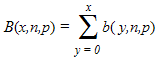

## CEILING

Returns number rounded up, away from zero, to the nearest multiple of significance. For example, if you want to avoid using pennies in your prices and your product is priced at $4.82, use the formula =CEILING(4.82,0.05) to round prices up to the nearest nickel.

### Syntax

CEILING(number, significance)

where:

number is the value you want to round off.

significance is the multiple to which you want to round.

### Remarks

* Both values must be numeric. 
* Regardless of the sign of a number, a value is rounded up when adjusted away from zero. If the number is an exact multiple of significance, no rounding occurs.

## Char

The Char function returns the character whose number code is defined in the parameter.

### Syntax:

Char(number)

where,

* number is the numeric value to retrieve the character.

## CHIDIST

Returns the one-tailed probability of the chi-squared ( ) distribution. The  distribution is associated with a  test. 

### Syntax

CHIDIST(x, degrees_freedom)

where:

x is the value at which you want to evaluate the distribution.

degrees_freedom is the number of degrees of freedom.

### Remarks

* Both arguments should be numeric.
* degrees_freedom  >= 1 and < 10^10.
* CHIDIST is calculated as follows:

CHIDIST = P(X > x)

where:

X is a  random variable.

## CHIINV

Returns the inverse of the one-tailed probability of the chi-squared () distribution. If probability = CHIDIST(x...), then CHIINV(probability,...) = x. Use this function to compare observed results with expected ones in order to decide whether your original hypothesis is valid.

### Syntax

CHIINV(probability, degrees_freedom)

where:

probability is a probability associated with the chi-squared distribution.

degrees_freedom is the number of degrees of freedom.

### Remarks

* Probability must be >= 0 and <= 1.
* degrees_freedom >=1 and  = 10^10.

Given a value for probability, CHIINV seeks the value x such that CHIDIST(x, degrees_freedom) = probability. Thus, precision of CHIINV depends on precision of CHIDIST. CHIINV uses an iterative search technique.

## CHITTEST

Returns the test for independence. CHITEST returns the value from the chi-squared (c2) distribution for the statistic and the appropriate degrees of freedom. 

### Syntax

CHITEST(actual_range, expected_range)

where:

actual_range is the range of data that contains observations to test against expected values.

expected_range is the range of data that contains the ratio of the product of row totals and column totals to the grand total.

### Remarks

* The  test first calculates a  statistic using the formula:

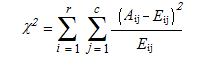

where:

Aij = actual frequency in the i-th row, j-th column

Eij = expected frequency in the i-th row, j-th column

r = number of rows

c = number of columns

A low value of  is an indicator of independence. The use of CHITEST is most appropriate when Eij's are not too small. Some statisticians suggest that each Eij should be greater than or equal to 5.

## Choose

The Choose function returns the value from a range of values on a specific index.

### Syntax:

Choose(index, valuearray)

where,

* index is to specify the index from where you want to retrive the value.
* valuearray is the array of value from where you want to take the value.
## Column

The Column function returns the column index of the provided column in range. 

### Syntax:

Column(range)

where,

* range is to provide the column in range.
## COMBIN

Returns the number of combinations for a given number of items. Use COMBIN to determine the total possible number of groups for a given number of items.

### Syntax

COMBIN(number, number_chosen)

where:

number is the number of items.

number_chosen is the number of items in each combination.

### Remarks

* Numeric arguments are truncated to integers. 
* A combination is any set or subset of items, regardless of their internal order. Combinations are distinct from permutations where the internal order is significant. 
* The number of combinations is as follows, where number = n and number_chosen = k: 

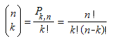

where:

## CONCATENATE

Joins several text strings into one text string.

### Syntax

CONCATENATE (text1, text2,...)

where:

text1, text2, ... are text items to be joined into a single text item. The text items can be text strings, numbers, or single-cell references.

### Remarks

* The "&" operator can be used instead of CONCATENATE to join text items.
## CONFIDENCE

Returns a value that you can use to construct a confidence interval about a population mean. The confidence interval is a range of values. In your sample, mean x is at the center of this range and the range is x ± CONFIDENCE. For example, if x is the sample mean of delivery times for products ordered through the mail, x ± CONFIDENCE is a range of population means. 

### Syntax

CONFIDENCE(alpha, standard_dev,size)

where:

alpha is the significance level used to compute the confidence level. The confidence level equals 100*(1 - alpha)%, or in other words, an alpha of 0.05 indicates a 95 percent confidence level.

standard_dev is the population standard deviation for the data range and is assumed to be known.

size is the sample size.

### Remarks

* All arguments must be non-numeric. 
* Alpha must be > 0 and < 1. 
* Standard_dev must be > 0. 
* Size must be >= 1.

## CORREL

Returns the correlation coefficient of the array1 and array2 cell ranges. 

### Syntax

CORREL(array1, array2)

where:

array1 is a cell range of values.

array2 is the second cell range of values.

### Remarks

* array1 and array2 must have the same number of data points.
* The equation for the correlation coefficient is:

where:

x-bar and y-bar are the sample means AVERAGE(array1) and AVERAGE(array2).

## COS

Returns the cosine of the given angle.

### Syntax

COS(number)

where:

number is the angle in radians for which you want the cosine.

## COSH

Returns the hyperbolic cosine of a number.

### Syntax

COSH(number)

where:

number is any real number for which you want to find the hyperbolic cosine.

### Remarks

* The formula for the hyperbolic cosine is:

## COUNT

Counts the number of items in a list that contains numbers. 

### Syntax

COUNT(value1, value2,...)

where:

value1, value2, ... are arguments that can contain or refer to a variety of different types of data, but only numbers are counted.

### Remarks

* Arguments that are numbers, dates or text representations of numbers are counted; arguments that are error values or text that cannot be translated into numbers are ignored. 
* If an argument is an array or reference, only numbers in that array or reference are counted. Empty cells, logical values, text or error values in the array or reference are ignored.

## COUNTA

Counts the number of cells that are not empty.

### Syntax

COUNTA(value1, value2,...)

where:

value1, value2, ... are arguments representing the values you want to count. In this case, a value is any type of information, excluding empty cells.

## COUNTBLANK

Counts empty cells in a specified range of cells.

### Syntax

COUNTBLANK(range)

where:

range is the range from which you want to count the blank cells.

### Remarks

* Cells with formulas that return "" (empty text) are also counted. Cells with zero values are not counted.
## COUNTIF

Counts the number of cells within a range that meet the given criteria.

### Syntax

COUNTIF(range, criteria)

where:

range is the range of cells from which you want to count cells.

criteria is the criteria in the form of a number, expression or text that defines which cells can be counted. For example, the criteria can be expressed as ">32".

### Remarks

* If and Sumif are other library functions that can be used to conditionally compute values.
## COVAR

Returns covariance, the average of the products of deviations for each data point pair. 

### Syntax

COVAR(array1, array2)

where:

array1 is the first cell range of numbers.

array2 is the second cell range of numbers.

### Remarks

* The arguments must either be numbers or be names, arrays or references that contain numbers. 
* array1 and array2 must have the same number of data points. 
* The covariance is:

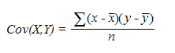

where:

X is array1

Y is array2

x-bar and y-bar are the sample means AVERAGE(array1) and AVERAGE(array2).

n is the sample size.

## CRITBINOM

Returns the smallest value where the cumulative binomial distribution is greater than or equal to a criterion value.

### Syntax

CRITBINOM(trials, probability_s, alpha)

where:

trials is the number of Bernoulli trials.

probability_s is the probability of a success on each trial.

alpha is the criterion value.

### Remarks

* Trials must be >= 0.
* Probability_s must be >=0 and <= 1.
* Alpha must be >= 0 and <= 1.
## DATE

Returns the sequential serial number that represents a particular date. 

### Syntax

DATE(year, month, day)

where:

year can be one to four digits. Year is interpreted based on 1900.

* When a year is between 0 (zero) and 1899 (inclusive), the value is added to 1900 to calculate the year. For example, DATE(102,11,12) returns November 12, 2002 (1900+102).
* If a year is between 1900 and 9999 (inclusive), the value is used as is, for example, DATE(2002,11,12) returns November 12, 2002.

month is a number representing the month of the year. 

day is a number representing the day of the month.

### Remarks

* Dates are stored as sequential serial numbers so that they can be used in calculations. By default, January 1, 1900 is serial number 1 and November 12, 2002 is serial number 37572 because it is 37572 days after January 1, 1900.
## DATEVALUE

Returns the serial number of the date represented by the date_text. 

### Syntax

DATEVALUE(date_text)

where:

date_text is the text that represents a date as a formatted string. For example, "11/12/2002" or "12-Nov-2002" are text strings within quotation marks that represent dates. If the year portion of the date_text is omitted, DATEVALUE uses the current year from your computer's built-in clock. The time information in the date_text is ignored.

### Remarks

* Dates are stored as sequential serial numbers so that they can be used in calculations. By default, January 1, 1900 is serial number 1, and November 12, 2002 is serial number 37572 because it is 37572 days after January 1, 1900. 
* Most functions automatically convert date values to serial numbers.
## DAY

Returns the day of a date, represented by a serial number. The day is given as an integer ranging from 1 to 31.

### Syntax

DAY(serial_number)

where:

serial_number is the date of the day you are trying to find. Dates should be entered by using the DATE function or as results of other formulas or functions. For example, use DATE(2002,4,23) for the 23rd day of April, 2002.

## DAYS360

Returns the number of days between two dates based on a 360-day year (twelve 30-day months) which, is used in some accounting calculations. 

### Syntax

DAYS360(start_date, end_date, method)

where:

start_date and end_date are the two dates between which, you want to know the number of days. If start_date occurs after end_date, DAYS360 returns a negative number. Dates should be entered by using the DATE function or as results of other formulas or functions. 

method is a logical value that specifies whether to use the U.S. or European method in the calculation. If method is:

* False or omitted - The calculation uses the U.S. (NASD) method. If the starting date is the 31st of a month, it becomes equal to the 30th of the same month. If the ending date is the 31st of a month and the starting date is earlier than the 30th of a month, the ending date becomes equal to the 1st of the next month; otherwise the ending date becomes equal to the 30th of the same month.
* True - The calculation uses the European method. Starting dates and ending dates that occur on the 31st of a month become equal to the 30th of the same month.

## DB

Returns the depreciation of an asset for a specified period using the fixed-declining balance method.

### Syntax

DB(cost, salvage, life, period, month)

where:

cost is the initial cost of the asset.

salvage is the value at the end of the depreciation (sometimes called the salvage value of the asset).

life is the number of periods over which, the asset is being depreciated (sometimes called the useful life of the asset).

period is the period for which, you want to calculate the depreciation. Period must use the same units as life.

month is the number of months in the first year. If month is omitted, it is assumed to be 12.

### Remarks

* The fixed-declining balance method computes the depreciation at a fixed rate. DB uses the following formulas to calculate the depreciation for a period:

(cost - total depreciation from prior periods) * rate

where:

        rate = 1 - ((salvage / cost) ^ (1 / life)), rounded to three decimal places

* Depreciation for the first and last periods is a special case. For the first period, DB uses this formula:

cost * rate * month / 12

* For the last period, DB uses this formula:

((cost - total depreciation from prior periods) * rate * (12 - month)) / 12

## DDB

Returns the depreciation of an asset for a specified period using the double-declining balance method or some other method you specify.

### Syntax

DDB(cost, salvage, life, period, factor)

where:

cost is the initial cost of the asset.

salvage is the value at the end of the depreciation (sometimes called the salvage value of the asset).

life is the number of periods over which, the asset is being depreciated (sometimes called the useful life of the asset).

period is the period for which, you want to calculate the depreciation. Period must use the same units as life.

factor is the rate at which, the balance declines. If factor is omitted, it is assumed to be 2 (the double-declining balance method).

> Note: All five arguments must be positive numbers.

### Remarks

* The double-declining balance method computes the depreciation at an accelerated rate. Depreciation is highest in the first period and decreases in successive periods. DDB uses the following formula to calculate depreciation for a period:

((cost-salvage) - total depreciation from prior periods) * (factor/life)

## DEGREES

Converts radians into degrees.

### Syntax

DEGREES(angle)

where:

angle is the angle in radians that you want to convert.

## DEVSQ

Returns the sum of squares of deviations of data points from their sample mean.

### Syntax

DEVSQ(number1, number2,...)

where:

number1, number2, ... are arguments for which, you want to calculate the sum of squared deviations. You can also use a single array or a reference to an array instead of arguments separated by commas.

Remarks

<table>
<tr>
<td>
* The arguments must be numbers or names, arrays or references that contain numbers. * The equation for the sum of squared deviations is:</td></tr>
<tr>
<td>
 </td></tr>
</table>

## Dollar

The Dollar function converts a number to text, using a currency format. 

The format used is $#,##0.00_);($#,##0.00). 

### Syntax:

Dollar (number, decimal_places)

where,

* number is the number you want to convert to text.
* decimal_places is the number of digits in decimal places you want to display. The value is rounded accordingly.
## EVEN

Returns the numberrounded upto thenearest even integer.

### Syntax

EVEN(number)

where:

number is the value that is to be rounded.

### Remarks

* Regardless of the sign of the number a value is rounded up when adjusted away from zero. If the number is an even integer no rounding occurs. 
## Exact

The Exact function compares two values ignoring the styles and returns the boolean value as true or false.

### Syntax:

Exact(value1, value2)

where,

* value1 is the first value you want to compare .
* value2 is the second value you want to compare.
## EXP

Returns e raised to the power of the given number.

### Syntax

EXP(number)

where:

number is the exponent applied to the base e.

## EXPONDIST

Returns the exponential distribution. 

### Syntax

EXPONDIST(x, lambda, cumulative)

where:

x is the value of the function.

lambda is the parameter value.

cumulative is a logical value that indicates which, form of the exponential function is to be provided. If cumulative is True, EXPONDIST returns the cumulative distribution function; if False, it returns the probability density function.

### Remarks

* The equation for the probability density function is: 

* The equation for the cumulative distribution function is:

## FACT

Returns the factorial of a number. The factorial of a number is the product of all positive integers <= the given number.

### Syntax

FACT(number)

where:

number is the non-negative number for which you want the factorial of. If the number is not an integer, it is truncated.

## False

The False function returns the logical value for the false.

### Syntax:

False(stringvalue)

where:

* stringvalue is toprovide an empty string.
## FDIST

Returns theF probability distribution.

### Syntax

FDIST(x, degrees_freedom1, degrees_freedom2)

where:

x is the value at which to evaluate the function.

degrees_freedom1 is the numerator degrees of freedom.

degrees_freedom2 is the denominator degrees of freedom.

### Remarks

* All arguments must be numeric.
* X must be >= 0.
* Both degrees_freedom1 and degrees_freedom2 must be >= 1 and < 10^10.
* FDIST is calculated as follows:

FDIST=P( F>x )

where:

F is a random variable that has an F distribution with degrees_freedom1 and degrees_freedom2 degrees of freedom.

## Find

The Find function finds a portion of a string from a particular text and returns the location of the string.

### Syntax:

Find(lookfor, lookin, start)

where,

* lookfor is the text you want to search.
* lookin is the the text in which you want to search.
* start specifies the starting position of the text from where you want to start searching in the text. This  is optional. 
## Finv 

 The Finv function returns the inverse of the F probability distribution. If p = FDIST(x,...), then FINV(p,...) = x.

Using F distribution, you can compare the degree of variability for two data sets. 

### Syntax:

FINV(probability,deg_freedom1,deg_freedom2)

The FINV function syntax has the following three arguments (Argument is a value that provides information to an action, an event, a method, a property, a function, or a procedure):

* Probability is a probability associated with the F cumulative distribution.
* Deg_freedom1 is the numerator degrees of freedom.
* Deg_freedom2 is the denominator degrees of freedom.
## FISHER

Returns the Fisher transformation at x. This transformation produces a function that is normally distributed rather than skewed. 

### Syntax

FISHER(x)

where:

x is a numeric value for which you want the transformation.

### Remarks

* X must be > -1 and < 1.
* The equation for the Fisher transformation is:

## FISHERINV

Returns the inverse of the Fisher transformation. When y = FISHER(x), then FISHERINV(y) = x.

### Syntax

FISHERINV(y)

where:

y is the value to perform the inverse of the transformation.

### Remarks

* The equation for the inverse of the Fisher transformation is:

## Fixed

The Fixed function rounds off to a specified number of decimal places and returns the value in text format.

### Syntax: 

Fixed ( number, decimal_places, no_commas )

where,

* number is the number you want to round.
* decimal_places is the number of decimal places you want to display in the result.
* no_commas is a logical value. This displays commas when it is set to FALSE, do not display commas when it is set to TRUE.
## FLOOR

Rounds off the given number down, toward zero, to the nearest multiple of significance.

### Syntax

FLOOR(number, significance)

where:

number is the numeric value that you want to round off.

significance is the multiple to which, you want to round the number off.

### Remarks

* Number and significance must have the same sign. 
* Regardless of the sign of the number, a value is rounded down when adjusted away from zero. When a number is an exact multiple of significance, no rounding occurs.
## FORECAST

Calculates a future value by using existing values using a linear regression. The predicted value is a y-value for a given x-value. 

### Syntax

FORECAST(x, known_ys, known_xs)

where:

x is the data point for which you want to predict a value.

known_ys is the dependent array or range of data.

known_xs is the independent array or range of data.

Remarks

* The equation for FORECAST is:

a+bx

where:

x-bar and y-bar are the sample means AVERAGE(known_xs) and AVERAGE(known_ys).

## FV

The FV function returns the future value of an investment, based on an interest rate and a constant payment schedule.

### Syntax:

FV( interest_rate, number_payments, payment, PV, Type )

where,

* interest_rate is the interest rate for the investment.
* number_payments is the number of payments for the annuity.
* payment is the payment made on each period.
* PV is the present value of the payments. This is optional. The FV function assumes PV value as 0, when this parameter is omitted.
* Type indicates the payments due. Type accepts the following values:
* 0 - Payments at the end of the period (default).
* 1 - Payments at the beginning of the period.

This is optional. The FV function assumes Type value as 0, when this parameter is omitted.

##  GAMMADIST

Returns thegamma distribution. 

### Syntax

GAMMADIST(x, alpha,beta, cumulative)

where:

x is the value to evaluate the distribution.

alpha is a parameter to the distribution.

beta is a parameter to the distribution. If beta = 1, GAMMADIST returns the standard gamma distribution.

cumulative is a logical value that determines the form of the function. If cumulative is True, GAMMADIST returns the cumulative distribution function; if False, it returns the probability density function.

### Remarks

* X must be >=  0. 
* Alpha and beta must be > 0. 
* The equation for the gamma probability density function is:

* The standard gamma probability density function is:

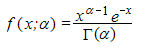

* When alpha = 1, GAMMADIST returns the exponential distribution with:

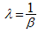

## Gammainv

The Gammainv function returns the inverse function for the GAMMADIST function. 

### Syntax:

Gammainv(p, alpha, beta)

where,

* p is the probability associated with the gamma distribution.
* alpha is a parameter of the distribution.
* beta is a parameter of the distribution.
## GAMMALN

### GAMMAINV

Returns the inverse of the gamma cumulative distribution. If p = GAMMADIST(x,...), then GAMMAINV(p,...) = x.

#### Syntax

GAMMAINV(probability, alpha, beta)

where:

probability is the probability associated with the gamma distribution.

alpha is a parameter to the distribution.

beta is a parameter to the distribution. 

#### Remarks

* Probability must be >= 0 and <= 1. 
* Alpha and beta must be positive. 

Given a value for probability, GAMMAINV seeks value x such that GAMMADIST(x, alpha, beta, True) = probability. Thus, precision of GAMMAINV depends on the precision of GAMMADIST. GAMMAINV uses an iterative search technique.

## GEOMEAN

Returns the geometric mean of an array or range of positive data. 

### Syntax

GEOMEAN(number1, number2,...)

where:

number1, number2, ... are arguments for which you want to calculate the mean. 

### Remarks

* The arguments must be either numbers or names, arrays or references that contain numbers. 
* All values must be positive. 
* The equation for the geometric mean is: 

## GROWTH

This feature enables you to calculate predicted exponential growth using existing data.  This calculates and returns an array of values used for the regression analysis. Growth enables you to perform a regression analysis.

_Method Table_

<table>
<tr>
<th>
Method </th><th>
Description </th><th>
Parameters </th><th>
Type </th><th>
Return Type </th><th>
Reference links </th></tr>
<tr>
<td>
Growth() </td><td>
Calculates the Growth for an array of cells.</td><td>
Known y’s, Known x’s, new_x's</td><td>
Method </td><td>
String </td><td>
N/A </td></tr>
</table>

The following is the formula to calculate Growth for an array of cells in a column:

### Syntax

=GROWTH(known_y's, [known_x's], [new_x's], 

Known_y's: A set of y-values you already know in a relationship, where y = b*m^x.

Known_x's: An optional set of x-values that you may already know in the relationship, where y = b*m^x.

New_x's: New x-values for which you want GROWTH to return corresponding y-values.

### Code

=Growth(B2:B7,A2:A7,C6:C7) 

## HARMEAN

Returns the harmonic mean of a data set. The harmonic mean is the reciprocal of the arithmetic mean of reciprocals.

### Syntax

HARMEAN(number1, number2,...)

number1, number2, ... are arguments for which you want to calculate the mean. 

### Remarks

* The arguments must be either numbers or names, arrays or references that contain numbers. 
* All data values must be positive. 
* The equation for the harmonic mean is:

## HLOOKUP

Searches for a value in the top row of the array of values and then returns a value in the same column from a row you specify in the array. Use HLOOKUP when your comparison values are located in a row across the top of a table of data and you want to look down a specified number of rows. Use VLOOKUP when your comparison values are located in a column to the left of the data you want to find.

### Syntax

HLOOKUP(lookup_value, table_array, row_index_num, range_lookup)

where:

lookup_value is the value to be found in the first row of the table. Lookup_value can be a value, a reference or a text string.

table_array is a table of information in which, data is looked up. Use a reference to a range or a range name.

row_index_num is the row number in table_array from which, the matching value is returned. A row_index_num of 1 returns the first row value in table_array, a row_index_num of 2 returns the second row value in table_array and so on. 

range_lookup is a logical value that specifies whether you want HLOOKUP to find an exact match or an approximate match. If True or omitted, an approximate match is returned. In other words, if an exact match is not found, the next largest value that is less than the lookup_value is returned. (This requires your lookup values to be sorted.) If False, HLOOKUP finds an exact match.

## HOUR

Returns the hour of a time value. The hour is given as an integer, ranging from 0 (12:00 A.M.) to 23 (11:00 P.M.).

### Syntax

HOUR(serial_number)

where:

serial_number is the time that contains the hour you want to find. Times may be entered as text strings within quotation marks (for example, "6:00 PM"), as decimal numbers (for example, 0.75, which represents 6:00 PM), or as results of other formulas or functions (for example, TIMEVALUE("6:00 PM")).

## Hypgeomdist

The Hypgeomdist function returns the hypergeometric distribution.

Syntax:

Hypgeomdist(sample, numberofsample, population, numberofpopulation)

where,

* sample is the number of successes in the sample.
* numberofsample is the size of the sample.
* population is the number of successes in the population.
* numberofpopulation is the population size.
## HYPEGEOMDIST

Returns the hypergeometric distribution. HYPGEOMDIST returns the probability of a given number of sample successes, given the sample size, population successes and population size. 

### Syntax

HYPGEOMDIST(sample_s, number_sample, population_s, number_population)

where:

sample_s is the number of successes in the sample.

number_sample is the size of the sample.

population_s is the number of successes in the population.

number_population is the population size.

### Remarks

* All arguments are truncated to integers. 
* sample_s must be >= 0 less than both  number_sample and population_s. 
* number_sample must be >= 0 and <  number_population. 
* population_s must be >= 0 and <  number_population.
* number_population must b >= 0. 
* The equation for the hypergeometric distribution is: 

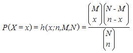

where:

x = sample_s

n = number_sample

M = population_s

N = number_population

## IF

Returns one value if a condition you specify evaluates to True and another value if it evaluates to False.

Use IF to conduct conditional tests on values and formulas.

### Syntax

IF(logical_test, value_if_true, value_if_false)

where:

logical_test is any value or expression that can be evaluated to True or False. 

value_if_true is the value that is returned if a logical_test is True.

value_if_false is the value that is returned if a logical_test is False. 

### Remarks

* Countif and Sumif are additional methods that provide conditional calculations.
## Index

The Index function returns the exact value from the provided row index and column index from a specific range.

### Syntax:

Index(range,row,col)

where,

* range is a string to mention the specific range.
* row is the integer that indicates the specific row index.
* col is the integer that indicates the specific column index.
## Indirect

The Indirect function returns the reference as a string instead of providing the content or range within it.

### Syntax:

Indirect(content)

where,

* content is the string that provides the textual representation of the cell.
## INT

Rounds a number down to the nearest integer.

### Syntax

INT(number)

where:

number is the real number that you want to round down to an integer.

## INTERCEPT

Calculates the point at which, the least squares fit line that intersects the y-axis. 

### Syntax

INTERCEPT(known_y's, known_x's)

where:

known_y's is the dependent set of observations or data.

known_x's is the independent set of observations or data.

### Remarks

* The equation for the intercept of the regression line, a, is:

where:

x-bar and y-bar are the sample means AVERAGE(known_x's) and AVERAGE(known_y's).

## IPMT

Returns the interest payment for a given period for an investment based on periodic, constant payments and a constant interest rate. 

### Syntax

IPMT(rate, per, nper, pv, fv, type)

where:

rate is the interest rate per period.

per is the period for which, you want to find the interest and must be in the range 1 to nper.

nper is the total number of payment periods in an annuity.

pv is the present value or the lump-sum amount that a series of future payments is worth right now.

fv is the future value or a cash balance that you want to attain after the last payment is made. If fv is omitted, it is assumed to be 0 (the future value of a loan, for example, is 0).

type is the number 0 or 1 and indicates when payments are due. If type is omitted, it is assumed to be 0. If type = 0, payments are made at the end of the period. If type is 1, payments are made at the beginning of the period.

### Remarks

* Make sure that you are consistent about the units you use for specifying rate and nper. If you make monthly payments on a four-year loan at 12 percent annual interest, use 12%/12 for rate and 4*12 for nper. If you make annual payments on the same loan, use 12% for rate and 4 for nper.
## IRR

Returns the internal rate of return for a series of cash flows represented by the numbers in values. The cash flows must occur at regular intervals such as monthly or annually. 

### Syntax

IRR(values, guess)

where:

values is an array or a reference to cells that contain numbers for which, you want to calculate the internal rate of return. Values must contain at least one positive value and one negative value to calculate the internal rate of return. IRR uses the order of values to interpret the order of cash flows. Be sure to enter your payment and income values in the sequence you want.

guess is a number that you guess is close to the result of IRR. An iterative technique is used for calculating IRR. In most cases, you do not need to provide a guess for the IRR calculation. If a guess is omitted, it is assumed to be 0.1 (10 percent).

## IsBlank

The IsBlank function checks for blank or null values.

### Syntax:

IsBlank( value )

where,

value is the value that you want to test. If the value is blank, this function returns TRUE. If the value is not blank, the function returns FALSE.

## IsErr

The IsErr function checks whether a value is an error.

### Syntax:

IsErr( value )

where,

value is the value that you want to test. If the value is an error value (except #N/A), this function returns TRUE/FALSE to indicate whether a value is an error.

## ISERROR

Returns True when the value is a string that starts with a #.

### Syntax

ISERROR(value)

where:

value is the value that is to be tested.

## IsLogical

The IsLogiacl function checks whether a value is a logical value and returns a  TRUE or FALSE.

### Syntax:

IsLogical( value )

where,

This value is the value that you want to test. when the value is a TRUE or FALSE value, this function returns TRUE. Otherwise, it returns FALSE.

## IsNA

The IsNA function returns a Boolean value after determining that the provided value is a #NA error value.

### Syntax:

IsNA(value)

where,

* Value is the function that tests.
## IsNonText

The IsNonText function returns the Boolean value after determining that the provided value is not a string.

### Syntax:

IsNonText(text)

where,

* text is the value you want to  test whether  it is a string or not.
## ISNUMBER

Returns True when the value parses as a numeric value.

### Syntax
ISNUMBER(value)

where:

value is the value that is to be tested.

## ISPMT

Calculates the interest paid during a specific period of an investment. 

### Syntax

ISPMT(rate, per, nper, pv)

where:

rate is the interest rate for the investment.

per is the period for which, you want to find the interest and must be between 1 and nper.

nper is the total number of payment periods for the investment.

pv is the present value of the investment. For a loan, pv is the loan amount.

### Remarks

* Make sure that you are consistent about the units you use for specifying rate and nper. If you make monthly payments on a four-year loan at an annual interest rate of 12 percent, use 12%/12 for rate and 4*12 for nper. If you make annual payments on the same loan, use 12% for rate and 4 for nper.
## IsText

The IsText function returns a Boolean value after determining that the provided value is a string.

### Syntax:

IsText(text)

where,

* text is the value you want to test to check if it is a string or not.
## KURT

Returns the kurtosis of a data set. Kurtosis characterizes the relative peakedness or flatness of a distribution compared with the normal distribution. Positive kurtosis indicates a relatively peaked distribution. Negative kurtosis indicates a relatively flat distribution.

### Syntax

KURT(number1, number2, ...)

where:

number1, number2, ... are arguments for which you want to calculate kurtosis. You can also use a single array or a reference to an array instead of arguments separated by commas.

### Remarks

* The arguments must be either numbers or names, arrays or references that contain numbers. 
* If an array or reference argument contains text, logical values or empty cells, those values are ignored; however, cells with the value zero are included. 
* If there are fewer than four data points or if the standard deviation of the sample equals zero, KURT returns the #DIV/0! error value. 
* Kurtosis is defined as:

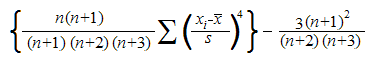

where:

s is the sample standard deviation.

## LARGE

Returns the k-th largest value in a data set. 

### Syntax

LARGE(array, k)

where:

array is the array or range of data for which, you want to determine the k-th largest value.

k is the position (from the largest) in the array or cell range of data to return.

### Remarks

* When n is the number of data points in a range, then LARGE(array,1) returns the largest value, and LARGE(array,n) returns the smallest value.
## LEFT

LEFT returns the first character or characters in a text string, based on the number of characters you specify.

### Syntax

LEFT(text, num_chars)

where:

text is the text string that contains the characters which, you want to extract.

num_chars specifies the number of characters which, you want LEFT to extract.

### Remarks

* Num_chars must be greater than or equal to zero.
* When num_chars is greater than the length of text, LEFT returns all the text.
* When num_chars is omitted, it is assumed to be 1.

## LN

Returns the natural logarithm of a number. Natural logarithms are based on the constant e (2.718281828459...).      

### Syntax

LN(number)

where:

number is the positive real number for which, you want the natural logarithm.

### Remarks

* LN is the inverse of the EXP function.
## LEN

LEN returns the length of a text string, including spaces.

### Syntax

Len(text)

where:

text is the text string whose length is to be determined.

## LOG

Returns the logarithm of a number to the base that you specify.

### Syntax

LOG(number, base)

where:

number is the positive real number for which, you want the logarithm.

base is the base of the logarithm. If base is omitted, it is assumed to be 10.

## LOG10

Returns the base-10 logarithm of a number.

### Syntax

LOG10(number)

where:

number is the positive real number for which, you want the base-10 logarithm.

## LOGEST

This feature enables you to calculate predicted exponential growth using existing data.  This calculates and returns an array of values used for the regression analysis. Logest calculates and returns an array of values that is used in regression analysis.

_Method Table_

<table>
<tr>
<th>
Method </th><th>
Description </th><th>
Parameters </th><th>
Type </th><th>
Return Type </th><th>
Reference links </th></tr>
<tr>
<td>
Logest() </td><td>
Calculates Logest for an array of cells.</td><td>
known_y's, known_x's, const, stats</td><td>
Method</td><td>
String </td><td>
N/A </td></tr>
</table>

The following is the formula to calculate Logest for an array of cells in a column:

### Syntax

=LOGEST(known_y's, [known_x's], [const], [stats])

Known_y's : A set of y-values you already know in a relationship, where y = b*m^x.

Known_x's : An optional set of x-values that you may already know in a relationship, where y = b*m^x.

Const  :  A logical value specifying whether to force the constant b to equal 1.

Stats  : A logical value specifying whether to return additional regression statistics.

### Code

= Logest(B2:B7,A2:A7,TRUE,FALSE)

## LOGINV

Returns the inverse of the lognormal cumulative distribution function of x, where ln(x) is normally distributed with parameters mean and standard_dev. If p = LOGNORMDIST(x,...), then LOGINV(p,...) = x.

### Syntax

LOGINV(probability, mean, standard_dev)

where:

probability is the probability associated with the lognormal distribution.

mean is the mean of ln(x).

standard_dev is the standard deviation of ln(x).

### Remarks

* Probability must be >= 0 and < 1. 
* Standard_dev must be positive. 
* The inverse of the lognormal distribution function is:

## LOGNORMDIST

Returns the cumulative lognormal distribution of x, where ln(x) is normally distributed with parameters mean and standard_dev.

### Syntax

LOGNORMDIST(x, mean, standard_dev)

where:

x is the value where the function can be evaluated.

mean is the mean of ln(x).

standard_dev is the standard deviation of ln(x).

### Remarks

* Both x and standard_dev must be positive. 
* The equation for the lognormal cumulative distribution function is: 

## Lower

The Lower function converts all characters in the specified text string to lowercase. Characters in the string that are not letters, are not changed.

### Syntax:

Lower( text )

where,

* text is the string you want to convert to lowercase.
## Match 

The Match function searches for a specified value in an array and returns the relative position of that item.

### Syntax:

Match( value, array, match_type )

where,

* this value is the value you want to search in the array.
* array is a range of cells that contains the value you want to search.
* match_type is the type of match you want to perform. 

match_type accepts the following values:

* 1 - The Match function finds the largest value that is less than or equal to the specified value. Ensure that the array is sorted in ascending order. 
* 0 - The Match function finds the first value that is equal to the specified value. The array can be sorted in any order.
* - 1 - The Match function finds the smallest value that is greater than or equal to the specified value. Ensure that the array is sorted in descending order.

Notes:

* The Match function does not distinguish between uppercase and lowercase when searching.
* When the Match function does not find a match, it returns #N/A error.
* match_type is optional.  The Match Function assumes match_type as 1 when the parametter is omitted.
* When the match_type parameter is 0 and a text value, then you can use wildcards in the value parameter.

Where, 

       *    -   matches any sequence of characters

       ?    -     matches any single character

## MAX

Returns the largest value in a set of values.

### Syntax

MAX(number1, number2, ...)

where:

number1, number2, ... are numbers for which you want to find the maximum value.

## MAXA

Returns the largest value in a list of arguments. Text and logical values such as True and False are compared as well as numbers.

### Syntax

MAXA(value1, value2, ...)

where:

value1, value2, ... are values for which you want to find the largest value.

### Remarks

* You can specify arguments that are numbers, empty cells, logical values or text representations of numbers. Arguments that are error values cause errors. If the calculation does not include text or logical values, use the MAX worksheet function instead.
* When an argument is an array or reference, only values in that array or reference are used. Empty cells and text values in the array or reference are ignored.
* Arguments that contain True evaluate as 1; arguments that contain text or False evaluate as 0 (zero).
* When the arguments contain no values, MAXA returns 0 (zero).
## MEDIAN

Returns the median of the given numbers. The median is the number in the middle of a set of numbers; that is, half the numbers have values that are greater than the median and half have values that are less.

### Syntax

MEDIAN(number1, number2, ...)

where:

number1, number2, ... are numbers for which you want the median.

### Remarks

* When there is an even number of numbers in the set, then MEDIAN calculates the average of the two numbers in the middle.
## MID

MID returns a text segment of a character string. The parameters specify the starting position and the number of characters.

### Syntax

MID(text, start_position, num_chars)

where:

text is the text containing the characters to extract.

start is the position of the first character in the text to extract.

number specifies the number of characters in the part of the text.

## MIN

Returns the smallest number in a set of values.

### Syntax

MIN(number1, number2, ...)

where:

number1, number2, ... are  numbers for which you want to find the minimum value.

### Remarks

* When an argument is an array or reference, only numbers in that array or reference are used. Empty cells, logical values or text in the array or reference are ignored. If logical values and text should not be ignored, use MINA.
## MINA

Returns the smallest value in the list of arguments. Text and logical values such as True and False are compared as well as numbers.

### Syntax

MINA(value1, value2, ...)

where:

value1, value2, ... are values for which, you want to find the smallest value.

Remarks

* Arguments that contain True evaluate as 1; arguments that contain text or False evaluate as 0 (zero).
## MINUTE

Returns theminutes of a time value. The minute is given as an integer, ranging from 0 to 59.

### Syntax

MINUTE(serial_number)

where:

serial_number is the time that contains the minute you want to find. Times may be entered as text strings within quotation marks (for example, "6:00 PM"), as decimal numbers (for example, 0.75, which represents 6:00 PM), or as results of other formulas or functions (for example, TIMEVALUE("6:00 PM")).

### Remarks

* Time values are a portion of a date value and are represented by a decimal number (for example, 12:00 PM is represented as 0.5).
## MIRR

Returns the modified internal rate of return for a series of periodic cash flows. 

### Syntax

MIRR(values, finance_rate, reinvest_rate)

where:

values is an array or a reference to cells that contain numbers. These numbers represent a series of payments (negative values) and income (positive values) occurring at regular periods. Values must contain at least one positive value and one negative value to calculate the modified internal rate of return. 

finance_rate is the interest rate you pay on the money used in the cash flows.

reinvest_rate is the interest rate you receive on the cash flows as you reinvest them.

### Remarks

* MIRR uses the order of values to interpret the order of cash flows. Be sure to enter your payment and income values in the sequence you want and with the correct signs (positive values for cash received, negative values for cash paid). 
* When n is the number of cash flows in values, frate is the finance_rate, and rrate is the reinvest_rate, then the formula for MIRR is:

## MOD

Returns the remainder after the number is divided by a divisor. The result has the same sign as the divisor.

### Syntax

MOD(number, divisor)

where:

number is the number, you want to find the remainder.

divisor is the value, you want to divide the number.

### Remarks

* The MOD function can be expressed in terms of the INT function:

MOD(n, d) = n – d * INT(n/d)

## MODE

Returns the most frequently occurring or repetitive, value in an array or range of data. 

### Syntax

MODE(number1, number2, ...)

where:

number1, number2, ... are arguments for which you want to calculate the mode. 

### Remarks

* In a set of values, the mode is the most frequently occurring value.
## MONTH

Returns the month of a date represented by a serial number. The month is given as an integer, ranging from 1 (January) to 12 (December).

### Syntax

MONTH(serial_number)

where:

serial_number is the date of the month you are trying to find. Dates should be entered by using the DATE function or as results of other formulas or functions. For example, use DATE(2002,11,12) for the 12th day of Nov, 2002.

### Remarks

* Dates are stored as sequential serial numbers so that they can be used in calculations. By default, January 1, 1900 is serial number 1 and January 1, 2008 is serial number 39448 because it is 39,448 days after January 1, 1900.
## NEGBINOMDIST

Returns the negative binomial distribution. NEGBINOMDIST returns the probability that there are  number_f failures before the number_s-th success, when the constant probability of a success is probability_s. 

### Syntax

NEGBINOMDIST(number_f, number_s, probability_s)

where:

number_f is the number of failures.

number_s is the threshold number of successes.

probability_s is the probability of a success.

### Remarks

* number_s  must be >= 1.
* probability_s must be >= 0 and <= 1. 
* number_f  must be >= 0. 
* The equation for the negative binomial distribution is:

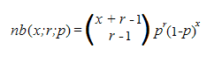

where:

x is number_f

r is number_s

p is probability_s

## NORMDIST

Returns the normal distribution for the specified mean and standard deviation. 

### Syntax

NORMDIST(x, mean, standard_dev, cumulative)

where:

x is the value for which, you want the distribution.

mean is the arithmetic mean of the distribution.

standard_dev is the standard deviation of the distribution.

cumulative is a logical value that determines the form of the function. If cumulative is True, NORMDIST returns the cumulative distribution function; if False, it returns the probability mass function.

### Remarks

* Standard_dev must be > 0. 
* The equation for the normal density function (cumulative = False) is: 

* When cumulative = True, the formula is the integral from negative infinity to x of the given formula.
## NORMINV

Returns the inverse of the normal cumulative distribution for the specified mean and standard deviation.

### Syntax

NORMINV(probability, mean, standard_dev)

where:

probability is a probability corresponding to the normal distribution.

mean is the arithmetic mean of the distribution.

standard_dev is the standard deviation of the distribution.

### Remarks

* Probability must be >= 0 and <= 1. 
* standard_dev must be > 0. 

Given a value for probability, NORMINV seeks value x such that NORMDIST(x, mean, standard_dev, True) = probability. NORMINV uses an iterative search technique.

## NormsDist

The NormsDist function returns the probability that the observed value of a standard normal random variable is less than or equal to the parameter.

### Syntax: 

NormsDist(value)

where, 

* value is a numeric value that checks with the random variable.
## NormsInv

The NormsInv function returns the standard normal random variable that has _Mean_ 0 and _Standard Deviation_ 1

### Syntax:

NormsDist(value)

where,

* value is probability of the standard deviation.
## NOT

Reverses the value of its argument. 

### Syntax

NOT(logical)

where:

logical is a value or expression that can be evaluated to True or False.

## NOW

Returns the serial number of the current date and time. 

### Syntax

NOW( )

Remarks

* Dates are stored as sequential serial numbers so that they can be used in calculations. By default, January 1, 1900 is serial number 1 and January 1, 2008 is serial number 39448 because it is 39,448 days after January 1, 1900 
* Numbers to the right of the decimal point in the serial number represent the time; numbers to the left represent the date. For example, the serial number .5 represents the time 12:00 noon.

## NPER

Returns the number of periods for an investment based on periodic, constant payments and a constant interest rate.

### Syntax

NPER(rate, pmt, pv, fv, type)

where:

rate is the interest rate per period.

pmt is the payment made each period; it cannot change over the life of the annuity. 

pv is the present value or the lump-sum amount that a series of future payments is worth right now.

fv is the future value or a cash balance that you want to attain after the last payment is made. If fv is omitted, it is assumed to be 0 (the future value of a loan, for example, is 0).

type is the number 0 or 1 and indicates when payments are due. when type equals:

* 0 - payments are due at the end of the period
* 1 - payments are due at the beginning of the period
## NPV

Calculates the net present value of an investment by using a discount rate and a series of future payments (negative values) and income (positive values).

### Syntax

NPV(rate, value1, value2, ...)

where:

rate is the rate of discount over the length of one period.

value1, value2, ... are arguments representing the payments and income. Value1, value2, ... must be equally spaced in time and occur at the end of each period. NPV uses the order of value1, value2, ... to interpret the order of cash flows. Be sure to enter your payment and income values in the correct sequence. 

### Remarks

* The NPV investment begins one period before the date of the value1 cash flow and ends with the last cash flow in the list. The NPV calculation is based on future cash flows. If your first cash flow occurs at the beginning of the first period, the first value must be added to the NPV result, not included in the value arguments. 
* When n is the number of cash flows in the list of values, the formula for NPV is:

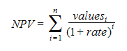

## ODD

Returns the number rounded up to the nearest odd integer.

### Syntax

ODD(number)

where:

number is the value to be rounded off.

### Remarks

* Regardless of the sign of a number, a value is rounded up when adjusted away from zero. If the number is an odd integer, no rounding occurs.

## Offset

The Offset function returns a reference to a range that is offset a number of rows and columns from any given range or cell.

### Syntax:

Offset( range, rows, columns, height, width )

where,

* range is the starting range from which you want to apply the offset.
* rows is the number of rows you want to apply as the offset to the range. This can be either a positive or negative number.
* columns is the number of columns you want to apply as the offset to the range. This can be either a positive or a negative number.
* height is the number of rows that you want the returned range to be.
* width is the number of columns that you want the returned range to be.

## OR

Returns True when any argument is True; returns False when all arguments are False.

### Syntax

OR(logical1, logical2, ...)

where:

logical1, logical2, ... are conditions you want to test that can be either True or False.

### Remarks

* The arguments must evaluate to logical values such as True or False or in arrays or references that contain logical values.

## PEARSON

Returns the Pearson product moment correlation coefficient, r, a dimensionless index that ranges from -1.0 to 1.0 inclusive and reflects the extent of a linear relationship between two data sets.

### Syntax

PEARSON(array1, array2)

where:

array1 is a set of independent values.

array2 is a set of dependent values.

### Remarks

* The arguments must be either numbers or names, array constants or references that contain numbers. 
* The formula for the Pearson product moment correlation coefficient, r, is: 

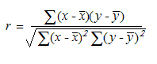

where:

x-bar and y-bar are the sample means AVERAGE(array1) and AVERAGE(array2).

## PERCENTILE

Returns the k-th percentile of values in a range. 

### Syntax

PERCENTILE(array, k)

where:

array is the array or range of data that defines relative standing.

k is the percentile value in the range 0..1, inclusive.

### Remarks

* k must be >=10 and <= 1. 
* When k is not a multiple of 1/(n - 1), PERCENTILE interpolates to determine the value at the k-th percentile.
## PERCENTRANK

Returns the rank of a value in a data set as a percentage of the data set. 

### Syntax

PERCENTRANK(array, x, significance)

where:

array is the range of data with numeric values that defines relative standing.

x is the value for which, you want to know the rank.

significance is an optional value that identifies the number of significant digits for the returned percentage value. If omitted, PERCENTRANK uses three digits (0.xxx).

### Remarks

* Significance must be >= 1. 
* When x does not match one of the values in the array, PERCENTRANK interpolates to return the correct percentage rank. 
## Permut

The Permut function returns the number of permutations of n items taken at k time.

### Syntax:

Permut(n, k)

where,

* n is the number of items.
* k is the time taken.
## PI

Returns the number 3.14159265358979, themathematical constant pi, accurate to 15 digits.

### Syntax

PI( )

## PMT

Calculates the payment for a loan based on constant payments and a constant interest rate.

### Syntax

PMT(rate, nper, pv, fv, type)

where:

rate is the interest rate for the loan.

nper is the total number of payments for the loan.

pv is the present value or the total amount that a series of future payments is worth now; also known as the principal.

fv is the future value or a cash balance you want to attain after the last payment is made. If fv is omitted, it is assumed to be 0 (zero), that is, the future value of a loan is 0.

type is the number 0 (zero) or 1 and indicates when payments are due. If type equals:

* 0 - payments are due at the end of the period
* 1 - payments are due at the beginning of the period

### Remarks 

* The payment returned by PMT includes principal and interest but no taxes, reserve payments or fees sometimes associated with loans. 
* Make sure that you are consistent about the units you use for specifying rate and nper. If you make monthly payments on a four-year loan at an annual interest rate of 12 percent, use 12%/12 for rate and 4*12 for nper. If you make annual payments on the same loan, use 12 percent for rate and 4 for nper. 

## POISSON

Returns the Poisson distribution. 

### Syntax

POISSON(x, mean, cumulative)

where:

x is the number of events.

mean is the expected numeric value.

cumulative is a logical value that determines the form of the probability distribution returned. If cumulative is True, POISSON returns the cumulative Poisson probability that the number of random events occurring is between zero and x inclusive; if False, it returns the Poisson probability mass function that the number of events occurring is exactly x.

Remarks

* X must be >= 0. 
* Mean must be > 0. 
* POISSON is calculated as follows:

For cumulative = False:

For cumulative = True:

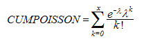

## Pow

The Pow function returns the result of a number raised to a power.

### Syntax:

POW(number, power) 

where,

* number is the base number. It can be any real number.
* power is the exponent to which, the base number is raised.

## POWER

Returns the result of a number raised to a power.

### Syntax

POWER(number, power)

where:

number is the base number. It can be any real number.

power is the exponent to which, the base number is raised.

## PPMT

Returns the payment on the principal for a given period, for an investment based on periodic, constant payments and a constant interest rate.

### Syntax

PPMT(rate, per, nper, pv, fv, type)

where:

rate is the interest rate per period.

per specifies the period and must be in the range of 1 to nper.

nper is the total number of payment periods in an annuity.

pv is the present value— the total amount that a series of future payments is worth now.

fv is the future value or a cash balance that you may want to attain after the last payment is made. When fv is omitted, it is assumed to be 0 (zero), that is, the future value of a loan is 0.

type is the number 0 or 1 and indicates when payments are due. When type equals:

* 0 - Payments are due at the end of the period.
* 1 - Payments are due at the beginning of the period.

### Remarks

* Make sure that you are consistent about the units you use for specifying rate and nper. If you make monthly payments on a four-year loan at 12 percent annual interest, use 12%/12 for rate and 4*12 for nper. If you make annual payments on the same loan, use 12% for rate and 4 for nper.
## PROB

Returns the probability whose values are in a range that is between two limits. If upper_limit is not supplied, returns the probability that values in x_range are equal to lower_limit.

### Syntax

PROB(x_range, prob_range, lower_limit, upper_limit)

where:

x_range is the range of numeric values of x with which, there are associated probabilities.

prob_range is a set of probabilities associated with values in x_range.

lower_limit is the lower bound on the value for which, you want a probability.

upper_limit is the optional upper bound on the value for which, you want a probability.

### Remarks

* Any value in prob_range must be > 0 and < 1.
* When upper_limit is omitted, PROB returns the probability of being equal to lower_limit.
## PRODUCT

Multiplies all the numbers given as arguments and returns the product.

### Syntax

PRODUCT(number1, number2, ...)

where:

number1, number2, ... are numbers that you want to multiply.

## PV

Returns the present value of an investment. The present value is the total amount that a series of future payments is worth now.

### Syntax

PV(rate, nper, pmt, fv, type)

where:

rate is the interest rate per period. For example, if you obtain an automobile loan at a 10% annual interest rate and make monthly payments, your interest rate per month is 10%/12 or 0.83%. You would enter 10%/12 or 0.83% or 0.0083, into the formula as the rate.

nper is the total number of payment periods in an annuity. For example, if you get a four-year car loan and make monthly payments, your loan has 4*12 (or 48) periods. You would enter 48 into the formula for nper.

pmt is the payment made for each period and cannot change over the life of the annuity. Typically, pmt includes principal and interest but, no other fees or taxes. For example, the monthly payments on a $10,000, four-year car loan at 12 percent are $263.33. You have to enter -263.33 into the formula as the pmt. If pmt is omitted, you must include the fv argument.

fv is the future value or a cash balance that you want to attain after the last payment is made. If fv is omitted, it is assumed to be 0 (the future value of a loan, for example, is 0). For example, if you want to save $50,000 to pay for a special project in 18 years, then $50,000 is the future value. You could then make a conservative guess at an interest rate and determine how much you must save each month. If fv is omitted, you must include the pmt argument.

type is the number 0 or 1 and indicates when payments are due. When type equals:

* 0 - Payments are due at the end of the period.
* 1 - Payments are due at the beginning of the period.

### Remarks 

* Make sure that you are consistent about the units you use for specifying rate and nper. If you make monthly payments on a four-year loan at 12 percent annual interest, use 12%/12 for rate and 4*12 for nper. If you make annual payments on the same loan, use 12% for rate and 4 for nper. 
* In annuity functions, the cash you pay out such as a deposit to savings is represented by a negative number; the cash you receive such as a dividend check is represented by a positive number.
* One financial argument is solved for in terms of the others. When rate is not 0, then,

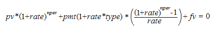

When rate is 0:

(pmt * nper) + pv + fv = 0

## QUARTILE

Returns the quartile of a data set. 

### Syntax

QUARTILE(array, quart)

where:

array is the array or cell range of numeric values for which, you want the quartile value.

quart indicates which, value to return.

When quartile equals:           Value returned:

        0                                Minimum value

        1                                First quartile (25th percentile)

        2                                Median value (50th percentile)

        3                                Third quartile (75th percentile)

        4                                Maximum value

## RADIANS

Converts degrees to radians.

### Syntax

RADIANS(angle)

where:

angle is an angle in degrees that you want to convert.

## RAND

Returns an evenly distributed random number greater than or equal to 0 and less than 1.

### Syntax

RAND( )

## RANK

Returns the rank of a number in a list of numbers. The rank of a number is its size relative to other values in a list. (If you were to sort the list, the rank of the number would be its position.)

### Syntax

RANK(number, ref, order)

where:

number is the number whose rank you want to find.

ref is an array of or a reference to a list of numbers.  

order is a number specifying how to rank numbers.

* When the order is 0 (zero) or omitted, the number is ranked as if ref were a list sorted in descending order. 
* When the order is any nonzero value, the number is ranked as if ref were a list sorted in ascending order. 

### Remark

* RANK gives duplicate numbers of the same rank. However, the presence of duplicate numbers affect the ranks of subsequent numbers.

## RATE

Returns the interest rate per period of an annuity. RATE is calculated by iteration and may not converge to a unique solution. 

### Syntax

RATE(nper, pmt, pv, fv, type, guess)

where:

nper is the total number of payment periods in an annuity.

pmt is the payment made for each period and cannot change over the life of the annuity. Typically, pmt includes  the principal and interest but, no other fees or taxes. If pmt is omitted, you must include the fv argument.

pv is the present value— the total amount that a series of future payments is worth now.

fv is the future value or a cash balance that you want to attain after the last payment is made. If fv is omitted, it is assumed to be 0 (the future value of a loan, for example, is 0).

type is the number 0 or 1 and indicates when payments are due. If type equals:

* 0 - Payments are due at the end of the period.
* 1 - Payments are due at the beginning of the period.

guess is your guess for what the rate is. If you omit guess, it is assumed to be 10 percent. If RATE does not converge, try different values for guess. RATE usually converges if guess is between 0 and 1.

## RIGHT

RIGHT returns the last character or characters in a text string, based on the number of characters you specify.

### Syntax

RIGHT(text, num_chars)

where:

text is the text string containing the characters you want to extract.

num_chars specifies the number of characters you want RIGHT to extract.

### Remarks

* Num_chars must be greater than or equal to zero. 
* When num_chars is greater than the length of text, RIGHT returns all the text. 
* When num_chars is omitted, it is assumed to be 1.

## ROUND

Rounds a number to a specified number of digits.

### Syntax

ROUND(number, num_digits)

where:

number is the number you want to round off.

num_digits specifies the number of digits you want to round off.

### Remarks

* When num_digits > 0, then number is rounded off to the specified number of decimal places. 
* When num_digits = 0, then number is rounded off to the nearest integer. 
* When num_digits  < 0, then number is rounded off to the left of the decimal point.

## ROUNDDOWN

Rounds a number down towards zero.

### Syntax

ROUNDDOWN(number, num_digits)

where:

number is any real number that you want rounded down.

Num_digits is the number of digits to which you want to round a number.

### Remark

* ROUNDDOWN behaves like ROUND, except that it always rounds a number down.

## ROUNDUP

Rounds a number up away from 0 (zero).

### Syntax

ROUNDUP(number, num_digits)

where:

number is any real number that you want rounded up.

num_digits is the number of digits to which you want to round a number.

### Remarks

* ROUNDUP behaves like ROUND, except that it always rounds a number up.

## RSQ

Returns the square of the Pearson product moment correlation coefficient through data points in known_y's and known_x's. 

### Syntax

RSQ(known_y's, known_x's)

where:

known_y's is an array or range of data points.

known_x's is an array or range of data points.

### Remarks

The equation for the Pearson product moment correlation coefficient, r, is:

where:

x-bar and y-bar are the sample means AVERAGE(known_x’s) and AVERAGE(known_y’s).

RSQ returns r2 that is the square of this correlation coefficient.

## SECOND

Returns the seconds of a time value. The second is given as an integer in the range 0 (zero) to 59.

### Syntax

SECOND(serial_number)

where:

serial_number is the time that contains the seconds you want to find. 

### Remarks

* Time values are a portion of a date value and are represented by a decimal number (for example, 12:00 PM is represented as 0.5 because it is half of a day).

## SIGN

Determines the sign of a number. Returns 1 if the number is positive, zero (0) if the number is 0 and -1 if the number is negative.

### Syntax

SIGN(number)

where:

number is any real number.

## SIN

Returns the sine of the given angle.

### Syntax

SIN(number)

where:

number is the angle in radians for which you want the sine.

SINH
Returns the hyperbolic sine of a number.

### Syntax

SINH(number)

where:

number is any real number.

### Remarks

* The formula for the hyperbolic sine is,

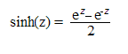

## SinH

The SinH function computes the hyperbolic sine of the argument.

### Syntax:

SinH(value)

where,

* value is to get the sine of the specific value.

## SKEW

Returns the skewness of a distribution. Skewness characterizes the degree of asymmetry of a distribution around its mean. 

### Syntax

SKEW(number1, number2, ...)

where:

number1, number2 ... are arguments for which you want to calculate the skewness. You can also use a single array or a reference to an array instead of arguments separated by commas.

### Remarks

The equation for skewness is defined as:

## SLN

Returns the straight-line depreciation of an asset for one period.

### Syntax

SLN(cost, salvage, life)

where:

cost is the initial cost of the asset.

salvage is the value at the end of the depreciation (sometimes called the salvage value of the asset).

life is the number of periods over-which the asset is depreciated (the useful life of the asset).

## SLOPE

Returns the slope of the linear regression line through data points in known_y's and known_x's. The slope is the rate of change along the regression line.

### Syntax

SLOPE(known_y's, known_x's)

where:

known_y's is an array or cell range of numeric dependent data points.

known_x's is the set of independent data points.

### Remarks

* The equation for the slope of the regression line is:

where:

x-bar and y-bar are the sample means AVERAGE(known_x’s) and AVERAGE(known_y’s).

## SMALL

Returns the k-th smallest value in a data set. 

### Syntax

SMALL(array, k)

where:

array is an array or range of numerical data for which, you want to determine the k-th smallest value.

k is the position (from the smallest) in the array or range of data to return.

## SQRT

Returns a positive square root.

### Syntax

SQRT(number)

where:

number is the number for which you want the square root.

### Remarks

* Number must be >= 0.

## STANDARDIZE

Returns a normalized value from a distribution characterized by mean and standard_dev.

### Syntax

STANDARDIZE(x, mean, standard_dev)

where:

x is the value that you want to normalize.

mean is the arithmetic mean of the distribution.

standard_dev is the standard deviation of the distribution.

### Remarks

* standard_dev must be > 0. 
* The equation for the normalized value is:

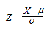

## STDEV

Estimates the standard deviation based on a sample. The standard deviation is a measure of how widely values are dispersed from the average value (the mean).

### Syntax

STDEV(number1, number2, ...)

where:

number1, number2, ... are number arguments corresponding to a sample of a population. 

### Remarks

* STDEV assumes that its arguments are a sample of the population. If your data represents the entire population, then compute the standard deviation using STDEVP.
* STDEV uses the following formula:

where:

x-bar is the sample mean AVERAGE(number1,number2,…).

n is the sample size.

## STDEVA

Estimates standard deviation based on a sample. The standard deviation is a measure of how widely values are dispersed from the average value (the mean). Text and logical values such as True and False are also included in the calculation.

### Syntax

STDEVA(value1, value2 , ...)

where:

value1, value2, ... are values corresponding to a sample of a population. You can also use a single array or a reference to an array instead of arguments separated by commas.

### Remarks

* Arguments that contain True evaluate as 1; arguments that contain text or False evaluate as 0 (zero). 
* STDEVA uses the following formula:

where:

x-bar is the sample mean AVERAGE(value1,value2,…).

n is the sample size.

## STDEVP

Calculates standard deviation based on the entire population given as arguments. 

### Syntax

STDEVP(number1, number2, ...)

where:

number1, number2, ... are 1 to 30 number arguments corresponding to a population. You can also use a single array or a reference to an array instead of arguments separated by commas.

### Remarks

* STDEVP assumes that its arguments are the entire population. If your data represents a sample of the population, then compute the standard deviation using STDEV. 
* STDEVP uses the following formula:

where:

x is the sample mean AVERAGE(number1,number2,…).

n is the sample size.

## STDEVPA

Calculates the standard deviation based on the entire population given as arguments, including text and logical values.

### Syntax

STDEVPA(value1, value2, ...)

where:

value1, value2, ... are values corresponding to a population. You can also use a single array or a reference to an array instead of arguments separated by commas.

### Remarks

* Arguments that contain True evaluate as 1; arguments that contain text or False evaluate as 0 (zero).
* STDEVPA uses the following formula: 

where:

x-bar is the sample mean AVERAGE(value1,value2,…).

n is the sample size.

## STEYX

Returns the standard error of the predicted y-value for each x in the regression. 

### Syntax

STEYX(known_y's, known_x's)

where:

known_y's is an array or range of dependent data points.

known_x's is an array or range of independent data points.

### Remarks

* The equation for the standard error of the predicted y is: 

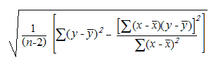

where:

x-bar and y-bar are the sample means AVERAGE(known_x’s) and AVERAGE(known_y’s).

n is the sample size.

## SUBSTITUTE

Substitutes new_text for old_text in a text string. Use SUBSTITUTE when you want to replace specific text in a text string; use REPLACE when you want to replace any text that occurs in a specific location in a text string.

### Syntax

SUBSTITUTE(text, old_text, new_text, instance_num)

where:

Text is the text or the reference to a cell containing text for which you want to substitute characters.

Old_text is the text you want to replace.

New_text is the text you want to replace old_text with.

Instance_num specifies which occurrence of old_text you want to replace with new_text. If you specify instance_num, only that instance of old_text is replaced. Otherwise, every occurrence of old_text in text is changed to new_text.

For example:

The example may be easier to understand when you copy it to a blank worksheet.

<table>
<tr>
<td>
</td><td>
A</td><td>
</td></tr>
<tr>
<td>
1</td><td>
Data</td><td>
</td></tr>
<tr>
<td>
2</td><td>
Sales Data</td><td>
</td></tr>
<tr>
<td>
3</td><td>
Quarter 1, 2008</td><td>
</td></tr>
<tr>
<td>
4</td><td>
Quarter 1, 2011</td><td>
</td></tr>
<tr>
<td>
</td><td>
Formula</td><td>
Description (Result)</td></tr>
<tr>
<td>
</td><td>
=SUBSTITUTE(A2, "Sales", "Cost")</td><td>
Substitutes Cost for Sales (Cost Data)</td></tr>
<tr>
<td>
</td><td>
=SUBSTITUTE(A3, "1", "2", 1)</td><td>
Substitutes first instance of "1" with "2" (Quarter 2, 2008)</td></tr>
<tr>
<td>
</td><td>
=SUBSTITUTE(A4, "1", "2", 3)</td><td>
Substitutes third instance of "1" with "2" (Quarter 1, 2012)</td></tr>
</table>

## Sum

The Sum function adds all numbers in a range of cells and returns the result.

### Syntax:

Sum( number1, number2, ... number_n )

where,

number1 is the first number, number2 is the second and number_n is the nth number to be added together

## SumIf

SumIf function adds the specified range of cells by a given criteria.

### Syntax: 

SumIf( range, criteria, sum_range )

where,

* range is the range of cells you want to apply the criteria against.
* criteria is used to determine the cells that are added.
* sum_range are the cells to sum.

## SUMPRODUCT

Multiplies corresponding components in the given arrays and returns the sum of those products.

### Syntax

SUMPRODUCT(array1, array2, array3, ...)

where:

array1, array2, array3, ... are 2 to 30 arrays whose components you want to multiply and then add.

### Remarks

* The array arguments must have the same dimensions. 
* SUMPRODUCT treats array entries that are not numeric as if they were zeros.

## SUMSQ

Returns the sum of the squares of the arguments.

### Syntax

SUMSQ(number1, number2, ...)

where:

number1, number2, ... are arguments for which you want the sum of the squares. You can also use a single array or a reference to an array instead of arguments separated by commas.

## SumXmY2

The SumXmY2 function calculates the sum of the squares of the differences between the corresponding items in the arrays and returns the sum as results.

### Syntax:

SumXmY2( array1, array2 )

where,

array1 and array are two ranges or arrays.

## SUMX2MY2

Returns the sum of the difference of squares of corresponding values in two arrays.

### Syntax

SUMX2MY2(array_x, array_y)

where:

array_x is the first array or range of values.

array_y is the second array or range of values.

### Remarks

* When an array or reference argument contains text, logical values or empty cells, those values are ignored; however, cells with the value zero are included. 
* The equation for the sum of the difference of squares is:

## SUMX2PY2

Returns the sum of the sum of squares of corresponding values in two arrays. The sum of the sum of squares is a common term in many statistical calculations.

### Syntax

SUMX2PY2(array_x, array_y)

where:

array_x is the first array or range of values.

array_y is the second array or range of values.

### Remarks

* When an array or reference argument contains text, logical values or empty cells, those values are ignored; however, cells with the value zero are included. 
* The equation for the sum of the sum of squares is:

## SYD

Returns the sum-of-years' digits depreciation of an asset for a specified period.

### Syntax

SYD(cost, salvage, life, per)

where:

cost is the initial cost of the asset.

salvage is the value at the end of the depreciation (sometimes called the salvage value of the asset).

life is the number of periods over which, the asset is depreciated (sometimes called the useful life of the asset).

per is the period and must use the same units as life.

### Remarks

* SYD is calculated as follows:

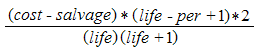

## TAN

Returns the tangent of a number.

### Syntax

TAN(number)

where:

number is the tangent of the angle that you want.

## TANH

Returns the hyperbolic tangent of a number.

### Syntax

TANH(number)

where:

number is any real number.

### Remarks

* The formula for the hyperbolic tangent is:

## TEXT

Converts a value to text in a specific number format.

### Syntax

TEXT(value, format_text)

where:

value is a numeric value, a formula that evaluates to a numeric value or a reference to a cell containing a numeric value.

format_text is a number format in text form in the Category box on the Number tab in the Format Cells dialog box.

## TIME

Returns the decimal number for a particular time.

The decimal number returned by TIME is a value ranging from 0 (zero) to 0.99999999, representing the times from 0:00:00 (12:00:00 A.M.) to 23:59:59 (11:59:59 P.M.).

### Syntax

TIME(hour, minute, second)

where:

hour is a number from 0 (zero) to 23 representing the hour. 

minute is a number from 0 to 59 representing the minute. 

second is a number from 0 to 59 representing the second.

## TIMEVALUE

Returns the decimal number of the time represented by a text string. The decimal number is a value ranging from 0 (zero) to 0.99999999, representing the times from 0:00:00 (12:00:00 A.M.) to 23:59:59 (11:59:59 P.M.).

### Syntax

TIMEVALUE(time_text)

where:

time_text is a text string that represents a time as a formatted string; for example, "6:45 PM" and "18:45" text strings within quotation marks that represent time.

Remarks

Date information in time_text is ignored.

## TODAY

Returns the serial number of the current date. The serial number is the number of days since Jan 1, 1900.

### Syntax

TODAY( )

### Remarks

* Dates are stored as sequential serial numbers so that they can be used in calculations. By default, January 1, 1900 is serial number 1 and January 1, 2008 is serial number 39448 because it is 39,448 days after January 1, 1900. 

## Trim

The Trim function returns a text value with the leading and trailing spaces removed.

### Syntax:

Trim( text )

where,

* text is the text value for which you want to remove the leading and the trailing spaces.

## TRIMMEAN

Returns the mean of the interior of a data set. TRIMMEAN calculates the mean taken by excluding a percentage of data points from the top and bottom tails of a data set.

### Syntax

TRIMMEAN(array, percent)

where:

array is the array or range of values to trim and average.

percent is the fractional number of data points to exclude from the calculation. For example, if percent = 0.2, 4 points are trimmed from a data set of 20 points (20 x 0.2): 2 from the top and 2 from the bottom of the set.

### Remarks

* Percent must be >= 0 and <= 1.
* TRIMMEAN rounds off the number of excluded data points down to the nearest multiple of 2. If percent = 0.1, 10 percent of 30 data points equals 3 points. For symmetry, TRIMMEAN excludes a single value from the top and bottom of the data set.

## True

The True function returns the logical value for True.

### Syntax:

True(stringvalue)

where,

* stringvalue is toprovide an empty string.

## TRUNC

Truncates a number to an integer by removing the fractional part of the number.

### Syntax

TRUNC(number, num_digits)

where:

number is the number you want to truncate.

num_digits is a number specifying the precision of the truncation. The default value for num_digits is 0 (zero).

### Remarks

* TRUNC and INT are similar in that both return integers. TRUNC removes the fractional part of the number. INT rounds numbers down to the nearest integer based on the value of the fractional part of the number. INT and TRUNC are different only when using negative numbers: TRUNC(-4.3) returns -4 but, INT(-4.3) returns -5 because -5 is the lower number.

## Upper

The Upper function converts all characters in a text string to uppercase.

### Syntax:

Upper( text )

where,

* text is the string you want to convert to uppercase.

## Value

The Value function computes the date or a string that contains the number, and converts it into number format.

### Syntax:

Value(range)

where,

* range is the string that contains the date or a number.

## Var

The Var function returns the variance of a population based on sample of numbers.

### Syntax: 

Var( number1, number2, ... number_n )

where,

number1, number2, ... number_n are the sample numbers. 30 numbers can be entered.

## VarA

The VarA function returns the variance of a population based on a sample of numbers, text, and logical values (ie: TRUE or FALSE). 

### Syntax: 

VarA( value1, value2, ... value_n )

where,

value1, value2, ... value_n are the sample values. They can be numbers, text, and logical values. Values that are TRUE are evaluated as 1. Values that are FALSE or text values are evaluated as 0. 30 values can be entered.

## VarP

The VarP function returns population variance of the listed values.

### Syntax:

VarP(listofvalues)

where,

* listofvalues provides the range or values that contain the population.

## VARPA

Calculates variance based on the entire population. In addition to numbers and text, logical values such as True and False are also included in the calculation.

### Syntax

VARPA(value1, value2, ...)

value1, value2, ... are arguments corresponding to a population.

Remarks

* VARPA assumes that its arguments are the entire population. If your data represents a sample of the population, you must compute the variance using VARA. 
* Arguments that contain True evaluate as 1; arguments that contain text or False evaluate as 0 (zero). If the calculation does not include text or logical values, use the VARP worksheet function instead. 
* The equation for VARPA is:

where:

x is the sample mean AVERAGE(value1, value2, …).

n is the sample size.

## VDB

Returns the depreciation of an asset for any period you specify, including partial periods, using the double-declining balance method or some other method you specify. VDB stands for variable declining balance.

### Syntax

VDB(cost, salvage, life, start_period, end_period, factor, no_switch)

where:

cost is the initial cost of the asset.

salvage is the value at the end of the depreciation (sometimes called the salvage value of the asset).

life is the number of periods over which, the asset is depreciated (sometimes called the useful life of the asset).

start_period is the starting period for which, you want to calculate the depreciation. start_period must use the same units as life.

end_period is the ending period for which, you want to calculate the depreciation. end_period must use the same units as life.

factor is the rate at which, the balance declines. If factor is omitted, it is assumed to be 2 (the double-declining balance method). 

no_switch is a logical value specifying whether to switch to straight-line depreciation when depreciation is greater than the declining balance calculation.

* When no_switch is True, straight-line depreciation is not used even when the depreciation is greater than the declining balance calculation. 
* When no_switch is False or omitted, straight-line depreciation is used when depreciation is greater than the declining balance calculation.

All arguments except no_switch must be positive numbers.

## VLOOKUP

Searches for a value in the left most column of a table and then returns a value in the same row from a column you specify in the table. Use VLOOKUP instead of HLOOKUP when your comparison values are located in a column to the left of the data you want to find.

The V in VLOOKUP stands for "Vertical."

### Syntax

VLOOKUP(lookup_value, table_array, col_index_num, range_lookup)

where:

lookup_value is the value to be found in the first column of the array. Lookup_value can be a value, a reference or a text string.

table_array is the table of information in which, data is looked up. Use a reference to a range or a range name.

* When range_lookup is True, the values in the first column of the table_array must be placed in ascending order: ..., -2, -1, 0, 1, 2, ..., A-Z, False, True; otherwise VLOOKUP may not give the correct value. If range_lookup is False, table_array does not need to be sorted.
* The values in the first column of the table_array can be text, numbers or logical values.
* Uppercase and lowercase text are equivalent.

col_index_num is the column number in the table_array from which, the matching value must be returned. A col_index_num of 1 returns the value in the first column of the table_array; a col_index_num of 2 returns the value in the second column of the table_array, and so on.

range_lookup is a logical value that specifies whether you want VLOOKUP to find an exact match or an approximate match. If True or omitted, an approximate match is returned. In other words, if an exact match is not found, the next largest value that is less than the lookup_value is returned. 

### Remarks

* When VLOOKUP can't find a lookup_value and the range_lookup is True, it uses the largest value that is less than or equal to the lookup_value.

## WEEKDAY

Returns the day of the week corresponding to a date. The day is given as an integer, ranging from 1 (Sunday) to 7 (Saturday) by default.

### Syntax

WEEKDAY(serial_number,return_type)

where:

serial_number is a sequential number that represents the date of the day you are trying to find. Dates should be entered by using the DATE function or as results of other formulas or functions. For example, use DATE(2008,5,23) for the 23rd day of May 2008. 

return_type is a number that determines the type of return value.

When Return_type is:                 Number returned:

        1 or omitted                  Numbers 1 (Sunday) through 7 (Saturday).

        2                                  Numbers 1 (Monday) through 7 (Sunday).

        3                                  Numbers 0 (Monday) through 6 (Sunday).

Remarks

* Dates are stored as sequential serial numbers so that they can be used in calculations. By default, January 1, 1900 is serial number 1 and January 1, 2008 is serial number 39448 because it is 39,448 days after January 1, 1900 
## Weibull

The Weibull function  returns the Weibull distribution. This distribution is used in reliability analysis, such as calculating a device's mean time to failure.

### Syntax:

WEIBULL(x,alpha,beta,cumulative)

where,

* X     is the value at which the function is evaluated.
* Alpha is a parameter to the distribution.
* Beta is a parameter to the distribution.
* Cumulative determines the form of the function.

### Remarks

* When x, alpha, or beta is nonnumeric, WEIBULL returns the #VALUE! error value.
* When x < 0, WEIBULL returns the #NUM! error value.
* When alpha ≤ 0 or if beta ≤ 0, WEIBULL returns the #NUM! error value.

## Xirr

The Xirr function computes the internal rate of return for a schedule of possibly non-periodic cash flows.

### Syntax: 

Xirr(cashflow, datelist, value)

where,

* cashflow is the range of cash flow.
* datelist is the list of corresponding date serial number values.
* value is an initial guess at the return value.

## YEAR

Returns the year corresponding to a date. The year is returned as an integer in the range 1900-9999.

### Syntax

YEAR(serial_number)

where:

serial_number is the date of the year you want to find. Dates should be entered by using the DATE function or as results of other formulas or functions. For example, use DATE(2002,11,12) for the 12th day of November 2002. 

### Remarks

* Dates are stored as sequential serial numbers so that they can be used in calculations. By default, January 1, 1900 is serial number 1 and January 1, 2008 is serial number 39448 because it is 39,448 days after January 1, 1900.

## ZTEST

Returns the one-tailed probability-value of a z-test. 

### Syntax

ZTEST(array, u0, sigma)

where:

array is the array or range of data against which, to test u0

u0 is the value to test.

sigma is the population (known) standard deviation. If omitted, the sample standard deviation is used.

Remarks

* ZTEST is calculated as follows when sigma is not omitted: 

or when sigma is omitted:

where:

x is the sample mean AVERAGE(array); s is the sample standard deviation STDEV(array).

n is the number of observations in the sample COUNT(array).

