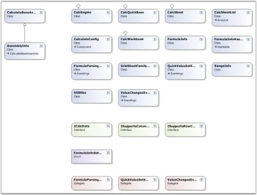
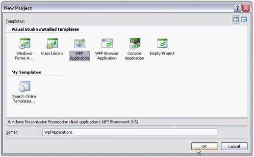
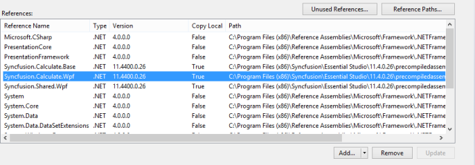
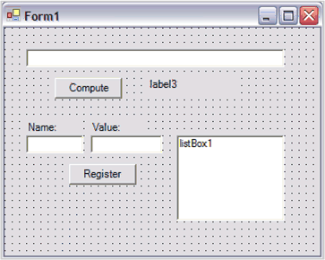
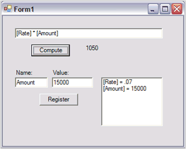
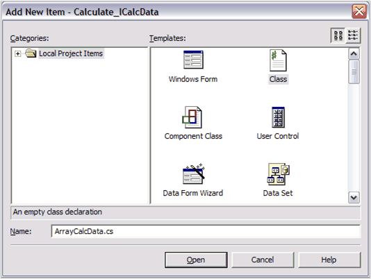
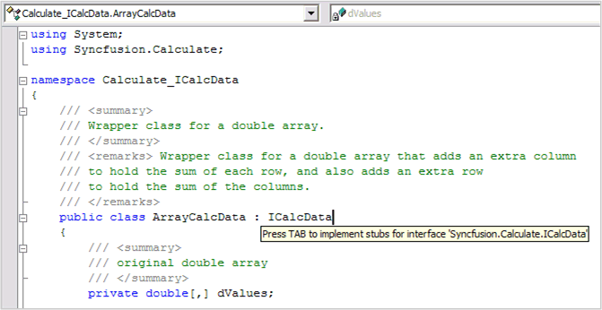
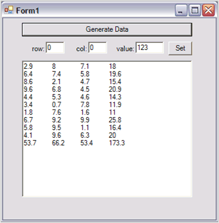

# Getting Started

This section covers information on the following topics.

## Class Diagram

The following illustration shows the Class Diagram for Essential Calculate.

Class Diagram for Essential Calculate
{:.caption}

## Create Platform Application

This section illustrates the step-by-step procedure to create the following platform applications.

### WPF Application

1. Open Microsoft Visual Studio. Go to File menu and click New Project. In the New Project dialog box, select WPF Application template, name the project and click OK. 

New Project Dialog Box
{:.caption}

A new WPF application is created.

2. Open the main form of the application in the designer.

3. Add the Syncfusion controls to your VS.NET toolbox if you haven't done so already [This is done automatically when you install Essential Studio].

4. Now you need to deploy Essential Calculate into this WPF application. Refer WPF topic for detailed information.

For more information refer to the following topic. 

## Deploy Essential Calculate in WPF Application

We have now created a platform application in the previous topic (Creating Platform Application). 

This section guides you to deploy Essential Calculate in those applications under the following topics:

* WPF-Step-by-step procedure to deploy Calculate in a WPF application.

Now, you have created a WPF application (refer Creating Platform Application). This section illustrates how to deploy Essential Calculate into this WPF application.

Deploying Essential Calculate in a WPF Application

The following steps guide you to deploy Essential Calculate:

1. Go to Solution Explorer of the application you have created-> right-click Reference folder and then click Add References. 
2. Add the below mentioned assemblies as references in the application:
   I. Syncfusion.Core.dll
   II. Syncfusion.Compression.Base.dll
   III. Syncfusion.Calculate.Base.dll

   N> There is no toolbox support for Calculate in WPF application.

3.Then create a CalculateEngine. The CalcQuickBase class is used to create a CalculateEngine.

           

				// Create a new CalculateQuickBase. This object represents the CalculateEngine.

				CalcQuickBase cq = new CalcQuickBase();

				' Create a new CalculateQuickBase. This object represents the CalculateEngine.

				Dim cq As CalcQuickBase

				cq = New CalcQuickBase()
				
			

4.Use the ParseAndCompute method to perform calculations by using the CalculateEngine.

   

				// Perform calculations by using Essential Calculate.

				string formula = "if(20>10,\"BIG\",\"Small\")";

				string value = cq.ParseAndCompute(formula);

				' Perform calculations by using Essential Calculate.

				Dim formula As String = "if(20>10,""BIG"",""Small"")"

				Dim value As String = cq.ParseAndCompute(formula)

      

5.You can alsomodify the default behavior of the CalculateEngine by using the Engine property. 

         

         The default format of appending quotation marks to the concatenated string can be eliminated by using the following code.

         

					// Strings concatenated by using the ampersand operator is returned without quotation marks.

					cq.Engine.UseNoAmpersandQuotes = true;

					' Strings concatenated by using the ampersand operator is returned without quotation marks.

					cq.Engine.UseNoAmpersandQuotes = True

   
					
N> Engine is a class that is defined as a "property" in Essential Calculate.

Essential Calculate is now deployed in your WPF application.

## Feature Summary

The features of Essential Calculate are as follows.

* Essential Calculate comes with a function library of more than 400 entries and supports cross sheet references.
* It can be used in conjunction with Essential XlsIO to fully load, manipulate and compute Excel spreadsheets without depending on Excel.
* Essential Calculate does not depend on Microsoft Excel and thus enables you to perform calculations independent of Excel.
* You can add extensive calculation support to your own business objects. 
* Easily set up forms that have calculation dependencies among various controls.
* With Essential Calculate, you can set properties that indicates that you want formula dependencies to be tracked so that the values are automatically updated when a dependent value changes. Or you can turn off the overhead of tracking dependencies and have formulas calculated from scratch when you need a particular formula value.
* Essential Calculate can be used in manual mode or automatic mode.
* The manual mode works when you explicitly request for a value. At that point, the calculation is done from scratch to obtain the computed value. So, if your formula depends on several other values in the form, and when you request the computed value, the other values are retrieved and used to compute the requested formula.
* In automatic mode, Essential Calculate maintains a dependency list. Hence, when a value is changed, any formula that depends on it, is recalculated at that particular point. When you request for a formula value, the formula value is not computed from scratch; instead it is retrieved from where Essential Calculate stores computed values.

## Quick Start

This section shows you how easy it is to get started using Essential Calculate. It gives you a basic introduction to the concepts you need to know before getting started with the product and some tips and ideas on how to use Essential Calculate in your projects.

### Console Application Using CalcQuickBase

In this section, you can learn how to use the CalcQuickBase object to perform arbitrary calculations from a Console Application. This shows you the minimal steps that are required to use Essential Calculate to add calculation support to an application. This quick application lets you type algebraic expressions using a Console.ReadLine and display the calculated results using a Console.WriteLine.

### WPF Application Using CalcQuickBase

In this section, you can create a WPF Application that uses a CalcQuickBase object that handles arbitrary variables in its calculations.

### Adding Calculation Support to an Arbitrary Array with an ICalcData Interface

This section demonstrates how to add calculation support to an arbitrary array of doubles by adding an additional row and column to hold summary information.

### Simple Console Application Using CalcQuickBase

In this section, you can create a Console Application that requests a string from the user. The application requires the string to be an algebraic expression like: 4.1 + 3.21 or SQRT(2) * 14.2 or (3 + Sqrt(2)) / ( 2 - Cos(2.1)) 

Once you enter an expression, the application uses a CalcQuick object to perform the requested calculation and displays it to the Console. The process continues until you enter an empty string. The step-by-step procedure to create a simple console application is discussed under the following topic:

#### Console Application CalcQuickBase

The step-by-step procedure to create a simple console application is as follows:

1. From Visual Studio, use File | New | Project to create a new Console Application named CalcQuickBaseTutorial. After creating the project, open the References node in the Solution Explorer and add a reference to Syncfusion.Calculate.Base. At this point, your Solution Explorer window should appear similar to this one.

   

   Application Display
   {:.caption}

2. In the Main method, add the code to create a CalcQuickBase object. Also add the code to loop through the process of retrieving a string and using CalcQuickBase.ParseAndCompute to perform the calculation that is represented by the string. Given below is the code that handles these tasks.
   

   
 

							using System;

							using Syncfusion.Calculate;

							namespace CalcQuickBaseTutorial

							{

									/// 

									/// Summary description for Class1.

									/// 

									class Class1

									{

											/// 

											/// The main entry point for the application.

											/// 

											[STAThread]

											static void Main(string[] args)

											{

													CalcQuickBase cq = new CalcQuickBase();

													string s;

													while( (s = Console.ReadLine()) != "" )

													{

															string val = cq.ParseAndCompute(s);

															Console.WriteLine("value= " + val);

															// Blank line

															Console.WriteLine(""); 

													}

											}

									}

							}
							
   
   
   
  
   
							

							Imports System

							Imports Syncfusion.Calculate

							Namespace CalcQuickBaseTutorial

								Class Class1

									Public Overloads Shared Sub Main()

										Dim cq As New CalcQuickBase

										Dim s As String = Console.ReadLine()

										Do While s <> ""

											Dim val As String = cq.ParseAndCompute(s)

											Console.WriteLine(("value= " + val))

											Console.WriteLine("") 

											' Blank line

											s = Console.ReadLine()

										Loop

									' Main 

									End Sub 

								' Class1

								End Class 

							' CalcQuickBaseTutorial

							End Namespace 
							
				

							

3.Once the code is entered, run the application by pressing F5. Then enter an expression such as 1+2 and press Enter. Enter additional algebraic combinations of constants and named functions from the Function Library like Sin, Cos, Sum and Pi. Press Enter without entering anything to terminate the program. Below is a typical display of this.

   

   

### WPF Application Using Variables and CalcQuickBase

In this section, you can learn how to create a WPF Application that allows you to register variables with a CalcQuick object and then use these variables in algebraic expressions. For example, you might register a variable named Rate to be 0.07 and a variable named Amount to be 1500, and then compute a quantity represented by the formula Rate * Amount or by (1 + Rate) * Amount.

#### WPF CalcQuickBase

1. In Visual Studio, use File | New | Project to create a new WPF Application. Right-click the References in Solution Explorer and add a reference to Syncfusion.Calculate.Base.

    

     Essential Calculate Reference Being Added to the Project
	 {:.caption}

2. Using the designer, drop three text boxes, three labels, two buttons and one list box onto the form as shown in the picture below.

    

    Form Showing Controls
	{:.caption}

3.Double-click the form in the designer to add a Form.Load event handler. Add the code which, is shown below to the project.

   

						using Syncfusion.Calculate;

						//...

						private CalcQuickBase cq;

						private void Form1_Load(object sender, System.EventArgs e)

						{

								cq = new CalcQuickBase();

								this.button1.Click += new EventHandler(button1_Click);

								this.button2.Click += new EventHandler(button2_Click);

						}

						private void button1_Click(object sender, EventArgs e)

						{

								// Compute

								this.label3.Text = 

														this.cq.ParseAndCompute(this.textBox1.Text);

						}

						private void button2_Click(object sender, EventArgs e)

						{

								// Register name.

								string key = this.textBox2.Text;

								if(key.Length > 0)

								{

									   // The value.

										this.cq[key] = this.textBox3.Text; 

										// Just display it in the list box.

										this.listBox1.Items.Add(string.Format("[{0}] = {1}", 

												key, this.textBox3.Text));

								}

						}

   
   
   
   
   

						Imports Syncfusion.Calculate

						'...

						Dim cq As CalcQuickBase

						Private Sub Form1_Load(ByVal sender As Object, ByVal e As System.EventArgs)

							cq = New CalcQuickBase

							AddHandler Me.button1.Click, AddressOf button1_Click

							AddHandler Me.button2.Click, AddressOf button2_Click

						' Form1_Load

						End Sub 

						Private Sub button1_Click(ByVal sender As Object, ByVal e As EventArgs)

							' Compute

							Me.label3.Text = Me.cq.ParseAndCompute(Me.textBox1.Text)

						' Button1_Click

						End Sub 

						Private Sub button2_Click(ByVal sender As Object, ByVal e As EventArgs)

							' Register name.

							Dim key As String = Me.textBox2.Text

							If key.Length > 0 Then

								' The value.

								Me.cq(key) = Me.textBox3.Text 

								' Just display it in the list box.

								Me.listBox1.Items.Add(String.Format("[{0}] = {1}", key, Me.textBox3.Text))

							End If

						' Button2_Click

						End Sub 
						
		

4.Run the sample by pressing F5. Then in the Name text box, enter Rate and in the Value text box, enter .07. Now press the Register button. Similarly, enter Amount in the Name text box, 15000 in the Value text box followed by pressing the Register button.

     

     Form Showing Two Variables Registered and a Sample Calculation
	 {:.caption}

5.In the top text box, which is empty, enter the formula:  [Rate] * [Amount]. Press the Compute button. You can then see a screen similar to the one below.

    The computed product, 1050, is displayed next to the Compute button.

     By examining the code, notice that you register a name with a CalcQuickBase object by using its name as an indexer on the CalcQuickBase object and assign the desired value to this indexed object. Then to use the name within a formula, you enclose it within square brackets.

	
	
### Add Calculation Support to an Array Using ICalcData

For rectangular business objects, implementing an ICalcData interface lets you use values from your object in calculations. This section illustrates the process of adding calculation support to an Array.

#### ICalcData

1. In Visual Studio, use File | New | Project to create a new WPF Application. Right-click the References in Solution Explorer and add a reference to Syncfusion.Calculate.Base.

   

   Essential Calculate Reference Being Added to the Project
   {:.caption}

2. As you drop the controls on the form, accept the default names so that you can copy and paste the code snippets later in this lesson. 
3. The form has two buttons: the first is the Generate Data button and the second is the Set button. Drop a text box on the form and set its MultiLine property to True so that you can size it to occupy most of the form.  
4. Drop the final three text boxes in left to right order under the Generate Data button, adding three labels to identify these text boxes.

     

     Form with Controls Positioned
	 {:.caption}

    You now have your basic form. Before leaving this form in the designer, double click both buttons to add the button handler code stubs to your Form1 code. You can add the code to these stubs later.

    In order to add arbitrary calculation support to an object, that object must implement the ICalcData interface. In this sample, you may want to add calculation support to a double array. To do so, you must create a wrapper class that accepts a double object in its constructor and then returns these double values in its indexer. In addition you can extend the wrapper class by adding an additional row that holds the sum of the column values in the double array and by adding an addition column that holds the sum of the row values in the double array.

    The first step is to add the class. To do so, right-click your project in the Solution Explorer window, select Add, and select Add Class.

     

     Adding a Class File to Your Project
	 {:.caption}

5. In the dialog that appears, name the class as ArrayCalcData.cs (or ArrayCalcData.vb depending upon the language you are using).

     

     Naming the Class File
	 {:.caption}
	 

6. After adding the class, Visual Studio displays the class implementation file whose contents are shown below. In the next few steps, you must add the code to this class to create the functionality you need.

   ~~~ cs

			using System;

			namespace Calculate_ICalcData

			{

					/// 

					/// Summary description for ArrayCalcData.

					/// 

					public class ArrayCalcData

					{

							public ArrayCalcData()

							{

									//

									// TODO: Add constructor logic here.

									//

							}

					}

			}

   ~~~
   {:.prettyprint}

			Imports System 

			Namespace Calculate_ICalcData 

					''' 
 

					''' Summary description for ArrayCalcData. 

					''' 
 

					Public Class ArrayCalcData

						Public Sub New()

							' 

							' TODO: Add constructor logic here. 

							' 

						End Sub

					End Class

			End Namespace

7. You need to add fields to hold the double array, the extra row and extra column. Additionally, you can add fields to hold the row and column counts for convenience. Here is the code.

   ~~~ cs

			using System;

			using Syncfusion.Calculate;

			namespace Calculate_ICalcData

			{

					public class ArrayCalcData 

					{

							/// 

							/// Original double array.

							/// 

							private double[,] dValues;

							/// 

							/// Vector holding the sum of the rows.

							/// 

							/// <remarks>

							/// Serves as the last column.

							/// </remarks>

							private object[] rowSums;

							/// 

							/// Vector holding the sum of the columns.

							/// 

							/// <remarks>

							/// Serves as the last row.

							/// </remarks>

							private object[] colSums;

							int rowCount;

							int colCount;

							//...

					}

			}

   ~~~
   {:.prettyprint}

			Imports System 

			Imports Syncfusion.Calculate

			Public Class ArrayCalcData

				'/ 

				'/ Original double array.

				'/ 

				Private dValues(,) As Double

				'/ 

				'/ Vector holding the sum of the rows.

				'/ 

				'/ <remarks>

				'/ Serves as the last column.

				'/ </remarks>

				Private rowSums() As Object

				'/ 

				'/ Vector holding the sum of the columns.

				'/ 

				'/ <remarks>

				'/ Serves as the last row.

				'/ </remarks>

				Private colSums() As Object

				Dim rowCount As Integer

				Dim colCount As Integer
				End Class

8. Here you are making a constructor that accepts a double array as an argument. In the constructor code, you must save the reference that is to be the passed in a double array, initialize two RowCount and ColCount fields and allocate the two additional arrays that are needed to hold the added sums you want. 

   If you notice, you are actually populating these added arrays with formula strings such as "=Sum(A5:D5)". While using Essential Calculate with an ICalcData interface, Essential Calculate uses Excel-like notation to refer to the cells in a rectangular collection. A1 is the first cell in the first row, B1 is second cell in the first row, and so on. So, "=Sum(A5:D5)" sums columns 1 through 4 in row 5. The method RangeInfo.GetAlphaLabel used in the code, converts a numerical value like 1, 2, or 3, into the proper column letter A, B, or C.

   ~~~ cs

				/// 

				/// Wraps the double array with an extra row and column that holds calculated sums.

				/// 

				/// <param name="dValues"></param>

				public ArrayCalcData(double[,] dValues)

				{

						this.dValues = dValues;

						rowCount = dValues.GetLength(0);

						colCount = dValues.GetLength(1);

						rowSums = new object[rowCount + 1];

						colSums = new object[colCount + 1];

						// Initializes the formulas for the row sums.

						// eg. "=Sum(A5:D5)"  to sum row 5

						for(int row = 0; row <= rowCount; ++row)

						{

								rowSums[row] = string.Format("=Sum(A{1}:{0}{1})", 

										RangeInfo.GetAlphaLabel(colCount), row + 1);

						}

						// Initializes the formulas for the column sums.

						// eg. "=Sum(B1:B5)"  to sum column 2

						for(int col = 0; col <= colCount; ++col)

						{

								colSums[col] = string.Format("=Sum({0}1:{0}{1})", 

										RangeInfo.GetAlphaLabel(col + 1), rowCount);

						}

				}

   ~~~
   {:.prettyprint}

				'/ 

				'/ Wraps the double array with an extra row and column that holds calculated sums.

				'/ 

				'/ <param name="dValues"></param>

				Public Sub New(ByVal dValues(,) As Double)

						Me.dValues = dValues

						rowCount = dValues.GetLength(0)

						colCount = dValues.GetLength(1)

						rowSums = New Object(rowCount + 1) {}

						colSums = New Object(colCount + 1) {}

						' Initializes the formulas for the row sums.

						' eg. "=Sum(A5:D5)"  to sum row 5

							  Dim row As Integer

						 Dim row As Integer

						For row = 0 To rowCount - 1

							rowSums(row) = String.Format("=Sum(A{1}:{0}{1})", _ 

										RangeInfo.GetAlphaLabel(colCount - 1), row + 1)

						Next

						' Initializes the formulas for the column sums.

						' eg. "=Sum(B1:B5)"  to sum column 2

						Dim col As Integer

						For col = 0 To colCount - 1

							colSums(col) = String.Format("=Sum({0}1:{0}{1})", _ 

								 RangeInfo.GetAlphaLabel((col + 1)), rowCount - 1)

						Next

				' New

				End Sub 

9. Now you can add the code stubs for implementing the ICalcData interface. For the implementation, you only need to add the code to the first two methods in the interface. WireParentObject is not used in our code. ValueChanged is an event that you can raise in the SetValueRowCol implementation.

   

    Implementing the ICalcData Interface in C#
	
	{:.caption}
	
	

     Using Visual Studio 2003 with C#, add a colon after the class name in the class declaration and type ICalcData. Pressing the tab key adds the method stubs. Given below is a picture showing this technique.

     If you are using VB.NET, then you can add the ICalcData stubs using the drop-down lists at the top of the edit window in Visual Studio. In the left drop-down, select the ICalcData interface as shown below.

   

    implementing the ICalcData Interface in VB, Choosing the Interface
	{:.caption}

     Then, in the right drop-down, click each of the four items listed to add the proper code stubs.

   

    Implementing the ICalcData Interface in VB, Adding the Members
	{:.caption}

     After doing these steps, you can see these methods in the class code. (In the C# code, the region may be collapsed.)

				public object GetValueRowCol(int row, int col)

				{

						// TODO:  Add ArrayCalcData1.GetValueRowCol implementation.

						return null;

				}

				public void SetValueRowCol(object value, int row, int col)

				{

						// TODO:  Add ArrayCalcData1.SetValueRowCol implementation.

				}

				public event Syncfusion.Calculate.ValueChangedEventHandler ValueChanged;

				public void WireParentObject()

				{

					 // TODO:  Add ArrayCalcData1.WireParentObject implementation.   

				}

				Public Function GetValueRowCol(ByVal row As Integer, ByVal col As Integer) _

								As Object Implements Syncfusion.Calculate.ICalcData.GetValueRowCol

				End Function

				Public Sub SetValueRowCol(ByVal value As Object, ByVal row As Integer, ByVal _

								col As Integer) Implements Syncfusion.Calculate.ICalcData.SetValueRowCol

				End Sub

				Public Sub WireParentObject() Implements Syncfusion.Calculate.ICalcData.WireParentObject

				End Sub

				Public Event ValueChanged(ByVal sender As Object, ByVal e As _

				Syncfusion.Calculate.ValueChangedEventArgs) Implements _ 

										Syncfusion.Calculate.ICalcData.ValueChanged

10. GetValueRowCol should return the value for a given row and column index. The indexes are one-based by convention. Here is the code that you must use. If the last column is requested, the value in the colSums array is returned. If the last row is requested, the value in the rowSums array is returned. Otherwise, the value in the double array is returned.

    ~~~ cs

				/// 

				/// Gets the value into either the double array or column vector or row vector.

				/// 

				/// <param name="row">One-based row index.</param>

				/// <param name="col">One-based column index.</param>

				/// <returns>The value.</returns>

				/// <remarks> By convention, ICalcData uses one-based indexes.</remarks>

				public object GetValueRowCol(int row, int col)

				{

						if(row-1 == rowCount)

						{

								return colSums[col-1];

						}

						else if(col-1 == colCount)

						{

								return rowSums[row-1];

						}

						else

								return this.dValues[row-1, col-1];

				}

    ~~~
    {:.prettyprint}

				'/ 

				'/ Gets the value into either the double array or column vector or row vector.

				'/ 

				'/ <param name="row">One-based row index.</param>

				'/ <param name="col">One-based column index.</param>

				'/ <returns>The value.</returns>

				'/ <remarks> By convention, ICalcData uses one-based indexes.</remarks>

				Public Function GetValueRowCol(ByVal row As Integer, ByVal col As Integer) _

							   As Object Implements Syncfusion.Calculate.ICalcData.GetValueRowCol

						If row = rowCount Then

							Return colSums((col - 1))

						Else

							If col = colCount Then

								Return rowSums((row - 1))

							Else

								Return Me.dValues(row - 1, col - 1)

							End If

						End If

				' GetValueRowCol

				End Function 

11. SetValueRowCol is used to set the value at a specified row and column index. You can also use it to raise the ValueChanged event. The CalcEngine listens to this event to trigger calculations as values are entered initially and later modified. It is this event that brings calculation support into the object. 

    Here is the code you must use. The code is the reverse process of the GetValueRowCol method. At the end of the method, the ValueChanged event is raised.

    ~~~ cs

				/// 

				/// Sets the value into either the double array or column vector or row vector.

				/// 

				/// <param name="row">One-based row index.</param>

				/// <param name="col">One-based column index.</param>

				/// <param name="value">The value to be set.</param>

				/// <remarks> This setter raises the ICalcData.ValueChanged event which, 

				/// is listened to by the CalcEngine to manage the calculations.

				/// 

				/// By convention, ICalcData uses one-based indexes.

				/// </remarks>

				public void SetValueRowCol(object value, int row, int col)

				{

						if(row-1 == rowCount)

						{

								colSums[col-1] = value;

						}

						else if(col-1 == colCount)

						{

								rowSums[row-1] = value;

						}

						else

								this.dValues[row-1, col-1] = double.Parse(value.ToString());

						ValueChangedEventArgs e1 = new ValueChangedEventArgs(row, col, value.ToString());

						ValueChanged(this, e1);

				}

    ~~~
    {:.prettyprint}

				'/ 

					'/ Sets the value into either the double array or column vector or row vector.

					'/ 

					'/ <param name="row">One-based row index.</param>

					'/ <param name="col">One-based column index.</param>

					'/ <param name="value">The value to be set.</param>

					'/ <remarks> This setter raises the ICalcData.ValueChanged event which, 

					'/ is listened to by the CalcEngine to manage the calculations.

					'/ 

					'/ By convention, ICalcData uses one-based indexes.

					'/ </remarks>

					Public Sub SetValueRowCol(ByVal value As Object, ByVal row As Integer, _

										   ByVal col As Integer) Implements                _ 

										   Syncfusion.Calculate.ICalcData.SetValueRowCol

						If row = rowCount Then

							colSums(col - 1) = value

						Else

							If col = colCount Then

								rowSums(row - 1) = value

							Else

								Me.dValues(row - 1, col - 1) = Double.Parse(value.ToString())

							End If

						End If

						Dim e1 As New ValueChangedEventArgs(row, col, value.ToString())

						RaiseEvent ValueChanged(Me, e1)

				' SetValueRowCol

				End Sub 

12. You have to add an indexer definition to the class for two reasons: it is a straight-forward way to force the user to go though the GetValueRowCol and SetValueRowCol methods, allowing the CalcEngine to monitor these changes. It also makes your ArrayCalcData class look like an array.

     Here is the code you must use. It is just a Get and Set implementation that goes through the ICalcData interface methods.

				/// 

				/// Gets / sets the value of this ArrayCalcData object.

				/// 

				/// <remarks>

				/// Since this class wraps a double array, the indexing is zero-based but,

				/// the ICalcData methods requires one-based indexing by convention. So, 

				/// one is added to the indexes when the ICalcData methods are called.

				/// </remarks>

				public object this[int row, int col]

				{

						get{return GetValueRowCol(row + 1, col + 1);}

						set{SetValueRowCol(value, row + 1, col + 1);}

				}

						'/ 

						'/ Gets / sets the value of this ArrayCalcData object.

						'/ 

						'/ <remarks>

						'/ Since this class wraps a double array, the indexing is zero-based but, 

						'/ the ICalcData methods requires one-based indexing by convention. So, 

						'/ one is added to the indexes when the ICalcData methods are called.

						'/ </remarks>

						Default Public Property Item(ByVal row As Integer, ByVal col As Integer) As Object

								Get

									Return GetValueRowCol(row + 1, col + 1)

								End Get

								Set(ByVal Value As Object)

									SetValueRowCol(Value, row + 1, col + 1)

								End Set

						End Property

13. Generate Data button handler creates a random double array and populate it with random double values. It also creates an instance of an ArrayCalcData class to wrap the double array that it creates. It then creates a CalcEngine object that uses this ArrayCalcData object as its datasource. The ShowObject method just displays the values from your ArrayCalcData object in the multiline text box that you added to the form. 

     The engine.UseDependencies property tells the CalcEngine that you want it to track dependencies so the value automatically recalculates when dependent values change. The engine.RecalculateRange call allows the CalcEngine to traverse all the data and set up the necessary dependencies to do the calculations.

     Here is the code.+--+       

    ~~~ cs

				using Syncfusion.Calculate;

				//. . . 

				private Random r = new Random();

				private ArrayCalcData data;

				int nRows;

				int nCols;

				/// 

				/// Populates the double array.

				/// 

				/// <param name="sender"></param>

				/// <param name="e"></param>

				private void button1_Click(object sender, System.EventArgs e)

				{

						// Creates some sample data.

						this.nRows = r.Next(10) + 2;

						this.nCols = r.Next(3) + 1;

						double[,] a = new double[nRows,nCols];

						for(int row = 0; row < nRows; ++ row)

								for(int col = 0; col < nCols; ++col)

										a[row, col] = ((double)r.Next(100)) / 10;

						// Creates an ArrayCalcData object and passes it in this array.

						this.data = new ArrayCalcData(a);

						// Creates a CalcEngine object using this ArrayCalcData object.

						CalcEngine engine = new CalcEngine(this.data);

						// Turns on dependency tracking so that values set with the Set button take effect immediately.

						engine.UseDependencies = true;

						// Calls RecalculateRange so any formulas in the data can be initially computed.

						engine.RecalculateRange(RangeInfo.Cells(1, 1, nRows + 1, nCols + 1), data); 

						ShowObject();

				}

				/// 

				/// Displays the ArrayCalcData values in a text box.

				/// 

				private void ShowObject()

				{

						this.textBox1.Text = "";

						for(int i = 0; i <= this.nRows; ++i)

						{

								for(int j = 0; j <= this.nCols; ++j)

								{

										this.textBox1.Text += this.data[i, j].ToString() + "\t";

								}

								this.textBox1.Text += "\r\n";

						}

				}

    ~~~
    {:.prettyprint}

				Imports Syncfusion.Calculate

				'...

				Private r As New Random

				Private data As ArrayCalcData

				Dim nRows As Integer

				Dim nCols As Integer

				'/ 

				'/ Populates the double array.

				'/ 

				'/ <param name="sender"></param>

				'/ <param name="e"></param>

				Private Sub button1_Click(ByVal sender As Object, ByVal e As System.EventArgs) _

															  Handles Button1.Click

						' Creates some sample data.

						Me.nRows = r.Next(10) + 2

						Me.nCols = r.Next(3) + 1

						Dim a(nRows, nCols) As Double

						Dim row As Integer

						For row = 0 To nRows - 1

							Dim col As Integer

							For col = 0 To nCols - 1

								a(row, col) = CDbl(r.Next(100)) / 10

							Next

						Next

						'Creates an ArrayCalcData object and passes it in this array.

						Me.data = New ArrayCalcData(a)

						' Creates a CalcEngine object using this ArrayCalcData object.

						Dim engine As New CalcEngine(Me.data)

						' Turns on dependency tracking so that values set with the Set button take effect immediately.

						engine.UseDependencies = True

						' Calls the RecalculateRange so any formulas in the data can be initially computed.

						engine.RecalculateRange(RangeInfo.Cells(1, 1, nRows + 1, nCols + 1), data)

						ShowObject()

				' Button1_Click

				End Sub 

				'/ 

				'/ Displays the ArrayCalcData values in a text box.

				'/ 

				Private Sub ShowObject()

						Me.TextBox1.Text = ""

						Dim i As Integer

						For i = 0 To Me.nRows

							Dim j As Integer

							For j = 0 To Me.nCols

								Me.TextBox1.Text += Me.data(i, j).ToString() + ControlChars.Tab

							Next

							Me.TextBox1.Text += ControlChars.Cr + ControlChars.Lf

						Next

				' ShowObject

				End Sub 

    Here is a typical display that you might see if you run the application at this point. Recall that the data is random so you may see fewer or more rows and columns. The column on the right is the sum of the columns that precedes it in the same row. The row at the bottom is the sum of the columns above it. You can click the Generate Data button several times to see different data.

    

     Sample Display Showing Double Array, SumColumn and SumRow
	 {:.caption}

14. The Set button allows you to set a particular value in the displayed data so you can see the effect of changing this value on the calculations in the last row and last column. Recall that your data store is mimicking an array of doubles, so it indexes from zero even though the ICalcData interface expects one-based indexing. The implementation code takes this into account. 

					/// 

					/// Populates a single entry in the ArrayCalcData object.

					/// 

					/// <param name="sender"></param>

					/// <param name="e"></param>

					private void button2_Click(object sender, System.EventArgs e)

					{

							if (this.nRows == 0)

							{

									MessageBox.Show("Generate data first.");

									return;

							}

							int row = int.Parse(this.textBox2.Text);

							int col = int.Parse(this.textBox3.Text);

							string val = this.textBox4.Text;

							this.data[row, col] = val;

							ShowObject();

					}

				'/ 

				'/ Populates a single entry in the ArrayCalcData object.

				'/ 

				'/ <param name="sender"></param>

				'/ <param name="e"></param>

				Private Sub button2_Click(ByVal sender As Object, ByVal e As System.EventArgs) _

																   Handles Button2.Click

						If Me.nRows = 0 Then

							MessageBox.Show("Generate data first.")

							Return

						End If

						Dim row As Integer = Integer.Parse(Me.textBox2.Text)

						Dim col As Integer = Integer.Parse(Me.textBox3.Text)

						Dim val As String = Me.textBox4.Text

						Me.data(row, col) = val

						ShowObject()

				' Button2_Click

				End Sub 

    Here is the code you must use. It allows you to specify the row, column and value. Note there is no error checking code shown here, so enter only values that make sense for the displayed data.

    On the previous screen, if you click the Set button, it places 123 in cell 0,0. Notice the calculations update automatically to reflect the new value.

    

    Sample Display After Setting 123 into Array Element (0, 0)
	{:.caption}
