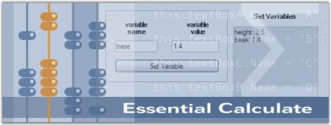

# Overview

Essential Calculate is a 100% Native .NET library that provides calculation functionality by using the Microsoft .NET framework, so that it can be used in any .NET environment, including C#, VB.NET and managed C++. Essential Calculate is a UI independent class library that lets you add formula calculation support to Window Forms, Web Forms and WPF applications. Essential Calculate does not depend on Microsoft Excel and thus allows you to perform calculations independent of Excel. 

The range of calculations include simple algebraic expressions such as (1.2^3-1)/8, to formulas using intrinsic functions like 4 * sqrt(exp(8.4)), to formulas relying on variables that are defined through controls on a form such as cos([textBox1] * pi()/180), to spreadsheet-like formulas such as Sum(A2:B14). Essential Calculate lets you parse and compute such expressions, and includes a library of more than 400 functions. This function library is easily extendable. The data used in the calculations can be from any source, ranging from fixed values to values that are entered through the controls, to data tables and Excel spreadsheets.

Essential Calculate allows you to add extensive calculation support to your business objects. It enables to easily setup forms that have calculation dependencies among various controls.

_Essential Calculate_

## Key Features

Important features of Essential Calculate are listed as follows.

* Extensive calculation support can be added to your own business objects 
* Easily set up forms that have calculation dependencies among various controls.
* Essential Calculate comes with a function library of more than 400 entries and supports cross sheet references.
* It can be used in conjunction with Essential XlsIO, to fully load, manipulate and compute Excel spreadsheets without depending on Excel.
* Essential Calculate does not depend upon Microsoft Excel and thus enables you to perform calculations independent of Excel.

## User Guide Organization

The product comes with numerous samples as well as an extensive documentation to guide you. This User Guide provides detailed information on the features and functionalities of Essential Calculate. It is organized into the following sections:

* Overview-This section gives a brief introduction to our product and its key features.
* Installation and Deployment-This section elaborates on the install location of the samples, license, and so on.
* Getting Started-This section guides you on getting started with various platform applications and deploying Essential Calculate into those applications.
* Concepts and Features-The features of Essential Calculate are illustrated with use case scenarios, code examples and screen shots under this section.
* Frequently Asked Questions-This section illustrates the solutions for various task-based queries about Essential Calculate.

## Document Conventions

The following conventions help you quickly identify the important sections of information while using the content.

_Document Conventions_

<table>
<tr>
<th>
Convention</th><th>
Description</th></tr>
<tr>
<td>
Note</td><td>
Represents important information.</td></tr>
<tr>
<td>
Example</td><td>
Represents an example.</td></tr>
<tr>
<td>
Tip</td><td>
Represents useful hints that helps you in using the controls/features.</td></tr>
<tr>
<td>
Additional Information</td><td>
Represents additional information on the topic.</td></tr>
</table>

