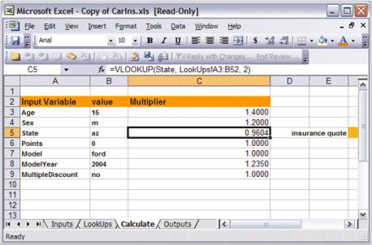

# Working with an Excel Spreadsheet

You can use the Microsoft Excel to design spreadsheets that can be used on systems where MS Excel is not installed. This can be done by using a combination of Essential XlsIO and Essential Calculate, where the former can be used to read and write the spreadsheet and later to actually do the computation as values in the spreadsheet are modified. 

## Example

To illustrate this process, consider a sample project, Essential Studio\xx.x.x.xx\WPF\Calculation.Wpf\Samples\2.0\XlsFileUsingExcelRW. 

N> This requires you to have Essential XlsIO installed in addition to Essential Calculate. MS Excel is not required.

The spreadsheet you are using is a car insurance calculator. It uses Names to manage variable values and has the following four sheets.

* Inputs-Contains the input values for the car insurance calculations like the state, age, and so on.
* LookUps-Contains data that determine insurance rates. For example, each state has a weight assigned to it; each age has a weight assigned to it, and so on.
* Calculate-Does the actual calculations. Based on the input values from the input sheet, formulas in this sheet, look up appropriate weights from the LookUps sheet, and compute the car insurance cost depending upon these weights.
* Outputs-Contains the computed results obtained from the Calculate sheet.

This layout represents a general calculation design process which you can use for batch processing of information. The idea is that you change the inputs (all on a single sheet) and then return the outputs (all from a single sheet). There may be a web service or a server application that allows clients to upload inputs and then download outputs. Or it could just be a batch processing calculation engine. Using this technique, you can use Excel to design complex calculations and then have a simple application that runs on systems without Excel, to input new values and retrieve computed results.

For example, consider the below form which accepts input values from the user. Once the values are set, the user clicks a button on the form that puts these values into the inputs sheet and then retrieves the insurance costs from the Outputs sheet and displays it on the form.

Before learning about the actual code used in this sample to access XLS files, you need to know about a couple of classes in Essential Calculate as well as the role that Essential XlsIO plays.

## CalcSheet and CalcWorkbook Classes

In the Adding Calculation Support section, you would have learnt how to support referencing multiple ICalcData objects in a workbook fashion. The technique used there relies on registering each ICalcData object directly with a single instance of the CalcEngine. Different ICalcData objects are managed by tying together in a Tab Control as the Tab Pages. To support a general workbook structure where there are no support objects like Tab Pages and Tab Controls to provide the links, the Essential Calculate library includes two classes: CalcSheet and CalcWorkbook.

* The CalcSheet class is an ICalcData derived object that plays the role of a single worksheet. 
* It does have the optional facility to hold row/column type data objects that can be set through indexing an instance of the class. 
* This class allocates storage to hold such data. 
* The CalcWorkbookclass is a collection of CalcSheets. 
* You can use these classes to manage the support for working with Excel spreadsheets.

For more detailed information on these classes, check out the class reference.

## Using Essential XlsIO

Essential XIsIO gives you an Excel-like Automation-type support without having MS Excel installed on the host system. This means that you can use this library to read and write an XLS file and hold its contents in memory. 

Limitation-You cannot perform actual computations on the contents of the XLS file. Essential Calculate adds this ability. 

A sample which illustrates the usage of Essential XlsIO with Essential Calculate is available in the following sample installation location:

_<Install Location>\WPF\Calculate.Wpf\Samples\2.0\Xls File Using CalcEngine Demo\cs_ 

In this sample, the following two classes are used: 

* ExcelRWCalcSheet which is derived from CalcSheet and implements Syncfusion.XlsIO.IWorksheet 
* ExcelRWWorkbook which is derived from CalcWorkbook and implements Syncfusion.XlsIO.IWorkbook. 

These classes uses XlsIO library through the supported interfaces to populate a CalcWorkbook object from an XLS file. In addition, the derived classes use overrides to get and set the data through the XlsIO objects that holds the XLS data, instead of relying on the internal data storage that is available in CalcSheet. This gives us the ability to change values in the CalcWorkbook object and view the newly computed results. So, when you want to use an XLS file in your business objects and modify the values or get new calculated results, you can add these two classes to your project and utilize the support immediately in the same manner as this sample.

