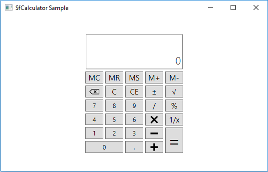
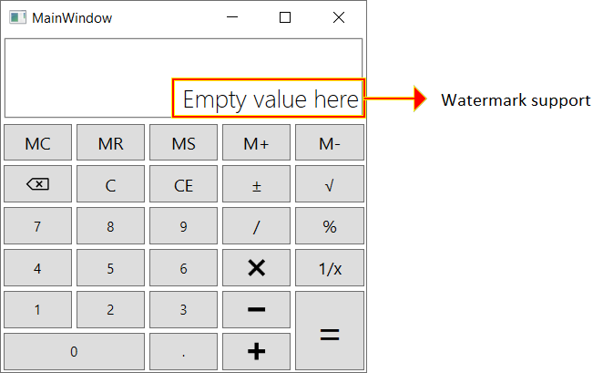
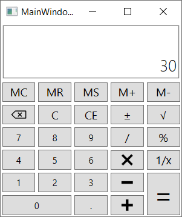

# Getting Started with SfCalculator
This section provides a quick overview for working with the [SfCalculator](https://help.syncfusion.com/cr/wpf/Syncfusion.Windows.Controls.Input.SfCalculator.html).

## Assembly deployment
Refer to the [control dependencies](https://help.syncfusion.com/wpf/control-dependencies#sfcalculator) section to get the list of assemblies or NuGet package that needs to be added as a reference to use the [SfCalculator](https://help.syncfusion.com/cr/wpf/Syncfusion.Windows.Controls.Input.SfCalculator.html) control in any application.

You can find more details about installing the NuGet package in a WPF application in the following link:
[How to install nuget packages](https://help.syncfusion.com/wpf/visual-studio-integration/nuget-packages#installing-nuget-packages)

## Creating Application with SfCalculator control
In this walk through, user will create a WPF application that contains [SfCalculator](https://help.syncfusion.com/cr/wpf/Syncfusion.Windows.Controls.Input.SfCalculator.html) control.
1. [Creating project](#Creating-the-project)
2. [Adding control via designer](#Adding-control-via-designer)
3. [Adding control manually in XAML](#Adding-control-manually-in-XAML)
4. [Adding control manually in C#](#Adding-control-manually-in-C#)

## Creating project
Below section provides detailed information to create new project in Visual Studio to display [SfCalculator](https://help.syncfusion.com/cr/wpf/Syncfusion.Windows.Controls.Input.SfCalculator.html) control. The required [assemblies](https://help.syncfusion.com/wpf/control-dependencies#sfcalculator) will be added automatically.

## Add control via designer

The [SfCalculator](https://help.syncfusion.com/cr/wpf/Syncfusion.Windows.Controls.Input.SfCalculator.html) control can be added to an application by dragging it from the toolbox to a designer view. The following assembly references are added automatically:

## Add control manually in XAML

In order to add [SfCalculator](https://help.syncfusion.com/cr/wpf/Syncfusion.Windows.Controls.Input.SfCalculator.html) control manually in XAML, do the below steps,

1. Add the below required assembly references to the project,

   * Syncfusion.SfInput.WPF
   * Syncfusion.Shared.WPF

2. Import Syncfusion WPF schema **http://schemas.syncfusion.com/wpf** in XAML page.

3. Declare [SfCalculator](https://help.syncfusion.com/cr/wpf/Syncfusion.Windows.Controls.Input.SfCalculator.html) in XAML page.



<Window xmlns="http://schemas.microsoft.com/winfx/2006/xaml/presentation"
        xmlns:x="http://schemas.microsoft.com/winfx/2006/xaml"
        xmlns:syncfusion="http://schemas.syncfusion.com/wpf" 
        x:Class="SfCalculatorSample.MainWindow"
        Title="SfCalculator Sample" Height="350" Width="525">
    <Grid>
        <syncfusion:SfCalculator x:Name="sfCalculator" HorizontalAlignment="Center" VerticalAlignment="Center" Width="100"/>
    </Grid>
</Window>



## Add control manually in C#

In order to add [SfCalculator](https://help.syncfusion.com/cr/wpf/Syncfusion.Windows.Controls.Input.SfCalculator.html) control manually in C#, do the below steps,

1. Add the below required assembly references to the project,

    * Syncfusion.SfInput.WPF
    * Syncfusion.Shared.WPF

2. Import SfCalculator namespace **Syncfusion.Windows.Controls.Input**.

3. Create SfCalculator control instance and add it to the window.



using Syncfusion.Windows.Controls.Input;
namespace SfCalculatorSample
{
    /// 

    /// Interaction logic for MainWindow.xaml
    /// 

    public partial class MainWindow : Window
    {
        public MainWindow()
        {
            InitializeComponent();
            //Creating an instance of SfCalculator control
            SfCalculator sfCalculator = new SfCalculator();
            //Adding SfCalculator as window content
            this.Content = sfCalculator;
        }
    }
}



## Setting watermark
You can set watermark for [SfCalculator](https://help.syncfusion.com/cr/wpf/Syncfusion.Windows.Controls.Input.SfCalculator.html) control using [DefaultText](https://help.syncfusion.com/cr/wpf/Syncfusion.Windows.Controls.Input.SfCalculator.html#Syncfusion_Windows_Controls_Input_SfCalculator_DisplayText) property.




<syncfusion:SfCalculator HorizontalAlignment="Stretch" DisplayText="Empty value here"  />




SfCalculator sfCalculator = new SfCalculator()
{
    HorizontalAlignment = HorizontalAlignment.Stretch,
    DisplayText = "Empty value here"
};




## Setting value 

You can set the value to be displayed on the [SfCalculator](https://help.syncfusion.com/cr/wpf/Syncfusion.Windows.Controls.Input.SfCalculator.html) control using [DefaultValue](https://help.syncfusion.com/cr/wpf/Syncfusion.Windows.Controls.Input.SfCalculator.html#Syncfusion_Windows_Controls_Input_SfCalculator_DefaultValue) property.

N> The [Value](https://help.syncfusion.com/cr/wpf/Syncfusion.Windows.Controls.Input.SfCalculator.html#Syncfusion_Windows_Controls_Input_SfCalculator_Value) property of [SfCalculator](https://help.syncfusion.com/cr/wpf/Syncfusion.Windows.Controls.Input.SfCalculator.html) is **Read-only** which will allow you to get the value calculated from last expression and will be in decimal format.




<syncfusion:SfCalculator HorizontalAlignment="Stretch"  DefaultValue="30"  />




sfCalculator.DefaultValue = 30;




