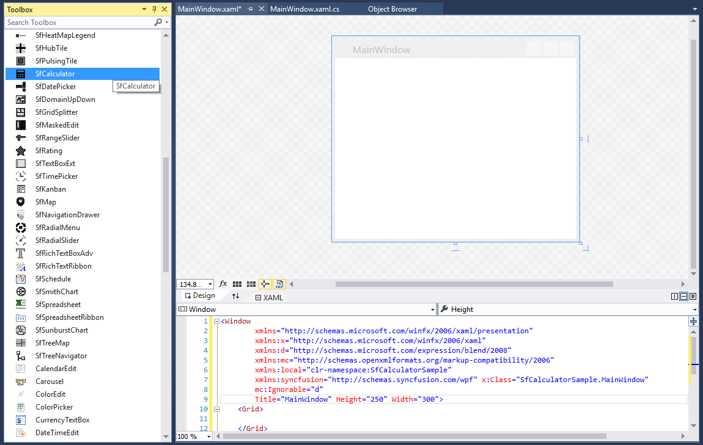
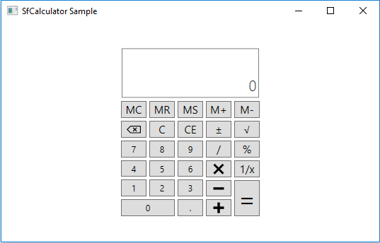
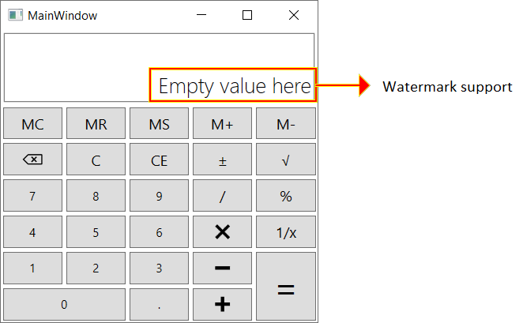
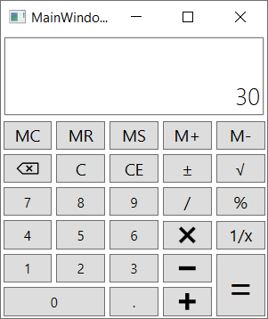

# Getting Started with WPF Calculator
This section provides a quick overview for working with the [WPF Calculator](https://www.syncfusion.com/wpf-controls/calculator).

## Assembly deployment
Refer to the [control dependencies](https://help.syncfusion.com/wpf/control-dependencies#sfcalculator) section to get the list of assemblies or NuGet packages that need to be added as a reference to use the [WPF Calculator](https://help.syncfusion.com/cr/wpf/Syncfusion.Windows.Controls.Input.SfCalculator.html) control in any application.

You can find more details about installing the NuGet package in a WPF application in the following link:
[How to install nuget packages](https://help.syncfusion.com/wpf/installation/install-nuget-packages#installing-nuget-packages)

## Creating Application with WPF Calculator control
In this walkthrough, you will create a WPF application that contains the [WPF Calculator](https://help.syncfusion.com/cr/wpf/Syncfusion.Windows.Controls.Input.SfCalculator.html) control.
1. [Creating project](#creating-project)
2. [Add control via designer](#add-control-via-designer)
3. [Add control manually in XAML](#add-control-manually-in-xaml)
4. [Add control manually in C#](#add-control-manually-in-c#)

## Creating project
The section below provides detailed information on how to create a new WPF project in Visual Studio to host the [WPF Calculator](https://help.syncfusion.com/cr/wpf/Syncfusion.Windows.Controls.Input.SfCalculator.html) control.

## Add control via designer

The [WPF Calculator](https://help.syncfusion.com/cr/wpf/Syncfusion.Windows.Controls.Input.SfCalculator.html) control can be added to an application by dragging it from the toolbox to the designer view.

## Add control manually in XAML

In order to add the [WPF Calculator](https://help.syncfusion.com/cr/wpf/Syncfusion.Windows.Controls.Input.SfCalculator.html) control manually in XAML, do the below steps,

1. Add the below required assembly references to the project,

   * Syncfusion.SfInput.WPF
   * Syncfusion.Shared.WPF

2. Import Syncfusion® WPF schema **http://schemas.syncfusion.com/wpf** in XAML page.

3. Declare [WPF Calculator](https://help.syncfusion.com/cr/wpf/Syncfusion.Windows.Controls.Input.SfCalculator.html) in XAML page.




<Window xmlns="http://schemas.microsoft.com/winfx/2006/xaml/presentation"
        xmlns:x="http://schemas.microsoft.com/winfx/2006/xaml"
        xmlns:syncfusion="http://schemas.syncfusion.com/wpf" 
        x:Class="SfCalculatorSample.MainWindow"
        Title="SfCalculator Sample" Height="350" Width="525">
    <Grid>
        <syncfusion:SfCalculator x:Name="sfCalculator" HorizontalAlignment="Center" VerticalAlignment="Center" Width="100"/>
    </Grid>
</Window>



{{ codesnippet1 | OrderList_Indent_Level_1 }}

## Add control manually in C#

In order to add the [WPF Calculator](https://help.syncfusion.com/cr/wpf/Syncfusion.Windows.Controls.Input.SfCalculator.html) control manually in C#, do the steps below.

1. Add the following required assembly references to the project:

    * Syncfusion.SfInput.WPF
    * Syncfusion.Shared.WPF

2. Import the WPF Calculator namespace **Syncfusion.Windows.Controls.Input**.

3. Create an WPF Calculator control instance and add it to the window.




using Syncfusion.Windows.Controls.Input;
namespace SfCalculatorSample
{
    /// 

    /// Interaction logic for MainWindow.xaml
    /// 

    public partial class MainWindow : Window
    {
        public MainWindow()
        {
            InitializeComponent();
            //Creating an instance of SfCalculator control
            SfCalculator sfCalculator = new SfCalculator();
            //Adding SfCalculator as window content
            this.Content = sfCalculator;
        }
    }
}



{{ codesnippet2 | OrderList_Indent_Level_1 }}

## Setting watermark
You can set a watermark for the [WPF Calculator](https://help.syncfusion.com/cr/wpf/Syncfusion.Windows.Controls.Input.SfCalculator.html) control using the [DisplayText](https://help.syncfusion.com/cr/wpf/Syncfusion.Windows.Controls.Input.SfCalculator.html#Syncfusion_Windows_Controls_Input_SfCalculator_DisplayText) property. The default value of `DisplayText` is an empty string.




<syncfusion:SfCalculator HorizontalAlignment="Stretch" DisplayText="Empty value here" />




SfCalculator sfCalculator = new SfCalculator()
{
    HorizontalAlignment = HorizontalAlignment.Stretch,
    DisplayText = "Empty value here"
};




## Setting value 

You can set the initial value displayed in the [WPF Calculator](https://help.syncfusion.com/cr/wpf/Syncfusion.Windows.Controls.Input.SfCalculator.html) control using the [DefaultValue](https://help.syncfusion.com/cr/wpf/Syncfusion.Windows.Controls.Input.SfCalculator.html#Syncfusion_Windows_Controls_Input_SfCalculator_DefaultValue) property. The default value of `DefaultValue` is `0`.

N> The [Value](https://help.syncfusion.com/cr/wpf/Syncfusion.Windows.Controls.Input.SfCalculator.html#Syncfusion_Windows_Controls_Input_SfCalculator_Value) property of [WPF Calculator](https://help.syncfusion.com/cr/wpf/Syncfusion.Windows.Controls.Input.SfCalculator.html) is **Read-only**; it returns the value calculated from the last expression as a `decimal`.




<syncfusion:SfCalculator HorizontalAlignment="Stretch" DefaultValue="30" />




sfCalculator.DefaultValue = 30;




## Theme

The WPF Calculator supports various built-in themes. Refer to the links below to apply themes,

  * [Apply theme using SfSkinManager](https://help.syncfusion.com/wpf/themes/skin-manager)
	
  * [Create a custom theme using ThemeStudio](https://help.syncfusion.com/wpf/themes/theme-studio#creating-custom-theme)

  