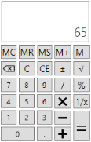

# About Syncfusion® WPF Calculator Control

The [WPF Calculator](https://help.syncfusion.com/cr/wpf/Syncfusion.Windows.Controls.Input.SfCalculator.html) control allows you to perform mathematical operations as you would with a standard calculator. It supports basic arithmetic operations, memory operations, configurable display text and value, and built-in theming.

## Key features 

* **Value** - The `Value` property retrieves the current value calculated by the WPF Calculator. This is a **Read-Only** property of type `decimal`. The default value is `0`.
* **Memory** - The `Memory` property retrieves the value stored in memory. This is a **Read-Only** property of type `decimal`. The default value is `0`. See [Memory](memory) for details on memory operations.
* **DefaultValue** - The `DefaultValue` property sets the initial value shown in the value TextBox. The default value is `0`.
* **DisplayText** - The `DisplayText` property shows a watermark in the value TextBox when no value is entered. The default value is an empty string.
* **Operators** - Supports standard arithmetic operators (+, −, ×, ÷), percent (%), sign change (±), square root (√), and backspace.
* **Memory operations** - Supports `MS`, `MR`, `M+`, `M-`, and `MC` memory keys. See [Memory](memory).
* **Theming** - Supports various built-in themes. See the [Theme](getting-started#theme) section.

> Starting with Syncfusion® version 16.2 (2018 Vol 2), the `Syncfusion.Licensing.dll` is added as a reference for all Syncfusion WPF controls. Refer to the [licensing help topic](https://help.syncfusion.com/common/essential-studio/licensing/license-key) for more information.