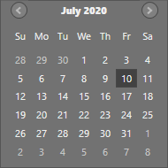

# Appearance in WPF CalendarEdit

This section explains different styling, theming options available in [CalendarEdit](https://help.syncfusion.com/cr/wpf/Syncfusion.Shared.Wpf~Syncfusion.Windows.Shared.CalendarEdit.html) control.

## Setting the foreground

You can change the default foreground, mouse hover foreground and border brush of the `CalendarEdit` by using the `Foreground`, `MouseOverForeground` and `MouseOverBorderBrush` properties. The default value of `Foreground` is `Dark SlateGray` and `MouseOverForeground` is `Black`.




<syncfusion:CalendarEdit Foreground="Blue"
                         MouseOverForeground="Red"
                         MouseOverBorderBrush="DarkGoldenrod"
                         Name="calendarEdit" />




calendarEdit.Foreground = Brushes.Blue;
calendarEdit.MouseOverForeground = Brushes.Red;
calendarEdit.MouseOverBorderBrush = Brushes.DarkGoldenrod;




N> [View Sample in GitHub](https://github.com/SyncfusionExamples/syncfusin-wpf-calendar-examples/tree/master/Samples/Appearance)

## Setting the background

You can change the default background and mouse hover background color of the `CalendarEdit` by using the `Background` and `MouseOverBackground` properties. The default value of `Background` is `White` and `MouseOverBackground` is `Lavender`.




<syncfusion:CalendarEdit Background="Pink"
                         MouseOverBackground="Green"
                         Name="calendarEdit" />




calendarEdit.Background = Brushes.Pink;
calendarEdit.MouseOverBackground = Brushes.Green;




N> [View Sample in GitHub](https://github.com/SyncfusionExamples/syncfusin-wpf-calendar-examples/tree/master/Samples/Appearance)

## Change flow direction

You can change the flow direction of the `CalendarEdit` layout from right to left by setting the `FlowDirection` property value as `RightToLeft`. The default value of `FlowDirection` property is `LeftToRight`.




<syncfusion:CalendarEdit FlowDirection="RightToLeft"
                         Name="calendarEdit" />




calendarEdit.FlowDirection = FlowDirection.RightToLeft;




N> [View Sample in GitHub](https://github.com/SyncfusionExamples/syncfusin-wpf-calendar-examples/tree/master/Samples/Appearance)

## Theme

You can customize the appearance of the `CalendarEdit` control by using the [SfSkinManager.SetVisualStyle](https://help.syncfusion.com/cr/cref_files/wpf/Syncfusion.SfSkinmanager.Wpf~Syncfusion.SfSkinmanager.SfSkinmanager~SetVisualStyle.html) method. The following are the various built-in visual styles for `CalendarEdit` control.

* Blend
* Lime
* MaterialDark
* MaterialDarkBlue
* MaterialLight
* MaterialLightBlue
* Metro
* Office2010Black
* Office2010Blue
* Office2010Silver
* Office2013DarkGray
* Office2013LightGray
* Office2013White
* Office2016Colorful
* Office2016DarkGray
* Office2016White
* Office2019Black
* Office2019Colorful
* Office365
* Saffron
* VisualStudio2013
* VisualStudio2015




//Namespace for the SfSkinManager.
using Syncfusion.SfSkinManager;

CalendarEdit calendarEdit = new CalendarEdit();
SfSkinManager.SetVisualStyle(calendarEdit, VisualStyles.Blend);




Here, the `Blend` style is applied to the `CalendarEdit`.

N> [View Sample in GitHub](https://github.com/SyncfusionExamples/syncfusin-wpf-calendar-examples/tree/master/Samples/Themes)
