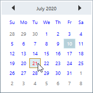
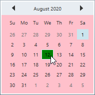
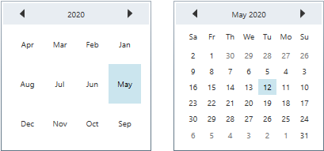

# Appearance in WPF Calendar (CalendarEdit)

This section explains different styling, theming options available in [CalendarEdit](https://help.syncfusion.com/cr/wpf/Syncfusion.Windows.Shared.CalendarEdit.html) control.

## Setting the foreground

You can change the default foreground, mouse hover foreground and border brush of the `CalendarEdit` by using the `Foreground`, `MouseOverForeground` and `MouseOverBorderBrush` properties. The default value of `Foreground` is `Dark SlateGray` and `MouseOverForeground` is `Black`.




<syncfusion:CalendarEdit Foreground="Blue"
                         MouseOverForeground="Red"
                         MouseOverBorderBrush="DarkGoldenrod"
                         Name="calendarEdit" />




calendarEdit.Foreground = Brushes.Blue;
calendarEdit.MouseOverForeground = Brushes.Red;
calendarEdit.MouseOverBorderBrush = Brushes.DarkGoldenrod;




N> [View Sample in GitHub](https://github.com/SyncfusionExamples/syncfusin-wpf-calendar-examples/tree/master/Samples/Appearance)

## Setting the background

You can change the default background and mouse hover background color of the `CalendarEdit` by using the `Background` and `MouseOverBackground` properties. The default value of `Background` is `White` and `MouseOverBackground` is `Lavender`.




<syncfusion:CalendarEdit Background="Pink"
                         MouseOverBackground="Green"
                         Name="calendarEdit" />




calendarEdit.Background = Brushes.Pink;
calendarEdit.MouseOverBackground = Brushes.Green;




N> [View Sample in GitHub](https://github.com/SyncfusionExamples/syncfusin-wpf-calendar-examples/tree/master/Samples/Appearance)

## Change flow direction

You can change the flow direction of the `CalendarEdit` layout from right to left by setting the `FlowDirection` property value as `RightToLeft`. The default value of `FlowDirection` property is `LeftToRight`.




<syncfusion:CalendarEdit FlowDirection="RightToLeft"
                         Name="calendarEdit" />




calendarEdit.FlowDirection = FlowDirection.RightToLeft;




N> [View Sample in GitHub](https://github.com/SyncfusionExamples/syncfusin-wpf-calendar-examples/tree/master/Samples/Appearance)

## Theme

CalendarEdit supports various built-in themes. Refer to the below links to apply themes for the CalendarEdit,

  * [Apply theme using SfSkinManager](https://help.syncfusion.com/wpf/themes/skin-manager)
	
  * [Create a custom theme using ThemeStudio](https://help.syncfusion.com/wpf/themes/theme-studio#creating-custom-theme)

 
