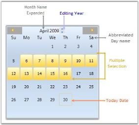

# WPF CalendarEdit Overview

The [CalendarEdit](https://help.syncfusion.com/cr/wpf/Syncfusion.Windows.Shared.CalendarEdit.html) control provides implementation of DateTime values in a calendar form. It therefore supports full range of dates allowed by that object. Effectively, any date ranging from year 0 to year 9999 A.D. can be displayed. It displays a calendar through where you can navigate to any day in a selected year. Its template can be easily modified just like any other WPF control. It is added with in-built animation to navigate between months.

## Control structure

## Features

* `CalendarEdit` supports different Culture Types.

* Different built-in skins are available to give a good look and feel to the control.

* It has options to change the direction of month while navigation.

* The appearance of the header and selection border can be customized using different brushes.

* You can select more than one “Date” value at a time.

* Display area of Calendar control is limited using abbreviated days and months.

* A ToolTip can be set to the required date, or by row and column.

