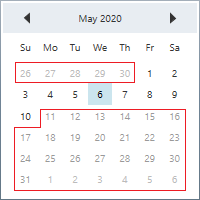
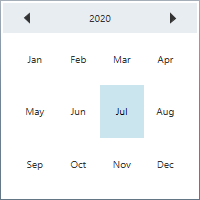
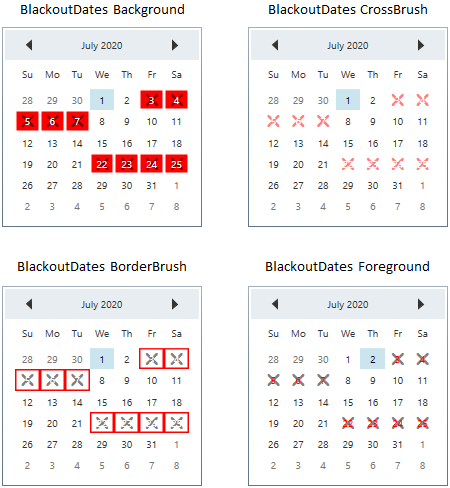
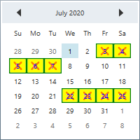
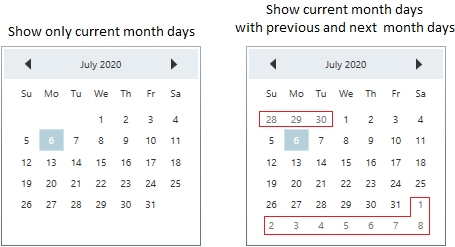
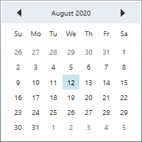

# Restrict Date Selection in WPF Calendar (CalendarEdit)

This section explains how to restrict a date within a particular range by using [CalendarEdit](https://help.syncfusion.com/cr/wpf/Syncfusion.Windows.Shared.CalendarEdit.html) control.

## Restrict date selection within minimum and maximum date

You can restrict the users from selecting a date within the particular range by specifying [MinDate](https://help.syncfusion.com/cr/wpf/Syncfusion.Windows.Shared.CalendarEdit.html#Syncfusion_Windows_Shared_CalendarEdit_MinDate) and [MaxDate](https://help.syncfusion.com/cr/wpf/Syncfusion.Windows.Shared.CalendarEdit.html#Syncfusion_Windows_Shared_CalendarEdit_MaxDate) in `CalendarEdit` control.




<!--Setting date range -->
<syncfusion:CalendarEdit MinDate="05/1/2020" 
                         MaxDate="05/10/2020"
                         Name="calendarEdit"/>




CalendarEdit calendarEdit = new CalendarEdit();
calendarEdit.MinDate = new DateTime(2020, 05, 01);
calendarEdit.MaxDate = new DateTime(2020, 05, 10);




N> The `MaxDate` should be greater than `MinDate` of the `CalendarEdit`. If the `MinDate` property is greater than the new `MaxDate`, then the `MinDate` will be reset to the `MaxDate`.

N> [View Sample in GitHub](https://github.com/SyncfusionExamples/syncfusin-wpf-calendar-examples/tree/master/Samples/Restrict-Date)

### Show disabled dates 

If you want to show the disabled dates which are not within the range of minimum and maximum date limits, use the [MinMaxHidden](https://help.syncfusion.com/cr/wpf/Syncfusion.Windows.Shared.CalendarEdit.html#Syncfusion_Windows_Shared_CalendarEdit_MinMaxHidden) property value as `false`. The default value of `MinMaxHidden` property is `true`. 




<syncfusion:CalendarEdit MinMaxHidden="False"
                         MinDate="05/1/2020" 
                         MaxDate="05/10/2020"
                         Name="calendarEdit"/>




CalendarEdit calendarEdit = new CalendarEdit();
calendarEdit.MinDate = new DateTime(2020, 05, 01);
calendarEdit.MaxDate = new DateTime(2020, 05, 10);
calendarEdit.MinMaxHidden = false;




N> [View Sample in GitHub](https://github.com/SyncfusionExamples/syncfusin-wpf-calendar-examples/tree/master/Samples/Restrict-Date)

## Restrict date selection

If you want to restrict the user to select the date, use the [DisableDateSelection](https://help.syncfusion.com/cr/wpf/Syncfusion.Windows.Shared.CalendarEdit.html#Syncfusion_Windows_Shared_CalendarEdit_DisableDateSelection) property value as `true`. However, you can select any month or year. The default value of `DisableDateSelection` property is `false`.




<syncfusion:CalendarEdit Name="calendarEdit" 
                         DisableDateSelection="true"/>



calendarEdit.DisableDateSelection = true;




N> [View Sample in GitHub](https://github.com/SyncfusionExamples/syncfusin-wpf-calendar-examples/tree/master/Samples/Restrict-Date)

## Block dates

If you want to block particular dates from the date selection, add that date ranges to the [BlackoutDates](https://help.syncfusion.com/cr/wpf/Syncfusion.Windows.Shared.CalendarEdit.html#Syncfusion_Windows_Shared_CalendarEdit_BlackoutDates) collection. You can add more block out date ranges to the `BlackoutDates` collection.




<syncfusion:CalendarEdit Name="calendarEdit">
    <syncfusion:CalendarEdit.BlackoutDates>
        <syncfusion:BlackoutDatesRange StartDate="07/03/2020"
                                       EndDate="07/07/2020" />
        <syncfusion:BlackoutDatesRange StartDate="07/22/2020" 
                                       EndDate="07/25/2020" />
    </syncfusion:CalendarEdit.BlackoutDates>
</syncfusion:CalendarEdit>




calendarEdit.BlackoutDates.Add(new BlackoutDatesRange() {
    StartDate = new DateTime(2020, 07, 03),
    EndDate = new DateTime(2020, 07, 07)});
calendarEdit.BlackoutDates.Add(new BlackoutDatesRange() {
    StartDate = new DateTime(2020, 07, 22), 
    EndDate = new DateTime(2020, 07, 25)});




N> [View Sample in GitHub](https://github.com/SyncfusionExamples/syncfusin-wpf-calendar-examples/tree/master/Samples/Blackoutdates)

## Custom appearance of blocked days

You can change the background and cross-mark color of the block out days by using the [BlackoutDatesBackground](https://help.syncfusion.com/cr/wpf/Syncfusion.Windows.Shared.CalendarEdit.html#Syncfusion_Windows_Shared_CalendarEdit_BlackoutDatesBackground) and [BlackoutDatesCrossBrush](https://help.syncfusion.com/cr/wpf/Syncfusion.Windows.Shared.CalendarEdit.html#Syncfusion_Windows_Shared_CalendarEdit_BlackoutDatesCrossBrush) properties. You can also change the foreground and border color of the block out dates by using the [BlackoutDatesForeground](https://help.syncfusion.com/cr/wpf/Syncfusion.Windows.Shared.CalendarEdit.html#Syncfusion_Windows_Shared_CalendarEdit_BlackoutDatesForeground) and [BlackoutDatesBorderBrush](https://help.syncfusion.com/cr/wpf/Syncfusion.Windows.Shared.CalendarEdit.html#Syncfusion_Windows_Shared_CalendarEdit_BlackoutDatesBorderBrush) properties. The default value of `BlackoutDatesBackground` is `Transparent` and `BlackoutDatesCrossBrush` is `Black`. The default value of `BlackoutDatesForeground` is `White` and `BlackoutDatesBorderBrush` is `Transparent`.




<syncfusion:CalendarEdit BlackoutDatesBackground="Yellow" 
                         BlackoutDatesBorderBrush="Green"
                         BlackoutDatesCrossBrush="Red" 
                         BlackoutDatesForeground="Blue" 
                         Name="calendarEdit">
    <syncfusion:CalendarEdit.BlackoutDates>
        <syncfusion:BlackoutDatesRange StartDate="07/03/2020"
                                       EndDate="07/07/2020" />
        <syncfusion:BlackoutDatesRange StartDate="07/22/2020" 
                                       EndDate="07/25/2020" />
    </syncfusion:CalendarEdit.BlackoutDates>
</syncfusion:CalendarEdit>




calendarEdit.BlackoutDatesBackground = Brushes.Yellow;
calendarEdit.BlackoutDatesBorderBrush = Brushes.Green;
calendarEdit.BlackoutDatesCrossBrush = Brushes.Red;
calendarEdit.BlackoutDatesForeground = Brushes.Blue;
calendarEdit.BlackoutDates.Add(new BlackoutDatesRange() {
    StartDate = new DateTime(2020, 07, 03),
    EndDate = new DateTime(2020, 07, 07)});
calendarEdit.BlackoutDates.Add(new BlackoutDatesRange() {
    StartDate = new DateTime(2020, 07, 22), 
    EndDate = new DateTime(2020, 07, 25)});




N> [View Sample in GitHub](https://github.com/SyncfusionExamples/syncfusin-wpf-calendar-examples/tree/master/Samples/Blackoutdates)

## Hide previous and next month days

If you want show only the currently displaying month's days without displaying previous and next month's days, use the [ShowPreviousMonthDays](https://help.syncfusion.com/cr/wpf/Syncfusion.Windows.Shared.CalendarEdit.html#Syncfusion_Windows_Shared_CalendarEdit_ShowPreviousMonthDays) and [ShowNextMonthDays](https://help.syncfusion.com/cr/wpf/Syncfusion.Windows.Shared.CalendarEdit.html#Syncfusion_Windows_Shared_CalendarEdit_ShowNextMonthDays) property value as `false`. The default value of `ShowPreviousMonthDays` and `ShowNextMonthDays` property is `true`.




<syncfusion:CalendarEdit ShowPreviousMonthDays="False"
                         ShowNextMonthDays="False"
                         Name="calendarEdit" />



calendarEdit.ShowNextMonthDays = false;
calendarEdit.ShowPreviousMonthDays = false;




N> [View Sample in GitHub](https://github.com/SyncfusionExamples/syncfusin-wpf-calendar-examples/tree/master/Samples/Restrict-Date)

## Readonly support

If you want to restrict the user to select the date or month or year, use the [AllowSelection](https://help.syncfusion.com/cr/wpf/Syncfusion.Windows.Shared.CalendarEdit.html#Syncfusion_Windows_Shared_CalendarEdit_AllowSelection) property value as `false`. However, selected date can be changed programmatically in readonly mode and the user can only navigate to any month or year. The default value of `AllowSelection` property is `true`.




<syncfusion:CalendarEdit Date="08/12/2020"
                         Name="calendarEdit" 
                         AllowSelection="False"/>



calendarEdit.AllowSelection = false;
calendarEdit.Date = new DateTime(2020, 08, 12);




N> [View Sample in GitHub](https://github.com/SyncfusionExamples/syncfusin-wpf-calendar-examples/tree/master/Samples/Restrict-Date)

