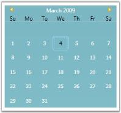
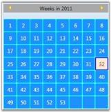
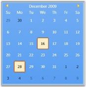

# Working with Calendar

This section contains the following topics:

## Setting the date

You can explicitly set the date for the CalendarEdit control, using the [Date](https://help.syncfusion.com/cr/wpf/Syncfusion.Shared.Wpf~Syncfusion.Windows.Shared.CalendarEdit~Date.html) property. This dependency property sets the date explicitly to the CalendarEdit control. It returns the current date of the CalendarEdit control.




<!-- Adding calendar with date as 12/12/2009 -->
<syncfusion:CalendarEdit Name="calendarEdit" Date="12/12/2009"/>





//Creating an instance of CalendarEdit control
CalendarEdit calendarEdit = new CalendarEdit();

//Sets the Date
calendarEdit.Date = DateTime.Now.Date;  

//Adding CalendarEdit as window content
this.Content = calendarEdit;




## Settings the days

It is possible to hide the days of the next month and the previous month in the calendar, to enhance the appearance of the Calendar. This is done by disabling the [ShowNextMonthDays](https://help.syncfusion.com/cr/wpf/Syncfusion.Shared.Wpf~Syncfusion.Windows.Shared.CalendarEdit~ShowNextMonthDays.html) and [ShowPreviousMonthDays](https://help.syncfusion.com/cr/wpf/Syncfusion.Shared.Wpf~Syncfusion.Windows.Shared.CalendarEdit~ShowPreviousMonthDays.html) properties. 

For setting these properties, use the following code.




<!-- Adding calendar with next month day and previous month day Set to false -->
<syncfusion:CalendarEdit Name="calendarEdit" ShowNextMonthDays="False" ShowPreviousMonthDays="False"/>





//Creating an instance of CalendarEdit control
CalendarEdit calendarEdit = new CalendarEdit();

//Hide the next month days
calendarEdit.ShowNextMonthDays = false;

//Hide the previous month days
calendarEdit.ShowPreviousMonthDays = false;

//Adding CalendarEdit as window content
this.Content = calendarEdit;
 



## Today row

To know the details of current date in a CalendarEdit control, you need to enable Today Row. Set the [TodayRowIsVisible](https://help.syncfusion.com/cr/wpf/Syncfusion.Shared.Wpf~Syncfusion.Windows.Shared.CalendarEdit~TodayRowIsVisible.html) property to true to display today's details. This dependency property indicates whether the today bar is visible or collapsed.

For setting this property, use the following code example.




<!-- Adding Calendar with today row -->
<syncfusion:CalendarEdit Name="calendarEdit" TodayRowIsVisible="True"/>





//Creating an instance of CalendarEdit control
CalendarEdit calendarEdit = new CalendarEdit();

//Enable the today row
calendarEdit.TodayRowIsVisible = true; 

//Adding CalendarEdit as window content
this.Content = calendarEdit;




## Week number

Enhance the usability of the CalendarEdit control, by showing week numbers near the left margin. To show week numbers, set [ShowWeekNumbers](https://help.syncfusion.com/cr/wpf/Syncfusion.Shared.Wpf~Syncfusion.Windows.Shared.CalendarEdit~ShowWeekNumbers.html) property to true as follows.




<!-- Adding calendar with week numbers -->
<syncfusion:CalendarEdit Name="calendarEdit" ShowWeekNumbers="True"/>





//Creating an instance of CalendarEdit control
CalendarEdit calendarEdit = new CalendarEdit();

//Show week numbers
calendarEdit.ShowWeekNumbers = true;

//Adding CalendarEdit as window content
this.Content = calendarEdit;




## Week numbers grid

It is now possible to edit weekly date in CalendarEdit control. This is achieved by Setting the [VisualMode](https://help.syncfusion.com/cr/wpf/Syncfusion.Shared.Wpf~Syncfusion.Windows.Shared.CalendarEdit~VisualMode.html) to WeekNumbers as follows.

The following code example illustrates this.



<!--Calendar Edit-->
<syncfusion:CalendarEdit Name="calendar"  VisualMode="WeekNumbers"/>





//Setting VisualMode in C#
calendar.VisualMode = VisualMode.Syncfusion.Windows.Shared.CalendarVisualMode.WeekNumbers;




Run the code. The output is as follows:

### Changing week number grids default properties

You can set the color for the border brush, background and foreground for the cells in the Week Numbers Grid. You can also set the corner radius and thickness for the border of the cells in the Week Numbers Grid.

The following code example illustrates this.




<!--Calendar Edit with Week Number Default Properties-->
<syncfusion:CalendarEdit  WeekNumberBackground="DodgerBlue" WeekNumberBorderBrush="Cyan" WeekNumberForeground="White" WeekNumberBorderThickness="1" WeekNumberCornerRadius="2"/>





//Calendar Edit with Week Number Default Properties
CalendarEdit calendar = new CalendarEdit();
calendar.WeekNumberBorderBrush = Brushes.Cyan;calendar.WeekNumberCornerRadius = new CornerRadius(2);
calendar.WeekNumberBorderThickness = new Thickness(1);calendar.WeekNumberBackground = Brushes.DodgerBlue;
calendar.WeekNumberForeground = Brushes.White;




Run the code. The output is as follows:

### Changing week number grids selection properties

You can set the border brush, background and foreground color for the required cell in the Week Numbers Grid. You can also set the corner radius and thickness for the border of the selected cell in the Week Numbers Grid.

The following code example illustrates this.




<!--Calendar Edit with Week Number Selection Properties-->
<syncfusion:CalendarEdit WeekNumberSelectionBackground="AntiqueWhite" WeekNumberSelectionBorderBrush="Blue" WeekNumberSelectionForeground="Brown" WeekNumberSelectionBorderThickness="2" WeekNumberSelectionBorderCornerRadius="2"/>





//Calendar Edit with Week Number Selection Properties
CalendarEdit calendar = new CalendarEdit();
calendar.WeekNumberSelectionBorderBrush = Brushes.Blue;calendar.WeekNumberSelectionBorderCornerRadius = new CornerRadius(2);
calendar.WeekNumberSelectionBorderThickness = new Thickness(2);
calendar.WeekNumberSelectionBackground = Brushes.AntiqueWhite;calendar.WeekNumberSelectionForeground = Brushes.Brown;




Run the code. The output is as follows:

### Changing week number Mouse over properties

You can set the border brush, background and foreground color for the cell focused in the Week Numbers Grid.

The following code example illustrates this.




<!--Calendar Edit with Week Number Mouse Over Properties-->
<syncfusion:CalendarEdit WeekNumberHoverBackground="Gold"  WeekNumberHoverBorderBrush="DarkOrange" WeekNumberHoverForeground="Indigo" />





//Calendar Edit with Week Number Mouse Over Properties
CalendarEdit calendar = new CalendarEdit();
calendar.WeekNumberHoverBorderBrush = Brushes.DarkOrange;
calendar.WeekNumberHoverBackground = Brushes.Gold;
calendar.WeekNumberHoverForeground = Brushes.Indigo;




Run the code. The output is as follows:

## Customizing the display of minimum and maximum dates

Minimum dates and Maximum dates display in CalendarEdit can be customized with two states-True and False. The states can be set by using the property MinMaxHidden:

* When this property is set to True, the minimum dates and maximum dates are hidden. 
* When this property is set to False, the display minimum dates and maximum dates are disabled. 
* The default value for this property is true. It returns the Boolean value.

The following code example illustrates how to set the [MinMaxHidden](https://help.syncfusion.com/cr/wpf/Syncfusion.Shared.Wpf~Syncfusion.Windows.Shared.CalendarEdit~MinMaxHidden.html) property to the control programmatically.



<!-- CalendarEdit with MinMaxHidden has false -->
<syncfusion:CalendarEdit Height ="250" Width ="250" Name="calendar" MinMaxHidden="False" MinDate="11/30/2009" MaxDate="1/4/2010"/>





//Create an instance of CalendarEdit
CalendarEdit calendarEdit = new CalendarEdit();

//CalendarEdit with MinMaxHidden as false
calendarEdit.MinMaxHidden = false;




Run the code. The output is as follows:

## Highlight the particular Day cell

You can differentiate the particular day from other days by setting that date value to the [SpecialDate.Date](https://help.syncfusion.com/cr/wpf/Syncfusion.Shared.Wpf~Syncfusion.Windows.Shared.SpecialDate~Date.html) property and adding `SpecialDate.Date` into the [SpecialDates](https://help.syncfusion.com/cr/wpf/Syncfusion.Shared.Wpf~Syncfusion.Windows.Shared.CalendarEdit~SpecialDates.html) collection. You can use the [SpecialDate.CellTemplate](https://help.syncfusion.com/cr/wpf/Syncfusion.Shared.Wpf~Syncfusion.Windows.Shared.SpecialDate~CellTemplate.html) property to customize the `SpecialDate` day cell appearance. 




<Window.Resources>
    <DataTemplate x:Key="special_date">
        <TextBlock Text="{Binding Day}"
                   Background="Yellow"/>
    </DataTemplate>
</Window.Resources>

<Grid>
    <syncfusion:CalendarEdit Name="calendarEdit">
        <syncfusion:CalendarEdit.SpecialDates>

            <!--Adding special dates into SpecialDates collection for highlight-->
            <syncfusion:SpecialDate Date="05/11/2020"
                                    CellTemplate="{StaticResource special_date }"/>
            <syncfusion:SpecialDate Date="05/22/2020" 
                                    CellTemplate="{StaticResource special_date }"/>
            <syncfusion:SpecialDate Date="05/25/2020" 
                                    CellTemplate="{StaticResource special_date }"/>
        </syncfusion:CalendarEdit.SpecialDates>
    </syncfusion:CalendarEdit>
</Grid>




N> View [Sample](https://github.com/SyncfusionExamples/syncfusin-wpf-calendaredit-examples/tree/master/Samples/SpecialDays) in GitHub