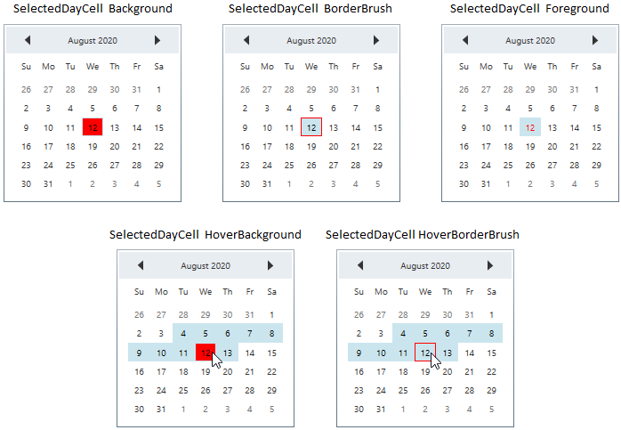
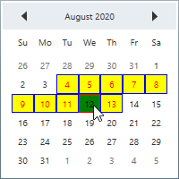
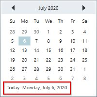
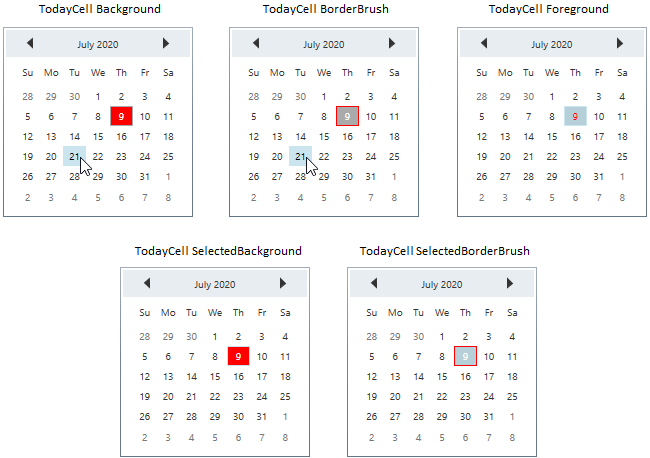
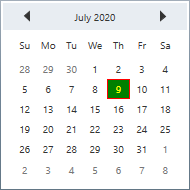
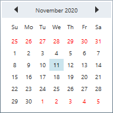
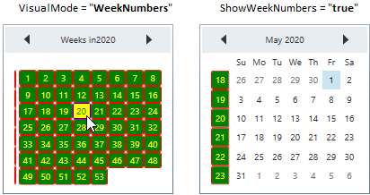
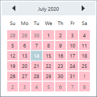
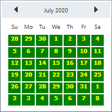
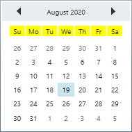

# Working with WPF CalendarEdit

This section explains how to select a date and custom UI of the WPF [CalendarEdit](https://help.syncfusion.com/cr/wpf/Syncfusion.Shared.Wpf~Syncfusion.Windows.Shared.CalendarEdit.html) control.

## Select a date

You can select a date in the `CalendarEdit` control by mouse click on the specific date. You can get the selected date by using the `Date` property.




<!-- Selecting date -->
<syncfusion:CalendarEdit Name="calendarEdit" />




CalendarEdit calendarEdit = new CalendarEdit();




N> [View Sample in GitHub](https://github.com/SyncfusionExamples/syncfusin-wpf-calendar-examples/tree/master/Samples/Select-Date)

### Select a date programmatically

You can set selected date programmatically by setting the date value to the [Date](https://help.syncfusion.com/cr/wpf/Syncfusion.Shared.Wpf~Syncfusion.Windows.Shared.CalendarEdit~Date.html) property.




<!-- Selecting date programmatically -->
<syncfusion:CalendarEdit Date="25/08/2020"
                         Name="calendarEdit"/>



//Selecting date programmatically
calendarEdit.Date = new DateTime(2020, 08, 25);




N> [View Sample in GitHub](https://github.com/SyncfusionExamples/syncfusin-wpf-calendar-examples/tree/master/Samples/Select-Date)

## Select multiple dates

You can select a multiple dates by drag and move the mouse from required start date to end date.
 You can get the selected dates from the [SelectedDates](https://help.syncfusion.com/cr/wpf/Syncfusion.Shared.Wpf~Syncfusion.Windows.Shared.CalendarEdit~SelectedDates.html) property. You can restrict the multiple date selection by setting [AllowMultiplySelection](https://help.syncfusion.com/cr/wpf/Syncfusion.Shared.Wpf~Syncfusion.Windows.Shared.CalendarEdit~AllowMultiplySelection.html) property as `false`. The default value of `AllowMultiplySelection` property is `true`.




<!-- Selecting multiple dates-->
<syncfusion:CalendarEdit Name="calendarEdit" 
                         AllowMultiplySelection="True"/>




//Selecting multiple dates
calendarEdit.AllowMultiplySelection = true;




N> [View Sample in GitHub](https://github.com/SyncfusionExamples/syncfusin-wpf-calendar-examples/tree/master/Samples/Select-Date)

### Select a multiple dates programmatically

You can select a multiple dates programmatically by setting the dates to the [SelectedDatesList](https://help.syncfusion.com/cr/wpf/Syncfusion.Shared.Wpf~Syncfusion.Windows.Shared.CalendarEdit~SelectedDatesList.html) property.




<!-- Selecting date -->
<syncfusion:CalendarEdit Date="25/08/2020" 
                         AllowMultiplySelection="True"
                         Name="calendarEdit"/>



//Selecting multiple date programmatically
calendarEdit.AllowMultiplySelection = true;
calendarEdit.SelectedDatesList = new List<Date>();
calendarEdit.SelectedDatesList.Add(new Date(2020, 09, 01));
calendarEdit.SelectedDatesList.Add(new Date(2020, 09, 02));
calendarEdit.SelectedDatesList.Add(new Date(2020, 09, 03));
calendarEdit.SelectedDatesList.Add(new Date(2020, 09, 04));
calendarEdit.SelectedDatesList.Add(new Date(2020, 09, 05));
calendarEdit.SelectedDatesList.Add(new Date(2020, 09, 06));
calendarEdit.SelectedDatesList.Add(new Date(2020, 09, 07));
calendarEdit.SelectedDatesList.Add(new Date(2020, 09, 08));




## Highlight selected date

If you want to highlight the selected date, change it's foreground, background or border brush by using the [SelectionForeground](https://help.syncfusion.com/cr/wpf/Syncfusion.Shared.Wpf~Syncfusion.Windows.Shared.CalendarEdit~SelectionForeground.html), [SelectedDayCellBackground](https://help.syncfusion.com/cr/wpf/Syncfusion.Shared.Wpf~Syncfusion.Windows.Shared.CalendarEdit~SelectedDayCellBackground.html) and [SelectedDayCellBorderBrush](https://help.syncfusion.com/cr/wpf/Syncfusion.Shared.Wpf~Syncfusion.Windows.Shared.CalendarEdit~SelectedDayCellBorderBrush.html) and  properties. You can also change the mouse hover background and border brush for the selected day cell by using the [SelectedDayCellHoverBackground](https://help.syncfusion.com/cr/wpf/Syncfusion.Shared.Wpf~Syncfusion.Windows.Shared.CalendarEdit~SelectedDayCellHoverBackground.html) and [SelectionBorderBrush](https://help.syncfusion.com/cr/wpf/Syncfusion.Shared.Wpf~Syncfusion.Windows.Shared.CalendarEdit~SelectionBorderBrush.html) properties.




<syncfusion:CalendarEdit SelectedDayCellBackground="Yellow" 
                         SelectedDayCellBorderBrush="Blue"
                         SelectionForeground="Red"
                         SelectedDayCellHoverBackground="Green"
                         SelectionBorderBrush="Red"
                         Name="calendarEdit" />




calendarEdit.SelectedDayCellBackground = Brushes.Yellow;
calendarEdit.SelectedDayCellBorderBrush = Brushes.Blue;
calendarEdit.SelectionForeground = Brushes.Red;
calendarEdit.SelectedDayCellHoverBackground = Brushes.Green;
calendarEdit.SelectionBorderBrush = Brushes.Red;




N> [View Sample in GitHub](https://github.com/SyncfusionExamples/syncfusin-wpf-calendar-examples/tree/master/Samples/Select-Date)

## Get today date

If you want to know the today date, use the [TodayDate](https://help.syncfusion.com/cr/wpf/Syncfusion.Shared.Wpf~Syncfusion.Windows.Shared.CalendarEdit~TodayDate.html) property. It contains the today date of the `CalendarEdit` control.




CalendarEdit calendarEdit = new calendarEdit();

//get the today date
 var today_Date= calendarEdit.TodayDate;




## Display today date

If you want to display the today date in the `CalendarEdit` control, use the [TodayRowIsVisible](https://help.syncfusion.com/cr/wpf/Syncfusion.Shared.Wpf~Syncfusion.Windows.Shared.CalendarEdit~TodayRowIsVisible.html) property value as `true`. It will display the today date in the bottom-left corner of the `CalendarEdit` control. The default value of `TodayRowIsVisible` property is `false`.




<syncfusion:CalendarEdit TodayRowIsVisible="True"
                         Name="calendarEdit" />





//Enable the today row
calendarEdit.TodayRowIsVisible = true; 




N> [View Sample in GitHub](https://github.com/SyncfusionExamples/syncfusin-wpf-calendar-examples/tree/master/Samples/Select-Date)

### Highlight today date

If you want to highlight the today date, change it's foreground, background or border brush by using [TodayCellForeground](https://help.syncfusion.com/cr/wpf/Syncfusion.Shared.Wpf~Syncfusion.Windows.Shared.CalendarEdit~TodayCellForeground.html), [TodayCellBackground](https://help.syncfusion.com/cr/wpf/Syncfusion.Shared.Wpf~Syncfusion.Windows.Shared.CalendarEdit~TodayCellBackground.html) and [TodayCellBorderBrush](https://help.syncfusion.com/cr/wpf/Syncfusion.Shared.Wpf~Syncfusion.Windows.Shared.CalendarEdit~TodayCellBorderBrush.html) properties. You can also change the selected border brush and background of the today date by using the [TodayCellSelectedBorderBrush](https://help.syncfusion.com/cr/wpf/Syncfusion.Shared.Wpf~Syncfusion.Windows.Shared.CalendarEdit~TodayCellSelectedBorderBrush.html) and [TodayCellSelectedBackground](https://help.syncfusion.com/cr/wpf/Syncfusion.Shared.Wpf~Syncfusion.Windows.Shared.CalendarEdit~TodayCellSelectedBackground.html) properties.




<syncfusion:CalendarEdit TodayCellSelectedBorderBrush="Red" 
                         TodayCellSelectedBackground="Green"
                         TodayCellForeground="Yellow"
                         Name="calendarEdit" />




calendarEdit.TodayCellSelectedBorderBrush = Brushes.Red;
calendarEdit.TodayCellSelectedBackground = Brushes.Green;
calendarEdit.TodayCellForeground = Brushes.Yellow;




N> [View Sample in GitHub](https://github.com/SyncfusionExamples/syncfusin-wpf-calendar-examples/tree/master/Samples/Select-Date)

## Differentiate current month days from other days

If you want to differentiate currently selected month days from previous or next month days, change the previous and next month days foreground by using the [NotCurrentMonthForeground](https://help.syncfusion.com/cr/wpf/Syncfusion.Shared.Wpf~Syncfusion.Windows.Shared.CalendarEdit~NotCurrentMonthForeground.html) property. The default value of `NotCurrentMonthForeground` property is `Gray`.




<syncfusion:CalendarEdit NotCurrentMonthForeground="Red"
                         Name="calendarEdit" />




calendarEdit.NotCurrentMonthForeground = Brushes.Red;




N> [View Sample in GitHub](https://github.com/SyncfusionExamples/syncfusin-wpf-calendar-examples/tree/master/Samples/Select-Date)

## Change default view (Month, Year, Decade)

By default, the days are displayed in the `CalendarEdit`.
You can change the default calendar view as week numbers, month, years or years range mode by setting the respective value to the [VisualMode](https://help.syncfusion.com/cr/wpf/Syncfusion.Shared.Wpf~Syncfusion.Windows.Shared.CalendarEdit~VisualMode.html) property. The default value of `VisualMode` property is `Days`.




<syncfusion:CalendarEdit Name="calendarEdit" 
                         VisualMode="YearsRange"/>




calendarEdit.VisualMode = CalendarVisualMode.YearsRange;




N> [View Sample in GitHub](https://github.com/SyncfusionExamples/syncfusin-wpf-calendar-examples/tree/master/Samples/Select-Date)

## Display week numbers

If you want to know the week number of the currently displayed dates, use the [ShowWeekNumbers](https://help.syncfusion.com/cr/wpf/Syncfusion.Shared.Wpf~Syncfusion.Windows.Shared.CalendarEdit~ShowWeekNumbers.html) property as `true`. It will display the respective week numbers in the left side of the `CalendarEdit` control.The default value of `ShowWeekNumbers` property is `false`.   




<!--Showing Week number-->
<syncfusion:CalendarEdit Name="calendarEdit" 
                         ShowWeekNumbers="True"/>




//Shows week numbers
calendarEdit.ShowWeekNumbers = true;




N> [View Sample in GitHub](https://github.com/SyncfusionExamples/syncfusin-wpf-calendar-examples/tree/master/Samples/Select-Date)

## Highlight week numbers

If you want to highlight the week numbers, change it's foreground, background or border brush by using the [WeekNumberBackground](https://help.syncfusion.com/cr/wpf/Syncfusion.Shared.Wpf~Syncfusion.Windows.Shared.CalendarEdit~WeekNumberBackground.html), [WeekNumberForeground](https://help.syncfusion.com/cr/wpf/Syncfusion.Shared.Wpf~Syncfusion.Windows.Shared.CalendarEdit~WeekNumberForeground.html) and [WeekNumberBorderBrush](https://help.syncfusion.com/cr/wpf/Syncfusion.Shared.Wpf~Syncfusion.Windows.Shared.CalendarEdit~WeekNumberBorderBrush.html) properties. You can also change the mouse hover background, foreground and border brush for the selected day cell by using the [WeekNumberHoverBackground](https://help.syncfusion.com/cr/wpf/Syncfusion.Shared.Wpf~Syncfusion.Windows.Shared.CalendarEdit~WeekNumberHoverBackground.html), [WeekNumberHoverForeground](https://help.syncfusion.com/cr/wpf/Syncfusion.Shared.Wpf~Syncfusion.Windows.Shared.CalendarEdit~WeekNumberHoverForeground.html) and [WeekNumberHoverBorderBrush](https://help.syncfusion.com/cr/wpf/Syncfusion.Shared.Wpf~Syncfusion.Windows.Shared.CalendarEdit~WeekNumberHoverBorderBrush.html) properties.




<syncfusion:CalendarEdit WeekNumberBackground="Green" 
                         WeekNumberBorderBrush="Red"
                         WeekNumberForeground="Yellow"
                         WeekNumberHoverBackground="Yellow"
                         WeekNumberHoverBorderBrush="Blue"
                         WeekNumberHoverForeground="Green"
                         ShowWeekNumbers="True"
                         VisualMode="WeekNumbers" />




calendarEdit.WeekNumberBackground = Brushes.Green;
calendarEdit.WeekNumberBorderBrush = Brushes.Red;
calendarEdit.WeekNumberForeground = Brushes.Yellow;
calendarEdit.WeekNumberHoverBackground = Brushes.Yellow;
calendarEdit.WeekNumberHoverBorderBrush = Brushes.Blue;
calendarEdit.WeekNumberHoverForeground = Brushes.Green;
calendarEdit.ShowWeekNumbers = true;
calendarEdit.VisualMode = CalendarVisualMode.WeekNumbers;




N> [View Sample in GitHub](https://github.com/SyncfusionExamples/syncfusin-wpf-calendar-examples/tree/master/Samples/Select-Date)

## Special days

You can differentiate the special day from other days by setting that date value to the [SpecialDate.Date](https://help.syncfusion.com/cr/wpf/Syncfusion.Shared.Wpf~Syncfusion.Windows.Shared.SpecialDate~Date.html) property and adding `SpecialDate.Date` into the [SpecialDates](https://help.syncfusion.com/cr/wpf/Syncfusion.Shared.Wpf~Syncfusion.Windows.Shared.CalendarEdit~SpecialDates.html) collection. You can use the [SpecialDate.CellTemplate](https://help.syncfusion.com/cr/wpf/Syncfusion.Shared.Wpf~Syncfusion.Windows.Shared.SpecialDate~CellTemplate.html) property to customize the `SpecialDate` day cell appearance. 




//ViewModel.cs
public class ViewModel {
	private SpecialDatesCollection specialDates;
	public SpecialDatesCollection SpecialDates {
		get { return specialDates; }
		set { specialDates = value; }
	}
	public ViewModel() {
		SpecialDates = new SpecialDatesCollection();
	}
}







    <Window.Resources>
        <DataTemplate x:Key="WorldEnvironmentDay" >
            <Image Source="Resources\Icon_Environmental day.png" />
        </DataTemplate>
        <DataTemplate x:Key="EngineersDay" >
            <Image Source="Resources\Icon_Engineer day.png" />
        </DataTemplate>
        <DataTemplate x:Key="PollutionPreventionDay" >
            <Image Source="Resources\Icon_Pollution day.png" />
        </DataTemplate>
        <DataTemplate x:Key="NationalMathematicsDay" >
            <Image Source="Resources\Icon_Mathematics day.png" />
        </DataTemplate>
        <DataTemplate x:Key="Christmas" >
            <Image Source="Resources\Christmas.png" />
        </DataTemplate>

        <local:ViewModel x:Key="viewModel">
            <local:ViewModel.SpecialDates>
                <syncfusion:SpecialDate Date="06/05/2020" CellTemplate="{StaticResource WorldEnvironmentDay }"/>
                <syncfusion:SpecialDate Date="09/15/2020" CellTemplate="{StaticResource EngineersDay }"/>
                <syncfusion:SpecialDate Date="12/02/2020" CellTemplate="{StaticResource PollutionPreventionDay }"/>
                <syncfusion:SpecialDate Date="12/22/2020" CellTemplate="{StaticResource NationalMathematicsDay }"/>
                <syncfusion:SpecialDate Date="12/25/2020" CellTemplate="{StaticResource Christmas }"/>
            </local:ViewModel.SpecialDates>
        </local:ViewModel>
    </Window.Resources>
    
    <Grid>
        <syncfusion:CalendarEdit DataContext="{StaticResource viewModel}"                         
                                 SpecialDates="{Binding SpecialDates}"
                                 Name="calendarEdit" />
    </Grid>




N> [View Sample in GitHub](https://github.com/SyncfusionExamples/syncfusin-wpf-calendaredit-examples/tree/master/Samples/SpecialDays)

## Setting Culture

You can change the culture for `CalendarEdit` control by setting the required culture to the `Culture` property.




<!--Setting french culture-->
<syncfusion:CalendarEdit Name="calendarEdit" 
                         Culture="fr-FR"/>




//Setting french culture
calendarEdit.Culture = new CultureInfo("fr-FR");




## Show full month and week name

You can display full month names and week day names by setting the [ShowAbbreviatedDayNames](https://help.syncfusion.com/cr/wpf/Syncfusion.Shared.Wpf~Syncfusion.Windows.Shared.CalendarEdit~ShowAbbreviatedDayNames.html) and [ShowAbbreviatedDayNames](https://help.syncfusion.com/cr/wpf/Syncfusion.Shared.Wpf~Syncfusion.Windows.Shared.CalendarEdit~ShowAbbreviatedDayNames.html) properties as `false`. The default value of `ShowAbbreviatedDayNames` and `ShowAbbreviatedDayNames` property is `true`.




<syncfusion:CalendarEdit ShowAbbreviatedDayNames="False"
                         ShowAbbreviatedMonthNames="False"
                         Name="calendarEdit"/>




CalendarEdit calendarEdit = new CalendarEdit();
calendarEdit.ShowAbbreviatedDayNames = false;
calendarEdit.ShowAbbreviatedMonthNames = false;




N> [View Sample in GitHub](https://github.com/SyncfusionExamples/syncfusin-wpf-calendar-examples/tree/master/Samples/Select-Date)

## Tooltip for particular days

You can set tooltip for particular days in the `CalendarEdit` control by using the [SetToolTip(Date,ToolTip)](https://help.syncfusion.com/cr/wpf/Syncfusion.Shared.Wpf~Syncfusion.Windows.Shared.CalendarEdit~SetToolTip(Date,ToolTip).html) method. You can pass the specific date and tooltip to the `SetToolTip(Date,ToolTip)` method.




Date yesterday = new Date(DateTime.Now.Year, DateTime.Now.Month, DateTime.Now.Day-1);
Date today = new Date(DateTime.Now.Year, DateTime.Now.Month, DateTime.Now.Day);
CalendarEdit calendarEdit = new CalendarEdit();

//Setting tooltip for yesterday and today dates
calendarEdit.SetToolTip(yesterday, new ToolTip() { Content = "Yesterday" });
calendarEdit.SetToolTip(today, new ToolTip() { Content = "Today" });




## Custom appearance of day cell

You can customize the appearance of day cell by using styles and templates in the `CalendarEdit` control.

### Custom UI for day cell using style

You can customize the appearance of day cell by using the [DayCellsStyle](https://help.syncfusion.com/cr/wpf/Syncfusion.Shared.Wpf~Syncfusion.Windows.Shared.CalendarEdit~DayCellsStyle.html) property. The `DataContext` of the `DayCellsStyle` is `DayCell`.




<Window.Resources>    
    <!-- day cell style -->
    
</Window.Resources>
<Grid>
    <syncfusion:CalendarEdit DayCellsStyle="{StaticResource dayCell}" 
                             Name="calendarEdit" />
</Grid>




N> [View Sample in GitHub](https://github.com/SyncfusionExamples/syncfusin-wpf-calendar-examples/tree/master/Samples/Style)

### Custom UI for day cell using template

You can customize the appearance of day cell by using the [DayCellsDataTemplate](https://help.syncfusion.com/cr/wpf/Syncfusion.Shared.Wpf~Syncfusion.Windows.Shared.CalendarEdit~DayCellsStyle.html) property. The `DataContext` of the `DayCellsDataTemplate` is `DayCell`.




<Window.Resources>    
    <!-- day cell template -->
    <DataTemplate x:Key="dayCelltemplate"
                  DataType="syncfusion:DayCell">
        <TextBlock TextAlignment="Center"
                   Foreground="Yellow"
                   Background="Green"
                   FontFamily="Tahoma"
                   FontStyle="Normal"
                   Text="{Binding Day}"/>
    </DataTemplate>
</Window.Resources>
<Grid>
    <syncfusion:CalendarEdit DayCellsDataTemplate="{StaticResource dayCelltemplate}"  
                             Name="calendarEdit" />
</Grid>




N> [View Sample in GitHub](https://github.com/SyncfusionExamples/syncfusin-wpf-calendar-examples/tree/master/Samples/Template)

## Custom UI for day name cell using style

You can customize the appearance of day name cell by using the [DayNameCellsStyle](https://help.syncfusion.com/cr/wpf/Syncfusion.Shared.Wpf~Syncfusion.Windows.Shared.CalendarEdit~DayNameCellsStyle.html) property. The `DataContext` of the `DayNameCellsStyle` is `DayNameCell`.




<Window.Resources>    
    <!-- day name cell style -->
    
</Window.Resources>
<Grid>
    <syncfusion:CalendarEdit DayNameCellsStyle="{StaticResource daynameCellStyle}" 
                             Name="calendarEdit" />
</Grid>




N> [View Sample in GitHub](https://github.com/SyncfusionExamples/syncfusin-wpf-calendar-examples/tree/master/Samples/Style)

## Selected date changed notification

The selected date changed in `CalendarEdit` can be examined using [DateChanged](https://help.syncfusion.com/cr/wpf/Syncfusion.Shared.Wpf~Syncfusion.Windows.Shared.CalendarEdit~DateChanged_EV.html) event. The `DateChanged` event contains the old and newly selected date time values in the `OldValue` and `NewValue` properties.




 <syncfusion:CalendarEdit DateChanged="CalendarEdit_DateChanged" 
                          Name="calendarEdit"/>




CalendarEdit calendarEdit = new CalendarEdit();
calendarEdit.DateChanged += CalendarEdit_DateChanged;




You can handle the event as follows,




private void CalendarEdit_DateChanged(DependencyObject d, DependencyPropertyChangedEventArgs e) {
    //Get old and new selected date values
    var oldValue = e.OldValue;
    var newValue = e.NewValue;
}


