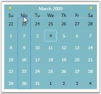

# Layout Related Features

This section illustrates the Layout-related features of CalendarEdit control. The following features are discussed:

## Header Background and Foreground Color

CalendarEdit control provides the HeaderBackground and HeaderForeground properties to customize the appearance of the header background and foreground. Use the following code examples to set the above properties.




<!-- Adding calendar with header background and foreground -->
<syncfusion:CalendarEdit Name="calendarEdit" HeaderBackground="SaddleBrown" HeaderForeground="Bisque"/>





//Creating an instance of CalendarEdit control
CalendarEdit calendarEdit = new CalendarEdit();

//Setting Header Background
calendarEdit.HeaderBackground = Brushes.SaddleBrown;

//Setting Header foreground
calendarEdit.HeaderForeground = Brushes.Bisque;

//Adding CalendarEdit as window content
this.Content = calendarEdit;
  



## Selection Border Color

Whenever a selection is made in the Calendar, the selected day grid can be associated with a border. The color of this selection border of the day grid can be customized using the SelectionBorderBrush property. This dependency property sets the brush value for the selection border brush of the day grid.

To set the SelectionBorderBrush property, use the following code.




<!-- Adding calendar with selection border brush -->
<syncfusion:CalendarEdit Name="calendarEdit" SelectionBorderBrush="Aqua"/>




//Creating an instance of CalendarEdit control
CalendarEdit calendarEdit = new CalendarEdit();

//Setting the brush for the Selection day grid
calendarEdit.SelectionBorderBrush = Brushes.Aqua; 

///Adding CalendarEdit as window content
this.Content = calendarEdit;




## Corner Radius for the Selection Border

You can set the corner radius for the selection border by using the SelectionBorderCornerRadius property. This is dependency property sets the value for the corner radius as follows.




<!-- Adding calendar with selection border corner radius -->
<syncfusion:CalendarEdit Name="calendarEdit" SelectionBorderCornerRadius="0"/>




//Creating an instance of CalendarEdit control
CalendarEdit calendarEdit = new CalendarEdit();

//Setting corner radius for selection border
calendarEdit.SelectionBorderCornerRadius = new CornerRadius(0); 

//Adding CalendarEdit as window content
this.Content = calendarEdit; 




## CalendarEdit

Feature: Foreground for Selected Dates

Property Name: SelectionForeground

This property is used to set the foreground color of the dates that are all selected.

This is mainly used to differentiate the SelectedDates from other dates.




<syncfusion:CalendarEdit Name="calendarEdit1" SelectionForeground="Red"/>





calendarEdit1.SelectionForeground = new SolidColorBrush(Colors.Red);




