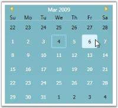

# Abbreviating Names

This section provides information about how to abbreviate day and month names. It has the following topics:

Abbreviating Day Names

By default, the day names are displayed in an abbreviated form in the CalendarEdit control. They can also be displayed in an expanded form by setting IsDayNameAbbreviated property to false. This indicates whether the name of day is abbreviated or expanded. It returns the Boolean value. 

To set this property, use the following code:



<!-- Adding calendar with day name expanded-->
<syncfusion:CalendarEdit Name="calendarEdit" Width="400" IsDayNamesAbbreviated="False"/>




//Creating an instance of CalendarEdit controlCalendarEdit calendarEdit = new CalendarEdit();
//Disable the DayNameAbbreviatedcalendarEdit.IsDayNamesAbbreviated = false; 
//Adding CalendarEdit as window contentthis.Content = calendarEdit;



Abbreviating Month Names

By default, the MonthNames are displayed in an expanded form in the CalendarEdit control. They can also be displayed in an abbreviated form by setting IsMonthNamesAbbreviated property to _true_. This dependency property indicates whether the name of month is abbreviated or expanded. It returns a Boolean value.

To set the IsMonthNamesAbbreviated property, use the following code.



<!-- Adding calendar with month name been abbreviated -->
<syncfusion:CalendarEdit Name="calendarEdit" IsMonthNameAbbreviated="True"/>





//Creating an instance of CalendarEdit controlCalendarEdit calendarEdit = new CalendarEdit();
//Disable the DayNameAbbreviatedcalendarEdit.IsMonthNameAbbreviated = true;
//Adding CalendarEdit as window contentthis.Content = calendarEdit;



