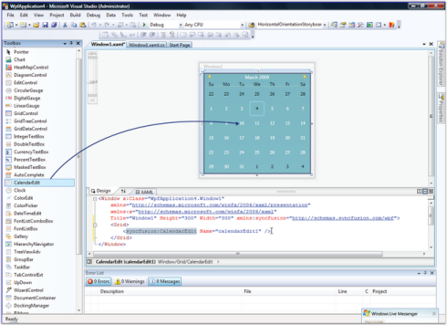
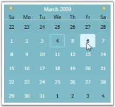

# Getting Started

This section guides you on getting started with CalendarEdit control. It covers the following topics:

## Why to use our CalendarEdit control

Here are some highlights about our CalendarEdit control.

* CalendarEdit supports different Culture Types
* The CalendarEdit can be displayed in the following two modes; Standard and Vista
* Different built-in skins are available to give a good look and feel to the control
* It has options to change the direction of month while navigation
* The appearance of the header and selection border can be customized using different brushes
* You can select more than one "Date" value at a time
* Display area of Calendar control is limited using abbreviated days and months
* A ToolTip can be set to the required date, or by row and column

## Elaborate Structure of the Control

The various elements of CalendarEdit control are illustrated in the following image.

## Create CalendarEdit Control

There are two possible ways to create a simple CalendarEdit control.

#### Through Designer

To create the CalendarEdit control through designer, follow the steps:

1. Drag the CalendarEdit control from the toolbox onto the design area.
2. Set the properties for the CalendarEdit in design mode, by using the Smart Tag feature.

#### Programmatically

To create the CalendarEdit control through code, use the following XAML or C# code.



<!-- Adding CalendarEdit control -->
<syncfusion:CalendarEdit Name="calendarEdit"/>





//Creating an instance of CalendarEdit controlCalendarEdit calendarEdit = new CalendarEdit();
//Adding CalendarEdit as window contentthis.Content = calendarEdit;



