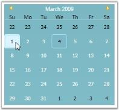

# Selecting the Date and Year at Run Time

Selecting Date at Run Time

By setting the AllowSelection property to true, you can enable user selection in CalendarEdit control at run time. This dependency property indicates whether the date selection is allowed during runtime. It returns a Boolean value indicating the state of this property.

For setting the AllowSelection property, use the following code.

<table>
<tr>
<td>
[XAML]&lt;!-- Adding calendar with allow selection of a date --&gt;&lt;syncfusion:CalendarEdit Name="calendarEdit" AllowSelection="True"/&gt;</td></tr>
<tr>
<td>
[C#]//Creating an instance of CalendarEdit controlCalendarEdit calendarEdit = new CalendarEdit();//Allow selection of a datecalendarEdit.AllowSelection = true;//Adding calendarEdit as window contentthis.Content = calendarEdit;</td></tr>
</table>

{  | markdownify }
{:.image }

Selecting Year at Run Time

By setting the IsAllowYearSelection property to _true_, you can edit the year at run time. This is dependency property indicates whether the year can be edited at run time. It returns the Boolean value that indicates the state of this property.

To set the IsAllowYearSelection property, use the following code.

<table>
<tr>
<td>
[XAML]&lt;!-- Setting IsAllowYearSelection property--&gt;&lt;syncfusion:CalendarEdit Name="calendarEdit" IsAllowYearSelection="True"/&gt;</td></tr>
<tr>
<td>
[C#]//Creating an instance of CalendarEdit controlCalendarEdit calendarEdit = new CalendarEdit();//Allow selection of yearcalendarEdit.IsAllowYearSelection = true;//Adding CalendarEdit as window contentthis.Content = calendarEdit;</td></tr>
</table>

{  | markdownify }
{:.image }

See Also

Selecting Multiple Dates, Scrolling to the Selected Date

