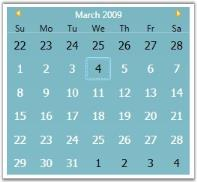

# Styles and Templates

This section deals with the following Styles and Templates supported by CalendarEdit control. 

## Day Cells Style

You can set the style of a day cell, using the DayCellsStyle property. 

To set this property, use the following code.


<Window x:Class="WpfApplication4.Window1"

  xmlns="http://schemas.microsoft.com/winfx/2006/xaml/presentation"

  xmlns:x="http://schemas.microsoft.com/winfx/2006/xaml"

  Title="Window1" Height="300" Width="300" xmlns:syncfusion="http://schemas.syncfusion.com/wpf">

<Grid Margin="20">

  <Grid.Resources>

<!-- day cell style -->

    

  </Grid.Resources>

  <!-- Adding calendar with day cell style -->

  <syncfusion:CalendarEdit Name="calendarEdit" DayCellsStyle="{StaticResource dayCell}"/>

</Grid>

</Window>



_Style set for Day Cell_

## Day Name Cells Style

You can set the style of the day name cell, using the DayNameCellsStyle property. Use the following code example to 
set this property.



<Window x:Class="WpfApplication4.Window1"

  xmlns="http://schemas.microsoft.com/winfx/2006/xaml/presentation"

  xmlns:x="http://schemas.microsoft.com/winfx/2006/xaml"

  Title="Window1" Height="300" Width="300" xmlns:syncfusion="http://schemas.syncfusion.com/wpf">

<Grid Margin="20">

  <Grid.Resources>

    <!-- setting style for DayNameCell -->

    

  </Grid.Resources>

  <!-- Adding calendar with day name cell style -->

  <syncfusion:CalendarEdit Name="calendarEdit" DayNameCellsStyle="{StaticResource dayCell}"/>

</Grid>

</Window>



_Style set for Day Name Cell_

## Data Template for Day Cell

You can create a data template for the day cell, using the DayCellsDataTemplate property. This dependency property 
sets the day cell data template using the following code example.



<Window x:Class="WpfApplication4.Window1"

    xmlns="http://schemas.microsoft.com/winfx/2006/xaml/presentation"

    xmlns:x="http://schemas.microsoft.com/winfx/2006/xaml"

    Title="Window1" Height="300" Width="300" xmlns:syncfusion="http://schemas.syncfusion.com/wpf">

  <Grid Margin="20">

    <Grid.Resources>

      <!-- setting Data Template for DayCell -->

      <DataTemplate x:Key="dayCell" DataType="syncfusion:DayCell">

      <TextBlock

      TextBlock.FontFamily="Tahoma"

      TextBlock.FontStyle="Normal"

      TextBlock.FontSize="15"

      Text="{Binding Day}"/>

      </DataTemplate>

    </Grid.Resources>

    <!-- Adding calendar -->

    <syncfusion:CalendarEdit Name="calendarEdit" DayCellsDataTemplate="{StaticResource dayCell}"/>

  </Grid>

</Window>



_Data Template set for Day Cell_

## Data Template for Day Name Cell

You can create a data template for the day name cell, using the DayNameCellsDataTemplate property. This dependency 
property sets the day name cell data template using the following code example.


<Window x:Class="WpfApplication4.Window1"

  xmlns="http://schemas.microsoft.com/winfx/2006/xaml/presentation"

  xmlns:x="http://schemas.microsoft.com/winfx/2006/xaml"

  Title="Window1" Height="300" Width="300" xmlns:syncfusion="http://schemas.syncfusion.com/wpf">

<Grid Margin="20">

  <Grid.Resources>

    <!-- setting Data Template for DayNameCell -->

    <DataTemplate x:Key="dayNameCells" DataType="syncfusion:DayNameCell">

    <TextBlock

    TextBlock.FontFamily="Tahoma"

    TextBlock.FontStyle="Normal"

    TextBlock.FontSize="15"

    Text="{Binding}"/>

    </DataTemplate>

  </Grid.Resources>

  <!-- Adding calendar -->

  <syncfusion:CalendarEdit Name="calendarEdit" DayNameCellsDataTemplate="{StaticResource dayNameCells}"/>

</Grid>

</Window>



_Data Template set for Day Name Cell_

