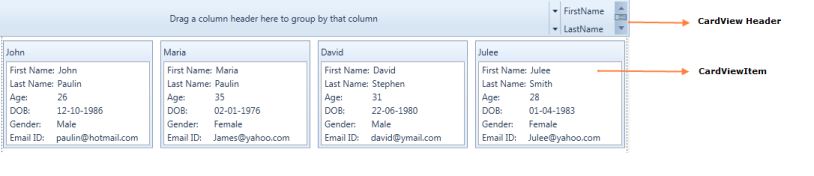
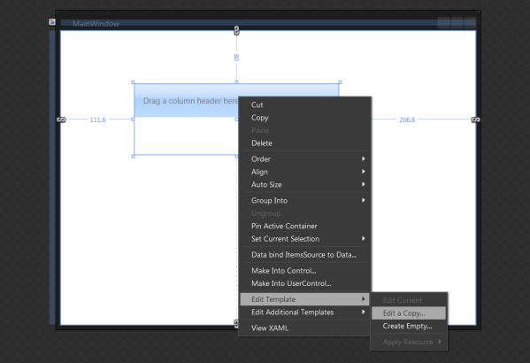
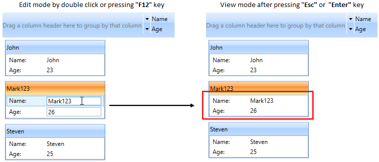
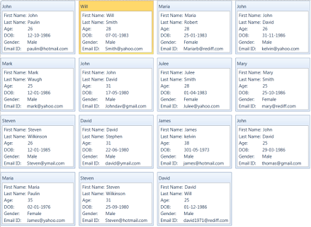

# Controls and Components

The following controls assemble the CardView control.

* CardView
* CardViewItem

## CardView

## Use Case Scenarios

CardView control helps to sort or group items based on the given field names.Structure of the CardView Control

The following screenshot displays the CardView:

Structure of the CardView Control
{:.caption}

* CardViewHeader: It shows the header of the card view control
* CardViewItem: It contains the list of ComboBox’s items

## Sample link

1. Select Start -> Programs -> Syncfusion -> Essential Studio 9.2.0.137 -> Dashboard.
2. Select Run Locally Installed Samples in WPF CardView.
3. Now select the CardView item in the tree.
4. Choose CardView demo.

## Appearance

You can customize the appearance of the ComboBoxAdv control by editing the style of the control in Expression Blend or by using the following properties exposed by CardView control:

* Edit style in Expression Blend 
* Customizing by using properties

## Blendability

You can edit the style of ComboBoxAdv by using Expression Blend. To edit the ComboBoxAdv control’s style in Expression Blend:

1. Drag the CardView control to the Design view. The CardView control will appear as shown in the screen shot displayed below.

2. Right-click the CardView control, select Edit Template, and then select Edit a Copy. 

   
   
   CardView Control in Edit Template 
   {:.caption}
   
## Features of CardView control

## Grouping

Cards inside the CardView control can be grouped by the fields available in the list. Grouping can be achieved by dragging the field from the list to the header panel in the CardView control. Grouping can be controlled by the property called [CanGroup](https://help.syncfusion.com/cr/wpf/Syncfusion.Windows.Tools.Controls.CardView.html#Syncfusion_Windows_Tools_Controls_CardView_CanGroup). By default [CanGroup](https://help.syncfusion.com/cr/wpf/Syncfusion.Windows.Tools.Controls.CardView.html#Syncfusion_Windows_Tools_Controls_CardView_CanGroup) value will be true.

### Adding grouping to an Application 

[CanGroup](https://help.syncfusion.com/cr/wpf/Syncfusion.Windows.Tools.Controls.CardView.html#Syncfusion_Windows_Tools_Controls_CardView_CanGroup) property can be added directly to an application using the following code snippet:



<syncfusion:CardView CanGroup="False">        

</syncfusion:CardView>





CardView cardview = new CardView();       

cardview.CanGroup = false;



## Filtering

Cards can be filtered by the values which are given for the fields. To filter the cards, just check the values in the listed popup that opens when you click the button which is available in the front of the fields list.

## Sorting

Cards can be sorted inside the CardView Control. It can be achieved by the fields available. To sort the cards just click on the field name listed in the header. It can be controlled by the property called [CanSort](https://help.syncfusion.com/cr/wpf/Syncfusion.Windows.Tools.Controls.CardView.html#Syncfusion_Windows_Tools_Controls_CardView_CanSort). By default the value is true.

### Adding sorting to an Application 

[CanSort](https://help.syncfusion.com/cr/wpf/Syncfusion.Windows.Tools.Controls.CardView.html#Syncfusion_Windows_Tools_Controls_CardView_CanSort) can be added directly to an application using the following code snippet: 



<syncfusion:CardView CanSort="False">        

</syncfusion:CardView>





CardView cardview = new CardView();       

cardview.CanSort = false;



## Card editing using keyborad and mouse interaction

You can edit the selected `CardViewItem` value by double-clicking on that item or by pressing the `F2` key. You can enable the editing by setting the value of the [CanEdit](https://help.syncfusion.com/cr/wpf/Syncfusion.Windows.Tools.Controls.CardView.html#Syncfusion_Windows_Tools_Controls_CardView_CanEdit) property as `true`. Otherwise, you will not be able to perform the edit operation. To get out from the editing mode, you need to press the `Esc` or `Enter` key. The default value of `CanEdit` property is `false`. 

N> You need to define the UI for edit mode `CardViewItem` with editable functionalities by using [EditItemTemplate](https://help.syncfusion.com/cr/wpf/Syncfusion.Windows.Tools.Controls.CardView.html#Syncfusion_Windows_Tools_Controls_CardView_EditItemTemplate). `EditItemTemplate` is applied to the selected item in the edit mode, and `ItemTemplate` is applied to the selected item in the view mode.




//Model.cs
public class CardViewModel {
    public string Name { get; set; }
    public int Age { get; set; }
}

//ViewModel.cs
public class ViewModel : NotificationObject {
    private ObservableCollection<CardViewModel> cardViewItems;
    public ObservableCollection<CardViewModel> CardViewItems {
        get { return cardViewItems; }
        set { cardViewItems = value;
            this.RaisePropertyChanged("CardViewItems"); 
        }
    }
    public ViewModel() {
        CardViewItems = new ObservableCollection<CardViewModel>();
        populateItems();
    }
    private void populateItems() {
        CardViewItems.Add(new CardViewModel() { Name = "John", Age = 23 });
        CardViewItems.Add(new CardViewModel() { Name = "Mark", Age = 26 });
        CardViewItems.Add(new CardViewModel() { Name = "Steven", Age = 25 });
    }
}







<Window.DataContext>
    <local:ViewModel/>
</Window.DataContext>
<Grid>
    <StackPanel>
        <syncfusion:CardView CanEdit="True"
                             Name="cardView" 
                             ItemsSource="{Binding CardViewItems}">
            <syncfusion:CardView.EditItemTemplate>
                <DataTemplate>
                    <Grid>
                        <Grid.RowDefinitions>
                            <RowDefinition Height="20"/>
                            <RowDefinition Height="20"/>
                        </Grid.RowDefinitions>
                        <Grid.ColumnDefinitions>
                            <ColumnDefinition Width="75"/>
                            <ColumnDefinition/>
                        </Grid.ColumnDefinitions>
                        <TextBlock Text="Name:"
                                   Grid.Row="0"
                                   Grid.Column="0"/>
                        <TextBox Text="{Binding Name, UpdateSourceTrigger=PropertyChanged}"    
                                 Grid.Row="0"
                                 Grid.Column="1"/>
                        <TextBlock Text="Age:" 
                                   Grid.Row="1"
                                   Grid.Column="0"/>
                        <TextBox Text="{Binding Age, UpdateSourceTrigger=PropertyChanged}"
                                 Grid.Row="1" 
                                 Grid.Column="1"/>
                    </Grid>
                </DataTemplate>
            </syncfusion:CardView.EditItemTemplate>
            <syncfusion:CardView.ItemTemplate>
                <DataTemplate>
                    <Grid>
                        <Grid.RowDefinitions>
                            <RowDefinition Height="20"/>
                            <RowDefinition Height="20"/>
                        </Grid.RowDefinitions>
                        <Grid.ColumnDefinitions>
                            <ColumnDefinition Width="75"/>
                            <ColumnDefinition/>
                        </Grid.ColumnDefinitions>
                        <TextBlock Text="Name:"
                                   Grid.Row="0"
                                   Grid.Column="0"/>
                        <TextBlock Text="{Binding Name, UpdateSourceTrigger=PropertyChanged}"  
                                 Grid.Row="0"
                                 Grid.Column="1"/>
                        <TextBlock Text="Age:"
                                   Grid.Row="1"
                                   Grid.Column="0"/>
                        <TextBlock Text="{Binding Age, UpdateSourceTrigger=PropertyChanged}"
                                 Grid.Row="1" 
                                 Grid.Column="1"/>
                    </Grid>
                </DataTemplate>
            </syncfusion:CardView.ItemTemplate>
            <syncfusion:CardView.HeaderTemplate>
                <DataTemplate>
                    <TextBlock Text="{Binding Name}"/>
                </DataTemplate>
            </syncfusion:CardView.HeaderTemplate>
        </syncfusion:CardView>
    </StackPanel>    
</Grid>




N> View [Sample](https://github.com/SyncfusionExamples/syncfusion-wpf-card-view-examples/tree/master/Samples/CardView-EditMode) in GitHub

## Start card editing programmatically

If you want to programmatically start the edit mode of selected `CardViewItem`, use the [BeginEdit](https://help.syncfusion.com/cr/wpf/Syncfusion.Windows.Tools.Controls.CardView.html#Syncfusion_Windows_Tools_Controls_CardView_BeginEdit)  method. You can also programmaticaly change the edit mode to view mode by using the [EndEdit](https://help.syncfusion.com/cr/wpf/Syncfusion.Windows.Tools.Controls.CardView.html#Syncfusion_Windows_Tools_Controls_CardView_EndEdit) method.

N> You must set the `CanEdit` property as `true` to perform `BeginEdit` or `EndEdit`.




//Model.cs
public class CardViewModel {
    public string Name { get; set; }
    public int Age { get; set; }
}

//ViewModel.cs
public class ViewModel : NotificationObject {
    private ObservableCollection<CardViewModel> cardViewItems;
    public ObservableCollection<CardViewModel> CardViewItems {
        get { return cardViewItems; }
        set { cardViewItems = value;
            this.RaisePropertyChanged("CardViewItems"); 
        }
    }
    public ViewModel() {
        CardViewItems = new ObservableCollection<CardViewModel>();
        populateItems();
    }
    private void populateItems() {
        CardViewItems.Add(new CardViewModel() { Name = "John", Age = 23 });
        CardViewItems.Add(new CardViewModel() { Name = "Mark", Age = 26 });
        CardViewItems.Add(new CardViewModel() { Name = "Steven", Age = 25 });
    }
}







<Window.DataContext>
    <local:ViewModel/>
</Window.DataContext>
<Grid VerticalAlignment="Center">
    <StackPanel Orientation="Horizontal">
        <syncfusion:CardView CanEdit="True"
                             Name="cardView" 
                             ItemsSource="{Binding CardViewItems}">
            <syncfusion:CardView.EditItemTemplate>
                <DataTemplate>
                    <Grid>
                        <Grid.RowDefinitions>
                            <RowDefinition Height="20"/>
                            <RowDefinition Height="20"/>
                        </Grid.RowDefinitions>
                        <Grid.ColumnDefinitions>
                            <ColumnDefinition Width="75"/>
                            <ColumnDefinition/>
                        </Grid.ColumnDefinitions>
                        <TextBlock Text="Name:"
                                   Grid.Row="0"
                                   Grid.Column="0"/>
                        <TextBox Text="{Binding Name, UpdateSourceTrigger=PropertyChanged}"    
                                 Grid.Row="0"
                                 Grid.Column="1"/>
                        <TextBlock Text="Age:" 
                                   Grid.Row="1"
                                   Grid.Column="0"/>
                        <TextBox Text="{Binding Age, UpdateSourceTrigger=PropertyChanged}"
                                 Grid.Row="1" 
                                 Grid.Column="1"/>
                    </Grid>
                </DataTemplate>
            </syncfusion:CardView.EditItemTemplate>
            <syncfusion:CardView.ItemTemplate>
                <DataTemplate>
                    <Grid>
                        <Grid.RowDefinitions>
                            <RowDefinition Height="20"/>
                            <RowDefinition Height="20"/>
                        </Grid.RowDefinitions>
                        <Grid.ColumnDefinitions>
                            <ColumnDefinition Width="75"/>
                            <ColumnDefinition/>
                        </Grid.ColumnDefinitions>
                        <TextBlock Text="Name:"
                                   Grid.Row="0"
                                   Grid.Column="0"/>
                        <TextBlock Text="{Binding Name, UpdateSourceTrigger=PropertyChanged}"  
                                 Grid.Row="0"
                                 Grid.Column="1"/>
                        <TextBlock Text="Age:"
                                   Grid.Row="1"
                                   Grid.Column="0"/>
                        <TextBlock Text="{Binding Age, UpdateSourceTrigger=PropertyChanged}"
                                 Grid.Row="1" 
                                 Grid.Column="1"/>
                    </Grid>
                </DataTemplate>
            </syncfusion:CardView.ItemTemplate>
            <syncfusion:CardView.HeaderTemplate>
                <DataTemplate>
                    <TextBlock Text="{Binding Name}"/>
                </DataTemplate>
            </syncfusion:CardView.HeaderTemplate>
        </syncfusion:CardView>
        <StackPanel Orientation="Vertical" >
            <Button Click="BeginEdit_Click" Content="BeginEdit"/>
            <Button Click="EndEdit_Click" Content="EndEdit"/>
        </StackPanel>
    </StackPanel>    
</Grid>







private void BeginEdit_Click(object sender, RoutedEventArgs e) {
    cardView.BeginEdit();
}

private void EndEdit_Click(object sender, RoutedEventArgs e) {
    cardView.EndEdit();
}




N> View [Sample](https://github.com/SyncfusionExamples/syncfusion-wpf-card-view-examples/tree/master/Samples/CardView-EditMode) in GitHub

## Header Panel

It is the base to showcase the fields when you drop the fields from the list. We can customize the visibility of the Header panel by using the property called [ShowHeader](https://help.syncfusion.com/cr/wpf/Syncfusion.Windows.Tools.Controls.CardView.html#Syncfusion_Windows_Tools_Controls_CardView_ShowHeader).

### Adding Header Panel visibility customization to an Application 

[ShowHeader](https://help.syncfusion.com/cr/wpf/Syncfusion.Windows.Tools.Controls.CardView.html#Syncfusion_Windows_Tools_Controls_CardView_ShowHeader) property can be added directly to an application using the following code example:



<syncfusion:CardView ShowHeader="False">        

</syncfusion:CardView>





CardView cardview = new CardView();       

cardview.ShowHeader = false;</td></tr>



CardView control view when ShowHeader=false.
{:.caption}