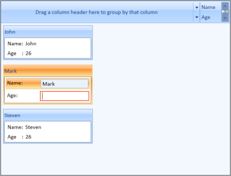

# Customizing Data Templates

Data templates can be customized for items and headers. This section explains how to customize the data templates.

## Item Template 

You can customize how a business object is displayed using ItemTemplate of [CardViewItem](https://help.syncfusion.com/cr/wpf/Syncfusion.Windows.Tools.Controls.CardViewItem.html). The following example shows the usage of ItemTemplate.



<syncfusion:CardView ItemsSource="{Binding Contacts}" >

	<syncfusion:CardView.ItemTemplate>

		<DataTemplate >

			<ListBox ScrollViewer.HorizontalScrollBarVisibility="Disabled">

				<ListBoxItem>

					<StackPanel Orientation="Horizontal">

						<TextBlock Text="Name:"/>

						<TextBlock Text="{Binding Name}" Margin="5,0,0,0"/>

					</StackPanel>

				</ListBoxItem>

				<ListBoxItem>

					<StackPanel Orientation="Horizontal">

						<TextBlock Text="Age    :"/>

						<TextBlock Text="{Binding Age}" Margin="5,0,0,0"/>

					</StackPanel>

				</ListBoxItem>

			</ListBox>

		</DataTemplate>

	</syncfusion:CardView.ItemTemplate>

</syncfusion:CardView>



Implementing the above code generates the following output.

CardView with ItemTemplate
{:.caption}

## Header Template 

You can also customize header of the CardViewItem using a header template. This is illustrated in the following example.

1. Define a data template for the header as follows.

   ~~~ xaml

	  <DataTemplate x:Key="headerTemplate">

				<Grid>

					<Border Background="Gray">

					<TextBlock Text="{Binding Path=Name}" Margin="5" Foreground="White" VerticalAlignment="Center" FontWeight="Bold" FontFamily="Bookman Old Style" Grid.Column="1"/>

					</Border>

				</Grid>

	  </DataTemplate>

   ~~~

2. Set the HeaderTemplate for the CardViewItem to the above template.

   ~~~ xaml

		<syncfusion:CardView ItemsSource="{Binding Contacts}" 

							 ItemTemplate="{StaticResource contactTemplate}" 

							 HeaderTemplate="{StaticResource headerTemplate}"

							/>

   ~~~

This generates the following CardView control.

  
CardView control with Header Template
{:.caption}

## EditItem Template

You can edit the values loaded in [CardViewItem](https://help.syncfusion.com/cr/wpf/Syncfusion.Windows.Tools.Controls.CardViewItem.html) using [EditItemTemplate](https://help.syncfusion.com/cr/wpf/Syncfusion.Windows.Tools.Controls.CardView.html#Syncfusion_Windows_Tools_Controls_CardView_EditItemTemplate). This is illustrated in the following example.

1. Define a data template for the content as follows.

   ~~~ xaml

		<DataTemplate x:Key="contactEditTemplate">

				<ListBox ScrollViewer.HorizontalScrollBarVisibility="Disabled" SelectedIndex="0" ToolTip="{Binding Path=Validation.HasError, ElementName=txt}">

					<ListBoxItem HorizontalContentAlignment="Stretch" Padding="1">

						<Grid >

							<Grid.ColumnDefinitions>

								<ColumnDefinition Width="75"/>

								<ColumnDefinition />

							</Grid.ColumnDefinitions>

							<TextBlock Text="Name:"/>

							<TextBox Grid.Column="1"   x:Name="txt" HorizontalAlignment="Stretch" Text="{Binding Name, UpdateSourceTrigger=PropertyChanged, ValidatesOnDataErrors=True}" />

						</Grid>

					</ListBoxItem>

					<ListBoxItem HorizontalContentAlignment="Stretch" Padding="1">

						<Grid >

							<Grid.ColumnDefinitions>

								<ColumnDefinition Width="75"/>

								<ColumnDefinition Width="*"/>

							</Grid.ColumnDefinitions>

							<TextBlock Text="Age:"/>

							<TextBox  Grid.Column="1"  Text="{Binding Age, UpdateSourceTrigger=PropertyChanged, ValidatesOnDataErrors=True}" />

						</Grid>

					</ListBoxItem>
					
				</ListBox>

		</DataTemplate>

   ~~~
   
2. Set EditItemTemplate for the CardView to the above template.

   ~~~ xaml

		<syncfusion:CardView ItemsSource="{Binding Contacts}" CanEdit="True" 

						 ItemTemplate="{StaticResource contactTemplate}" 

						 EditItemTemplate="{StaticResource contactEditTemplate}"

						 HeaderTemplate="{StaticResource headerTemplate}" />

   ~~~

Implementing the above codes generate the following CardView control. 

CardView with EditItemTemplate
{:.caption}

N> You can edit the values in the CardView control by double-clicking the CardViewItem.