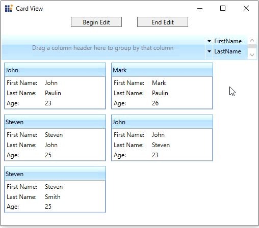
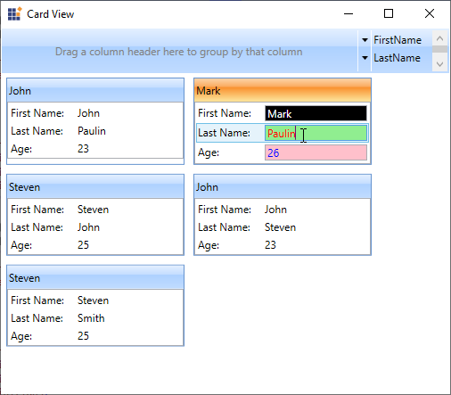

# Editing Mode in WPF Card View

This section describes how to enable or disable the edit mode and perform edit operation in [CardView](https://help.syncfusion.com/cr/wpf/Syncfusion.Windows.Tools.Controls.CardView.html) control.

## Enable/disable the editing mode

You can enable or disable the editing mode of card items by setting the [CanEdit](https://help.syncfusion.com/cr/wpf/Syncfusion.Windows.Tools.Controls.CardView.html#Syncfusion_Windows_Tools_Controls_CardView_CanEdit) property value as `true` or `false`. The default value of `CanEdit` property is `false`.

N> If you want edit the card items, you must set the `CanEdit` property value as `true`. Otherwise, you will not be able to perform the edit operation.




<syncfusion:CardView CanEdit="True" 
					 Name="cardView"/>




cardView.CanEdit = true;




N> [View Sample in GitHub](https://github.com/SyncfusionExamples/syncfusion-wpf-card-view-examples/blob/master/Samples/Editing)

## Card editing using keyboard and mouse interaction

You can edit the selected `CardViewItem` value by double-clicking on that item or by pressing the `F2` key. To get out from the editing mode, you need to press the `Esc` or `Enter` key.

N> To perform an edit operation on selected `CardViewItem`, you need to define the `CardViewItem` edit mode UI with editable functionalities by using [EditItemTemplate](https://help.syncfusion.com/cr/wpf/Syncfusion.Windows.Tools.Controls.CardView.html#Syncfusion_Windows_Tools_Controls_CardView_EditItemTemplate). `EditItemTemplate` is applied to the selected item in the edit mode, and `ItemTemplate` is applied to the selected item in the view mode.




//Model.cs
public class CardViewModel
{
    public string FirstName { get; set; }
    public string LastName { get; set; }
    public int Age { get; set; }
}

//ViewModel.cs
public class ViewModel : NotificationObject
{
    private ObservableCollection<CardViewModel> cardViewItems;
    public ObservableCollection<CardViewModel> CardViewItems
    {
        get { return cardViewItems; }
        set { cardViewItems = value;
            this.RaisePropertyChanged(nameof(CardViewItems)); }
    }
    public ViewModel()
    {
        CardViewItems = new ObservableCollection<CardViewModel>();
        populateItems();
    }
    private void populateItems()
    {
        CardViewItems.Add(new CardViewModel() { FirstName = "John", LastName= "Paulin", Age = 23});
        CardViewItems.Add(new CardViewModel() { FirstName = "Mark", LastName = "Paulin",Age = 26 });
        CardViewItems.Add(new CardViewModel() { FirstName = "Steven", LastName = "John", Age = 25 });
        CardViewItems.Add(new CardViewModel() { FirstName = "John", LastName = "Steven", Age = 23 });
        CardViewItems.Add(new CardViewModel() { FirstName = "Steven", LastName = "Smith", Age = 25 });
    }
}







<syncfusion:CardView CanEdit="True" 
                     ItemsSource="{Binding CardViewItems}"
					 Name="cardView">
    <syncfusion:CardView.EditItemTemplate>
        <DataTemplate>
            <ListBox ScrollViewer.HorizontalScrollBarVisibility="Disabled">
                <ListBoxItem Padding="1">
                    <Grid>
                        <Grid.ColumnDefinitions>
                            <ColumnDefinition Width="75" />
                            <ColumnDefinition />
                        </Grid.ColumnDefinitions>
                        <TextBlock Text="First Name:" />
                        <TextBox
                            Grid.Column="1"
                            Text="{Binding FirstName, 
                                   UpdateSourceTrigger=PropertyChanged}" />
                    </Grid>
                </ListBoxItem>
                <ListBoxItem Padding="1">
                    <Grid>
                        <Grid.ColumnDefinitions>
                            <ColumnDefinition Width="75" />
                            <ColumnDefinition Width="*" />
                        </Grid.ColumnDefinitions>
                        <TextBlock Text="Last Name:" />
                        <TextBox Grid.Column="1" 
                                 Text="{Binding LastName, 
                                        UpdateSourceTrigger=PropertyChanged}" />
                    </Grid>
                </ListBoxItem>
                <ListBoxItem Padding="1">
                    <Grid>
                        <Grid.ColumnDefinitions>
                            <ColumnDefinition Width="75" />
                            <ColumnDefinition Width="*" />
                        </Grid.ColumnDefinitions>
                        <TextBlock Text="Age:" />
                        <TextBox Grid.Column="1" 
                                 Text="{Binding Age, 
                                        UpdateSourceTrigger=PropertyChanged}" />
                    </Grid>
                </ListBoxItem>
            </ListBox>
        </DataTemplate>
    </syncfusion:CardView.EditItemTemplate>
    <syncfusion:CardView.HeaderTemplate>
        <DataTemplate>
            <TextBlock Text="{Binding FirstName}"/>
        </DataTemplate>
    </syncfusion:CardView.HeaderTemplate>
    <syncfusion:CardView.ItemTemplate>
        <DataTemplate >
            <ListBox ScrollViewer.HorizontalScrollBarVisibility="Disabled">
                <ListBoxItem Padding="1">
                    <Grid>
                        <Grid.ColumnDefinitions>
                            <ColumnDefinition Width="75" />
                            <ColumnDefinition />
                        </Grid.ColumnDefinitions>
                        <TextBlock Text="First Name:" />
                        <TextBlock Grid.Column="1"
                                   Text="{Binding FirstName,
                                          UpdateSourceTrigger=PropertyChanged}" />
                    </Grid>
                </ListBoxItem>
                <ListBoxItem Padding="1">
                    <Grid>
                        <Grid.ColumnDefinitions>
                            <ColumnDefinition Width="75" />
                            <ColumnDefinition Width="*" />
                        </Grid.ColumnDefinitions>
                        <TextBlock Text="Last Name:" />
                        <TextBlock Grid.Column="1" 
                                   Text="{Binding LastName, 
                                          UpdateSourceTrigger=PropertyChanged}" />
                    </Grid>
                </ListBoxItem>
                <ListBoxItem Padding="1">
                    <Grid>
                        <Grid.ColumnDefinitions>
                            <ColumnDefinition Width="75" />
                            <ColumnDefinition Width="*" />
                        </Grid.ColumnDefinitions>
                        <TextBlock Text="Age:" />
                        <TextBlock Grid.Column="1"
                                   Text="{Binding Age,
                                          UpdateSourceTrigger=PropertyChanged}" />
                    </Grid>
                </ListBoxItem>
            </ListBox>
        </DataTemplate>
    </syncfusion:CardView.ItemTemplate>        
</syncfusion:CardView>




cardView.CanEdit = true;




N> [View Sample in GitHub](https://github.com/SyncfusionExamples/syncfusion-wpf-card-view-examples/blob/master/Samples/Editing)

## Start card editing programmatically

If you want to programmatically start the edit mode of selected `CardViewItem`, use the [BeginEdit](https://help.syncfusion.com/cr/wpf/Syncfusion.Windows.Tools.Controls.CardView.html#Syncfusion_Windows_Tools_Controls_CardView_BeginEdit)  method. You can also programmatically change the edit mode to view mode by using the [EndEdit](https://help.syncfusion.com/cr/wpf/Syncfusion.Windows.Tools.Controls.CardView.html#Syncfusion_Windows_Tools_Controls_CardView_EndEdit) method.

N> You must set the `CanEdit` property as `true` to perform `BeginEdit` or `EndEdit`.




<Window.DataContext>
    <local:ViewModel/>
</Window.DataContext>
<Grid Margin="1">
    <Grid.RowDefinitions>
        <RowDefinition Height="auto"/>
        <RowDefinition/>
    </Grid.RowDefinitions>
    <StackPanel Grid.Row="0" Orientation="Horizontal">
        <Button Click="BeginEdit_Click" Content="Begin Edit"/>
        <Button Click="EndEdit_Click" Content="End Edit"/>
    </StackPanel>
    <syncfusion:CardView CanEdit="True" Grid.Row="1" 
                         ItemsSource="{Binding CardViewItems}"
                         Name="cardView">
        <syncfusion:CardView.EditItemTemplate>
            <DataTemplate>
                <ListBox ScrollViewer.HorizontalScrollBarVisibility="Disabled">
                    <ListBoxItem Padding="1" HorizontalContentAlignment="Stretch">
                        <Grid>
                            <Grid.ColumnDefinitions>
                                <ColumnDefinition Width="75" />
                                <ColumnDefinition />
                            </Grid.ColumnDefinitions>
                            <TextBlock Text="First Name:" />
                            <TextBox
                                Grid.Column="1"
                                Text="{Binding FirstName, 
                                       UpdateSourceTrigger=PropertyChanged}" />
                        </Grid>
                    </ListBoxItem>
                    <ListBoxItem Padding="1" HorizontalContentAlignment="Stretch">
                        <Grid>
                            <Grid.ColumnDefinitions>
                                <ColumnDefinition Width="75" />
                                <ColumnDefinition Width="*" />
                            </Grid.ColumnDefinitions>
                            <TextBlock Text="Last Name:" />
                            <TextBox Grid.Column="1" 
                                     Text="{Binding LastName, 
                                            UpdateSourceTrigger=PropertyChanged}" />
                        </Grid>
                    </ListBoxItem>
                    <ListBoxItem Padding="1" HorizontalContentAlignment="Stretch">
                        <Grid>
                            <Grid.ColumnDefinitions>
                                <ColumnDefinition Width="75" />
                                <ColumnDefinition Width="*" />
                            </Grid.ColumnDefinitions>
                            <TextBlock Text="Age:" />
                            <TextBox Grid.Column="1" 
                                     Text="{Binding Age, 
                                            UpdateSourceTrigger=PropertyChanged}" />
                        </Grid>
                    </ListBoxItem>
                </ListBox>
            </DataTemplate>
        </syncfusion:CardView.EditItemTemplate>
    </syncfusion:CardView>
</Grid>







private void BeginEdit_Click(object sender, RoutedEventArgs e) {
    //Turn on the edit mode
    cardView.BeginEdit();
}

private void EndEdit_Click(object sender, RoutedEventArgs e) {
    //Turn off the edit mode
    cardView.EndEdit();
}




N> [View Sample in GitHub](https://github.com/SyncfusionExamples/syncfusion-wpf-card-view-examples/tree/master/Samples/CardView-EditMode)

## Custom UI for edit mode CardViewItem

You can change the appearance of card items in edit mode by using `EditItemTemplate` property. The `DataContext` of `EditItemTemplate` property is `CardViewItem`.




<syncfusion:CardView CanEdit="True"
                     ItemsSource="{Binding CardViewItems}" Name="cardView">
    <syncfusion:CardView.EditItemTemplate>
        <DataTemplate>
            <ListBox ScrollViewer.HorizontalScrollBarVisibility="Disabled">
                <ListBoxItem Padding="1" HorizontalContentAlignment="Stretch">
                    <Grid>
                        <Grid.ColumnDefinitions>
                            <ColumnDefinition Width="75" />
                            <ColumnDefinition />
                        </Grid.ColumnDefinitions>
                        <TextBlock Text="First Name:" />
                        <TextBox
                            Background="Black"
                            Foreground="White"
                            Grid.Column="1"
                            Text="{Binding FirstName, 
                                   UpdateSourceTrigger=PropertyChanged}" />
                    </Grid>
                </ListBoxItem>
                <ListBoxItem Padding="1" HorizontalContentAlignment="Stretch">
                    <Grid>
                        <Grid.ColumnDefinitions>
                            <ColumnDefinition Width="75" />
                            <ColumnDefinition Width="*" />
                        </Grid.ColumnDefinitions>
                        <TextBlock Text="Last Name:" />
                        <TextBox 
                            Background="LightGreen"
                            Foreground="Red"
                            Grid.Column="1" 
                            Text="{Binding LastName, 
                                   UpdateSourceTrigger=PropertyChanged}" />
                    </Grid>
                </ListBoxItem>
                <ListBoxItem Padding="1" HorizontalContentAlignment="Stretch">
                    <Grid>
                        <Grid.ColumnDefinitions>
                            <ColumnDefinition Width="75" />
                            <ColumnDefinition Width="*" />
                        </Grid.ColumnDefinitions>
                        <TextBlock Text="Age:" />
                        <TextBox 
                            Background="Pink"
                            Foreground="Blue"
                            Grid.Column="1" 
                            Text="{Binding Age, 
                                   UpdateSourceTrigger=PropertyChanged}" />
                    </Grid>
                </ListBoxItem>
            </ListBox>
        </DataTemplate>
    </syncfusion:CardView.EditItemTemplate>




cardView.CanEdit = true;




N> [View Sample in GitHub](https://github.com/SyncfusionExamples/syncfusion-wpf-card-view-examples/blob/master/Samples/CustomUI)

