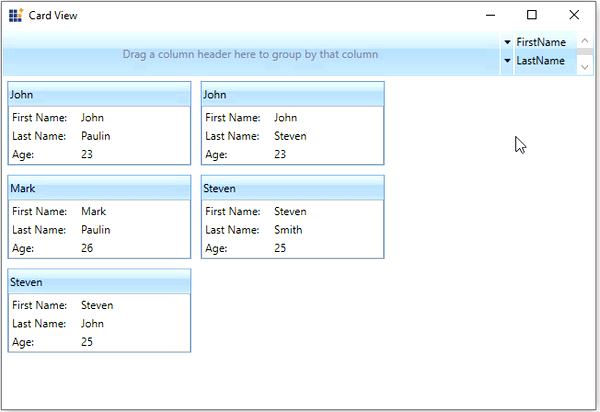

# Filtering Mode in WPF Card View

This section describes how to enable or disable the filtering mode and perform filter operations in [CardView](https://help.syncfusion.com/cr/wpf/Syncfusion.Windows.Tools.Controls.CardView.html) control.

## Filter the CardViewItems

Cards can be filtered by the values which are given for the fields. To filter the cards, just check the values that is listed in the popup.




//Model.cs
public class CardViewModel
{
    public string FirstName { get; set; }
    public string LastName { get; set; }
    public int Age { get; set; }
}

//ViewModel.cs
public class ViewModel : NotificationObject
{
    private ObservableCollection<CardViewModel> cardViewItems;
    public ObservableCollection<CardViewModel> CardViewItems
    {
        get { return cardViewItems; }
        set { cardViewItems = value;
            this.RaisePropertyChanged(nameof(CardViewItems)); }
    }
    public ViewModel()
    {
        CardViewItems = new ObservableCollection<CardViewModel>();
        populateItems();
    }
    private void populateItems()
    {
        CardViewItems.Add(new CardViewModel() { FirstName = "John", LastName= "Paulin", Age = 23});
        CardViewItems.Add(new CardViewModel() { FirstName = "Mark", LastName = "Paulin",Age = 26 });
        CardViewItems.Add(new CardViewModel() { FirstName = "Steven", LastName = "John", Age = 25 });
        CardViewItems.Add(new CardViewModel() { FirstName = "John", LastName = "Steven", Age = 23 });
        CardViewItems.Add(new CardViewModel() { FirstName = "Steven", LastName = "Smith", Age = 25 });
    }
}







<syncfusion:CardView ItemsSource="{Binding CardViewItems}"
					 Name="cardView">
    <syncfusion:CardView.HeaderTemplate>
        <DataTemplate>
            <TextBlock Text="{Binding FirstName}"/>
        </DataTemplate>
    </syncfusion:CardView.HeaderTemplate>
    <syncfusion:CardView.ItemTemplate>
        <DataTemplate >
            <ListBox ScrollViewer.HorizontalScrollBarVisibility="Disabled">
                <ListBoxItem Padding="1">
                    <Grid>
                        <Grid.ColumnDefinitions>
                            <ColumnDefinition Width="75" />
                            <ColumnDefinition />
                        </Grid.ColumnDefinitions>
                        <TextBlock Text="First Name:" />
                        <TextBlock Grid.Column="1"
                                   Text="{Binding FirstName,
                                          UpdateSourceTrigger=PropertyChanged}" />
                    </Grid>
                </ListBoxItem>
                <ListBoxItem Padding="1">
                    <Grid>
                        <Grid.ColumnDefinitions>
                            <ColumnDefinition Width="75" />
                            <ColumnDefinition Width="*" />
                        </Grid.ColumnDefinitions>
                        <TextBlock Text="Last Name:" />
                        <TextBlock Grid.Column="1" 
                                   Text="{Binding LastName, 
                                          UpdateSourceTrigger=PropertyChanged}" />
                    </Grid>
                </ListBoxItem>
                <ListBoxItem Padding="1">
                    <Grid>
                        <Grid.ColumnDefinitions>
                            <ColumnDefinition Width="75" />
                            <ColumnDefinition Width="*" />
                        </Grid.ColumnDefinitions>
                        <TextBlock Text="Age:" />
                        <TextBlock Grid.Column="1"
                                   Text="{Binding Age,
                                          UpdateSourceTrigger=PropertyChanged}" />
                    </Grid>
                </ListBoxItem>
            </ListBox>
        </DataTemplate>
    </syncfusion:CardView.ItemTemplate>        
</syncfusion:CardView>




N> [View Sample in GitHub](https://github.com/SyncfusionExamples/syncfusion-wpf-card-view-examples/blob/master/Samples/Editing)

## Reset the filter

If you want to reset the filtered card selection, click the `Clear Filter` button that is placed in the bottom of field's value list popup. Then, it will remove the filtered items and shows all card items

N> [View Sample in GitHub](https://github.com/SyncfusionExamples/syncfusion-wpf-card-view-examples/blob/master/Samples/Editing)

## Hide the filtering header

You can hide the filtering header by using the [ShowHeader](https://help.syncfusion.com/cr/wpf/Syncfusion.Windows.Tools.Controls.CardView.html#Syncfusion_Windows_Tools_Controls_CardView_ShowHeader) property value as `false`. The default value of `ShowHeader` property is `true`.




<syncfusion:CardView ShowHeader="False" 
                     ItemsSource="{Binding CardViewItems}"
					 Name="cardView"/>



cardView.ShowHeader = false;




N> [View Sample in GitHub](https://github.com/SyncfusionExamples/syncfusion-wpf-card-view-examples/blob/master/Samples/Editing)
