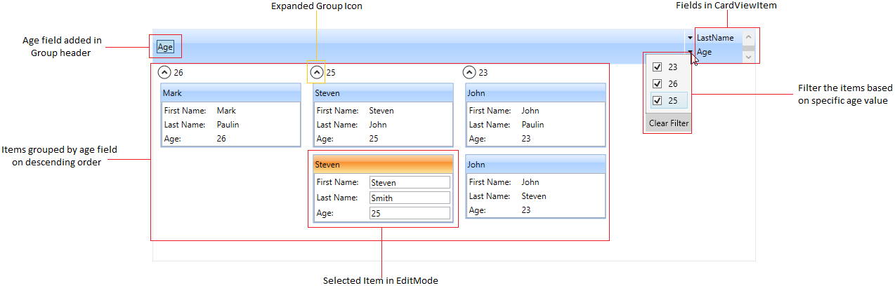
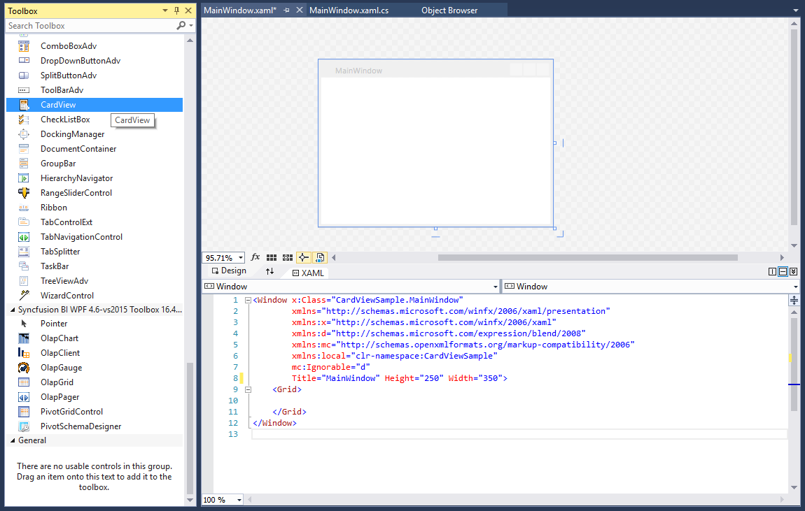
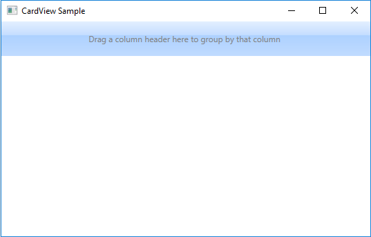
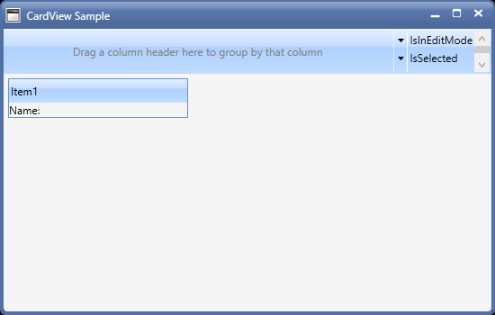
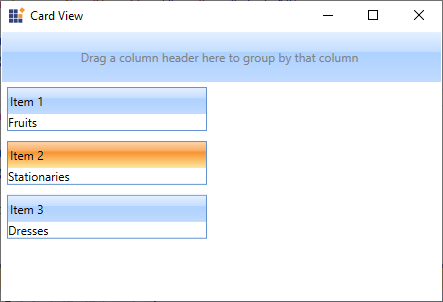

# Getting Started with WPF CardView

This section describes how to create a [CardView](https://help.syncfusion.com/cr/wpf/Syncfusion.Windows.Tools.Controls.CardView.html) control in a WPF application and overview of its basic functionalities.

## Structure of CardView control

## Assembly deployment

Refer to the [Control Dependencies](https://help.syncfusion.com/wpf/control-dependencies#cardview) section to get the list of assemblies or NuGet package that needs to be added as a reference to use the control in any application.

Refer to the [NuGet Packages Documentation](https://help.syncfusion.com/wpf/visual-studio-integration/nuget-packages) to find more details about installing nuget packages in a WPF application.

## Adding WPF CardView control via designer

1. The `CardView` control can be added to an application by dragging it from the toolbox to a designer view. The following dependent assemblies will be added automatically:
	* Syncfusion.Shared.WPF
	* Syncfusion.Tools.WPF

2. Set the properties for `CardView` control in design mode using the SmartTag feature.

## Adding WPF CardView control via XAML

To add the `CardView` control manually in XAML, follow these steps:

1.  Create a new WPF project in Visual Studio.
2. Add the following required assembly references to the project:
	* Syncfusion.Shared.WPF
	* Syncfusion.Tools.WPF
3. Import Syncfusion WPF schema **http://schemas.syncfusion.com/wpf**, and declare the `CardView` control in XAML page.





<Window x:Class="CardViewSample.MainWindow"
        xmlns="http://schemas.microsoft.com/winfx/2006/xaml/presentation"
        xmlns:x="http://schemas.microsoft.com/winfx/2006/xaml"
        xmlns:d="http://schemas.microsoft.com/expression/blend/2008"
        xmlns:mc="http://schemas.openxmlformats.org/markup-compatibility/2006"
        xmlns:local="clr-namespace:CardViewSample"
        xmlns:syncfusion="http://schemas.syncfusion.com/wpf"
        mc:Ignorable="d"
        Title="Card View" Height="450" Width="800">

    <Grid Name="grid">
        <syncfusion:CardView Name="cardView"/>
    </Grid>
</Window>




## Adding WPF CardView control via C#

To add the `CardView` control manually in C#, follow these steps:

1. Create a new WPF application via Visual Studio.
2. Add the following required assembly references to the project:
	* Syncfusion.Shared.WPF
	* Syncfusion.Tools.WPF
3) Include the required namespace.




using Syncfusion.Windows.Tools.Controls;




4) Create an instance of `CardView` control, and add it to the window.




namespace CardViewSample
{
    public partial class MainWindow : Window
    {
        public MainWindow()
        {
            InitializeComponent();
            //Creating an instance of CardView control
            CardView cardView = new CardView ();

            //Adding CardView as window content
            this.Content = cardView;
        }
    }
}




N> [View Sample in GitHub](https://github.com/SyncfusionExamples/syncfusion-wpf-card-view-examples/blob/master/Samples/Getting-Started)

## Populating items using CardViewItem

You can add the card items inside the control by adding the [CardViewItem](https://help.syncfusion.com/cr/wpf/Syncfusion.Windows.Tools.Controls.CardViewItem.html) into the `CardView.Items` collection property.




<syncfusion:CardView Name="cardView">
    <syncfusion:CardViewItem Header="Item 1">
        <TextBlock Text="Fruits"/>
    </syncfusion:CardViewItem>
    <syncfusion:CardViewItem Header="Item 2">
        <TextBlock Text="Stationaries"/>
    </syncfusion:CardViewItem>
    <syncfusion:CardViewItem Header="Item 3">
        <TextBlock Text="Dresses"/>
    </syncfusion:CardViewItem>
</syncfusion:CardView>




CardViewItem cardViewItem1 = new CardViewItem()
{
    Header = "Item 1",
    Content = new TextBlock() { Text = "Fruits" }
};
CardViewItem cardViewItem2 = new CardViewItem()
{
    Header = "Item 2",
    Content = new TextBlock() { Text = "Stationaries" }
};
CardViewItem cardViewItem3 = new CardViewItem()
{
    Header = "Item 3",
    Content = new TextBlock() { Text = "Dresses" }
};

CardView cardView= new CardView();
cardView.Items.Add(cardViewItem1);
cardView.Items.Add(cardViewItem2);
cardView.Items.Add(cardViewItem3);




N> [View Sample in GitHub](https://github.com/SyncfusionExamples/syncfusion-wpf-card-view-examples/blob/master/Samples/Getting-Started)

## Populating items using ItemsSource

You can populate the card items to the `CardView` control by using the `ItemsSource` property. You need to use [HeaderTemplate](https://help.syncfusion.com/cr/wpf/Syncfusion.Windows.Tools.Controls.CardView.html#Syncfusion_Windows_Tools_Controls_CardView_HeaderTemplate) and `ItemTemplate` to populate the items into the view.

N> You can use the grouping, sorting, filtering and editing functionalities only by populating the card items through the `ItemsSource` property.




//Model.cs
public class CardViewModel
{
    public string Item { get; set; }
    public string Name { get; set; }     
}

//ViewModel.cs
public class ViewModel : NotificationObject
{
    private ObservableCollection<CardViewModel> cardViewItems;
    public ObservableCollection<CardViewModel> CardViewItems
    {
        get { return cardViewItems; }
        set { cardViewItems = value;
            this.RaisePropertyChanged(nameof(CardViewItems)); }
    }
    public ViewModel()
    {
        CardViewItems = new ObservableCollection<CardViewModel>();
        populateItems();
    }
    private void populateItems()
    {
        CardViewItems.Add(new CardViewModel() { Item="Item 1", Name = "Fruits" });
        CardViewItems.Add(new CardViewModel() { Item="Item 2", Name = "Stationaries" });
        CardViewItems.Add(new CardViewModel() { Item = "Item 3", Name = "Dresses" });
    }
}







<syncfusion:CardView ItemsSource="{Binding CardViewItems}"
                	 Name="cardView">
    <syncfusion:CardView.HeaderTemplate>
        <DataTemplate>
            <TextBlock Text="{Binding Item}"/>
        </DataTemplate>
    </syncfusion:CardView.HeaderTemplate>
    <syncfusion:CardView.ItemTemplate>
        <DataTemplate>
            <StackPanel Orientation="Horizontal">
                <TextBlock Text="Name:" 
				           Margin="5" />
                <TextBlock Grid.Column="1"
                           Margin="5"
                           Text="{Binding Name, UpdateSourceTrigger=PropertyChanged}" />
            </StackPanel>
        </DataTemplate>
    </syncfusion:CardView.ItemTemplate>          
</syncfusion:CardView>




N> [View Sample in GitHub](https://github.com/SyncfusionExamples/syncfusion-wpf-card-view-examples/blob/master/Samples/PopulateItems)

## Select a CardViewItem

You can select any card item by mouse click on the specific item. You can get the selected item by using the [SelectedItem](https://help.syncfusion.com/cr/wpf/Syncfusion.Windows.Tools.Controls.CardView.html#Syncfusion_Windows_Tools_Controls_CardView_SelectedItem) property. The default value of `SelectedItem` property is `null`.

N> You can select only one item at a time.




<syncfusion:CardView Name="cardView">
    <syncfusion:CardViewItem Header="Item 1">
        <TextBlock Text="Fruits"/>
    </syncfusion:CardViewItem>
    <syncfusion:CardViewItem Header="Item 2">
        <TextBlock Text="Stationaries"/>
    </syncfusion:CardViewItem>
    <syncfusion:CardViewItem Header="Item 3">
        <TextBlock Text="Dresses"/>
    </syncfusion:CardViewItem>
</syncfusion:CardView>




CardViewItem cardViewItem1 = new CardViewItem()
{
    Header = "Item 1",
    Content = new TextBlock() { Text = "Fruits" }
};
CardViewItem cardViewItem2 = new CardViewItem()
{
    Header = "Item 2",
    Content = new TextBlock() { Text = "Stationaries" }
};
CardViewItem cardViewItem3 = new CardViewItem()
{
    Header = "Item 3",
    Content = new TextBlock() { Text = "Dresses" }
};

CardView cardView= new CardView();
cardView.Items.Add(cardViewItem1);
cardView.Items.Add(cardViewItem2);
cardView.Items.Add(cardViewItem3);




N> [View Sample in GitHub](https://github.com/SyncfusionExamples/syncfusion-wpf-card-view-examples/blob/master/Samples/Getting-Started)

## Select CardViewItem programmatically using property

You can select a particular card item programmatically by using the [CardViewItem.IsSelected](https://help.syncfusion.com/cr/wpf/Syncfusion.Windows.Tools.Controls.CardViewItem.html#Syncfusion_Windows_Tools_Controls_CardViewItem_IsSelected) property. The default value of `CardViewItem.IsSelected` property is `false`.




<syncfusion:CardView Name="cardView">
    <syncfusion:CardViewItem Header="Item 1" >
        <TextBlock Text="Fruits"/>
    </syncfusion:CardViewItem>
    <syncfusion:CardViewItem Header="Item 2"
                             IsSelected="True">
        <TextBlock Text="Stationaries"/>
    </syncfusion:CardViewItem>
    <syncfusion:CardViewItem Header="Item 3">
        <TextBlock Text="Dresses"/>
    </syncfusion:CardViewItem>
</syncfusion:CardView>




CardViewItem cardViewItem1 = new CardViewItem()
{
    Header = "Item 1",
    Content = new TextBlock() { Text = "Fruits" }
};
CardViewItem cardViewItem2 = new CardViewItem()
{
    Header = "Item 2",
    IsSelected = true,
    Content = new TextBlock() { Text = "Stationaries" }
};
CardViewItem cardViewItem3 = new CardViewItem()
{
    Header = "Item 3",
    Content = new TextBlock() { Text = "Dresses" }
};

CardView cardView= new CardView();
cardView.Items.Add(cardViewItem1);
cardView.Items.Add(cardViewItem2);
cardView.Items.Add(cardViewItem3);




N> [View Sample in GitHub](https://github.com/SyncfusionExamples/syncfusion-wpf-card-view-examples/blob/master/Samples/Getting-Started)

## Group the CardViewItems

You can group the cards inside the `CardView` control by dragging the required fields from the list and drop it into the dropping region of the `CardView` control header. If you want to disable the grouping, use the [CanGroup](https://help.syncfusion.com/cr/wpf/Syncfusion.Windows.Tools.Controls.CardView.html#Syncfusion_Windows_Tools_Controls_CardView_CanGroup) property value as `false`.




//Model.cs
public class CardViewModel
{
    public string FirstName { get; set; }
    public string LastName { get; set; }
    public int Age { get; set; }
}

//ViewModel.cs
public class ViewModel : NotificationObject
{
    private ObservableCollection<CardViewModel> cardViewItems;
    public ObservableCollection<CardViewModel> CardViewItems
    {
        get { return cardViewItems; }
        set { cardViewItems = value;
            this.RaisePropertyChanged(nameof(CardViewItems)); }
    }
    public ViewModel()
    {
        CardViewItems = new ObservableCollection<CardViewModel>();
        populateItems();
    }
    private void populateItems()
    {
        CardViewItems.Add(new CardViewModel() { FirstName = "John", LastName= "Paulin", Age = 23});
        CardViewItems.Add(new CardViewModel() { FirstName = "Mark", LastName = "Paulin",Age = 26 });
        CardViewItems.Add(new CardViewModel() { FirstName = "Steven", LastName = "John", Age = 25 });
        CardViewItems.Add(new CardViewModel() { FirstName = "John", LastName = "Steven", Age = 23 });
        CardViewItems.Add(new CardViewModel() { FirstName = "Steven", LastName = "Smith", Age = 25 });
    }
}







<syncfusion:CardView CanGroup="True" 
                     ItemsSource="{Binding CardViewItems}"
					 Name="cardView">
    <syncfusion:CardView.HeaderTemplate>
        <DataTemplate>
            <TextBlock Text="{Binding FirstName}"/>
        </DataTemplate>
    </syncfusion:CardView.HeaderTemplate>
    <syncfusion:CardView.ItemTemplate>
        <DataTemplate >
            <ListBox ScrollViewer.HorizontalScrollBarVisibility="Disabled">
                <ListBoxItem Padding="1">
                    <Grid>
                        <Grid.ColumnDefinitions>
                            <ColumnDefinition Width="75" />
                            <ColumnDefinition />
                        </Grid.ColumnDefinitions>
                        <TextBlock Text="First Name:" />
                        <TextBlock Grid.Column="1"
                                   Text="{Binding FirstName,
                                          UpdateSourceTrigger=PropertyChanged}" />
                    </Grid>
                </ListBoxItem>
                <ListBoxItem Padding="1">
                    <Grid>
                        <Grid.ColumnDefinitions>
                            <ColumnDefinition Width="75" />
                            <ColumnDefinition Width="*" />
                        </Grid.ColumnDefinitions>
                        <TextBlock Text="Last Name:" />
                        <TextBlock Grid.Column="1" 
                                   Text="{Binding LastName, 
                                          UpdateSourceTrigger=PropertyChanged}" />
                    </Grid>
                </ListBoxItem>
                <ListBoxItem Padding="1">
                    <Grid>
                        <Grid.ColumnDefinitions>
                            <ColumnDefinition Width="75" />
                            <ColumnDefinition Width="*" />
                        </Grid.ColumnDefinitions>
                        <TextBlock Text="Age:" />
                        <TextBlock Grid.Column="1"
                                   Text="{Binding Age,
                                          UpdateSourceTrigger=PropertyChanged}" />
                    </Grid>
                </ListBoxItem>
            </ListBox>
        </DataTemplate>
    </syncfusion:CardView.ItemTemplate>        
</syncfusion:CardView>




cardView.CanGroup = true;




Here, `CardViewItems` grouped based on `Age` field.

N> [View Sample in GitHub](https://github.com/SyncfusionExamples/syncfusion-wpf-card-view-examples/blob/master/Samples/Editing)

## Sort the CardViewItems

You can sort the cards inside the `CardView` control either default, ascending or descending order by clicking the field names listed in the header. If you want to disable the sorting, use the [CanSort](https://help.syncfusion.com/cr/wpf/Syncfusion.Windows.Tools.Controls.CardView.html#Syncfusion_Windows_Tools_Controls_CardView_CanSort) property value as `false`.




<syncfusion:CardView CanSort="True" 
                     ItemsSource="{Binding CardViewItems}"
					 Name="cardView"/>




cardView.CanSort = true;




Here, `CardViewItems` sorted based on `FirstName` field.

N> [View Sample in GitHub](https://github.com/SyncfusionExamples/syncfusion-wpf-card-view-examples/blob/master/Samples/Editing)

##  Edit the CardViewItems

You can edit the selected `CardViewItem` value by double-clicking on that item or by pressing the `F2` key. To get out from the editing mode, you need to press the `Esc` or `Enter` key. You can enable the editing mode of card items by setting the [CanEdit](https://help.syncfusion.com/cr/wpf/Syncfusion.Windows.Tools.Controls.CardView.html#Syncfusion_Windows_Tools_Controls_CardView_CanEdit) property value as `true`

N> To perform an edit operation on selected `CardViewItem`, you need to define the `CardViewItem` edit mode UI with editable functionalities by using [EditItemTemplate](https://help.syncfusion.com/cr/wpf/Syncfusion.Windows.Tools.Controls.CardView.html#Syncfusion_Windows_Tools_Controls_CardView_EditItemTemplate).




<syncfusion:CardView CanEdit="True" 
                     ItemsSource="{Binding CardViewItems}"
					 Name="cardView">
    <syncfusion:CardView.EditItemTemplate>
        <DataTemplate>
            <ListBox ScrollViewer.HorizontalScrollBarVisibility="Disabled">
                <ListBoxItem Padding="1">
                    <Grid>
                        <Grid.ColumnDefinitions>
                            <ColumnDefinition Width="75" />
                            <ColumnDefinition />
                        </Grid.ColumnDefinitions>
                        <TextBlock Text="First Name:" />
                        <TextBox
                            Grid.Column="1"
                            Text="{Binding FirstName, 
                                   UpdateSourceTrigger=PropertyChanged}" />
                    </Grid>
                </ListBoxItem>
                <ListBoxItem Padding="1">
                    <Grid>
                        <Grid.ColumnDefinitions>
                            <ColumnDefinition Width="75" />
                            <ColumnDefinition Width="*" />
                        </Grid.ColumnDefinitions>
                        <TextBlock Text="Last Name:" />
                        <TextBox Grid.Column="1" 
                                 Text="{Binding LastName, 
                                        UpdateSourceTrigger=PropertyChanged}" />
                    </Grid>
                </ListBoxItem>
                <ListBoxItem Padding="1">
                    <Grid>
                        <Grid.ColumnDefinitions>
                            <ColumnDefinition Width="75" />
                            <ColumnDefinition Width="*" />
                        </Grid.ColumnDefinitions>
                        <TextBlock Text="Age:" />
                        <TextBox Grid.Column="1" 
                                 Text="{Binding Age, 
                                        UpdateSourceTrigger=PropertyChanged}" />
                    </Grid>
                </ListBoxItem>
            </ListBox>
        </DataTemplate>
    </syncfusion:CardView.EditItemTemplate>     
</syncfusion:CardView>




cardView.CanEdit = true;




N> [View Sample in GitHub](https://github.com/SyncfusionExamples/syncfusion-wpf-card-view-examples/blob/master/Samples/Editing)

## Orientation of CardViewItems

You can arrange the cards either vertically or horizontally by using the [Orientation](https://help.syncfusion.com/cr/wpf/Syncfusion.Windows.Tools.Controls.CardView.html#Syncfusion_Windows_Tools_Controls_CardView_Orientation) property. The default value of `Orientation` property is `Vertical`.

N> If there is no enough space to arrange the cards either vertically or horizontally that is assigned by `Orientation` property, then `CardView` will automatically arrange the cards at available position.




<syncfusion:CardView Orientation="Horizontal" 
                     ItemsSource="{Binding CardViewItems}"
					 Name="cardView"/>




cardView.Orientation = Orientation.Horizontal;




N> [View Sample in GitHub](https://github.com/SyncfusionExamples/syncfusion-wpf-card-view-examples/blob/master/Samples/Editing)

## Selected item changed notification

You will be notified when selected card item changed in `CardView` by using [SelectedItemChanged](https://help.syncfusion.com/cr/wpf/Syncfusion.Windows.Tools.Controls.CardView.html#Syncfusion_Windows_Tools_Controls_CardView_SelectedItemChanged) event. The `SelectedItemChanged` event contains the old and newly selected card item in the `OldValue` and `NewValue` properties.




<syncfusion:CardView SelectedItemChanged="CardView_SelectedItemChanged"
                     ItemsSource="{Binding CardViewItems}"
					 Name="cardView"/>




cardView.SelectedItemChanged += CardView_SelectedItemChanged;




You can handle the event as follows:




private void CardView_SelectedItemChanged(DependencyObject d, DependencyPropertyChangedEventArgs e)
{
    var newItem = e.NewValue;
    var oldItem = e.OldValue;          
}




## Theme

CardView supports various built-in themes. Refer to the below links to apply themes for the CardView,

  * [Apply theme using SfSkinManager](https://help.syncfusion.com/wpf/themes/skin-manager)
	
  * [Create a custom theme using ThemeStudio](https://help.syncfusion.com/wpf/themes/theme-studio#creating-custom-theme)

  