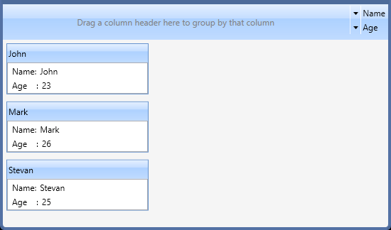

# Getting Started with WPF Card View

## Assembly deployment

Refer to the [control dependencies](https://help.syncfusion.com/wpf/control-dependencies#cardview) section to get the list of assemblies or NuGet package that needs to be added as reference to use the control in any application.

You can refer this [documentation](https://help.syncfusion.com/wpf/visual-studio-integration/nuget-packages) to find more details about installing the NuGet package in a WPF application.

## Creating a simple application with CardView

You can create a WPF application with CardView control using the following steps:

1.	[Create a project.](#creating-a-project)
2.	[Add control via designer.](#adding-control-via-designer)
3.	[Add control manually in XAML.](#adding-control-manually-in-xaml)
4.	[Add control manually in C#.](#adding-control-manually-in-c)
5.	[Add items using CardViewItem.](#adding-items-using-cardviewitem)
6.	[Bind to data.](#binding-to-data)
7.	[Group the cards.](#grouping)
8.	[Sort the cards.](#sorting)
9.	[Edit the fields.](#editing)

### Creating a project

Create a new WPF project in Visual Studio to display the CardView with functionalities.

## Adding control via designer

The CardView control can be added to an application by dragging it from the toolbox to a designer view. The required assembly references will be added automatically.

## Adding control manually in XAML

To add control manually in XAML, follow the given steps:

1.	Add the following required assembly reference to the project:
	* Syncfusion.Tools.WPF
	* Syncfusion.Shared.WPF 
2.	Import Syncfusion WPF schema **http://schemas.syncfusion.com/wpf** in XAML page.
3.	Declare the CardView control in XAML page.



<Window xmlns="http://schemas.microsoft.com/winfx/2006/xaml/presentation"
        xmlns:x="http://schemas.microsoft.com/winfx/2006/xaml"
        xmlns:syncfusion="http://schemas.syncfusion.com/wpf" 
        x:Class=" CardViewSample.MainWindow"
        Title="CardView Sample" Height="350" Width="525">
    <Grid>
		<!-- CardView Control -->
		<syncfusion:CardView x:Name="cardView"/>
    </Grid>
</Window>



## Adding control manually in C\#

To add control manually in C#, follow the given steps:

1.	Add the following required assembly references to the project:
	* Syncfusion.Tools.WPF
	* Syncfusion.Shared.WPF
2.	Import the CardView namespace **using Syncfusion.Windows.Tools.Controls;**.
3.	Create a CardView instance, and add it to the window.



using Syncfusion.Windows.Tools.Controls; 
namespace CardViewSample
{
    /// 
    /// Interaction logic for MainWindow.xaml
    /// 
    public partial class MainWindow : Window
    {
        public MainWindow()
        {
            InitializeComponent();
            //Creating an instance of CardView control
            CardView cardView = new CardView ();
            //Adding CardView as window content
            this.Content = cardView;
        }
    }
}



## Adding Items using CardViewItem

You can add the items inside the CardView control using [CardViewItem](https://help.syncfusion.com/cr/wpf/Syncfusion.Windows.Tools.Controls.CardViewItem.html).



<syncfusion:CardView >
    <syncfusion:CardViewItem Header="Item1" >
		<TextBlock Text="Name:"/>
     </syncfusion:CardViewItem>
</syncfusion:CardView>


CardView cardView = new CardView();
CardViewItem cardViewItem1 = new CardViewItem();
cardViewItem1.Header = "Item1";
TextBlock tBlock = new TextBlock() { Text = "Name:" };
cardViewItem1.Content = tBlock;
cardView.Items.Add(cardViewItem1);
this.Content = cardView;



## Binding to data

You can bind to a business object collection using the ItemsSource and ItemTemplate properties of the CardView control. Refer to the [Data binding](https://help.syncfusion.com/wpf/cardview/data-binding-to-objects) section for more details.

* **Model.cs**



public class CardViewModel	
{
	public string Name
	{
		get;
		set;
	}
	public int Age
	{
		get;
		set;
	}
}



* **ViewModel.cs**



public class ViewModel
{
	private ObservableCollection<CardViewModel> cardViewItems;
	public ObservableCollection<CardViewModel> CardViewItems
	{
		get { return cardViewItems; }
		set { cardViewItems = value; this.RaisePropertyChanged("CardViewItems"); }
	}
	public ViewModel()
	{
		CardViewItems = new ObservableCollection<CardViewModel>();
		populateItems();
	}
	private void populateItems()
	{
		CardViewItems.Add(new CardViewModel() { Name = "John", Age = 23 });
		CardViewItems.Add(new CardViewModel() { Name = "Mark", Age = 26 });
		CardViewItems.Add(new CardViewModel() { Name = "Steven", Age = 25 });
	}
}



* **MainWindow.Xaml**



<Window.DataContext>
    <local:ViewModel/>
</Window.DataContext>

<syncfusion:CardView ItemsSource="{Binding CardViewItems}" >
	<syncfusion:CardView.ItemTemplate>
		<DataTemplate >
			<ListBox ScrollViewer.HorizontalScrollBarVisibility="Disabled">
				<ListBoxItem>
					<StackPanel Orientation="Horizontal">
						<TextBlock Text="Name:"/>
						<TextBlock Text="{Binding Name}" Margin="5,0,0,0"/>
					</StackPanel>
				</ListBoxItem>
				<ListBoxItem>
					<StackPanel Orientation="Horizontal">
						<TextBlock Text="Age:"/>
						<TextBlock Text="{Binding Age}" Margin="5,0,0,0"/>
					</StackPanel>
				</ListBoxItem>
			</ListBox>
		</DataTemplate>
	</syncfusion:CardView.ItemTemplate>
	<syncfusion:CardView.HeaderTemplate>
		<DataTemplate>
			<TextBlock Text="{Binding Name}"/>
		</DataTemplate>
	</syncfusion:CardView.HeaderTemplate>
</syncfusion:CardView>



## Grouping

You can group the cards inside the CardView control by enabling the [CanGroup](https://help.syncfusion.com/cr/wpf/Syncfusion.Windows.Tools.Controls.CardView.html#Syncfusion_Windows_Tools_Controls_CardView_CanGroup) property.



<!--Gropuing cards -->
<syncfusion:CardView CanGroup="True "/>


//For grouping cards
cardview.CanGroup =true;



## Sorting

You can sort the cards inside the CardView control by enabling the [CanSort](https://help.syncfusion.com/cr/wpf/Syncfusion.Windows.Tools.Controls.CardView.html#Syncfusion_Windows_Tools_Controls_CardView_CanSort) property.



<!--Sorting cards-->
<syncfusion:CardView CanSort="True "/>


//For sorting cards
cardview.CanSort =true;



## Editing

You can edit the fields available in the cards by enabling [CanEdit](https://help.syncfusion.com/cr/wpf/Syncfusion.Windows.Tools.Controls.CardView.html#Syncfusion_Windows_Tools_Controls_CardView_CanEdit) property of CardView control.



<!--Editing cards field -->
<syncfusion:CardView CanEdit="True"/>


//For editing cards field
cardview.CanEdit = true;



