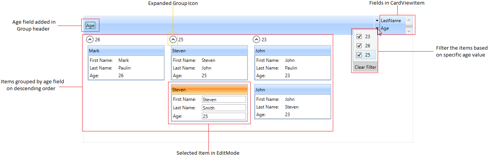
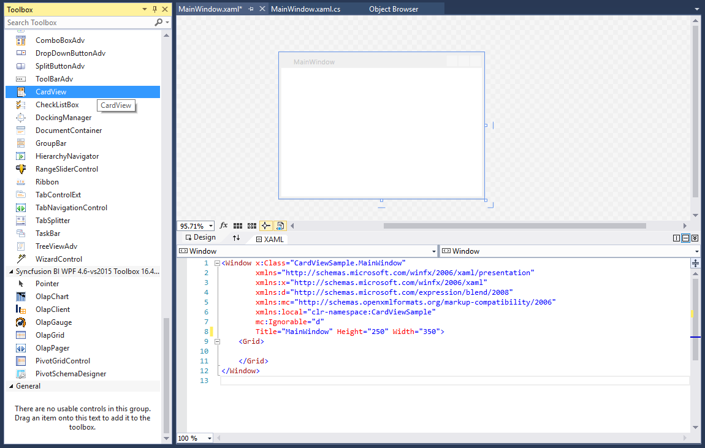
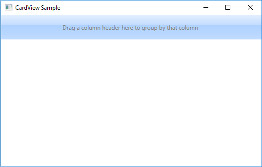
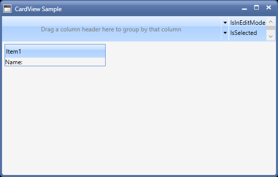
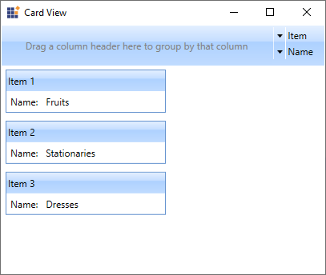
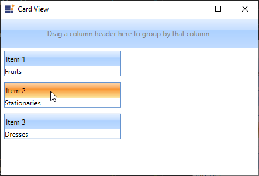
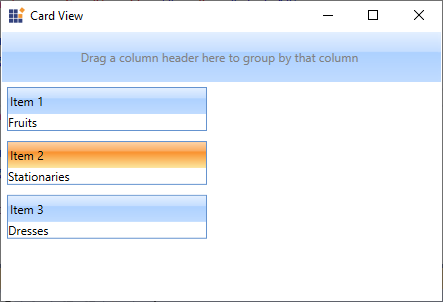
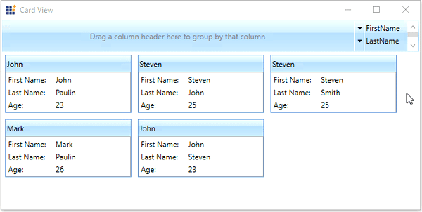
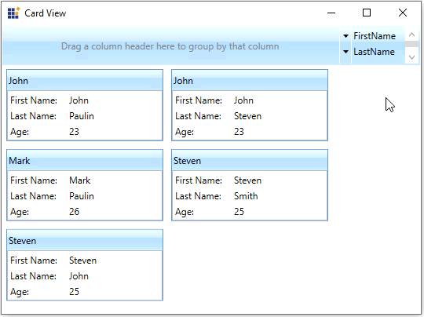
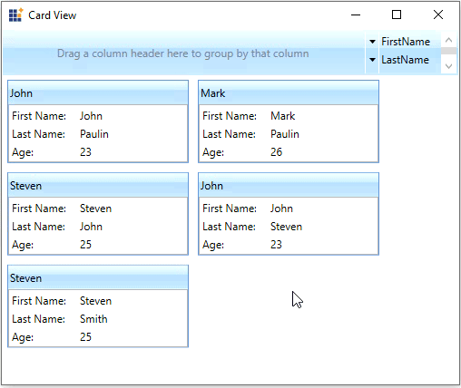

# Getting Started with WPF Card View

This section describes how to create a [CardView](https://help.syncfusion.com/cr/wpf/Syncfusion.Windows.Tools.Controls.CardView.html) control in a WPF application and overview of its basic functionalities.

## Structure of Card View control



## Assembly deployment

Refer to the [Control Dependencies](https://help.syncfusion.com/wpf/control-dependencies#cardview) section to get the list of assemblies that are added by the NuGet package.

Refer to the [NuGet Packages Documentation](https://help.syncfusion.com/wpf/installation/install-nuget-packages) to find more details about installing NuGet packages in a WPF application.

Install the Syncfusion WPF `Tools` NuGet package to add the required assemblies to your project:

```console
Install-Package Syncfusion.Tools.WPF
```

## Adding the Card View control using the Designer

1. You can add the _CardView_ control to an application by dragging it from the **Toolbox** and dropping it onto the designer surface. The following dependent assemblies are added automatically:
	* Syncfusion.Shared.WPF
	* Syncfusion.Tools.WPF



2. Use the **Smart Tag** feature to configure the _CardView_ control properties in design mode.

## Adding WPF Card View control via XAML

To add the _CardView_ control manually in XAML, follow these steps:

1. Create a new WPF project in Visual Studio.
2. Add the following assembly references to the project:
	* Syncfusion.Shared.WPF
	* Syncfusion.Tools.WPF
3. Import the Syncfusion WPF schema namespace **http://schemas.syncfusion.com/wpf** in the XAML page.
4. Add the [CardView](https://help.syncfusion.com/cr/wpf/Syncfusion.Windows.Tools.Controls.CardView.html) control to the XAML page.






<Window x:Class="CardViewSample.MainWindow"
        xmlns="http://schemas.microsoft.com/winfx/2006/xaml/presentation"
        xmlns:x="http://schemas.microsoft.com/winfx/2006/xaml"
        xmlns:d="http://schemas.microsoft.com/expression/blend/2008"
        xmlns:mc="http://schemas.openxmlformats.org/markup-compatibility/2006"
        xmlns:local="clr-namespace:CardViewSample"
        xmlns:syncfusion="http://schemas.syncfusion.com/wpf"
        mc:Ignorable="d"
        Title="Card View" Height="450" Width="800">
    <Grid Name="grid">
        <syncfusion:CardView Name="cardView"/>
    </Grid>
</Window>




{{ codesnippet1 | OrderList_Indent_Level_1 }}

## Adding WPF Card View control via C#

To add the _CardView_ control manually in C#, follow these steps:

1. Create a new WPF application in Visual Studio.
2. Add the following required assembly references to the project:
	* Syncfusion.Shared.WPF
	* Syncfusion.Tools.WPF
3. Import the required namespace.





using Syncfusion.Windows.Tools.Controls;




{{ codesnippet2 | OrderList_Indent_Level_1 }}

4. Create an instance of [CardView](https://help.syncfusion.com/cr/wpf/Syncfusion.Windows.Tools.Controls.CardView.html) control and add it to the window.





namespace CardViewSample
{
    public partial class MainWindow : Window
    {
        public MainWindow()
        {
            InitializeComponent();
            //Creating an instance of CardView control
            CardView cardView = new CardView();
            //Adding CardView as window content
            this.Content = cardView;
        }
    }
}




{{ codesnippet3 | OrderList_Indent_Level_1 }}



N> [View Sample in GitHub](https://github.com/SyncfusionExamples/syncfusion-wpf-card-view-examples/tree/master/Samples/Getting-Started)

## Populating items using CardViewItem

You can populate the Card View control by adding [CardViewItem](https://help.syncfusion.com/cr/wpf/Syncfusion.Windows.Tools.Controls.CardViewItem.html) objects directly to the _Items_ collection.




<syncfusion:CardView Name="cardView">
    <syncfusion:CardViewItem Header="Item 1">
        <TextBlock Text="Fruits"/>
    </syncfusion:CardViewItem>
    <syncfusion:CardViewItem Header="Item 2">
        <TextBlock Text="Stationery"/>
    </syncfusion:CardViewItem>
    <syncfusion:CardViewItem Header="Item 3">
        <TextBlock Text="Dresses"/>
    </syncfusion:CardViewItem>
</syncfusion:CardView>




CardViewItem cardViewItem1 = new CardViewItem()
{
    Header = "Item 1",
    Content = new TextBlock() { Text = "Fruits" }
};
CardViewItem cardViewItem2 = new CardViewItem()
{
    Header = "Item 2",
    Content = new TextBlock() { Text = "Stationery" }
};
CardViewItem cardViewItem3 = new CardViewItem()
{
    Header = "Item 3",
    Content = new TextBlock() { Text = "Dresses" }
};

CardView cardView = new CardView();
cardView.Items.Add(cardViewItem1);
cardView.Items.Add(cardViewItem2);
cardView.Items.Add(cardViewItem3);
this.Content = cardView;






N> [View Sample in GitHub](https://github.com/SyncfusionExamples/syncfusion-wpf-card-view-examples/tree/master/Samples/Getting-Started)

## Populating items using ItemsSource

You can populate the _CardView_ control by binding a collection to its _ItemsSource_ property. Use the [HeaderTemplate](https://help.syncfusion.com/cr/wpf/Syncfusion.Windows.Tools.Controls.CardView.html#Syncfusion_Windows_Tools_Controls_CardView_HeaderTemplate) and `ItemTemplate` properties to define how items are displayed in the view.

N> Grouping, sorting, filtering, and editing are supported only when the card items are populated through the `ItemsSource` property.




//Model.cs
public class CardViewModel
{
    public string Item { get; set; }
    public string Name { get; set; }     
}

//ViewModel.cs
public class ViewModel : NotificationObject
{
    private ObservableCollection<CardViewModel> cardViewItems;
    public ObservableCollection<CardViewModel> CardViewItems
    {
        get { return cardViewItems; }
        set { cardViewItems = value;
            this.RaisePropertyChanged(nameof(CardViewItems)); }
    }
    public ViewModel()
    {
        CardViewItems = new ObservableCollection<CardViewModel>();
        populateItems();
    }
    private void populateItems()
    {
        CardViewItems.Add(new CardViewModel() { Item = "Item 1", Name = "Fruits" });
        CardViewItems.Add(new CardViewModel() { Item = "Item 2", Name = "Stationery" });
        CardViewItems.Add(new CardViewModel() { Item = "Item 3", Name = "Dresses" });
    }
}







<Window x:Class="CardViewSample.MainWindow"
        xmlns="http://schemas.microsoft.com/winfx/2006/xaml/presentation"
        xmlns:x="http://schemas.microsoft.com/winfx/2006/xaml"
        xmlns:d="http://schemas.microsoft.com/expression/blend/2008"
        xmlns:mc="http://schemas.openxmlformats.org/markup-compatibility/2006"
        xmlns:local="clr-namespace:CardViewSample"
        xmlns:syncfusion="http://schemas.syncfusion.com/wpf" 
        mc:Ignorable="d"
        Title="MainWindow" Height="450" Width="800">
    <Window.DataContext>
        <local:ViewModel/>
    </Window.DataContext>
    <syncfusion:CardView ItemsSource="{Binding CardViewItems}"
                      Name="cardView">
        <syncfusion:CardView.HeaderTemplate>
            <DataTemplate>
                <TextBlock Text="{Binding Item}"/>
            </DataTemplate>
        </syncfusion:CardView.HeaderTemplate>
        <syncfusion:CardView.ItemTemplate>
            <DataTemplate>
                <StackPanel Orientation="Horizontal">
                    <TextBlock Text="Name:"
                           Margin="5" />
                    <TextBlock Margin="5"
                           Text="{Binding Name, UpdateSourceTrigger=PropertyChanged}" />
                </StackPanel>
            </DataTemplate>
        </syncfusion:CardView.ItemTemplate>
    </syncfusion:CardView>
</Window>






N> [View Sample in GitHub](https://github.com/SyncfusionExamples/syncfusion-wpf-card-view-examples/tree/master/Samples/PopulateItems)

## Select a CardViewItem

You can select a card item by clicking it. Use the [SelectedItem](https://help.syncfusion.com/cr/wpf/Syncfusion.Windows.Tools.Controls.CardView.html#Syncfusion_Windows_Tools_Controls_CardView_SelectedItem) property to retrieve the currently selected item. The default value of the _SelectedItem_ property is null.

N> You can select only one item at a time.




<syncfusion:CardView Name="cardView">
    <syncfusion:CardViewItem Header="Item 1">
        <TextBlock Text="Fruits"/>
    </syncfusion:CardViewItem>
    <syncfusion:CardViewItem Header="Item 2">
        <TextBlock Text="Stationery"/>
    </syncfusion:CardViewItem>
    <syncfusion:CardViewItem Header="Item 3">
        <TextBlock Text="Dresses"/>
    </syncfusion:CardViewItem>
</syncfusion:CardView>




CardViewItem cardViewItem1 = new CardViewItem()
{
    Header = "Item 1",
    Content = new TextBlock() { Text = "Fruits" }
};
CardViewItem cardViewItem2 = new CardViewItem()
{
    Header = "Item 2",
    Content = new TextBlock() { Text = "Stationery" }
};
CardViewItem cardViewItem3 = new CardViewItem()
{
    Header = "Item 3",
    Content = new TextBlock() { Text = "Dresses" }
};

CardView cardView = new CardView();
cardView.Items.Add(cardViewItem1);
cardView.Items.Add(cardViewItem2);
cardView.Items.Add(cardViewItem3);
this.Content = cardView;






N> [View Sample in GitHub](https://github.com/SyncfusionExamples/syncfusion-wpf-card-view-examples/tree/master/Samples/Getting-Started)

## Select CardViewItem programmatically

You can select a specific card item programmatically by setting the [CardViewItem.IsSelected](https://help.syncfusion.com/cr/wpf/Syncfusion.Windows.Tools.Controls.CardViewItem.html#Syncfusion_Windows_Tools_Controls_CardViewItem_IsSelected) property to true. The default value of `CardViewItem.IsSelected` property is `false`.




<syncfusion:CardView Name="cardView">
    <syncfusion:CardViewItem Header="Item 1" >
        <TextBlock Text="Fruits"/>
    </syncfusion:CardViewItem>
    <syncfusion:CardViewItem Header="Item 2"
                             IsSelected="True">
        <TextBlock Text="Stationery"/>
    </syncfusion:CardViewItem>
    <syncfusion:CardViewItem Header="Item 3">
        <TextBlock Text="Dresses"/>
    </syncfusion:CardViewItem>
</syncfusion:CardView>




CardViewItem cardViewItem1 = new CardViewItem()
{
    Header = "Item 1",
    Content = new TextBlock() { Text = "Fruits" }
};
CardViewItem cardViewItem2 = new CardViewItem()
{
    Header = "Item 2",
    IsSelected = true,
    Content = new TextBlock() { Text = "Stationery" }
};
CardViewItem cardViewItem3 = new CardViewItem()
{
    Header = "Item 3",
    Content = new TextBlock() { Text = "Dresses" }
};

CardView cardView = new CardView();
cardView.Items.Add(cardViewItem1);
cardView.Items.Add(cardViewItem2);
cardView.Items.Add(cardViewItem3);
this.Content = cardView;






N> [View Sample in GitHub](https://github.com/SyncfusionExamples/syncfusion-wpf-card-view-examples/tree/master/Samples/Getting-Started)

## Group the CardViewItems

You can group cards by dragging fields from the field list and dropping them into the grouping area in the Card View header. The field names in the drop region are automatically populated from the `HeaderTemplate` data context. To disable grouping, set the [CanGroup](https://help.syncfusion.com/cr/wpf/Syncfusion.Windows.Tools.Controls.CardView.html#Syncfusion_Windows_Tools_Controls_CardView_CanGroup) property to `false`. The default value of `CanGroup` is `true`.




//Model.cs
public class CardViewModel
{
    public string FirstName { get; set; }
    public string LastName { get; set; }
    public int Age { get; set; }
}

//ViewModel.cs
public class ViewModel : NotificationObject
{
    private ObservableCollection<CardViewModel> cardViewItems;
    public ObservableCollection<CardViewModel> CardViewItems
    {
        get { return cardViewItems; }
        set { cardViewItems = value;
            this.RaisePropertyChanged(nameof(CardViewItems)); }
    }
    public ViewModel()
    {
        CardViewItems = new ObservableCollection<CardViewModel>();
        populateItems();
    }
    private void populateItems()
    {
        CardViewItems.Add(new CardViewModel() { FirstName = "John", LastName= "Paulin", Age = 23});
        CardViewItems.Add(new CardViewModel() { FirstName = "Mark", LastName = "Paulin",Age = 26 });
        CardViewItems.Add(new CardViewModel() { FirstName = "Steven", LastName = "John", Age = 25 });
        CardViewItems.Add(new CardViewModel() { FirstName = "John", LastName = "Steven", Age = 23 });
        CardViewItems.Add(new CardViewModel() { FirstName = "Steven", LastName = "Smith", Age = 25 });
    }
}







<Window x:Class="CardViewSample.MainWindow"
        xmlns="http://schemas.microsoft.com/winfx/2006/xaml/presentation"
        xmlns:x="http://schemas.microsoft.com/winfx/2006/xaml"
        xmlns:d="http://schemas.microsoft.com/expression/blend/2008"
        xmlns:mc="http://schemas.openxmlformats.org/markup-compatibility/2006"
        xmlns:local="clr-namespace:CardViewSample"
        xmlns:syncfusion="http://schemas.syncfusion.com/wpf" 
        mc:Ignorable="d"
        Title="MainWindow" Height="450" Width="800">
    <Window.DataContext>
        <local:ViewModel/>
    </Window.DataContext>
    <syncfusion:CardView CanGroup="True"
                     ItemsSource="{Binding CardViewItems}"
                     Name="cardView">
        <syncfusion:CardView.HeaderTemplate>
            <DataTemplate>
                <TextBlock Text="{Binding Age}"/>
            </DataTemplate>
        </syncfusion:CardView.HeaderTemplate>
        <syncfusion:CardView.ItemTemplate>
            <DataTemplate >
                <ListBox ScrollViewer.HorizontalScrollBarVisibility="Disabled">
                    <ListBoxItem Padding="1">
                        <Grid>
                            <Grid.ColumnDefinitions>
                                <ColumnDefinition Width="75" />
                                <ColumnDefinition />
                            </Grid.ColumnDefinitions>
                            <TextBlock Text="First Name:" />
                            <TextBlock Grid.Column="1"
                                   Text="{Binding FirstName,
                                          UpdateSourceTrigger=PropertyChanged}" />
                        </Grid>
                    </ListBoxItem>
                    <ListBoxItem Padding="1">
                        <Grid>
                            <Grid.ColumnDefinitions>
                                <ColumnDefinition Width="75" />
                                <ColumnDefinition Width="*" />
                            </Grid.ColumnDefinitions>
                            <TextBlock Text="Last Name:" />
                            <TextBlock Grid.Column="1" 
                                   Text="{Binding LastName, 
                                          UpdateSourceTrigger=PropertyChanged}" />
                        </Grid>
                    </ListBoxItem>
                    <ListBoxItem Padding="1">
                        <Grid>
                            <Grid.ColumnDefinitions>
                                <ColumnDefinition Width="75" />
                                <ColumnDefinition Width="*" />
                            </Grid.ColumnDefinitions>
                            <TextBlock Text="Age:" />
                            <TextBlock Grid.Column="1"
                                   Text="{Binding Age,
                                          UpdateSourceTrigger=PropertyChanged}" />
                        </Grid>
                    </ListBoxItem>
                </ListBox>
            </DataTemplate>
        </syncfusion:CardView.ItemTemplate>
    </syncfusion:CardView>
</Window>




cardView.CanGroup = true;






Here, `CardViewItems` grouped based on `Age` field.

N> [View Sample in GitHub](https://github.com/SyncfusionExamples/syncfusion-wpf-card-view-examples/tree/master/Samples/Editing)

## Sort the CardViewItems

You can sort cards in ascending, descending, or default order by clicking the field names displayed in the header. To disable sorting, set the [CanSort](https://help.syncfusion.com/cr/wpf/Syncfusion.Windows.Tools.Controls.CardView.html#Syncfusion_Windows_Tools_Controls_CardView_CanSort) property to `false`. The default value of `CanSort` is `true`.




<Window.DataContext>
    <local:ViewModel/>
</Window.DataContext>
<syncfusion:CardView CanSort="True"
                     ItemsSource="{Binding CardViewItems}"
                     Name="cardView"/>




cardView.CanSort = true;






Here, `CardViewItems` sorted based on `FirstName` field.

N> [View Sample in GitHub](https://github.com/SyncfusionExamples/syncfusion-wpf-card-view-examples/tree/master/Samples/Editing)

## Edit the CardViewItems

You can edit the selected _CardViewItem_ by double-clicking it or pressing the `F2` key. To exit editing mode, press the `Esc` or `Enter` key. Enable editing by setting the [CanEdit](https://help.syncfusion.com/cr/wpf/Syncfusion.Windows.Tools.Controls.CardView.html#Syncfusion_Windows_Tools_Controls_CardView_CanEdit) property to true. The default value of `CanEdit` is `false`.

N> To support editing, define an editable UI using the [EditItemTemplate](https://help.syncfusion.com/cr/wpf/Syncfusion.Windows.Tools.Controls.CardView.html#Syncfusion_Windows_Tools_Controls_CardView_EditItemTemplate) property. The binding context of _EditItemTemplate_ is the underlying data item.




<Window.DataContext>
    <local:ViewModel/>
</Window.DataContext>
<syncfusion:CardView CanEdit="True"
                     ItemsSource="{Binding CardViewItems}"
                     Name="cardView">
    <syncfusion:CardView.EditItemTemplate>
        <DataTemplate>
            <ListBox ScrollViewer.HorizontalScrollBarVisibility="Disabled">
                <ListBoxItem Padding="1">
                    <Grid>
                        <Grid.ColumnDefinitions>
                            <ColumnDefinition Width="75" />
                            <ColumnDefinition />
                        </Grid.ColumnDefinitions>
                        <TextBlock Text="First Name:" />
                        <TextBox
                            Grid.Column="1"
                            Text="{Binding FirstName, 
                                   UpdateSourceTrigger=PropertyChanged}" />
                    </Grid>
                </ListBoxItem>
                <ListBoxItem Padding="1">
                    <Grid>
                        <Grid.ColumnDefinitions>
                            <ColumnDefinition Width="75" />
                            <ColumnDefinition Width="*" />
                        </Grid.ColumnDefinitions>
                        <TextBlock Text="Last Name:" />
                        <TextBox Grid.Column="1" 
                                 Text="{Binding LastName, 
                                        UpdateSourceTrigger=PropertyChanged}" />
                    </Grid>
                </ListBoxItem>
                <ListBoxItem Padding="1">
                    <Grid>
                        <Grid.ColumnDefinitions>
                            <ColumnDefinition Width="75" />
                            <ColumnDefinition Width="*" />
                        </Grid.ColumnDefinitions>
                        <TextBlock Text="Age:" />
                        <TextBox Grid.Column="1" 
                                 Text="{Binding Age, 
                                        UpdateSourceTrigger=PropertyChanged}" />
                    </Grid>
                </ListBoxItem>
            </ListBox>
        </DataTemplate>
    </syncfusion:CardView.EditItemTemplate>
</syncfusion:CardView>




cardView.CanEdit = true;






N> [View Sample in GitHub](https://github.com/SyncfusionExamples/syncfusion-wpf-card-view-examples/tree/master/Samples/Editing)

## Set the Orientation of CardViewItems

Use the [Orientation](https://help.syncfusion.com/cr/wpf/Syncfusion.Windows.Tools.Controls.CardView.html#Syncfusion_Windows_Tools_Controls_CardView_Orientation) property to arrange cards either vertically or horizontally. The default value of the `Orientation` property is `Vertical`.

N> If sufficient space is not available, Card View automatically arranges the cards to fit the available layout area.




<Window.DataContext>
    <local:ViewModel/>
</Window.DataContext>
<syncfusion:CardView Orientation="Horizontal"
                     ItemsSource="{Binding CardViewItems}"
                     Name="cardView"/>




cardView.Orientation = Orientation.Horizontal;





N> [View Sample in GitHub](https://github.com/SyncfusionExamples/syncfusion-wpf-card-view-examples/tree/master/Samples/Editing)

## Selected item changed notification

The [SelectedItemChanged](https://help.syncfusion.com/cr/wpf/Syncfusion.Windows.Tools.Controls.CardView.html#Syncfusion_Windows_Tools_Controls_CardView_SelectedItemChanged) event is raised whenever the selected item changes. The `SelectedItemChanged` callback receives a `DependencyPropertyChangedEventArgs` that contains the previously selected card item in the `OldValue` property and the newly selected card item in the `NewValue` property.




<Window.DataContext>
    <local:ViewModel/>
</Window.DataContext>
<syncfusion:CardView SelectedItemChanged="CardView_SelectedItemChanged"
                     ItemsSource="{Binding CardViewItems}"
                     Name="cardView"/>




cardView.SelectedItemChanged += CardView_SelectedItemChanged;




You can handle the event as follows:




// Required namespaces:
// using System.Windows;
// using Syncfusion.Windows.Tools.Controls;

private void CardView_SelectedItemChanged(DependencyObject d, DependencyPropertyChangedEventArgs e)
{
    var newItem = e.NewValue;
    var oldItem = e.OldValue;
}




## Theme

Card View supports a variety of built-in themes. Refer to the following articles to learn how to apply themes:

  * [Apply theme using SfSkinManager](https://help.syncfusion.com/wpf/themes/skin-manager)
  * [Create a custom theme using ThemeStudio](https://help.syncfusion.com/wpf/themes/theme-studio#creating-custom-theme)
  
N> [View Sample in GitHub](https://github.com/SyncfusionExamples/syncfusion-wpf-card-view-examples/tree/master/Samples/Themes)


