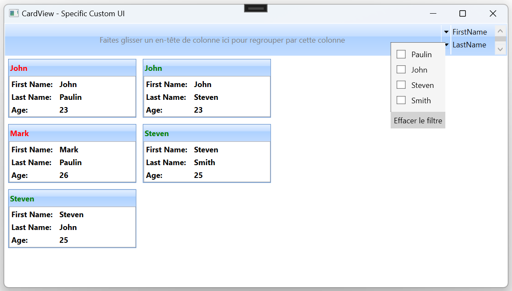

# Localization in WPF Card View

Localization is the process of translating the application resources into different language for the specific cultures. You can localize the CardView by [adding resource file](https://msdn.microsoft.com/library/aa992030.aspx). Application culture can be changed by setting [CurrentUICulture]([CurrentUICulture](https://docs.microsoft.com/en-us/dotnet/api/system.globalization.cultureinfo.currentuiculture?view=netframework-4.7.2)) after `InitializeComponent` method. 

Below application culture changed to French.





public MainWindow()
{
    InitializeComponent();
    System.Threading.Thread.CurrentThread.CurrentUICulture = new System.Globalization.CultureInfo("fr-FR");
}    





To localize the CardView based on [CurrentUICulture](https://docs.microsoft.com/en-us/dotnet/api/system.globalization.cultureinfo.currentuiculture?view=netframework-4.7.2) using resource files, follow the below steps. 

**Step 1:** Create new folder and named as **Resources** in your application. 

**Step 2:** Right-click on the Resources folder, select **Add** and then **NewItem**.

**Step 3:** In `Add New Item` wizard, select the **Resource File** option and name the filename as **Syncfusion.Tools.Wpf.&lt;culture name&gt;.resx**. For example, you have to give name as **Syncfusion.Tools.Wpf.fr-FR.resx** for French culture.

**Step 4:** Now, select `Add` option to add the resource file in **Resources** folder.

**Step 5:** Add the Name/Value pair in Resource Designer of **Syncfusion.Tools.Wpf.fr-FR.resx** file and change its corresponding value to corresponding culture. 

The following screenshot shows the localized CardView control.

