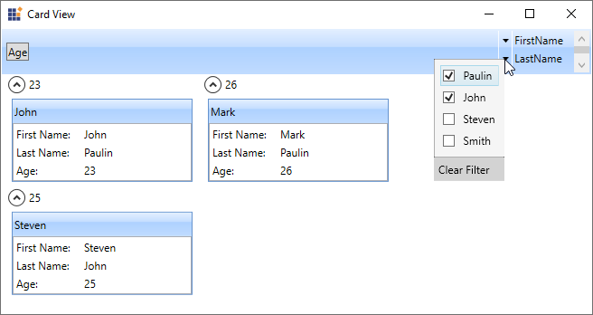

# About Syncfusion® WPF Card View Control

The WPF [CardView](https://help.syncfusion.com/cr/wpf/Syncfusion.Windows.Tools.Controls.CardView.html) control is a panel that helps organize a list of items in cards. It supports grouping, sorting, filtering, and editing options. Also, supports listing the grouped items in a tree structure.

## Control Structure

## Key features

* **Editing** - Allows to editing the fields in the GroupViewItems.
* **Grouping** - Allows to Grouping between the CardViewItems.
* **Filtering** - Allows to filtering based on the field's values in the GroupViewItems.
* **Sorting** - Allows Sorting between the CardViewItems.
* **Header** - Shows or hides the Card View Header panel.
* **Custom UI** - Allows to customize the CardViewItems.