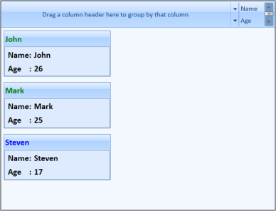

# Styling in WPF Bullet Graph (SfBulletGraph)

Styling can be applied to the CardView control and its items. 

## Theme

CardView supports various built-in themes. Refer to the below links to apply themes for the CardView,

  * [Apply theme using SfSkinManager](https://help.syncfusion.com/wpf/themes/skin-manager)
	
  * [Create a custom theme using ThemeStudio](https://help.syncfusion.com/wpf/themes/theme-studio#creating-custom-theme)

## ItemContainerStyle

The [ItemContainerStyle](https://docs.microsoft.com/en-us/dotnet/api/system.windows.controls.itemscontrol.itemcontainerstyle?view=netframework-4.7.2) property of CardView is used to set the styles for CardViewItem. This style can be applied to all items available in the CardView control.

1. Create a style for CardViewItem.

   ~~~ xaml

		

   ~~~
   
2. Set the ItemContainerStyle of CardView.
   
   ~~~ xaml

		<syncfusion:CardView ItemsSource="{Binding Contacts}" CanEdit="True" 

				 ItemTemplate="{StaticResource contactTemplate}"

				 EditItemTemplate="{StaticResource contactEditTemplate}"

				 ItemContainerStyle="{StaticResource contactStyle}"/>

   ~~~
   
This generates the following CardView control.

CardView control with styled items
{:.caption}

## ItemContainerStyleSelector

The [ItemContainerStyleSelector](https://docs.microsoft.com/en-us/dotnet/api/system.windows.controls.itemscontrol.itemcontainerstyleselector?view=netframework-4.7.2) property is used to choose the ItemContainerStyle at run-time base on some conditions. 

1. Create the styles in the Window’s resource as follows.

   ~~~ xaml

		

		

   ~~~
   
2. Create StyleSelector in the code.

   ~~~ csharp

		public class CardViewItemContainerStyleSelector : StyleSelector

		{
			public override Style SelectStyle(object item, DependencyObject container)

			{
				Window window = Application.Current.MainWindow;

				int age = (item as Contact).Age;

				if (age > 18)

				{

					return ((Style)window.Resources["ageStyle1"]);

				}

				else

				{

					return ((Style)window.Resources["ageStyle2"]);

				}
			}
		}

   ~~~

3. Define the style selector in the Window’s resource.

   ~~~ xaml

		<local:CardViewItemContainerStyleSelector x:Key="cardViewItemContainerStyleSelector"/>

   ~~~

4. Set the ItemContainerStyleSelector for the CardView control.

   ~~~ xaml

		<syncfusion:CardView ItemsSource="{Binding Contacts}" CanEdit="True" 

						 ItemTemplate="{StaticResource contactTemplate}"

						 EditItemTemplate="{StaticResource contactEditTemplate}"

						 ItemContainerStyleSelector="{StaticResource cardViewItemContainerStyleSelector}" />

   ~~~

This generates the following CardView control.

CardView control styled with ItemContainerStyleSelector
{:.caption}