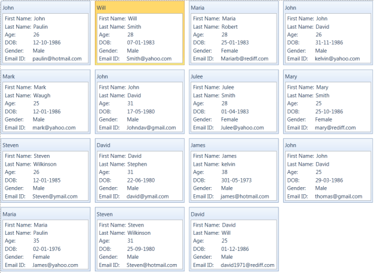

# Controls and Components

The following controls assemble the CardView control.

* CardView
* CardViewItem

## CardView

Use Case Scenarios

CardView control helps to sort or group items based on the given field names.Structure of the CardView Control

The following screenshot displays the CardView:

{  | markdownify }
{:.image }

* CardViewHeader: It shows the header of the card view control
* CardViewItem: It contains the list of ComboBox’s items

Sample link

1. Select Start -> Programs -> Syncfusion -> Essential Studio 9.2.0.137 -> Dashboard.
2. Select Run Locally Installed Samples in WPF CardView.
3. Now select the CardView item in the tree.
4. Choose CardView demo.
### Appearance

You can customize the appearance of the ComboBoxAdv control by editing the style of the control in Expression Blend or by using the following properties exposed by CardView control:

* Edit style in Expression Blend 
* Customizing by using properties
### Blendability

You can edit the style of ComboBoxAdv by using Expression Blend. To edit the ComboBoxAdv control’s style in Expression Blend:

1. Drag the CardView control to the Design view. The CardView control will appear as shown in the screen shot displayed below.
2. Right-click the CardView control, select Edit Template, and then select Edit a Copy. 

{  | markdownify }
{:.image }

### Features of CardView control

#### Grouping

Cards inside the CardView control can be grouped by the fields available in the list. Grouping can be achieved by dragging the field from the list to the header panel in the CardView control. Grouping can be controlled by the property called CanGroup. By default CanGroup value will be true.

Properties

_Property/Properties Table_

<table>
<tr>
<td>
Property</td><td>
Description</td><td>
Type</td><td>
Data Type</td><td>
Reference links</td></tr>
<tr>
<td>
CanGroup</td><td>
It controls the grouping</td><td>
Dependency Property</td><td>
Boolean</td><td>
NA</td></tr>
</table>

Adding grouping to an Application 

CanGroup property can be added directly to an application using the following code snippet:

<table>
<tr>
<td>
[XAML]&lt;syncfusion:CardView CanGroup="False"&gt;        &lt;/syncfusion:CardView&gt;</td></tr>
<tr>
<td>
[C#]CardView cardview = new CardView();       cardview.CanGroup = false;</td></tr>
</table>
#### Filtering

Cards can be filtered by the values which are given for the fields. To filter the cards, just check the values in the listed popup that opens when you click the button which is available in the front of the fields list.

#### Sorting

Cards can be sorted inside the CardView Control. It can be achieved by the fields available. To sort the cards just click on the field name listed in the header. It can be controlled by the property called CanSort. By default the value is true.

Properties

_Property/Properties Table_

<table>
<tr>
<th>
Property</th><th>
Description</th><th>
Type</th><th>
Data Type</th><th>
Reference links</th></tr>
<tr>
<td>
CanSort </td><td>
It controls the sorting</td><td>
Dependency Property</td><td>
Boolean</td><td>
NA</td></tr>
</table>

Adding sorting to an Application 

CanSort can be added directly to an application using the following code snippet: 

<table>
<tr>
<td>
[XAML]&lt;syncfusion:CardView CanSort="False"&gt;        &lt;/syncfusion:CardView&gt;</td></tr>
<tr>
<td>
[C#]CardView cardview = new CardView();       cardview.CanSort = false;</td></tr>
</table>
#### Editing

More attractive feature in the CardView control is editing. CanEdit property allows the user to edit the fields available in the cards. Moreover we can customize the Item template while editing by using the property called EditItemTemplate.

Properties

_Property/Properties Table_

<table>
<tr>
<td>
Property</td><td>
Description</td><td>
Type</td><td>
Data Type</td><td>
Reference links</td></tr>
<tr>
<td>
CanEdit</td><td>
It controls the editing capability of CardViewItems</td><td>
Dependency Property</td><td>
Boolean</td><td>
NA</td></tr>
<tr>
<td>
EditItemTemplate</td><td>
It provides the template for the items while editing.</td><td>
Dependency Property</td><td>
Boolean</td><td>
NA</td></tr>
</table>

Adding editing to an Application 

CanEdit property can be added directly to an application using the following code example:

<table>
<tr>
<td>
[XAML]&lt;syncfusion:CardView CanEdit="False"&gt;        &lt;/syncfusion:CardView&gt;</td></tr>
<tr>
<td>
[C#]CardView cardview = new CardView();       cardview.CanEdit = false;</td></tr>
</table>
#### Header Panel

It is the base to showcase the fields when you drop the fields from the list. We can customize the visibility of the Header panel by using the property called ShowHeader.

Properties

_Property/Properties Table_

<table>
<tr>
<td>
Property</td><td>
Description</td><td>
Type</td><td>
Data Type</td><td>
Reference links</td></tr>
<tr>
<td>
ShowHeader</td><td>
It controls the visibility of the Header panel</td><td>
Dependency Property</td><td>
Boolean</td><td>
NA</td></tr>
</table>

Adding Header Panel visibility customization to an Application 

ShowHeader property can be added directly to an application using the following code example:

<table>
<tr>
<td>
[XAML]&lt;syncfusion:CardView ShowHeader="False"&gt;        &lt;/syncfusion:CardView&gt;</td></tr>
<tr>
<td>
[C#]CardView cardview = new CardView();       cardview.ShowHeader = false;</td></tr>
</table>

{  | markdownify }
{:.image }

