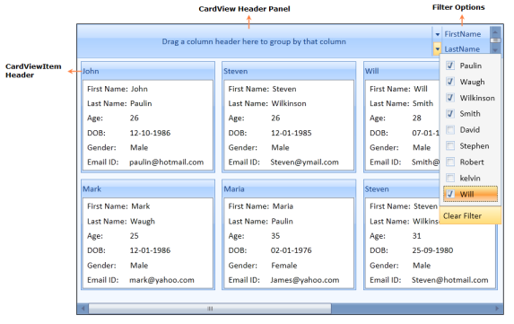
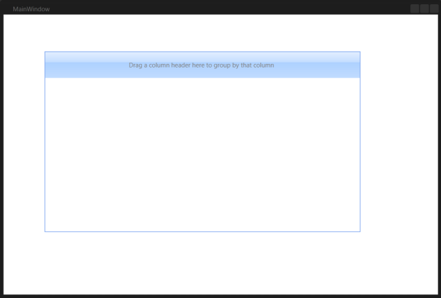
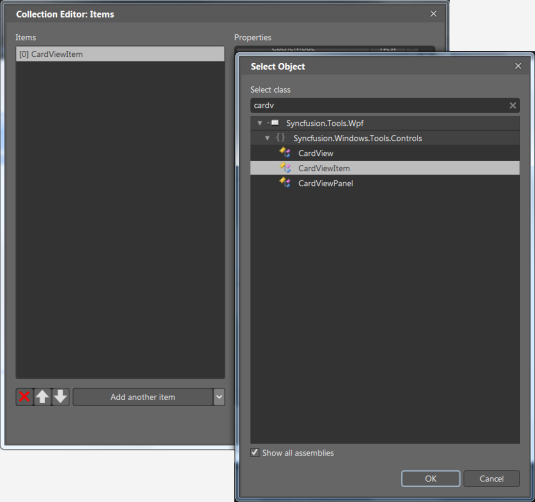

# Getting started

This section describes how to design a `CardView` control in a WPF application and overview of its basic functionalities.

## Control Structure

Structure of the CardView Control
{:.caption}

# Creating simple application with CardView

The CardView control can be added to an application using Visual Studio and Blend.

You can create the WPF application with CardView control as follows:

1. [Creating project](#creating-the-project)
2. [Adding control via Blend](#adding-control-via-blend)
3. [Adding control via XAML](#adding-control-via-xaml)
4. [Adding control via Code](#adding-control-via-code)

The CardView control can be created through Visual Studio, Expression Blend, XAML, and C#.

## Creating the project

The steps to create a CardView control using Visual Studio in C# are as follows:

1.	Open Visual Studio.

2.	On the File menu, select New -> Project. This opens the New Project Dialog box.

To create the CardView control through Visual Studio, drag the CardView from the Toolbox and drop it in the Designer area. It generates the CardView control.

Dragging CardView to the Visual Studio Designer
{:.caption}

## Adding control via Blend

The CardView control can also be created and configured using Expression Blend. The following are the steps to do so.

1. Create a WPF project in Expression Blend and reference the following assemblies.
   1. Syncfusion.Shared.Wpf
   2. Syncfusion.Tools.Wpf
   3. Syncfusion.Core
   
2. Search for CardView in the Toolbox.

   
   
   CardView in Expression Blend Toolbox
   {:.caption}
   
3. Drag the CardView to the designer. This generates the following CardView control.

   

   Dragging CardView to the Expression Blend Designer
   {:.caption}
   
4. To add the items to the CardView by using the CollectionEditor, select the CardView and go to Properties area, and then click Items (Collection) under Common Properties.

   
   
   CardView Properties
   {:.caption}
   
5. Once the Collection Editor opens, click Add Another Item.  The Select Object window opens.

6. Select the CardViewItem by typing CardViewItem in the search box, and then click OK.

   
   
   Collection Editor for CardView in Expression Blend
   {:.caption}
   
7. Configure the CardViewItem using the properties in the Collection Editor.

N> You can also customize the appearance of CardView control and its items using the template editing feature available in the Expression Blend.
      
## Adding control via XAML

To create the CardView control through XAML, add the following namespace to the directives list.





xmlns:syncfusion=http://schemas.syncfusion.com/wpf





After adding the above namespace the CardViewControl can be added to the application as follows:





 <syncfusion:CardView >

	<syncfusion:CardViewItem Header="Item1" >

		<ListBox>

			<ListBoxItem HorizontalContentAlignment="Stretch" Padding="1">

				<Grid >

					<Grid.ColumnDefinitions>

						<ColumnDefinition Width="75"/>

						<ColumnDefinition Width="*"/>

					</Grid.ColumnDefinitions>

					<TextBlock Text="Name:"/>

					<TextBox  Grid.Column="1" Text="David" />

				</Grid>

			</ListBoxItem>

			<ListBoxItem HorizontalContentAlignment="Stretch" Padding="1">

				<Grid >

					<Grid.ColumnDefinitions>

						<ColumnDefinition Width="75"/>

						<ColumnDefinition Width="*"/>

					</Grid.ColumnDefinitions>

					<TextBlock Text="DOB:"/>

					<TextBox  Grid.Column="1" Text="2/25/1986" />

				</Grid>

			</ListBoxItem>

		</ListBox>

	</syncfusion:CardViewItem>

</syncfusion:CardView>





## Adding control via Code

To create the CardView control through C#, include the following namespace to the directives list.





using Syncfusion.Windows.Tools.Controls;





Imports Syncfusion.Windows.Tools.Controls





Next, create the CardView control as illustrated in the following code example.





CardView cardView = new CardView();

CardViewItem cardViewItem1 = new CardViewItem();

TextBlock tBlock = new TextBlock() { Text = "John" };

cardViewItem1.Content = tBlock;

cardView.Items.Add(cardViewItem1);





Dim cardView As CardView = New CardView

Dim cardViewItem1 As CardViewItem = New CardViewItem

Dim tBlock As TextBlock = New TextBlock

cardViewItem1.Content = tBlock

cardView.Items.Add(cardViewItem1)





### ItemContainerStyle

The ItemContainerStyle property of CardView is used to set the styles for CardViewItem. This style can be applied to all items available in the CardView control.

1. Create a style for CardViewItem.



   

		

   


   
2. Set the ItemContainerStyle of CardView.
   
   

   

		<syncfusion:CardView ItemsSource="{Binding Contacts}" CanEdit="True" 

				 ItemTemplate="{StaticResource contactTemplate}"

				 EditItemTemplate="{StaticResource contactEditTemplate}"

				 ItemContainerStyle="{StaticResource contactStyle}"/>

    


   
This generates the following CardView control.

CardView control with styled items
{:.caption}

### ItemContainerStyleSelector

The ItemContainerStyleSelector property is used to choose the ItemContainerStyle at run-time base on some conditions. 

1. Create the styles in the Window’s resource as follows.

   

   

		

		

   


   
2. Create StyleSelector in the code.

   

   

		public class CardViewItemContainerStyleSelector : StyleSelector
		{
			public override Style SelectStyle(object item, DependencyObject container)
			{
				Window window = Application.Current.MainWindow;

				int age = (item as Contact).Age;

				if (age > 18)
				{
					return ((Style)window.Resources["ageStyle1"]);
				}
				else
				{
					return ((Style)window.Resources["ageStyle2"]);
				}
			}
		}

   

   

   	Public Class CardViewItemContainerStyleSelector
    Inherits StyleSelector
    
    Public Overrides Function SelectStyle(ByVal item As Object, ByVal container As DependencyObject) As Style
        Dim window As Window = Application.Current.MainWindow
        Dim age As Integer = CType(item,Contact).Age
        If (age > 18) Then
            Return CType(window.Resources("ageStyle1"),Style)
        Else
            Return CType(window.Resources("ageStyle2"),Style)
        End If
        
    End Function
End Class

   



3. Define the style selector in the Window’s resource.



   

		<local:CardViewItemContainerStyleSelector x:Key="cardViewItemContainerStyleSelector"/>

   



4. Set the ItemContainerStyleSelector for the CardView control.

   

   

		<syncfusion:CardView ItemsSource="{Binding Contacts}" CanEdit="True" 

						 ItemTemplate="{StaticResource contactTemplate}"

						 EditItemTemplate="{StaticResource contactEditTemplate}"

						 ItemContainerStyleSelector="{StaticResource cardViewItemContainerStyleSelector}" />

   



This generates the following CardView control.

CardView control styled with ItemContainerStyleSelector
{:.caption}