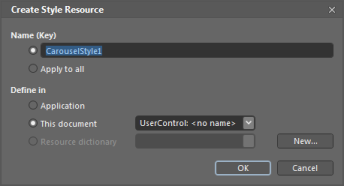
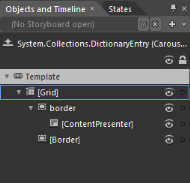

# Blendability support

The template of the Carousel control can be easily editable in Expression Blend, to give a nice look and feel.

Using Blendability Support in an Application

Following are the steps to edit the template in Expression Blend.

1. Open the Carousel control in blend. 
2. Go to Object ->Edit Style -> Edit a Copy to edit the template of Carousel control as follows.

{{ '' | markdownify }}
{:.image }

A window opens as shown below where you can create a new style for the Carousel control and can define exactly where you would like to store it.

{{ '' | markdownify }}
{:.image }

What’s produced through this set of steps is quite a bit of XAML which is placed within your application. This XAML represents the default style for the Carousel control. In the same way, you can edit the template of CarouselItem.

{{ '' | markdownify }}
{:.image }

Now you can edit each part in the template and can create custom look and feel for the control. In the following example, template for CarouselItem is edited to give a reflection effect.

[XAML]

        

{{ '' | markdownify }}
{:.image }

