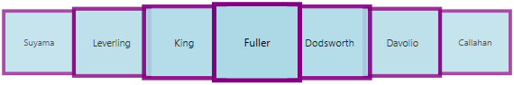
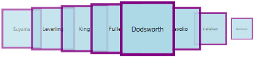
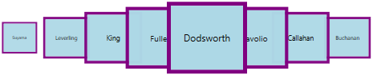
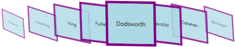

# Custom Path in WPF carousel (Carousel)

This section explains about resizing, skewing, page customization and opacity supports available in WPF [Carousel](https://help.syncfusion.com/cr/wpf/Syncfusion.Windows.Shared.Carousel.html) control's custom path mode.

## Load carousel items in custom path

If you want to load the carousel items in your custom path, set the path value to the [Carousel.Path](https://help.syncfusion.com/cr/wpf/Syncfusion.Windows.Shared.Carousel.html#Syncfusion_Windows_Shared_Carousel_Path). You can enable it only by setting the [VisualMode](https://help.syncfusion.com/cr/wpf/Syncfusion.Windows.Shared.Carousel.html#Syncfusion_Windows_Shared_Carousel_VisualMode) property as `VisualMode.CustomPath`. The default value of `VisualMode` property is `VisualMode.Standard` and `Carousel.Path` property is `null`.

N> If you not set any path value to `Carousel.Path` property on `VisualMode.CustomPath` mode, carousel items will be loaded in the `U` shaped path.




//Model.cs
public class CarouselModel {
	public string Header { get; set; }
}

//ViewModel.cs
public class ViewModel {
	private ObservableCollection<CarouselModel> collection;
	public ObservableCollection<CarouselModel> HeaderCollection
	{
		get {
			return collection;
		}
		set {
			collection = value;
		}
	}
	public ViewModel() {
		HeaderCollection = new ObservableCollection<CarouselModel>();
		HeaderCollection.Add(new CarouselModel() { Header = "Buchanan" });
		HeaderCollection.Add(new CarouselModel() { Header = "Callahan" });
		HeaderCollection.Add(new CarouselModel() { Header = "Davolio" });
		HeaderCollection.Add(new CarouselModel() { Header = "Dodsworth" });
		HeaderCollection.Add(new CarouselModel() { Header = "Fuller" });
		HeaderCollection.Add(new CarouselModel() { Header = "King" });
		HeaderCollection.Add(new CarouselModel() { Header = "Leverling" });
		HeaderCollection.Add(new CarouselModel() { Header = "Suyama" });
	}
}







<Window.DataContext>
    <local:ViewModel/>
</Window.DataContext>

<Grid>
    <syncfusion:Carousel Name="Carousel" 
                         VisualMode="CustomPath"
                         SelectedIndex="3"
                         ItemsSource="{Binding HeaderCollection}">
            <syncfusion:Carousel.Path>
                <Path Data="M0,100 L100,20" />
            </syncfusion:Carousel.Path>

        <syncfusion:Carousel.ItemTemplate>
            <DataTemplate>
                <Border Height="50" 
                        Width="100" 
                        BorderBrush="Purple" 
                        BorderThickness="5"
                        Background="LightBlue">
                    <TextBlock HorizontalAlignment="Center" 
                               VerticalAlignment="Center" 
                               Text="{Binding Header}"/>
                </Border>
            </DataTemplate>
        </syncfusion:Carousel.ItemTemplate>
    </syncfusion:Carousel>
</Grid>




carousel.VisualMode = VisualMode.CustomPath;
carousel.SelectedIndex = 3;




N> [View Sample in GitHub](https://github.com/SyncfusionExamples/syncfusion-wpf-carousel-examples/tree/master/Samples/Binding)

## Number of items to be visible in a Page

By default, all the items are displayed in the `Carousel` control. If you will be added more items and wants to display less number of items at a time, use the [ItemsPerPage](https://help.syncfusion.com/cr/wpf/Syncfusion.Windows.Shared.Carousel.html#Syncfusion_Windows_Shared_Carousel_ItemsPerPage) property. `ItemsPerPage` is  effective only on `VisualMode.CustomPath` view mode. The default value of `ItemsPerPage` property is `-1`.




<syncfusion:Carousel ItemsPerPage="3"
                     VisualMode="CustomPath"
                     ItemsSource="{Binding HeaderCollection}"
                     Name="carousel"/>




carousel.ItemsPerPage = 3;
carousel.VisualMode = VisualMode.CustomPath;




N> [View Sample in GitHub](https://github.com/SyncfusionExamples/syncfusion-wpf-carousel-examples/tree/master/Samples/CustomPath)

## Resize carousel items

If you want to change the size of the carousel items except the selected item in the `VisualMode.CustomPath` mode, use the [ScaleFraction](https://help.syncfusion.com/cr/wpf/Syncfusion.Windows.Shared.Carousel.html#Syncfusion_Windows_Shared_Carousel_ScaleFraction) property. You can disable it by setting the [ScalingEnabled](https://help.syncfusion.com/cr/wpf/Syncfusion.Windows.Shared.Carousel.html#Syncfusion_Windows_Shared_Carousel_ScalingEnabled) property value as `false`.  Value range of `ScaleFraction` property is `0` to `1`. The default value `ScaleFraction` property is `Double.NaN` and `ScalingEnabled` property is `true`.




<syncfusion:Carousel ScaleFraction="0.7" 
                     ScalingEnabled="True"
                     VisualMode="CustomPath"
                     ItemsSource="{Binding HeaderCollection}"
                     Name="carousel">
    <syncfusion:Carousel.Path>
        <Path Data="M0,0 L100,0" />
    </syncfusion:Carousel.Path>
</syncfusion:Carousel>




carousel.ScaleFraction = 0.7;
carousel.ScalingEnabled = true;
carousel.VisualMode = VisualMode.CustomPath;




N> [View Sample in GitHub](https://github.com/SyncfusionExamples/syncfusion-wpf-carousel-examples/tree/master/Samples/CustomPath_customization)

## Resize specific carousel item

If you want to individually change the size of the next, previous item or selected carousel items in the `VisualMode.CustomPath` mode, set the fraction values to the [ScaleFractions](https://help.syncfusion.com/cr/wpf/Syncfusion.Windows.Shared.Carousel.html#Syncfusion_Windows_Shared_Carousel_ScaleFractions) collection property. Value range of resizing is `0` to `1`. The default value of `ScaleFractions` property is `null`.

N> This will effective only on when setting the `ScalingEnabled` property value as `true`. 




<syncfusion:Carousel ScalingEnabled="True"
                     VisualMode="CustomPath"
                     ItemsSource="{Binding HeaderCollection}"
                     Name="carousel">
    <syncfusion:Carousel.Path>
        <Path Data="M0,0 L100,0" />
    </syncfusion:Carousel.Path>

    <syncfusion:Carousel.ScaleFractions>
        <syncfusion:PathFractionCollection>
            
            <!--Resize next items from the selected item-->
            <syncfusion:FractionValue Fraction="0" Value="0.6"/>
            
            <!--Resize selected item-->
            <syncfusion:FractionValue Fraction="0.5" Value="0.9"/>
            
            <!--Resize previous items from the selected item-->
            <syncfusion:FractionValue Fraction="1" Value="0"/>
        </syncfusion:PathFractionCollection>
    </syncfusion:Carousel.ScaleFractions>
</syncfusion:Carousel>




FractionValue NextItemfraction = new FractionValue() { Fraction = 0, Value = 0.6 };			
FractionValue selectedItemfraction = new FractionValue() { Fraction = 0.5, Value = 0.9 };
FractionValue PreviousItemfraction = new FractionValue() { Fraction = 1, Value = 0 };

PathFractionCollection pathFraction = new PathFractionCollection();
pathFraction.Add(NextItemfraction);
pathFraction.Add(selectedItemfraction);
pathFraction.Add(PreviousItemfraction);

//Adding scale fractions to the carousel items
carousel.ScaleFractions = pathFraction;

carousel.ScalingEnabled = true;
carousel.VisualMode = VisualMode.CustomPath;




N> [View Sample in GitHub](https://github.com/SyncfusionExamples/syncfusion-wpf-carousel-examples/tree/master/Samples/CustomPath)

## Opacity for carousel items

If you want to change the opacity of the carousel items except the selected item in the `VisualMode.CustomPath` mode, set the fraction value to the [OpacityFraction](https://help.syncfusion.com/cr/wpf/Syncfusion.Windows.Shared.Carousel.html#Syncfusion_Windows_Shared_Carousel_OpacityFraction) property. You can disable it by setting the [OpacityEnabled](https://help.syncfusion.com/cr/wpf/Syncfusion.Windows.Shared.Carousel.html#Syncfusion_Windows_Shared_Carousel_OpacityEnabled) property value as `false`. Value range of `OpacityFraction` property is `0` to `1`. The default value of `OpacityFraction` property is `Double.NaN` and `OpacityEnabled` property is `true`.




<syncfusion:Carousel OpacityFraction="0.9"
                     OpacityEnabled="True"
                     VisualMode="CustomPath"
                     ItemsSource="{Binding HeaderCollection}"
                     Name="carousel">
    <syncfusion:Carousel.Path>
        <Path Data="M0,0 L100,0" />
    </syncfusion:Carousel.Path>
</syncfusion:Carousel>




carousel.OpacityFraction = 0.9;
carousel.OpacityEnabled = true;
carousel.VisualMode = VisualMode.CustomPath;




N> [View Sample in GitHub](https://github.com/SyncfusionExamples/syncfusion-wpf-carousel-examples/tree/master/Samples/CustomPath_customization)

## Opacity for specific carousel item 

If you want to individually change the opacity of the next, previous items or selected carousel items in the `VisualMode.CustomPath` mode, set the fraction values to the [OpacityFractions](https://help.syncfusion.com/cr/wpf/Syncfusion.Windows.Shared.Carousel.html#Syncfusion_Windows_Shared_Carousel_OpacityFractions) collection property. Value range of opacity is `0` to `1`. The default value of `OpacityFractions` property is `null`.

N> This will effective only on when setting the `OpacityEnabled` property value as `true`. 




<syncfusion:Carousel OpacityEnabled="True"
                     VisualMode="CustomPath"
                     ItemsSource="{Binding HeaderCollection}"
                     Name="carousel">
    <syncfusion:Carousel.Path>
        <Path Data="M0,0 L100,0" />
    </syncfusion:Carousel.Path>

    <syncfusion:Carousel.OpacityFractions>
        <syncfusion:PathFractionCollection>
            
            <!--Opacity for next items from the selected item-->
            <syncfusion:FractionValue Fraction="0" Value="0"/>
            
            <!--Opacity for selected item-->
            <syncfusion:FractionValue Fraction="0.5" Value="0.9"/>
            
            <!--Opacity for previous items from the selected item-->
            <syncfusion:FractionValue Fraction="1" Value="0.7"/>
        </syncfusion:PathFractionCollection>
    </syncfusion:Carousel.OpacityFractions>
</syncfusion:Carousel>




FractionValue NextItemfraction = new FractionValue() { Fraction = 0, Value = 0 };			
FractionValue selectedItemfraction = new FractionValue() { Fraction = 0.5, Value = 0.9 };
FractionValue PreviousItemfraction = new FractionValue() { Fraction = 1, Value = 0.7 };

PathFractionCollection pathFraction = new PathFractionCollection();
pathFraction.Add(NextItemfraction);
pathFraction.Add(selectedItemfraction);
pathFraction.Add(PreviousItemfraction);

//Adding opacity fractions to the carousel items
carousel.OpacityFractions = pathFraction;

carousel.OpacityEnabled = true;
carousel.VisualMode = VisualMode.CustomPath;




N> [View Sample in GitHub](https://github.com/SyncfusionExamples/syncfusion-wpf-carousel-examples/tree/master/Samples/CustomPath)

## Skewing the carousel items

If you want to skewing the carousel items with particular `X-Y` fraction angle, use the [SkewAngleXFraction](https://help.syncfusion.com/cr/wpf/Syncfusion.Windows.Shared.Carousel.html#Syncfusion_Windows_Shared_Carousel_SkewAngleXFraction) and [SkewAngleYFraction](https://help.syncfusion.com/cr/wpf/Syncfusion.Windows.Shared.Carousel.html#Syncfusion_Windows_Shared_Carousel_SkewAngleYFraction) properties. You can enable it by setting the [SkewAngleXEnabled](https://help.syncfusion.com/cr/wpf/Syncfusion.Windows.Shared.Carousel.html#Syncfusion_Windows_Shared_Carousel_SkewAngleXEnabled) and [SkewAngleYEnabled](https://help.syncfusion.com/cr/wpf/Syncfusion.Windows.Shared.Carousel.html#Syncfusion_Windows_Shared_Carousel_SkewAngleYEnabled) property value as `true`. The default value `SkewAngleXFraction` and `SkewAngleYFraction` properties is `Double.NaN` and default value of `SkewAngleXEnabled` & `SkewAngleYEnabled` property is `false`.




<syncfusion:Carousel SkewAngleXFraction="5"
                     SkewAngleYFraction="30" 
                     SkewAngleXEnabled="True"
                     SkewAngleYEnabled="True"
                     VisualMode="CustomPath"
                     ItemsSource="{Binding HeaderCollection}"
                     Name="carousel">
    <syncfusion:Carousel.Path>
        <Path Data="M0,0 L100,0" />
    </syncfusion:Carousel.Path>
</syncfusion:Carousel>




carousel.SkewAngleXFraction = 5;
carousel.SkewAngleYFraction = 30;
carousel.SkewAngleXEnabled = true;
carousel.SkewAngleYEnabled = true;
carousel.VisualMode = VisualMode.CustomPath;




N> [View Sample in GitHub](https://github.com/SyncfusionExamples/syncfusion-wpf-carousel-examples/tree/master/Samples/CustomPath_customization)

## Skewing the specific carousel item 

If you want to individually skewing the next, previous item or selected carousel items in the `VisualMode.CustomPath` mode, set the `X-Y` fraction angle values to the [SkewAngleXFractions](https://help.syncfusion.com/cr/wpf/Syncfusion.Windows.Shared.Carousel.html#Syncfusion_Windows_Shared_Carousel_SkewAngleXFractions) and [SkewAngleYFractions](https://help.syncfusion.com/cr/wpf/Syncfusion.Windows.Shared.Carousel.html#Syncfusion_Windows_Shared_Carousel_SkewAngleYFractions) collection property. The default value of `SkewAngleXFractions` and `SkewAngleYFractions` property is `null`.

N> This will effective only on when setting the `SkewAngleXEnabled` and `SkewAngleYEnabled` properties value as `true`. 




<syncfusion:Carousel SkewAngleXEnabled="True"
                     SkewAngleYEnabled="True"
                     VisualMode="CustomPath"
                     ItemsSource="{Binding HeaderCollection}"
                     Name="carousel">
    <syncfusion:Carousel.Path>
        <Path Data="M0,0 L100,0" />
    </syncfusion:Carousel.Path>
      
    <syncfusion:Carousel.SkewAngleXFractions>
        <syncfusion:PathFractionCollection>
            
            <!--Skewing X angle of next items from the selected item-->
            <syncfusion:FractionValue Fraction="0" Value="10"/>
            
            <!--Skewing X angle of selected item-->
            <syncfusion:FractionValue Fraction="0.5" Value="0"/>
            
            <!--Skewing X angle of previous items from the selected item-->
            <syncfusion:FractionValue Fraction="1" Value="40"/>
        </syncfusion:PathFractionCollection>
    </syncfusion:Carousel.SkewAngleXFractions>

    <syncfusion:Carousel.SkewAngleYFractions>
        <syncfusion:PathFractionCollection>

            <!--Skewing Y angle of next items from the selected item-->
            <syncfusion:FractionValue Fraction="0" Value="10"/>

            <!--Skewing Y angle of selected item-->
            <syncfusion:FractionValue Fraction="0.5" Value="0"/>

            <!--Skewing Y angle of previous items from the selected item-->
            <syncfusion:FractionValue Fraction="1" Value="40"/>
        </syncfusion:PathFractionCollection>
    </syncfusion:Carousel.SkewAngleYFractions>
</syncfusion:Carousel>




carousel.SkewAngleXEnabled = true;
carousel.SkewAngleYEnabled = true;
carousel.VisualMode = VisualMode.CustomPath;




N> [View Sample in GitHub](https://github.com/SyncfusionExamples/syncfusion-wpf-carousel-examples/tree/master/Samples/CustomPath)
