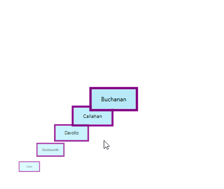
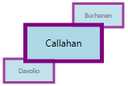
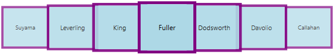
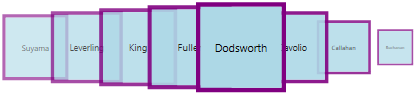
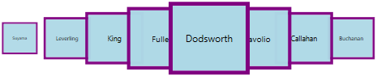
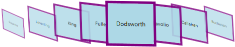
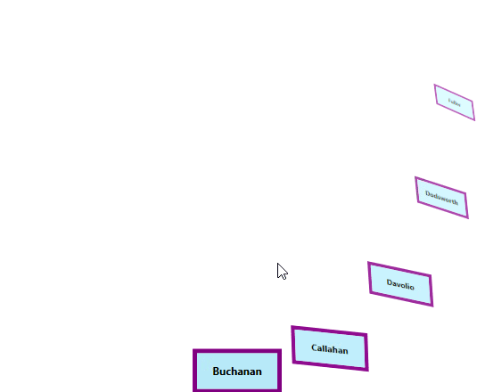

# Custom Path in WPF Carousel

This section explains the resizing, skewing, page customization, and opacity support available in the custom path mode of the [WPF Carousel](https://www.syncfusion.com/wpf-controls/carousel) control.

## Load WPF Carousel items in custom path

To load WPF Carousel items on a custom path, set the path value for the [Carousel.Path](https://help.syncfusion.com/cr/wpf/Syncfusion.Windows.Shared.Carousel.html#Syncfusion_Windows_Shared_Carousel_Path) property. Enable this view by setting the [VisualMode](https://help.syncfusion.com/cr/wpf/Syncfusion.Windows.Shared.Carousel.html#Syncfusion_Windows_Shared_Carousel_VisualMode) property to `VisualMode.CustomPath`. The default value of the `VisualMode` property is `VisualMode.Standard`, and the default value of the `Carousel.Path` property is `null`.

N> If you do not set a path value for the `Carousel.Path` property in `VisualMode.CustomPath` mode, WPF Carousel items are loaded on a `U`-shaped path.




//Model.cs
public class CarouselModel {
	public string Header { get; set; }
}

//ViewModel.cs
public class ViewModel {
	private ObservableCollection<CarouselModel> collection;
	public ObservableCollection<CarouselModel> HeaderCollection
	{
		get {
			return collection;
		}
		set {
			collection = value;
		}
	}
	public ViewModel() {
		HeaderCollection = new ObservableCollection<CarouselModel>();
		HeaderCollection.Add(new CarouselModel() { Header = "Buchanan" });
		HeaderCollection.Add(new CarouselModel() { Header = "Callahan" });
		HeaderCollection.Add(new CarouselModel() { Header = "Davolio" });
		HeaderCollection.Add(new CarouselModel() { Header = "Dodsworth" });
		HeaderCollection.Add(new CarouselModel() { Header = "Fuller" });
		HeaderCollection.Add(new CarouselModel() { Header = "King" });
		HeaderCollection.Add(new CarouselModel() { Header = "Leverling" });
		HeaderCollection.Add(new CarouselModel() { Header = "Suyama" });
	}
}







<Window.DataContext>
    <local:ViewModel/>
</Window.DataContext>

<Grid>
    <syncfusion:Carousel Name="Carousel" 
                         VisualMode="CustomPath"
                         SelectedIndex="3"
                         ItemsSource="{Binding HeaderCollection}">
            <syncfusion:Carousel.Path>
                <Path Data="M0,100 L100,20" />
            </syncfusion:Carousel.Path>

        <syncfusion:Carousel.ItemTemplate>
            <DataTemplate>
                <Border Height="50" 
                        Width="100" 
                        BorderBrush="Purple" 
                        BorderThickness="5"
                        Background="LightBlue">
                    <TextBlock HorizontalAlignment="Center" 
                               VerticalAlignment="Center" 
                               Text="{Binding Header}"/>
                </Border>
            </DataTemplate>
        </syncfusion:Carousel.ItemTemplate>
    </syncfusion:Carousel>
</Grid>




carousel.VisualMode = VisualMode.CustomPath;
carousel.SelectedIndex = 3;




N> [View Sample in GitHub](https://github.com/SyncfusionExamples/syncfusion-wpf-carousel-examples/tree/master/Samples/Binding)

## Number of items to be visible in a page

By default, all the items are displayed in the `Carousel` control. To display fewer items at a time when more items are added, use the [ItemsPerPage](https://help.syncfusion.com/cr/wpf/Syncfusion.Windows.Shared.Carousel.html#Syncfusion_Windows_Shared_Carousel_ItemsPerPage) property. The `ItemsPerPage` property is effective only in `VisualMode.CustomPath` view mode. The default value of the `ItemsPerPage` property is `-1`.




<syncfusion:Carousel ItemsPerPage="3"
                     VisualMode="CustomPath"
                     ItemsSource="{Binding HeaderCollection}"
                     Name="carousel"/>




carousel.ItemsPerPage = 3;
carousel.VisualMode = VisualMode.CustomPath;




N> [View Sample in GitHub](https://github.com/SyncfusionExamples/syncfusion-wpf-carousel-examples/tree/master/Samples/CustomPath)

## Resize WPF Carousel items

To change the size of WPF Carousel items except the selected item in `VisualMode.CustomPath` mode, use the [ScaleFraction](https://help.syncfusion.com/cr/wpf/Syncfusion.Windows.Shared.Carousel.html#Syncfusion_Windows_Shared_Carousel_ScaleFraction) property. You can disable scaling by setting the [ScalingEnabled](https://help.syncfusion.com/cr/wpf/Syncfusion.Windows.Shared.Carousel.html#Syncfusion_Windows_Shared_Carousel_ScalingEnabled) property to `false`. The value range of the `ScaleFraction` property is `0` to `1`. The default value of the `ScaleFraction` property is `Double.NaN`, and the default value of the `ScalingEnabled` property is `true`.




<syncfusion:Carousel ScaleFraction="0.7" 
                     ScalingEnabled="True"
                     VisualMode="CustomPath"
                     ItemsSource="{Binding HeaderCollection}"
                     Name="carousel">
    <syncfusion:Carousel.Path>
        <Path Data="M0,0 L100,0" />
    </syncfusion:Carousel.Path>
</syncfusion:Carousel>




carousel.ScaleFraction = 0.7;
carousel.ScalingEnabled = true;
carousel.VisualMode = VisualMode.CustomPath;




N> [View Sample in GitHub](https://github.com/SyncfusionExamples/syncfusion-wpf-carousel-examples/tree/master/Samples/CustomPath_customization)

## Resize specific WPF CarouselItem

To individually change the size of the next, previous, or selected Carousel items in `VisualMode.CustomPath` mode, set the fraction values for the [ScaleFractions](https://help.syncfusion.com/cr/wpf/Syncfusion.Windows.Shared.Carousel.html#Syncfusion_Windows_Shared_Carousel_ScaleFractions) collection property. The value range for resizing is `0` to `1`. The default value of the `ScaleFractions` property is `null`.

N> This is effective only when the `ScalingEnabled` property is set to `true`.




<syncfusion:Carousel ScalingEnabled="True"
                     VisualMode="CustomPath"
                     ItemsSource="{Binding HeaderCollection}"
                     Name="carousel">
    <syncfusion:Carousel.Path>
        <Path Data="M0,0 L100,0" />
    </syncfusion:Carousel.Path>

    <syncfusion:Carousel.ScaleFractions>
        <syncfusion:PathFractionCollection>
            
            <!--Resize next items from the selected item-->
            <syncfusion:FractionValue Fraction="0" Value="0.6"/>
            
            <!--Resize selected item-->
            <syncfusion:FractionValue Fraction="0.5" Value="0.9"/>
            
            <!--Resize previous items from the selected item-->
            <syncfusion:FractionValue Fraction="1" Value="0"/>
        </syncfusion:PathFractionCollection>
    </syncfusion:Carousel.ScaleFractions>
</syncfusion:Carousel>




FractionValue NextItemfraction = new FractionValue() { Fraction = 0, Value = 0.6 };			
FractionValue selectedItemfraction = new FractionValue() { Fraction = 0.5, Value = 0.9 };
FractionValue PreviousItemfraction = new FractionValue() { Fraction = 1, Value = 0 };

PathFractionCollection pathFraction = new PathFractionCollection();
pathFraction.Add(NextItemfraction);
pathFraction.Add(selectedItemfraction);
pathFraction.Add(PreviousItemfraction);

//Adding scale fractions to the carousel items
carousel.ScaleFractions = pathFraction;

carousel.ScalingEnabled = true;
carousel.VisualMode = VisualMode.CustomPath;




N> [View Sample in GitHub](https://github.com/SyncfusionExamples/syncfusion-wpf-carousel-examples/tree/master/Samples/CustomPath)

## Opacity for WPF Carousel items

To change the opacity of Carousel items except the selected item in `VisualMode.CustomPath` mode, set the fraction value for the [OpacityFraction](https://help.syncfusion.com/cr/wpf/Syncfusion.Windows.Shared.Carousel.html#Syncfusion_Windows_Shared_Carousel_OpacityFraction) property. You can disable opacity by setting the [OpacityEnabled](https://help.syncfusion.com/cr/wpf/Syncfusion.Windows.Shared.Carousel.html#Syncfusion_Windows_Shared_Carousel_OpacityEnabled) property to `false`. The value range of the `OpacityFraction` property is `0` to `1`. The default value of the `OpacityFraction` property is `Double.NaN`, and the default value of the `OpacityEnabled` property is `true`.




<syncfusion:Carousel OpacityFraction="0.9"
                     OpacityEnabled="True"
                     VisualMode="CustomPath"
                     ItemsSource="{Binding HeaderCollection}"
                     Name="carousel">
    <syncfusion:Carousel.Path>
        <Path Data="M0,0 L100,0" />
    </syncfusion:Carousel.Path>
</syncfusion:Carousel>




carousel.OpacityFraction = 0.9;
carousel.OpacityEnabled = true;
carousel.VisualMode = VisualMode.CustomPath;




N> [View Sample in GitHub](https://github.com/SyncfusionExamples/syncfusion-wpf-carousel-examples/tree/master/Samples/CustomPath_customization)

## Opacity for specific WPF CarouselItem

To individually change the opacity of the next, previous, or selected Carousel items in `VisualMode.CustomPath` mode, set the fraction values for the [OpacityFractions](https://help.syncfusion.com/cr/wpf/Syncfusion.Windows.Shared.Carousel.html#Syncfusion_Windows_Shared_Carousel_OpacityFractions) collection property. The value range of opacity is `0` to `1`. The default value of the `OpacityFractions` property is `null`.

N> This is effective only when the `OpacityEnabled` property is set to `true`.




<syncfusion:Carousel OpacityEnabled="True"
                     VisualMode="CustomPath"
                     ItemsSource="{Binding HeaderCollection}"
                     Name="carousel">
    <syncfusion:Carousel.Path>
        <Path Data="M0,0 L100,0" />
    </syncfusion:Carousel.Path>

    <syncfusion:Carousel.OpacityFractions>
        <syncfusion:PathFractionCollection>
            
            <!--Opacity for next items from the selected item-->
            <syncfusion:FractionValue Fraction="0" Value="0"/>
            
            <!--Opacity for selected item-->
            <syncfusion:FractionValue Fraction="0.5" Value="0.9"/>
            
            <!--Opacity for previous items from the selected item-->
            <syncfusion:FractionValue Fraction="1" Value="0.7"/>
        </syncfusion:PathFractionCollection>
    </syncfusion:Carousel.OpacityFractions>
</syncfusion:Carousel>




FractionValue NextItemfraction = new FractionValue() { Fraction = 0, Value = 0 };			
FractionValue selectedItemfraction = new FractionValue() { Fraction = 0.5, Value = 0.9 };
FractionValue PreviousItemfraction = new FractionValue() { Fraction = 1, Value = 0.7 };

PathFractionCollection pathFraction = new PathFractionCollection();
pathFraction.Add(NextItemfraction);
pathFraction.Add(selectedItemfraction);
pathFraction.Add(PreviousItemfraction);

//Adding opacity fractions to the carousel items
carousel.OpacityFractions = pathFraction;

carousel.OpacityEnabled = true;
carousel.VisualMode = VisualMode.CustomPath;




N> [View Sample in GitHub](https://github.com/SyncfusionExamples/syncfusion-wpf-carousel-examples/tree/master/Samples/CustomPath)

## Skewing the WPF Carousel items

To skew WPF Carousel items by a particular `X-Y` fraction angle, use the [SkewAngleXFraction](https://help.syncfusion.com/cr/wpf/Syncfusion.Windows.Shared.Carousel.html#Syncfusion_Windows_Shared_Carousel_SkewAngleXFraction) and [SkewAngleYFraction](https://help.syncfusion.com/cr/wpf/Syncfusion.Windows.Shared.Carousel.html#Syncfusion_Windows_Shared_Carousel_SkewAngleYFraction) properties. You can enable skewing by setting the [SkewAngleXEnabled](https://help.syncfusion.com/cr/wpf/Syncfusion.Windows.Shared.Carousel.html#Syncfusion_Windows_Shared_Carousel_SkewAngleXEnabled) and [SkewAngleYEnabled](https://help.syncfusion.com/cr/wpf/Syncfusion.Windows.Shared.Carousel.html#Syncfusion_Windows_Shared_Carousel_SkewAngleYEnabled) properties to `true`. The default value of the `SkewAngleXFraction` and `SkewAngleYFraction` properties is `Double.NaN`, and the default value of the `SkewAngleXEnabled` and `SkewAngleYEnabled` properties is `false`.




<syncfusion:Carousel SkewAngleXFraction="5"
                     SkewAngleYFraction="30" 
                     SkewAngleXEnabled="True"
                     SkewAngleYEnabled="True"
                     VisualMode="CustomPath"
                     ItemsSource="{Binding HeaderCollection}"
                     Name="carousel">
    <syncfusion:Carousel.Path>
        <Path Data="M0,0 L100,0" />
    </syncfusion:Carousel.Path>
</syncfusion:Carousel>




carousel.SkewAngleXFraction = 5;
carousel.SkewAngleYFraction = 30;
carousel.SkewAngleXEnabled = true;
carousel.SkewAngleYEnabled = true;
carousel.VisualMode = VisualMode.CustomPath;




N> [View Sample in GitHub](https://github.com/SyncfusionExamples/syncfusion-wpf-carousel-examples/tree/master/Samples/CustomPath_customization)

## Skewing the specific WPF CarouselItem

To individually skew the next, previous, or selected WPF Carousel items in `VisualMode.CustomPath` mode, set the `X-Y` fraction angle values for the [SkewAngleXFractions](https://help.syncfusion.com/cr/wpf/Syncfusion.Windows.Shared.Carousel.html#Syncfusion_Windows_Shared_Carousel_SkewAngleXFractions) and [SkewAngleYFractions](https://help.syncfusion.com/cr/wpf/Syncfusion.Windows.Shared.Carousel.html#Syncfusion_Windows_Shared_Carousel_SkewAngleYFractions) collection properties. The default value of the `SkewAngleXFractions` and `SkewAngleYFractions` properties is `null`.

N> This is effective only when the `SkewAngleXEnabled` and `SkewAngleYEnabled` properties are set to `true`.




<syncfusion:Carousel SkewAngleXEnabled="True"
                     SkewAngleYEnabled="True"
                     VisualMode="CustomPath"
                     ItemsSource="{Binding HeaderCollection}"
                     Name="carousel">
    <syncfusion:Carousel.Path>
        <Path Data="M0,0 L100,0" />
    </syncfusion:Carousel.Path>
      
    <syncfusion:Carousel.SkewAngleXFractions>
        <syncfusion:PathFractionCollection>
            
            <!--Skewing X angle of next items from the selected item-->
            <syncfusion:FractionValue Fraction="0" Value="10"/>
            
            <!--Skewing X angle of selected item-->
            <syncfusion:FractionValue Fraction="0.5" Value="0"/>
            
            <!--Skewing X angle of previous items from the selected item-->
            <syncfusion:FractionValue Fraction="1" Value="40"/>
        </syncfusion:PathFractionCollection>
    </syncfusion:Carousel.SkewAngleXFractions>

    <syncfusion:Carousel.SkewAngleYFractions>
        <syncfusion:PathFractionCollection>

            <!--Skewing Y angle of next items from the selected item-->
            <syncfusion:FractionValue Fraction="0" Value="10"/>

            <!--Skewing Y angle of selected item-->
            <syncfusion:FractionValue Fraction="0.5" Value="0"/>

            <!--Skewing Y angle of previous items from the selected item-->
            <syncfusion:FractionValue Fraction="1" Value="40"/>
        </syncfusion:PathFractionCollection>
    </syncfusion:Carousel.SkewAngleYFractions>
</syncfusion:Carousel>




carousel.SkewAngleXEnabled = true;
carousel.SkewAngleYEnabled = true;
carousel.VisualMode = VisualMode.CustomPath;




N> [View Sample in GitHub](https://github.com/SyncfusionExamples/syncfusion-wpf-carousel-examples/tree/master/Samples/CustomPath)
